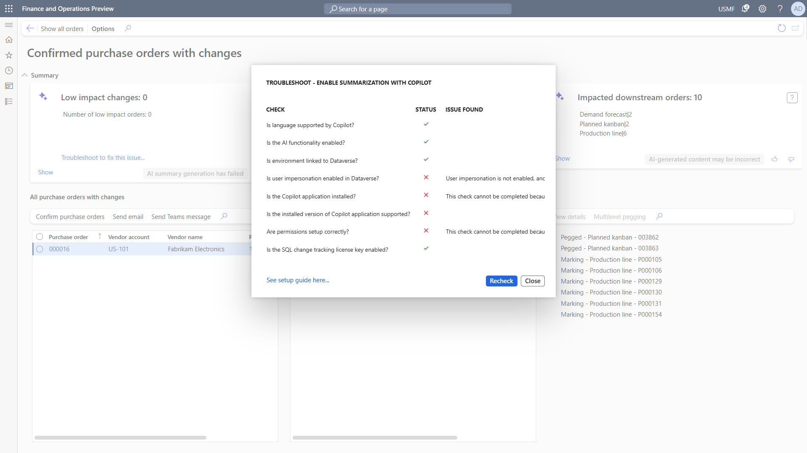

# Enable Copilot support for managing changes to confirmed purchase orders

[!include [banner](../includes/banner.md)]

This article describes how to enable Copilot support for the **Confirmed purchase orders with changes** workspace and its optional support for Copilot features. For more information about how to use this workspace, see [Review and accept changes to confirmed purchase orders](purchase-order-changes-after-confirmation.md).

## Turn on Copilot support for the Confirmed purchase orders with changes workspace

The **Confirmed purchase orders with changes** workspace is enabled by default. The workspace can be used either with or without its AI-powered and Copilot functionality. If you want to enable its AI features, make sure that you've also enabled Copilot capabilities in finance and operations apps, as described in [Enable Copilot capabilities in finance and operations apps](../../fin-ops-core/dev-itpro/copilot/enable-copilot.md).

## Troubleshoot the Copilot configuration

The Copilot experience for the **Confirmed purchase orders with changes** workspace provides a troubleshooting feature that helps you identify missing configuration steps. If one or more of the configuration steps are missing, the Copilot summarization tiles offer a troubleshooting link.

Select the link to open a troubleshooting feature that checks all installation and configuration requirements that Copilot needs to work. The feature marks the steps that require attention.

You can complete the outstanding configuration steps on a separate browser tab. When you've finished, select **Recheck** to reevaluate your configuration.

## See also

- [Review and accept changes to confirmed purchase orders](purchase-order-changes-after-confirmation.md)
- [Responsible AI FAQ for the Confirmed purchase orders with changes workspace](../faq-confirmed-po-changes.md)
