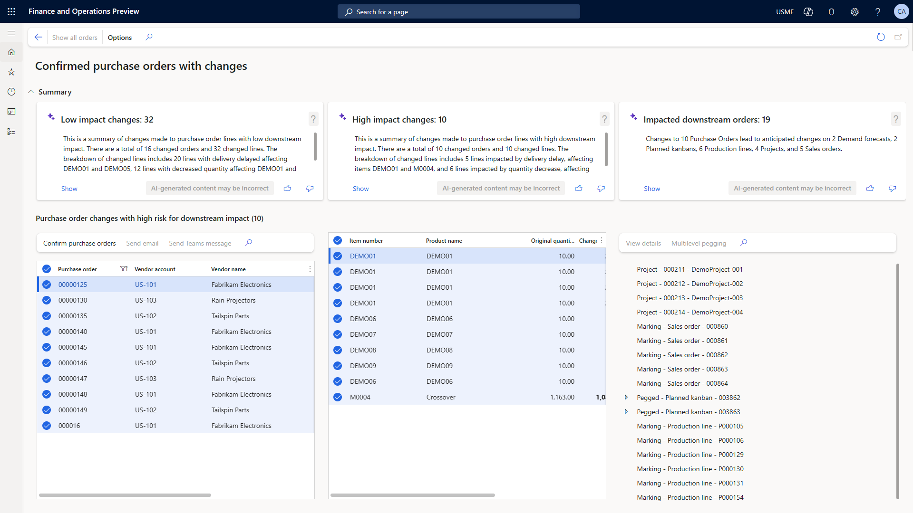

# Review and accept changes to confirmed purchase orders

[!include [banner](../includes/banner.md)]

During procurement planning, any changes that are made to confirmed purchase orders can have a significant impact on downstream processes such as planned production, service work, or sales orders. The new **Confirmed purchase orders with changes** workspace makes it fast and easy to identify and reconfirm changes that have only a low risk of downstream impact. Therefore, procurement managers can focus on high-impact changes to assess downstream order impacts and communicate directly with vendors.

## Prerequisites

The **Confirmed purchase orders with changes** workspace is enabled by default. However, its AI-powered and Copilot functionality must be enabled separately. If you also want to take advantage of the Copilot features, see [Enable Copilot support for managing changes to confirmed purchase orders](../../fin-ops-core/dev-itpro/copilot/purchase-order-changes-after-confirmation-enable.md) for the system requirements and information about how to set them up.

## The Confirmed purchase orders with changes workspace

To open the workspace, go to **Procurement and sourcing \> Workspaces \> Confirmed purchase orders with changes**.

The workspace lists all previously confirmed supplying purchase orders that have been changed since confirmation. It helps during the review process by identifying potential impacts on demand such as production work, service work orders, and sales orders.

The relations between supplying purchase orders and demand can originate from different sources, such as pegging from master panning, [inventory markings](../master-planning/planning-optimization/marking.md), and purchase orders that are created for demand in projects.

At the top of the workspace, three tiles summarize groups of changes to confirmed purchase orders and the related impact on downstream demand:

- **Low impact changes** – This tile highlights changes to purchase orders that have no known impact on downstream demand. No known impact is assumed if changes to the quantity or delivery dates don't affect those requirements from demand. Examples of these changes include an increased quantity or an earlier date. A summary of changes is generated to help you review and validate the purchase orders.
- **High impact changes** – This tile highlights purchase orders that have known downstream impacts on demand. These changes are summarized together with the detected demand impacts, to help you investigate further and decide what action to take.
- **Impacted downstream orders** – This tile summarizes impacts on different kinds of downstream demand orders by total per type of order. This information helps you review potential impacts on demand and identify each originating change.

Each tile provides a **Show** link. When you select this link, the view beneath shows the changes to supplying purchase orders and the affected demand according to the tile's classification and filter.

## Review changes to confirmed purchase orders

Purchasers use the workspace to review and accept changes to confirmed purchase orders. They typically follow these steps.

1. Study all changes to confirmed purchase orders and their downstream impact.
1. Focus on changes that have a low risk of downstream impact.
1. Review changes that have a high risk of downstream impact.
1. Review the remaining impact on downstream demand orders.

The following subsections describe these steps in more detail.

### Step 1: Study all changes to confirmed purchase orders and their downstream impact

The purchaser first opens the **Confirmed purchase orders with changes** workspace and studies all the changes that have been submitted through the purchase order change management process. Vendors can submit these changes through several channels.

When a purchase order that was previously confirmed is changed, it's moved back to the *Approved* state. The workspace shows all purchase orders that have been changed after confirmation.

The workspace shows two lists: one for the purchase orders and one for the purchase order lines.

The purchase order list shows the purchase order number, the vendor, and the requested receipt date from the purchase order header. To view the related records, select the purchase order or vendor link in the list.

The purchase order lines list shows information about each line that has proposed changes. This information includes the item number, product name, original quantity, new quantity, original confirmed receipt date, and new confirmed receipt date. The workspace also provides a hierarchical view of any downstream impact. The **Reference** field indicates the type of downstream impact, such as a planned kanban for a production order, a sales order, or a maintenance work order.

### Step 2: Focus on changes that have a low risk of downstream impact

To take action effectively and efficiently, you typically start by focusing on low-impact changes. These changes have no known downstream impact according to the current plan.

The **Low impact changes** tile at the top of the workspace provides an AI-generated, natural-language summary of the changes that have a low risk of impact. Select the **Show** link to open the corresponding filtered view.

The purchaser reviews the changes and can then accept them by selecting individual or multiple purchase orders and then selecting **Confirm purchase orders** on the toolbar above the list. The procedure for confirming the changes is the same as the procedure for confirming a purchase order for the first time, and it supports batch processing. Any extension that's registered for purchase order confirmation will also be run.

After the selected purchase orders are reconfirmed, they're moved back to the *Confirmed* state.

### Step 3: Review changes that have a high risk of downstream impact

The purchaser will spend more time on changes that have a high risk of downstream impact. These changes have downstream orders allocated to them, and the downstream impact has been identified.

The **High impact changes** tile provides an AI-generated, natural-language summary of the changes that have a high risk of impact. Select the **Show** link to open a filtered view where you can focus on those impacts and take action.

> [!NOTE]
> Only direct downstream impacts are considered. Indirect downstream impacts, such as product work that depends on other production work, aren't yet considered.

From this view, you can reach out to a vendor using email or Microsoft Teams. Using the contact details of the vendor contact person, the system generates a proposed message text and adds it to a new email message or Microsoft Teams chat. You can then review, update, and send the message.

After you've communicated with the vendor, you can update the order further and then send it back to the vendor for confirmation. Alternatively, you might cancel the order and plan for alternative supply.

### Step 4: Review the remaining impact on downstream demand orders

After most of the order changes have been addressed, the purchaser can review the overall downstream impact of the remaining open order changes.

The **Impacted downstream orders** tile provides a summary of the downstream impact. Select the **Show** link to open a filtered view where you can focus on those impacts and take action.

In this view, you can analyze the changes from the perspective of downstream impact and identify the purchase order changes that are causing the impact. You can then take action on those purchase orders.

A good way to focus on the most pressing downstream impact is to sort and filter the list by the date of impact (the requested date in the downstream order). You can then take action by communicating with downstream stakeholders. Those stakeholders might, in turn, contact affected customers and replan the downstream orders.

## Related information

- [Responsible AI FAQ for the Confirmed purchase orders with changes workspace](../faq-confirmed-po-changes.md)
- For administrators: [Enable Copilot support for managing changes to confirmed purchase orders](../../fin-ops-core/dev-itpro/copilot/purchase-order-changes-after-confirmation-enable.md)
