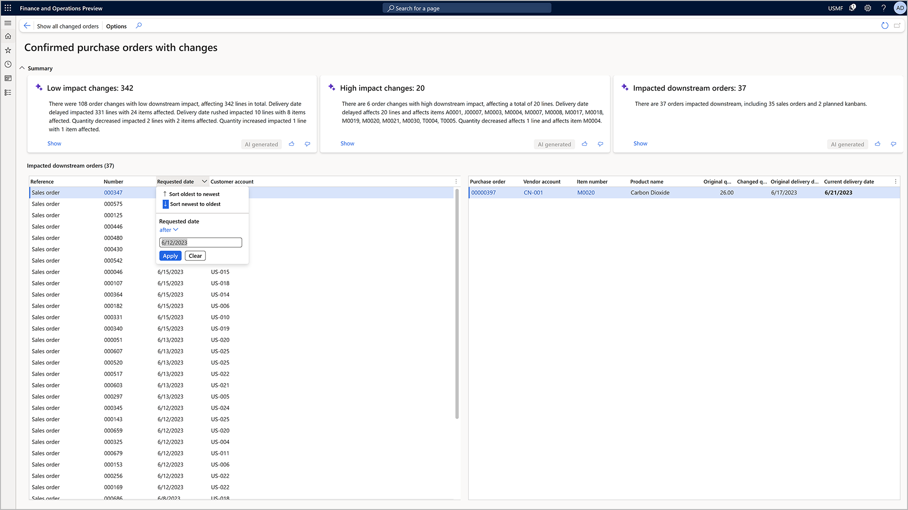

# Review and accept changes to confirmed purchase orders

[!include [banner](../includes/banner.md)]

> [!IMPORTANT]
> Some or all of the functionality noted in this article is available as part of a preview release. The content and the functionality are subject to change. For more information about preview releases, see [One version service updates FAQ](/dynamics365/unified-operations/fin-and-ops/get-started/one-version).
>
> During this preview phase, the summarization of changes and the summarization of downstream impact are only available in environments hosted in North America and will render in English. All other functionality is available globally.

<!-- KFM: Preview until 10.0.34 GA -->

During the procurement planning process, any changes made to confirmed purchase orders can have a significant impact on downstream processes such as planned production, service work, or sales orders. The new **Confirmed purchase orders with changes** workspace makes it fast and easy to identify and reconfirm changes that will only have a low risk of downstream impact, which allows procurement managers to focus on high-impact changes so they can assess potential downstream order impacts and communicate directly with vendors.

This article describes the workspace where users can review and accept changes made by suppliers to *Confirmed* purchase orders based on the downstream impact of the changes made.

## Enable the feature for your system

This section describes the steps you must complete to enable the **Confirmed purchase orders with changes** workspace and/or related Copilot features for your system.

- Steps 1 and 2 are required to enable the **Confirmed purchase orders with changes** workspace. You must complete these steps to use any of the features described in this article.
- Steps 3 – 6 are only required if you also want to use the Copilot features (natural-language change summaries and communication drafts). You can skip these steps if you don't want to use these features.

### Step 1: Upgrade Supply Chain Management to the required build

You must be running Microsoft Dynamics 365 Supply Chain Management 10.0.34 or later.

This feature was added in builds that came out after the initial release of 10.0.34 and 10.0.35. If you're running one of these versions, you must update your version to the builds described in the following list.

- If you're running Supply Chain Management version 10.0.34, then you must upgrade the Application Suite to 10.25.1372 (or later), which is included in build number 10.0.1591.72 (or later) of finance and operations apps.
- If you're running Supply Chain Management version 10.0.35, then you must upgrade the Application Suite to 10.26.1075 (or later), which is included in build number 10.0.1627.33  (or later) of finance and operations apps.

### Step 2: Enable the workspace feature in feature management

In the [**Feature management**](../../fin-ops-core/fin-ops/get-started/feature-management/feature-management-overview.md) workspace, turn on the feature named *Review changes to confirmed purchase orders based on downstream impact*.

### Step 3: Upgrade the *Finance and Operations Virtual Entity* solution

Follow these steps to upgrade the *Finance and Operations Virtual Entity* solution:

1. Go to the [Power Platform admin center](https://admin.powerplatform.microsoft.com/).
1. Select the Power Platform environment that is connected to your Finance and Operations application and open the detail view.
1. In the **Resources** box, select **Dynamics 365 apps**.
1. Find the app called *Finance and Operations Virtual Entity*.
1. If the status is *Installed*, then you're already running the latest version.
1. If the status is *Update available*, then you must update the solution. Select the ellipsis button and choose **Update**. Accept the terms of service and then select **Update**.

You can follow the status of the update. During the update, the status is *Installing*. On completion, the status changes to *Installed*.

### Step 4: Enable Supply Chain Management to access your Dataverse environment

Follow these steps to enable Supply Chain Management to access your Dataverse environment:

1. Go to the [Power Platform admin center](https://admin.powerplatform.microsoft.com/).
1. Select the Dataverse environment that is connected to your Supply Chain Management environment and open the detail view.
1. Select the **Settings** menu in the menu bar.
1. Navigate to **Product \> Features**.
1. Set the **Finance and Operations in Dataverse** to *On*.

### Step 5: Install the Copilot application in Supply Chain Management

Follow these steps to install the Copilot application in your Supply Chain Management environment:

1. Go to the [Copilot in Microsoft Dynamics 365 Supply Chain Management](https://appsource.microsoft.com/product/dynamics-365/mscrm.dynamicsscmai-preview?flightCodes=f42a7338c806438f8fca820c4ed82b7c&tab=Overview) page in the Microsoft commercial marketplace.
1. Select **Get it now**.
1. The deployment process opens the [Power Platform admin center](https://admin.powerplatform.microsoft.com/). Select the Dataverse environment that is connected to your Supply Chain Management environment to install the application.

### Step 6: Enable the required security roles

Users that should have access to the functionality must be assigned the *AIB Roles* and *Finance and Operations AI* security roles in Dataverse.

From the detail view of the environment, locate the **Access** box and select **Users** or **Teams**. Select the users or teams that should have access and assign the  *AIB Roles* and *Finance and Operations AI* security roles to them.

## The Confirmed purchase orders with changes workspace

To open the workspace, go to **Procurement and sourcing \> Workspaces \> Confirmed purchase orders with changes**.

The workspace lists all previously confirmed purchase orders that have been changed after confirmation. It aids the review process by identifying potential impacts on production work, service work orders, and sales orders.

At the top of the workspace, the following tiles summarize the changed confirmed purchase orders and the related downstream impacts:

- **Low impact changes** – Focuses on purchase orders with low risk for downstream impact (in other words, those with no downstream orders allocated). A generated summary of changes is provided to help you review and validate them.
- **High impact changes** – Highlights purchase orders with known downstream impacts. These high-risk changes are summarized along with the detected impact, which helps you investigate further and decide what actions to take.
- **Impacted downstream orders** – Summarizes impacts by the number and type of orders and shows the purchase order changes causing each impact. This information helps you review potential downstream impacts based on the latest master planning run.

Each tile provides a **Show** link, which lets you filter the list of purchase orders and purchase order lines. The list columns include original and new quantities, original and new confirmed delivery dates, and so on.

## Review changes to confirmed purchase orders

Purchasers use the workspace to review and accept changes to confirmed purchase orders. They'll typically proceed using the following steps:

1. Study all changes to confirmed purchase orders and their downstream impact.
1. Focus on changes with low risk of downstream impact.
1. Review changes with high risk of downstream impact.
1. Review remaining downstream impact.

Each of these steps is described in more detail in the following sections.

## Study all changes to confirmed purchase orders and their downstream impact

The purchaser starts by opening the **Confirmed purchase orders with changes** workspace and studying all the changes that have been submitted through the purchase order change management process. These changes can have been submitted by vendors through any of several various channels.

When a purchase order that had previously been *Confirmed* is changed, it's moved back into the *Approved* state. The workspace shows all purchase orders that have been changed after confirmation.

The workspace shows two lists, one with the purchase orders details, and one with the purchase order lines.

The purchase order list shows the purchase order number, the vendor, and the requested receipt date from the purchase order header. To view the related records, select the purchase order or vendor links in the list.

The purchase order lines list shows information about each line that has proposed changes. This information includes the item number, product name, original quantity, new quantity, original confirmed delivery date, and new confirmed delivery date. The workspace also provides a hierarchical view of the downstream impact (if any). The **Reference** field highlights the type of downstream impact, such as a planned kanban for a production order, a sales order, or a maintenance work order.

## Focus on changes with low risk of downstream impact

To take action effectively and efficiently, you'll typically start by focusing on low-impact changes. These are changes that have no known downstream impact according to the current plan.

The **Low impact changes** tile gives an AI-generated, natural-language summary of the changes with low impact risk. Select the **Show** link to open the respective filtered view.

The purchaser reviews the changes and can then accept them by selecting individual or multiple purchase orders and then selecting **Confirm purchase orders** on the toolbar above the list. The procedure to confirm the changes is the same as when confirming a purchase order for the first time, and it supports batch processing. Any extension that is registered for the purchase order confirmation will also be executed.

Once reconfirmed, the selected purchase orders will then move back into the *Confirmed* state.

## Review changes with high risk of downstream impact

The purchaser will spend more time on changes that have a high risk of downstream impact. These are changes that have downstream orders allocated and where the downstream impact has been identified.

The **High impact changes** tile gives an AI-generated, natural-language summary of the changes with high impact risk. Select the **Show** link to open a filtered view where you can focus on those impacts and take action.

> [!NOTE]
> Only direct downstream impacts are considered. Indirect downstream impacts, such as product work depending on other production work, aren't yet considered.

From this view, you can reach out to a vendor using email or Microsoft Teams. Using the contact details of the vendor contact person, the system generates a proposed message text and adds it to a new email message or Microsoft Teams chat. You can then review, update and send the message.

After talking with the vendor, you can update the order further before sending it back to the vendor for confirmation, or possibly cancel the order and plan for alternative supply.

## Review remaining downstream impact

Once most the order changes have been addressed, the purchaser can review the overall downstream impact of the remaining open order changes.

The **Impacted downstream orders** tile gives a summary of the downstream impact. Select the **Show** link to open a filtered view where you can focus on those impacts and take action.

In this view, you can analyze the changes from the perspective of downstream impact and identify the purchase order changes that are causing the impact. Then you can take action on those purchase orders.

A good way to focus on the most pressing downstream impact is to sort and filter the list by the date of impact (the requested date in the downstream order). This lats you identify the most eminent impact and take action by communicating with downstream stakeholders who might then reach out to impacted customers and replan the downstream orders.

## Frequently asked questions

### How does the Copilot technology work?

The system summarizes changes to purchase orders, such as changed quantities and confirmed delivery dates, and identifies downstream impacts. It uses the generative-AI model Text-davinci-003 to generate natural-language change summaries and suggested content for email and Teams conversations.  

### What if I'm not satisfied with the generated content?

Text generated by Copilot isn't intended to be used without manual review or supervision.

> [!NOTE]
> If you encounter inappropriate content being generated, report it to Microsoft using this feedback form: [Report abuse](https://msrc.microsoft.com/report/abuse?ThreatType=URL&IncidentType=Responsible%20AI&SourceUrl=https://dynamics.microsoft.com/supply-chain-management/overview/). Your feedback helps improve the functionality moving forward.
