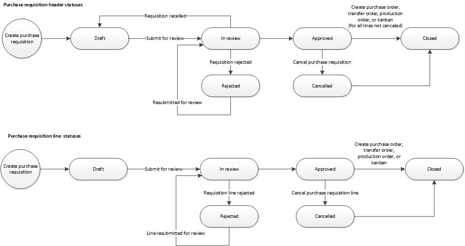
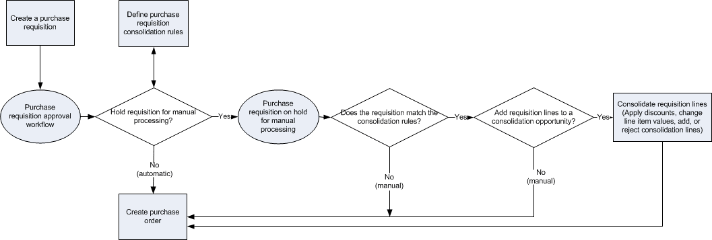

---
# required metadata

title: Purchase requisition overview
description: This article describes the purchase requisition workflow and the different statuses that a purchase requisition can have.
author: GalynaFedorova
ms.date: 11/02/2017
ms.topic: overview
ms.prod: 
ms.technology: 

# optional metadata

ms.search.form: PurchReqConsolidation, PurchReqCreate, PurchReqCreatePurchDetails, PurchReqCreatePurchListPage, PurchReqTable, PurchReqTableListPage, PurchReqConsolidationPartByVendor, PurchReqConsolidationLineDetail, PurchReqConsolidationCreate, PurchReqConsolidationBulkEdit, PurchReqConsolidationAddLine
# ROBOTS: 
audience: Application User
# ms.devlang: 
ms.reviewer: kamaybac
# ms.tgt_pltfrm: 
ms.custom: ["2174", "intro-internal"]
ms.assetid: 77d07119-4d9f-4c0e-acbe-d319203571ab
ms.search.region: Global
# ms.search.industry: 
ms.author: gfedorova
ms.search.validFrom: 2016-02-28
ms.dyn365.ops.version: AX 7.0.0

---

# Purchase requisition overview

[!include [banner](../includes/banner.md)]

This article describes the purchase requisition workflow and the different statuses that a purchase requisition can have.

Depending on the setup of your organization, you can create purchase requisitions for products that your organization uses. A purchase requisition is an internal document that authorizes the Purchasing department to buy items or services.  

After a purchase requisition is approved, it can be used to generate a purchase order. Purchase orders are the external documents that the Purchasing department submits to vendors.

## Creating purchase requisitions
You can create a purchase requisition on the **My purchase requisitions** page, and select the items and services that you require. You can select items from a procurement catalog that your organization has created, or you can request items that aren't found in a catalog by selecting a procurement category and entering the product details.  

Before you can submit a purchase requisition for review, workflows must be configured. You use a workflow to move a purchase requisition through the review process, from an initial status of **Draft** to a final status of **Approved**.

### Purchase requisition statuses

When you create a purchase requisition, a status is assigned to it. A status is also assigned to every line that you add to a purchase requisition. When you submit a purchase requisition to a workflow for review, the status of the purchase requisition and the status of each line are updated as the lines move through the workflow process.  

You can configure the purchase requisition workflow process to route a purchase requisition through the review process as a single document. Alternatively, the lines on a purchase requisition can be routed individually to the appropriate reviewers. If the purchase requisition lines are reviewed individually, the status of each purchase requisition line can be updated as the line moves through the review process. When all lines have completed the review process and no review steps remain for the purchase requisition, the status of the whole purchase requisition is updated.

### Purchase requisition workflow

The following diagram shows the statuses that are assigned to a purchase requisition and a purchase requisition line as they move through the workflow process.  

### Purchase requisition header and line status relationships

The overall status of a purchase requisition is determined by the status of the purchase requisition lines. Therefore, the review process must be completed for all purchase requisition lines before the review process for the whole purchase requisition can be completed. The following table describes the statuses that are assigned to a purchase requisition header and lines as the purchase requisition moves through the workflow process.

<table>
<thead>
<tr class="header">
<th>Purchase requisition status</th>
<th>Purchase requisition line status</th>
<th>Description</th>
</tr>
</thead>
<tbody>
<tr class="odd">
<td>Draft</td>
<td>Draft</td>
<td>The purchase requisition and purchase requisition line have been created, but they haven&#39;t been submitted for review. Purchase requisitions and purchase requisition lines that have a status of <strong>Draft</strong> can be modified. A purchase requisition or purchase requisition line also has a status of <strong>Draft</strong> if it has been recalled but hasn&#39;t been resubmitted for review. <strong>Note:</strong> You can submit or recall a purchase requisition at the document level. However, you can&#39;t submit or recall a single purchase requisition line.</td>
</tr>
<tr class="even">
<td>In review</td>
<td><ul>
<li>In review</li>
<li>Rejected</li>
</ul></td>
<td>If the workflow has been configured to route purchase requisition lines to individual reviewers, each line can have a status of <strong>In review</strong> or <strong>Rejected</strong>. The purchase requisition status is updated when the review process is completed for all purchase requisition lines and no review steps remain for the purchase requisition.
<ul>
<li><strong>In review</strong> – The purchase requisition lines have been submitted for review. When the workflow process is completed for a purchase requisition line, the status of that line remains <strong>In review</strong> until all remaining purchase requisition lines have been reviewed.</li>
<li><strong>Rejected</strong> – A purchase requisition line has been rejected. Purchase requisition lines that are rejected can be modified and resubmitted.</li>
</ul>
If you resubmit a purchase requisition line that has been rejected, the review process starts over for all lines in the purchase requisition that are still in review.  <strong>Note:</strong> You can recall a purchase requisition that has already been submitted. When you recall a purchase requisition, all other purchase requisition lines are also recalled. Purchase requisition lines that have been recalled can be deleted.</td>
</tr>
<tr class="odd">
<td>Rejected</td>
<td>Rejected</td>
<td>The purchase requisition and all purchase requisition lines have been rejected. Purchase requisitions and purchase requisition lines that have been rejected can be resubmitted.</td>
</tr>
<tr class="even">
<td>Approved</td>
<td><ul>
<li>Approved</li>
<li>Cancelled</li>
<li>Closed</li>
</ul></td>
<td>All purchase requisition lines have completed the review process, and there are no more review steps for the purchase requisition.
<ul>
<li><strong>Approved</strong> – The review process for a purchase requisition line has been completed, and the line is approved.</li>
<li><strong>Cancelled</strong> – The purchase requisition line was approved, but it has been canceled because it&#39;s no longer required. Only purchase requisition lines that have been approved can be canceled.</li>
<li><strong>Closed</strong> – The purchase requisition line was approved, and documents have been generated, depending on the requisition purpose.
<ul>
<li>If the requisition purpose is consumption, a purchase order has been generated for the purchase requisition line.</li>
<li>If the requisition purpose is replenishment, one or more fulfillment documents have been generated.</li>
</ul></li>
</ul></td>
</tr>
<tr class="odd">
<td>Cancelled</td>
<td>Cancelled</td>
<td>The purchase requisition and all purchase requisition lines have been canceled.  <strong>Note:</strong> If you no longer require an item that is on a purchase requisition line, you must cancel the purchase requisition line if it has already been approved. Only purchase requisition lines that have been approved can be canceled. If any purchase requisition lines are in review, the purchase requisition will have a status of <strong>In review</strong>. In this case, you can recall the purchase requisition and delete the appropriate purchase requisition line.</td>
</tr>
<tr class="even">
<td>Closed</td>
<td><ul>
<li>Closed</li>
<li>Cancelled</li>
</ul></td>
<td>The purchase requisition is closed, and one or more fulfillment documents have been generated.
<ul>
<li><strong>Closed</strong> – The purchase requisition line was approved, and documents have been generated, depending on the requisition purpose.
<ul>
<li>If the requisition purpose is consumption, a purchase order has been generated for the purchase requisition line.</li>
<li>If the requisition purpose is replenishment, one or more fulfillment documents have been generated.</li>
</ul></li>
<li><strong>Cancelled</strong> – The purchase requisition line was approved, but it has been canceled because it&#39;s no longer required. Only purchase requisition lines that have been approved can be canceled.</li>
</ul>
<strong>Note:</strong> If you no longer require an item on a purchase requisition line that has been closed, you must cancel the line on the fulfillment document that was generated for the purchase requisition line.</td>
</tr>
</tbody>
</table>

## Distributing costs to multiple financial accounts
You can distribute the cost of a product that is included in a purchase requisition to multiple financial accounts. If your organization uses dimensions, such as cost centers and departments, you can distribute the cost of a product to dimensions for financial accounts.

## Requisition purposes
Requisition purposes make the process of fulfilling requisition demand more flexible. When you create a requisition, you can assign one of two purposes to it: consumption or replenishment. Depending on the requisition purpose and the setup of your organization, requisition demand can be fulfilled by a purchase order, transfer order, production order, or kanban.  

In the procurement policies, you can control the requisition purposes that are available when a requisition is created for your organization.

### Requisitions that have a purpose of consumption

A requisition that has a purpose of consumption represents demand for items or services that will be used internally by your organization. The demand that is created by this kind of requisition is always fulfilled by a purchase order. If Supply Chain Management is set up to automatically generate purchase orders, purchase orders are created after the purchase requisition is approved.

### Requisitions that have a purpose of replenishment

A requisition that has a purpose of replenishment represents demand to replenish inventory. For example, you create a requisition to replenish items so that they can be sold at a specific retail location at a specific time. The demand that is created by this kind of requisition can be fulfilled by a purchase order, transfer order, production order, or kanban.  

When the requisition purpose is replenishment, demand is expressed as a quantity instead of a monetary amount. Therefore, encumbrance accounting, budgetary control, business rules for fixed asset determination (BRAD), project accounting, and any related rules don't apply. Only products that are stocked and released to the specified legal entity can fulfill replenishment requisition demand. To define the products that are available when the requisition purpose is replenishment, use the **Replenishment category access policy rule** page.  

To use purchase requisitions that have a purpose of replenishment, you must set up master scheduling to include requisition demand. The fulfillment method for the demand that is created by this kind of requisition is then determined automatically, based on the supply policies that have been set up for the items in your organization and planned by using master scheduling.

## Purchase requisitions and requests for quotation
In some cases, you must start a request for quotation (RFQ) process to identify the vendor and price for products that are requested in a purchase requisition. An RFQ can be generated when the purchase requisition is in review. When you accept a bid, information about the vendor, price, and so on, is transferred to the requisition.  

You can put a purchase requisition on hold by selecting the **On hold** check box on the **Purchase requisition details** page. Processing of the purchase requisition can continue only after you remove the hold by clearing the check box.  

> [!NOTE]
> In e-procurement, the RFQ for your purchase requisition might allow vendors to add alternate lines. In this case, your purchase requisition will reflect approved alternates.

## Demand consolidation
By consolidating purchase requisition lines from multiple purchase requisitions, you can increase your negotiating power with your vendors to achieve better pricing, lower shipping and handling costs, and reduced overhead costs.  

Purchase requisition lines are eligible for demand consolidation only if the following statements are true:

-   The purchase requisition has been approved.
-   The purchase requisition meets the purchasing policy rule criteria for manual processing and demand consolidation.

Approved purchase requisition lines that meet the criteria for manual processing are listed on the **Release approved purchase requisitions** page. If a purchase requisition line also meets the criteria for demand consolidation, the line can be added to a consolidation opportunity.  

A consolidation opportunity is a set of purchase requisition lines that are grouped together, so that the purchasing professional can negotiate the best deal with vendors. Purchase requisition lines that you select for a consolidation opportunity appear on the **Purchase requisition consolidation** page. You can modify the lines on this page, if changes are required. You can also add new lines to the consolidation opportunity or remove existing lines.  

After you add requisition lines to a consolidation opportunity and make any changes that you require, you can create a purchase order for the consolidated purchase requisition lines.  

> [!NOTE]
> Changes that you make to a purchase requisition line on the **Purchase requisition consolidation** page are reflected on the purchase order that you create. However, the line remains unchanged in the purchase requisition, so that its history is preserved.  

To create a purchase order for purchase requisition lines that aren't eligible for demand consolidation or aren't selected for a consolidation opportunity, you must process the lines manually.

### Consolidating purchase requisition lines

The process for demand consolidation starts when a purchase requisition is approved in a workflow and, if budget control is configured for your organization, when the budget reservations and pre-encumbrances have been recorded. The following diagram shows the process flow for demand consolidation.  

  

To consolidate approved purchase requisition lines, follow these steps:

1.  Review approved requisition lines that have been held for manual processing, and that are eligible for demand consolidation.
2.  Select lines to add to a consolidation opportunity.
3.  Create a new consolidation opportunity, or add requisition lines to an existing consolidation opportunity.
4.  Make any required changes to the requisition lines, and remove requisition line items that you no longer want to include in the consolidation opportunity.
5.  Create purchase orders for consolidated requisition lines or for purchase requisition lines in a consolidation opportunity.

## Additional resources

[Create a requisition for consumption](tasks/create-requisition-consumption.md)

[Purchase requisition workflow](purchase-requisitions-workflow.md)

[!INCLUDE[footer-include](../../includes/footer-banner.md)]