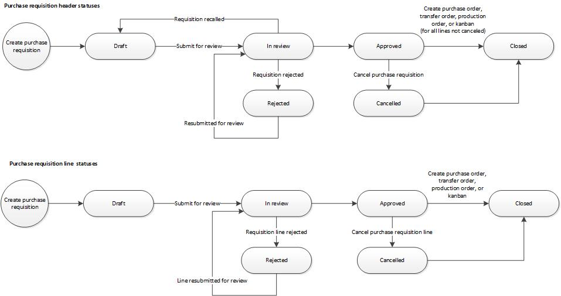
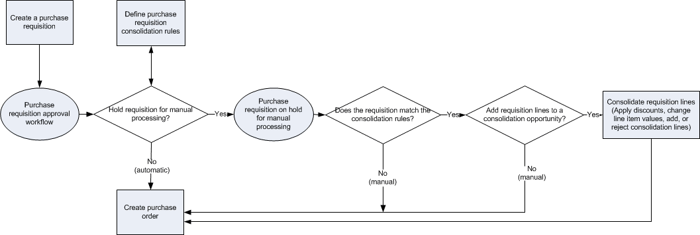

# Purchase requisition overview

[!INCLUDE [banner](../includes/banner.md)]

This article describes the purchase requisition workflow and the different statuses that a purchase requisition can have.

Depending on the setup of your organization, you can create purchase requisitions for products that your organization uses. A purchase requisition is an internal document that authorizes the Purchasing department to buy items or services.  

After a purchase requisition is approved, you can use it to generate a purchase order. Purchase orders are the external documents that the Purchasing department submits to vendors.

## Creating purchase requisitions

Create a purchase requisition on the **My purchase requisitions** page, and select the items and services that you require. You can select items from a procurement catalog that your organization created, or you can request items that aren't found in a catalog by selecting a procurement category and entering the product details.  

Before you can submit a purchase requisition for review, you must configure the required workflows. Use a workflow to move a purchase requisition through the review process, from an initial status of *Draft* to a final status of *Approved*.

### Purchase requisition statuses

When you create a purchase requisition, the system assigns a status to it. The system also assigns a status to every line that you add to a purchase requisition. When you submit a purchase requisition to a workflow for review, the system updates the status of the purchase requisition and the status of each line as the lines move through the workflow process.  

You can configure the purchase requisition workflow process to route a purchase requisition through the review process as a single document. Alternatively, you can route the lines on a purchase requisition individually to the appropriate reviewers. If the purchase requisition lines are reviewed individually, the system can update the status of each purchase requisition line as the line moves through the review process. When all lines complete the review process and no review steps remain for the purchase requisition, the system updates the status of the whole purchase requisition.

### Purchase requisition workflow

The following diagram shows the statuses that the system assigns to a purchase requisition and a purchase requisition line as they move through the workflow process.  

### Purchase requisition header and line status relationships

The overall status of a purchase requisition depends on the status of the purchase requisition lines. Therefore, you must complete the review process for all purchase requisition lines before you can complete the review process for the whole purchase requisition. The following table describes the statuses that are assigned to a purchase requisition header and lines as the purchase requisition moves through the workflow process.

| Purchase requisition status | Purchase requisition line status | Description |
|---|---|---|
| Draft | Draft | 
The purchase requisition and purchase requisition line have been created, but they haven't been submitted for review. You can modify purchase requisitions and purchase requisition lines that have a status of *Draft*. A purchase requisition or purchase requisition line also has a status of *Draft* if you recalled it but didn't resubmit it for review.

**Note:** You can submit or recall a purchase requisition at the document level. However, you can't submit or recall a single purchase requisition line.
 |
| In review | <ul><li>In review</li><li>Rejected</li></ul> | 
If the workflow is configured to route purchase requisition lines to individual reviewers, each line can have a status of *In review* or *Rejected*. The purchase requisition status updates when the review process is completed for all purchase requisition lines and no review steps remain for the purchase requisition.
<ul><li>*In review* – The purchase requisition lines are submitted for review. When the workflow process is completed for a purchase requisition line, the status of that line remains *In review* until all remaining purchase requisition lines are reviewed.</li><li>*Rejected* – A purchase requisition line is rejected. You can modify and resubmit purchase requisition lines that are rejected.</li></ul>
If you resubmit a purchase requisition line that was rejected, the review process starts over for all lines in the purchase requisition that are still in review.

**Note:** You can recall a purchase requisition that you already submitted. When you recall a purchase requisition, you also recall all other purchase requisition lines. You can delete purchase requisition lines that are recalled.
 |
| Rejected | Rejected | The purchase requisition and all purchase requisition lines have been rejected. You can resubmit purchase requisitions and purchase requisition lines that have been rejected. |
| Approved | <ul><li>Approved</li><li>Cancelled</li><li>Closed</li></ul> | 
All purchase requisition lines have completed the review process, and there are no more review steps for the purchase requisition.
<ul><li>*Approved* – The review process for a purchase requisition line is complete, and the line is approved.</li><li>*Cancelled* – The purchase requisition line was approved, but it's canceled because it's no longer required. Only purchase requisition lines that are approved can be canceled.</li><li>*Closed* – The purchase requisition line was approved, and documents are generated, depending on the requisition purpose.<ul><li>If the requisition purpose is consumption, a purchase order is generated for the purchase requisition line.</li><li>If the requisition purpose is replenishment, one or more fulfillment documents are generated.</li></ul></li></ul> |
| Cancelled | Cancelled | 
The purchase requisition and all purchase requisition lines have been canceled.

**Note:** If you no longer require an item that is on a purchase requisition line, you must cancel the purchase requisition line if it's already approved. Only purchase requisition lines that are approved can be canceled. If any purchase requisition lines are in review, the purchase requisition has a status of **In review**. In this case, you can recall the purchase requisition and delete the appropriate purchase requisition line.
 |
| Closed | <ul><li>Closed</li><li>Cancelled</li></ul> | 
The purchase requisition is closed, and one or more fulfillment documents have been generated.
<ul><li>*Closed* – The purchase requisition line was approved, and documents are generated, depending on the requisition purpose.<ul><li>If the requisition purpose is consumption, a purchase order is generated for the purchase requisition line.</li><li>If the requisition purpose is replenishment, one or more fulfillment documents are generated.</li></ul></li><li>*Cancelled* – The purchase requisition line was approved, but it's canceled because it's no longer required. Only purchase requisition lines that are approved can be canceled.</li></ul>
**Note:** If you no longer require an item on a purchase requisition line that is closed, you must cancel the line on the fulfillment document that was generated for the purchase requisition line.
 |

## Distributing costs to multiple financial accounts

You can distribute the cost of a product that is included in a purchase requisition to multiple financial accounts. If your organization uses dimensions, such as cost centers and departments, you can distribute the cost of a product to dimensions for financial accounts.

## Requisition purposes

Requisition purposes make the process of fulfilling requisition demand more flexible. When you create a requisition, you can assign one of two purposes to it: consumption or replenishment. Depending on the requisition purpose and the setup of your organization, requisition demand can be fulfilled by a purchase order, transfer order, production order, or kanban.  

In the procurement policies, you can control the requisition purposes that are available when a requisition is created for your organization.

### Requisitions that have a purpose of consumption

A requisition that has a purpose of consumption represents demand for items or services that your organization uses internally. The demand that this kind of requisition creates is always fulfilled by a purchase order. If Supply Chain Management is set up to automatically generate purchase orders, purchase orders are created after the purchase requisition is approved.

### Requisitions that have a purpose of replenishment

A requisition that has a purpose of replenishment represents demand to replenish inventory. For example, you create a requisition to replenish items so that you can sell them at a specific retail location at a specific time. The demand that this kind of requisition creates can be fulfilled by a purchase order, transfer order, production order, or kanban.  

When the requisition purpose is replenishment, demand is expressed as a quantity instead of a monetary amount. Therefore, encumbrance accounting, budgetary control, business rules for fixed asset determination (BRAD), project accounting, and any related rules don't apply. Only products that are stocked and released to the specified legal entity can fulfill replenishment requisition demand. To define the products that are available when the requisition purpose is replenishment, use the **Replenishment category access policy rule** page.  

To use purchase requisitions that have a purpose of replenishment, set up master scheduling to include requisition demand. The system automatically determines the fulfillment method for the demand that this kind of requisition creates, based on the supply policies that you set up for the items in your organization and planned by using master scheduling.

## Purchase requisitions and requests for quotation

In some cases, you must start a request for quotation (RFQ) process to identify the vendor and price for products that a purchase requisition requests. You can generate an RFQ when the purchase requisition is in review. When you accept a bid, the system transfers information about the vendor, price, and other details to the requisition.  

You can control whether the system should update fixed asset fields when you accept an RFQ bid for purchase requisitions that have business rules for fixed asset determination (BRAD). To set this option, follow these steps (requires Supply Chain Management version 10.0.49 or later):

1. Go to **Procurement and sourcing** > **Setup** > **Procurement and sourcing parameters**.
1. Open the **Purchase requisition** tab.
1. Set **RFQ bid–driven fixed asset field updates** to one of the following values:
    - *Yes* – Reevaluate asset classification and accounting values based on the accepted RFQ bid. This value is the default setting.
    - *No* – Only transfer the RFQ price to the requisition. Preserve existing accounting values and budget control reservations.

You can put a purchase requisition on hold by selecting the **On hold** check box on the **Purchase requisition details** page. Processing of the purchase requisition can continue only after you remove the hold by clearing the check box.  

> [!NOTE]
> In e-procurement, the RFQ for your purchase requisition might allow vendors to add alternate lines. In this case, your purchase requisition reflects approved alternates.

## Demand consolidation

When you consolidate purchase requisition lines from multiple purchase requisitions, you increase your negotiating power with vendors. You can get better pricing, lower shipping and handling costs, and reduced overhead costs.  

Purchase requisition lines are eligible for demand consolidation only if the following statements are true:

- The purchase requisition is approved.
- The purchase requisition meets the purchasing policy rule criteria for manual processing and demand consolidation.

The **Release approved purchase requisitions** page lists approved purchase requisition lines that meet the criteria for manual processing. If a purchase requisition line also meets the criteria for demand consolidation, you can add the line to a consolidation opportunity.  

A consolidation opportunity is a set of purchase requisition lines that you group together so that the purchasing professional can negotiate the best deal with vendors. Purchase requisition lines that you select for a consolidation opportunity appear on the **Purchase requisition consolidation** page. You can modify the lines on this page, if changes are required. You can also add new lines to the consolidation opportunity or remove existing lines.

After you add requisition lines to a consolidation opportunity and make any changes that you require, you can create a purchase order for the consolidated purchase requisition lines.  

> [!NOTE]
> Changes that you make to a purchase requisition line on the **Purchase requisition consolidation** page are reflected on the purchase order that you create. However, the line remains unchanged in the purchase requisition, so that its history is preserved.  

To create a purchase order for purchase requisition lines that aren't eligible for demand consolidation or aren't selected for a consolidation opportunity, you must process the lines manually.

### Consolidating purchase requisition lines

The process for demand consolidation starts when a purchase requisition is approved in a workflow and, if budget control is configured for your organization, when the budget reservations and pre-encumbrances have been recorded. The following diagram shows the process flow for demand consolidation.  

  

To consolidate approved purchase requisition lines, follow these steps:

1. Review approved requisition lines that have been held for manual processing, and that are eligible for demand consolidation.
1. Select lines to add to a consolidation opportunity.
1. Create a new consolidation opportunity, or add requisition lines to an existing consolidation opportunity.
1. Make any required changes to the requisition lines, and remove requisition line items that you no longer want to include in the consolidation opportunity.
1. Create purchase orders for consolidated requisition lines or for purchase requisition lines in a consolidation opportunity.

## Next steps

- [Create a requisition for consumption](tasks/create-requisition-consumption.md)
- [Purchase requisition workflow](purchase-requisitions-workflow.md)

[!INCLUDE[footer-include](../../includes/footer-banner.md)]
