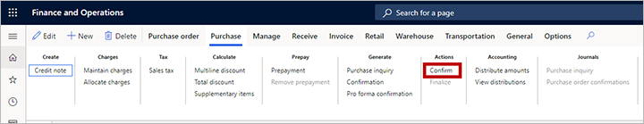
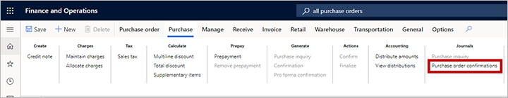
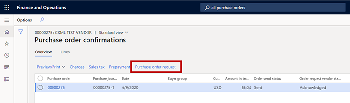
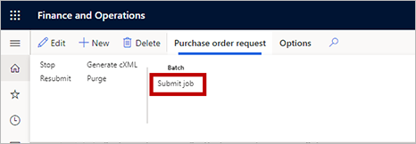

---
# required metadata

title: Purchasing cXML Enhancements
description: The purchasing cXML enhancements feature builds on the existing external catalog functionality used for purchase requisitions.
author: dasani-madipalli
manager: tfehr
ms.date: 08/03/2020
ms.topic: article
ms.prod: 
ms.service: dynamics-ax-applications
ms.technology: 

# optional metadata

# ms.search.form:  [Operations AOT form name to tie this topic to]
audience: Application User
# ms.devlang: 
ms.reviewer: kamaybac
ms.search.scope:  Core, Operations
# ms.tgt_pltfrm: 
# ms.custom: [used by loc for topics migrated from the wiki]
ms.search.region: Global
# ms.search.industry: [leave blank for most, retail, public sector]
ms.author: damadipa
ms.search.validFrom: 2020-08-03
ms.dyn365.ops.version: Release 10.0.13
---

# Purchasing cXML Enhancements

[!include [banner](../includes/banner.md)]

The _purchasing cXML enhancements_ feature builds on the [existing external catalog functionality](set-up-external-catalog-for-punchout.md) used for purchase requisitions, which is called _PunchOut_. While a purchase order doesn't have to originate from a purchase requisition, there needs to be a connection between the supplier on a purchase order and the parameters used to send the purchase order document.

## Turn on the purchasing cXML enhancement feature

To turn on the feature, go to the [**Feature management**](../../fin-ops-core/fin-ops/get-started/feature-management/feature-management-overview.md) page and search for the feature named &quot;Purchasing cXML Enhancements&quot;. Highlight the feature and then select **Enable now** to enable feature.

After enabling the feature, you should make settings in the following three areas (as summarized in the following diagram):

- [**cXML parameters**](#cxml-parameters) - Use these settings to set up some global parameters for use with the purchase order send functionality.
- [**Vendor setup**](#vendor-setup) - Set the new **Send purchase order via cXML** flag for each vendor for whom you would like to enable cXML by default for all new purchase orders created for that vendor.
- [**External catalogs**](#external-catalog-setup) - Use the new **Order parameters** settings here to establish the format and sending of the purchase order document.

In addition, you must also set up the [purchase order request batch job](#po-batch). This batch job is used to send the confirmed purchase orders.

## Set up global cXML parameters

Use the **cXML parameters** page to make a few global settings that apply to the purchase order send functionality.

To set up your cXML parameters, go to **Procurement and sourcing \> Setup \> cXML Management \> cXML Parameters** and make the following settings:

- **cXML test mode** - This is a global parameter that affects the physical sending of purchase orders from the batch job. Choose one of the following values:
  - **Test** - In this mode, the batch job can be running, and the XML document for the message will be generated, but it will just be saved on the purchase order request for review purposes (rather than sent). This is helpful when you are in an initial implementation and you want to check how data is populated in the cXML message and perhaps generate sample messages to send to suppliers for initial validation.
  - **Live** - In this mode, the feature will use the [External catalog setup](#external-catalog-setup) settings to physically transmit each document to the supplier.
- **Send purchase request updates** - Set this to **Yes** to send an update message for purchase orders. Set this **No** to prevent sending this message. Most vendors prefer not to receive an update message, and instead require the customer to phone or email the vendor if a purchase order should be changed. This is a global parameter and there isn't an override at the external catalog for each vendor. A purchase order will be marked as updated if you post a second confirmation on a purchase order and the first confirmation has already been sent and acknowledged by the vendor. If there is a second confirmation, but the first confirmation hasn't been sent, then it will be treated as a new document. You can confirm a purchase order as many times as you like until one confirmation is sent then the next one will be treated as an update message.
- **Send purchase request delete** - Set this to **Yes** to send a delete message for purchase orders. Set this **No** to prevent sending this message. Most vendors prefer not to receive a delete message, and instead require the customer to phone or email the vendor if a purchase order was sent by mistake. This is a global parameter and there isn't an override at the external catalog for each vendor. A purchase order will be marked as deleted if you cancel the purchase order in Supply Chain Management.
- **Archive path** - Specify the file path where you want to export and save archived cXML documents. The path is used when you run the purge function from the **Purchase order request** page.
- **Max characters for street line** - Enter a value to limit the number of characters that can be used in the street field for addresses in the cXML document. This is a global parameter and will affect all suppliers unless there is an override specified on the external catalog properties.

## Set up vendors purchase orders to use cXML

Each time you confirm a purchase order that has its **Send purchase order via cXML** flag set to _Yes_, the system will automatically generate the cXML message and deliver it to the vendor associated with that purchase order. There are two ways to control this option for your purchase orders:

- To set up a vendor to automatically use cXML for all new purchase orders created from a requisition, go to **Procurement and sourcing \> Vendors \> All vendors**. Open or create a vendor to open its details page. Then expand the **Purchase order defaults** FastTab and set **Send purchase order via cXML** to _Yes_. To also automatically use cXML for new purchase orders _not_ created from a requisition, you must also set the **ENABLEMANUALPO** order property to _True_ for the related external catalog (as described in [Set the order properties](#set-order-properties) ).
- For individual purchase orders, go to **Procurement and sourcing \> Purchase orders \> All purchase orders**. Open or create a purchase order to open its details page, and then select the **Header** tab. Expand the **Setup** FastTab and assign the **Send purchase order via cXML** flag as needed.

## Set up an external catalog to use cXML

The **External catalogs** page lets you set up the PunchOut functionality and purchase-order sending capability for each of your catalogs. To find these settings, go to **Procurement and sourcing \> Catalogs \> External catalogs**. Start by  [setting up each catalog as usual](set-up-external-catalog-for-punchout.md), which includes assigning a vendor, choosing the categories that the vendor is allowed to supply, activating the catalog, and so on. Then make the additional settings described in this section.

> [!NOTE]
> When you confirm a purchase order where sending over cXML is enabled, the system will look up the vendor associated with that purchase order and then find the first active external catalog associated with that vendor. The system will then use the settings from that catalog to send the purchase order. This means that if you have multiple external catalogs setups, the system will just use the first one it finds based on the vendor on the purchase order. Therefore, we recommend that you create just one external catalog for each vendor.

### Set the PunchOut protocol type

On the **General** FastTab, set the **Punchout protocol type** to _cXML._ There is only one option unless a partner has extended the functionality and provides an additional option in their extension.

If you are also using the catalog for PunchOut, then you must also [set up the message format](set-up-external-catalog-for-punchout.md). The message format is used for establishing the connection to the supplier in the PunchOut transaction from the requisition. When sending a purchase order, the order properties will be used to establish the connection with a supplier.

### Set the order properties

The _purchasing cXML enhancements_ feature adds the new **Order properties** FastTab for external catalogs. It provides a grid for defining the properties and a toolbar with the following three buttons help you to manage the properties:

- **Default properties** - When you are setting up a new catalog, select this button to add a predefined collection of commonly used properties to the grid.
- **New** - Add a new property to the grid.
- **Delete** - Delete the currently selected property. If you accidentally delete a default property from the list, then select **Default properties** to restore all the missing properties.

Each time you add one or more properties to the grid, use the right-hand column to specify values for each of them.

Use the default properties as follows:

- **BUYER\_COOKIE** - This is a tracking field that can be used to indicate a specific information for your company. Populate with a simple value as it doesn't have too much meaning in the purchase order send unless you have an agreement with the supplier on how to use this property.
- **DELIVERTO** - When the shipping address is populated in the document from the purchase order, the &quot;Attention information&quot; field will be used to populate the `DeliverTo` field in the XML message. If you require that this is a requester name and you will populate the requester field on the purchase order header, then enter the value _REQUESTER_ in this property to have the requester name populated in the `DeliverTo` field of the XML. Additionally, the primary email address and phone number from the requester will be used instead of the orderer.
- **DEPLOYMENTMODE** - Enter this as required by the vendor. The values are usually _PRODUCTION_ or _TEST_. Set this valued based on your communication with the supplier. Usually it will have to match the intended system behind the ORDERCHECHURL that the supplier is indicating as a test or production system.
- **FIXEDBILLADDRESSID** - When the `addressID` field is populated in the XML message, it will pick up the location that is specified on the address. If for some reason you have communicated to the supplier a different ID value to the value on the address location, then you can force an override by specifying the value here. This assumes that you only will use one address with the supplier, and they have that address set up in their system. The billing address is the primary invoice address specified for the Supply Chain Management legal entity.
- **FIXEDSHIPADDRESSID** - When the `addressID` field is populated in the XML message, it will pick up the location that is specified on the address. If for some reason you have communicated to the supplier a different ID value to the value on the address location, then you can force and override by specifying the value here. This assumes that you only will use one address with the supplier, and they have that address set up in their system. The shipping address is the address specified on the header of the purchase order. Most suppliers only accept header addresses and not line addresses. There are fields in the XML for line addresses, but they will be populated with the header address.
- **FROM\_DOMAIN** - Enter the value supplied by your vendor for sending purchase order documents.
- **FROM\_IDENTITY** - Enter the value supplied by your vendor for sending purchase order documents.
- **ORDERCHECKURL** - Enter the URL supplied by your vendor for where to transmit the purchase order documents. This is the `https://` URL supplied by your vendor.
- **PAYLOAD\_ID** - Enter a prefix value for the payload ID as needed for the business processes in place for the current supplier.
- **SENDER\_DOMAIN** - Enter the value supplied by your vendor for sending purchase order documents.
- **SENDER\_IDENTITY** - Enter the value supplied by your vendor for sending purchase order documents.
- **SHARED\_SECRET** - Enter the value supplied by your vendor for sending purchase order documents.
- **STREETLENGTH** - Enter a number here to represent the maximum number of characters the vendor will accept as a street name. If there is a value here, it will override the value specified on the **cXML Parameters** page. The system will remove line breaks and spaces to fit the standard Supply Chain Management address into the number of characters specified here before being truncated.
- **TO\_DOMAIN** - Enter the value supplied by your vendor for sending purchase order documents.
- **TO\_IDENTITY** - Enter the value supplied by your vendor for sending purchase order documents.
- **USERAGENT** - Enter a value here to identify the system you are using. For example, _Dynamics 365 Supply Chain Management_.
- **VERSION** - Enter a cXML version number if requested by the supplier. This will default to 1.2.008, which is a version that is stable and accepted by most vendors.
- **RESPONSETEXT** - If you expect the supplier to return custom text in the cXML response message after the order has been sent, enter that text in here. This will allow the system to mark the message as _Acknowledged_. If the response doesn't match standard text, or the customer text that you enter here, the request will be marked as error.
- **RESPONSETEXTSUB** - Set this property to _TRUE_ if you want to search the vendor response text for the values specified in the **RESPONSETEXT** field. For example, the vendor might return a long string that includes _OK_ in the response. You can enter _OK_ in **RESPONSETEXT** and set **RESPONSETESTSUB** to _TRUE_ to search the response for _OK_ anywhere in the response to allow the order to be set to Acknowledged.
- **CONTENTTYPE** - In a typical catalog setup, you don't need to set this property. If you receive a server 500 error from a vendor's system when you send a purchase order, then you could test by setting this value to _FALSE_. This will change a setting in the web request, which for some platforms may allow the message to be sent.
- **ENABLEHEADERS** - Set this property to _TRUE_ to send headers with the post of the purchase order. You only need to set this if the supplier requires it. If you set this to _TRUE_, add extra custom properties, prefixed with H\_, based on the names that the supplier provides. Typical examples include _H\_USERID_, _H\_PASSWORD_, _H\_RECEIVERID_, _H\_ACTIONREQUEST_. The following are included in the default properties:
- **H\_USERID** - If the trading partner requires you to send a user ID as part of the URL to submit a purchase order, enter the value here.
- **H\_PASSWORD** - If the trading partner requires you to send a password as part of the URL to submit a purchase order, enter the value here.
- **ENABLEMANUALPO** - If this property is set to _TRUE,_ then when users create purchase orders manually (without starting from a requisition), the **Send purchase order via cXML** setting on the vendor will be inherited by those purchase orders. If this isn't set, or set to _FALSE,_ then the **Send purchase order via cXML** flag won't be set on the purchase order header for manually created purchase orders. For purchase orders created from a requisition, the **Send purchase order via cXML** setting on the vendor is always inherited, regardless of this property setting. More information: [Set up vendors purchase orders to use cXML](#vendor-setup).
- **PUNCHOUTPOONLY** - If this property is set to _TRUE_, then only purchase requisition lines that are created from the PunchOut process will set the **Send purchase order via cXML** flag on the purchase order header. In addition, all lines in the purchase order must have a purchase requisition line type of _External catalog item_; otherwise, the cXML purchase order can't be created.
- **PUNCHOUTSHIPTO** - If this property is set to _TRUE_, then the legal entity default address will be added to the PunchOut setup request message when the user opens an external catalog. The address is added as the `ShipTo` address. Suppliers will leverage the `ShipTo` address to display pricing based on the company location.
- **TRACEPUNCHOUT** - Set this property to _TRUE_ if you get an error when trying to browse to an external catalog from the requisition. This will populate trace information for the `PunchOutSetupRequest` and `PunchOutResponse` messages that are sent between Supply Chain Management and the supplier site. The information can be viewed on the **cXML cart message log** page, which you can open from the **External catalog setup** page for the vendor catalog you are have having issues with. You should only use this while troubleshooting; don't turn it on unless necessary because it creates a large performance overhead on the database for each PunchOut. See also [External catalogs PunchOut cXML cart message log](#message-log).
- **REPLACENEWLINE** - Set this property to _TRUE_ if you are having an issue with a supplier's system sending a `PunchOutResponse` message that includes the `\n` character. This might happen if the supplier's messages are parsed through middleware or a procurement hub. If you are having an issue with a new vendor setup, enable the **TRACEPUNCHOUT** property to view the `PunchOutResponse` message to see whether the XML tags are broken up by the `\n` character.
- **POCOMMENTS** - Set this property to _TRUE_ if you want to the cXML document to include notes that are attached to the purchase order in Supply Chain Management. The attachment text is included in the header comments in the purchase order message. For more information about how these attachments are selected and processed by the system, see [Attach notes with a purchase order](#attach-po-notes).
- **VENDCOMMENTS** - Set this property to _TRUE_ if you want to the cXML document to include notes that are attached to the purchase order in Supply Chain Management. The attachment text is included in the header comments in the purchase order message. For more information about how these attachments are selected and processed by the system, see [Attach notes with a purchase order](#attach-po-notes).
- **CLEANAMP** - Set this property to _TRUE_ if you get an error when trying to PunchOut to a vendor and their return URL includes wrongly encoded `&` symbols.
- **PUNCHOUTTZ** - Set this property to _TRUE_ if the vendor you are working with does a specific validation of the PunchOut request message date/time using the ISO 8601 standard. Supply Chain Management uses the UTC date in the `PunchOutSetupRequest` message, so setting this to _TRUE_ will add +00:00 to the date/time format.
- **WMSADDRESSID** - Set this property to _TRUE_ to use the warehouse number on the purchase order header as the **addressID** in the **ShipTo** address for the purchase order request sent to the supplier. If you set a value for the **FIXEDSHIPADDRESSID** parameter, it will take precedence over this one, so you should choose either one or the other to set the **addressID** in for the **ShipTo** address in the document.
- **PUNCHOUTSHIPTOUSER** - This parameter works with the **PUNCHOUTSHIPTO** parameter. If **PUNCHOUTSHIPTO** is set to _TRUE,_ it will pick up the address for the legal entity. If **PUNCHOUTSHIPTOUSER** is set to _TRUE,_ then it will use the primary address from the PunchOut user instead of the legal entity address.

### Activate the external catalog

When you have finished setting up all of the parameters and making other settings for your external catalog, go back to the **General** FastTab and set **Active** to **Yes**.

### Attach notes with a purchase order

As mentioned in [Set the order properties](#set-order-properties), it's possible to include text from notes attached to the relevant purchase order and/or vendor records in your delivered cXML by setting the **POCOMMENTS** and/or **VENDCOMMENTS** parameters to _TRUE_ in the external catalog setup. This section provides a few more details about how these attachments are selected and processed by the system should you choose to use them.

To set the types of notes the system will look for, go to **Procurement and sourcing \> Setup \> Forms \> From setup** and then open the **Purchase order** tab. Set **Include documents of type** to the type of note you want to be able to include. Only text notes will be included, not document attachments.

Only attachments with **Type** set to the value you chose on the **Form setup** page and **Restriction** set to _External_ will be included with the purchase order.

To create, view, or edit attachments for a purchase order, go to **Procurement &amp; Sourcing \> All Purchase Orders** and then select or create a purchase order. Select the purchase order and then select the **Attachments** icon at the right side of the Action Pane.

## View the external catalogs PunchOut cXML cart message log

When you set up an external catalog with the **Punchout protocol type** set to _cXML,_ the system will capture a message log of the baskets coming back from suppliers for troubleshooting and additional data purposes.

To open the log for an external catalog, first choose the right catalog, and then select **cXML cart message log** on the Action Pane. You will then see a list of the carts that have been returned, the XML related to those carts, and the lines that were created on the related purchase requisition.

## Set external catalogs PunchOut extrinsic elements

When you set up an external catalog with the **Punchout protocol type** set to *cXML*, you will be able to add custom extrinsic elements to be inserted at the right position into the request XML message.

To add extrinsic elements to an external catalog:

1. Go to **Procurement and sourcing \> Catalogs \> External catalogs**.
1. Select the relevant catalog.
1. Expand the **Message format** FastTab.
1. In the **Extrinsics** section, use the buttons in the toolbar to add a row to the table for each extrinsic element you want to include. For each row, set the following:
    - **Name** - Enter a name for the element. This will become the value for the `name` attribute for the `Extrinsic` XML element created by each row. You will usually coordinate with your vendor to agree on what the name for each extrinsic element should be.
    - **Value**: Select a value for the element. This will become the value for the XML element created by each row. For each row, select one of the following:
        - **User name** - Places the name of the user that is executing the PunchOut. This is the sign-in name for Dynamics 365 Supply Chain Management.
        - **User email** - Places the email address the user that is executing the PunchOut. This is the address that the user has setup on the **Account** tab of the **User options** page.
        - **Random value** - Places a unique random value.
        - **User full name** - Places the full name from the contact person associated with the user accessing the external catalog.
        - **Firstname** - Places the first name from the contact person associated with the user accessing the external catalog.
        - **Lastname** - Places the last name from the contact person associated with the user accessing the external catalog.
        - **Phone number**- Places the primary phone number from the contact person associated with the user accessing the external catalog.

The user or admin won't see the extrinsic elements because they are first added when the user performs a PunchOut. They will be inserted between the `<BuyerCookie>` and the `<BrowserFromPost>` elements in the cXML setup request message, so you don't need to set them manually in the XML when you set up the external catalog.

## Create and process a purchase order

When you create a new purchase order for a vendor, the purchase order will inherit the **Send purchase order via cXML** status set for that vendor (enabled or disabled). However, the setting remains available on each purchase order's **Header** (on the **Setup** FastTab) so you can change it later if needed.

When you create a purchase order from a purchase requisition that came from a PunchOut flow, then the purchase order will have all the required line details populated. You can then add purchase order lines manually or copy them from other purchase orders. You should make sure that you populate all required fields, including the external reference number, which is the supplier number that will be used in the cXML message.

When you have finished filling out all of the details for the purchase order, be sure to confirm by opening the **Purchase** tab on the Action Pane and then selecting **Confirm** from the **Actions** group. No message is sent unless it is confirmed.

Once confirmed, you can see the status of the confirmation through the **Purchase order confirmations** journals. To see them, open the **Purchase** tab on the Action Pane and then, from the **Journals** group, select **Purchase order confirmations**.

Each purchaser order can have many confirmations. Each confirmation is marked with an incremental number. In the following example, the purchase order is 00000275 and the confirmation is 00000275-1. This is standard Supply Chain Management functionality that identifies changes in a purchase order based on the confirmation and therefore the type of cXML message to send to the supplier. You can also see the **Order send status** and the **Order request vendor status**. For more information about various status values that you might see here, see [Monitor purchase order requests](#monitor-po-requests).

Select **Purchase order request** to see more information about the document.

The **Purchase order request** page shows two grids. There will be one record in the top grid for each purchase order that is marked for sending. The bottom grid could have several records for the selected purchase order to indicate the status of each confirmation. In this example, we have purchase order 00000275 and we see the document 00000275-1 in the **Purchase order request history**.

If the batch job is set up and is running, then the document will be sent. You can see the status change after the document has been sent. In this example, you can see the **Order send status** is _Sent_ and the **Order request vendor status** is _Acknowledged_ which indicates that the suppliers received the document and was able to read it and store it in their system. You will see the time when the document was sent in the Purchase order request history grid. For more information about various status values that you might see here, see [Monitor purchase order requests](#monitor-po-requests).

## Schedule the purchase order request batch job

To enable the purchase order request send batch job, go to **Procurement and sourcing \> Setup \> cXML Management \> Purchase order request**. Then open the **Purchase order request** tab on the Action pane and select **Submit job**.

The **Purchase request prepare and send** dialog box opens. Use it to set up the recurrence as usual for batch jobs in Supply Chain Management. Choose your interval based on your order volume. Though you could run it every minute, it's probably best to send in batches over the course of the business day based on the order-receive windows that match your vendors' schedules. For example, your vendor might have a policy of shipping all orders received by 1 PM the same day. Then you might only need to run the batch a few times during the morning to communicate any orders that you have. Then the remaining orders will be sent the next day. This is purely a business decision that you can review and set the parameters accordingly. The process will look for purchase order request documents that are in the *waiting* status. If you have an order that you need to send immediately to a supplier, then you can select **Submit job** and set the **Batch processing** option to *No*.

## Monitor purchase order requests

### View the status of a purchase order

When orders enabled for sending via cXML are confirmed, they will go into a _waiting_ state. As described in [Create and process a purchase order](#create-po), you can view the purchase order state from the **Purchase order request** page. Each purchase order request can be in any of several different states, depending on its parameters and data. This section describes the various status types and the values they can have, which can help you manage issues and understand the status of your purchase orders.

The following statuses and values may be shown on the **Purchase order request** grid of the **Purchase order request** page:

- **Order send status** will have one of the following values:
  - **Waiting** - The document is waiting to be sent.
  - **Sent** - The document has been sent.
  - **Stopped** - The document was marked to be stopped before it was sent. A document can be marked as **Stopped** by selecting **Stop** on Action Pane of the **Purchase request** page.
  - **Archive** - The document has been purged by selecting **Purge** on Action Pane of the **Purchase request** page.
- **Order request vendor status** will have one of the following values:
  - **Waiting** - The document is waiting to be sent.
  - **Acknowledged** - The document has been acknowledged as received from the vendor. You can review the detailed XML message returned from the supplier by selecting the **Response XML** tab at the bottom of the **Purchase order request** page.
  - **Error** - The document was sent to the vendor, but an error occurred. You can review an error message by selecting the **Response XML** tab at the bottom of the **Purchase order request** page.

The following statuses and values may be shown on the **Purchase order request history** tab at the bottom of the **Purchase order request** page:

- **Order request type** will have one of the following values:
  - **New** - The line is marked as new right after the purchase order is confirmed.
  - **Update** - If a confirmation has already been sent and acknowledged from the supplier, then the next confirmation will be marked as _Update_. Updates will only be sent if they are enabled in the [global cXML Parameters](#cxml-parameters).
  - **Delete** - If a confirmation has already been sent and acknowledged by the supplier and the purchase order is canceled, then the confirmation waiting will be marked as _Delete_. Deletes will only be sent they are enabled in the [global cXML Parameters](#cxml-parameters).
- **Request time** - This is the time when the order confirmation was created. You can compare the request time with the order status time to determine time between confirmation and vendor acknowledgment.
- **Order send status** - This is the same as the **Order send status** reported in the **Purchase order request** grid. It is repeated here to make it easier to see the status at the confirmation level. If the **Order request type** is new, and the purchase order is reconfirmed before a confirmation is sent, the **Order send status** is set to archive.
- **Order status time** - This is the last time the purchase order request history record was updated (including status changes).
- **Order request vendor status** - This is the same as the **Order request vendor status** reported in the **Purchase order request** grid. It is repeated here to make it easier to see the status at the confirmation level.
- **Re-submit time** - This is the time the record was resubmitted.
- **Re-submit count** - This is the number of times the record has been resubmitted. A high number indicates multiple failures, which may indicate a problem with your or your vendor's data setup.

### View the XML for a purchase order request message

To view the XML for the purchase order request message, open the **Response XML** tab at the bottom of the **Purchase order request** page. This can be helpful during testing or error validation. To make it easier to read, copy this to a text file and view it in an XML editor to see a formatted message.

### View the detail of the vendor response

To view the content of a vendor acknowledged or error response, open the **Response XML** tab at the bottom of the **Purchase order request** page.

