---
# required metadata

title: Purchasing cXML Enhancements
description: The Purchasing cXML Enhancements feature builds on the existing external catalog functionality, PunchOut, that is used for purchase requisitions.
author: GalynaFedorova
ms.date: 08/03/2020
ms.topic: article
ms.prod: 
ms.technology: 

# optional metadata

ms.search.form: CatCXMLParameters, CatCXMLPurchRequest
audience: Application User
# ms.devlang: 
ms.reviewer: kamaybac
# ms.tgt_pltfrm: 
# ms.custom: [used by loc for articles migrated from the wiki]
ms.search.region: Global
# ms.search.industry: [leave blank for most, retail, public sector]
ms.author: gfedorova
ms.search.validFrom: 2020-08-03
ms.dyn365.ops.version: 10.0.13
---

# Purchasing cXML Enhancements

[!include [banner](../includes/banner.md)]

The *Purchasing cXML Enhancements* feature builds on the [existing external catalog functionality](set-up-external-catalog-for-punchout.md) that is used for purchase requisitions. This existing functionality is known as *PunchOut*. Although a purchase order doesn't have to originate from a purchase requisition, there must be a connection between the vendor on a purchase order and the parameters that are used to send the purchase order document.

## Turn on the Purchasing cXML Enhancements feature

To use this feature, it must be turned on for your system. As of Supply Chain Management version 10.0.21, it's turned on by default. As of Supply Chain Management version 10.0.32, this feature is mandatory and can't be turned off. If you're running a version older than 10.0.32, then admins can turn this functionality on or off by searching for the *Purchasing cXML Enhancements* feature in the [**Feature management** workspace](../../fin-ops-core/fin-ops/get-started/feature-management/feature-management-overview.md).

## Prepare to use the Purchasing cXML Enhancements feature

Before using this feature for the first time, you should configure settings in the following three areas:

- **[cXML parameters](#cxml-parameters)** – Use these settings to set up some global parameters for the functionality for sending purchase orders.
- **[Vendor setup](#vendor-setup)** – If commerce eXtensible Markup Language (cXML) should be used by default for all new purchase orders that are created for any vendor, set the **Send purchase order via cXML** option to *Yes* for that vendor.
- **[External catalogs](#external-catalog-setup)** – Use the new **Order properties** settings to define the format of the purchase order document and how it's sent.

The following illustration summarizes this configuration.

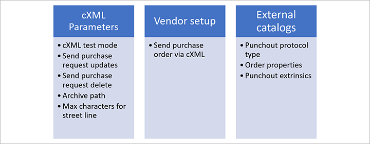

In addition, you must set up the [Purchase order request batch job](#po-batch). This batch job is used to send the confirmed purchase orders.

## Set up global cXML parameters

Use the **cXML parameters** page to make a few global settings that apply to the functionality for sending purchase orders.

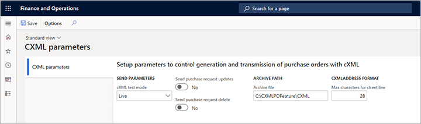

Go to **Procurement and sourcing \> Setup \> cXML management \> cXML parameters**, and set the following parameters:

- **cXML test mode** – This global parameter affects the way that purchase orders are physically sent from the batch job. Select one of the following values:

    - **Test** – In this mode, the batch job can be running, and the XML document for the message is generated, but it isn't sent. Instead, it's saved on the purchase order request for review purposes. This mode is helpful when you're in an initial implementation, and you want to see how data is entered in the cXML message. You might also want to generate sample messages that you can send to vendors for initial validation.
    - **Live** – In this mode, the feature uses the [external catalog settings](#external-catalog-setup) to physically transmit each document to the vendor.

- **Send purchase request updates** – Set this option to *Yes* to send an update message for purchase orders. Set it to *No* to prevent the message from being sent. Most vendors prefer not to receive update messages. Instead, they require that customers contact them by phone or email if a purchase order should be changed. This parameter is a global parameter, and no override can be specified on the external catalog for each vendor. A purchase order will be marked as updated if you post a second confirmation on a purchase order, but the first confirmation has already been sent and acknowledged by the vendor. If there is a second confirmation, but the first confirmation hasn't been sent, the second confirmation will be treated as a new document. You can confirm a purchase order as many times as you want until one confirmation is sent. The next confirmation will then be treated as an update message.
- **Send purchase request delete** – Set this option to *Yes* to send a delete message for purchase orders. Set it to *No* to prevent the message from being sent. Most vendors prefer not to receive delete messages. Instead, they require that customers contact them by phone or email if a purchase order was sent by mistake. This parameter is a global parameter, and no override can be specified on the external catalog for each vendor. A purchase order will be marked as deleted if you cancel the purchase order in Supply Chain Management.
- **Archive file** – Specify the file path where you want to export and save archived cXML documents. The path is used when you run the purge function from the **Purchase order request** page.
- **Max characters for street line** – Enter the maximum number of characters that can be used in the street field for addresses in the cXML document. This global parameter affects all vendors unless an override is specified on the external catalog properties.

## Set up vendor purchase orders to use cXML

Every time that you confirm a purchase order where the **Send purchase order via cXML** option is set to *Yes*, the system automatically generates the cXML message and delivers it to the vendor that is associated with that purchase order. There are two ways to control this option for your purchase orders:

- To set up a vendor so that it automatically uses cXML for all new purchase orders that are created from a requisition, go to **Procurement and sourcing \> Vendors \> All vendors**, and select or create a vendor to open its details page. Then, on the **Purchase order defaults** FastTab, set the **Send purchase order via cXML** option to *Yes*. If cXML should also automatically be used for new purchase orders that are **not** created from a requisition, you must also set the **ENABLEMANUALPO** order property to *True* for the related external catalog, as described in the [Set the order properties](#set-order-properties) section later in this article.
- For individual purchase orders, go to **Procurement and sourcing \> Purchase orders \> All purchase orders**, and select or create a purchase order to open its details page. Switch to the **Header** view, and then, on the **Setup** FastTab, set the **Send purchase order via cXML** option as required.

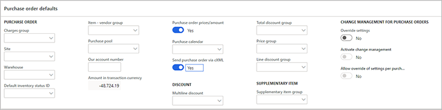

## Set up an external catalog to use cXML

On the **External catalogs** page, for each of your catalogs, you can set up the PunchOut functionality and the functionality for sending purchase orders. To find the relevant settings, go to **Procurement and sourcing \> Catalogs \> External catalogs**. Start by [setting up each catalog as usual](set-up-external-catalog-for-punchout.md). This process includes assigning a vendor, selecting the categories that the vendor is allowed to supply, and activating the catalog. Then configure the additional settings that are described in this section.

> [!NOTE]
> When you confirm a purchase order that can be sent via cXML, the system looks up the vendor that is associated with the purchase order and then finds the first active external catalog that is associated with that vendor. The system then uses the settings from that external catalog to send the purchase order. If multiple external catalogs are set up, the system uses only the first external catalog that it finds, based on the vendor on the purchase order. Therefore, we recommend that you create just one external catalog for each vendor.

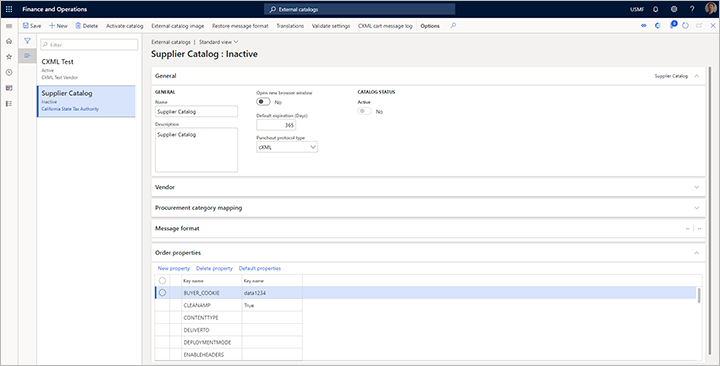

### Set the PunchOut protocol type

On the **General** FastTab of the **External catalogs** page, set the **Punchout protocol type** field to *cXML*. This option will be the only available option, unless a partner has extended the functionality and provides an additional option in the extension.

If you're also using the catalog for PunchOut, you must also [set up the message format](set-up-external-catalog-for-punchout.md). The message format is used to establish the connection to the vendor in the PunchOut transaction from the requisition. When a purchase order is sent, the order properties will be used to establish the connection with a vendor.

### Set the order properties

The *Purchasing cXML Enhancements* feature adds a new **Order properties** FastTab for external catalogs. This FastTab provides a grid where you can define the order properties. It also provides a toolbar. This toolbar contains the following three buttons that you can use to manage the order properties:

- **Default properties** – When you're setting up a new catalog, select this button to add a predefined collection of commonly used properties to the grid.
- **New** – Add a new property to the grid.
- **Delete** – Delete the currently selected property from the grid. If you accidentally delete a default property, select **Default properties** to restore all the missing properties.

Every time that you add one or more properties to the grid, use the right column to specify a value for each.

Use the default properties in the following way:

- **BUYER\_COOKIE** – This tracking field can be used to indicate specific information for your company. Unless you have an agreement with the vendor about how this property is used, it doesn't have very much meaning when sending a purchase order. Therefore, you should set it to a simple value.
- **DELIVERTO** – When the shipping address is entered in the document from the purchase order, the **Attention information** field is used to set the **DeliverTo** field in the XML message. If you require that this value be a requester name, and you will set the requester field on the purchase order header, enter the value *REQUESTER* for this property, so that the requester name will be entered in the **DeliverTo** field in the XML. In this case, the primary email address and phone number that are used will be from the requester instead of the orderer.
- **DEPLOYMENTMODE** – Set this property as required by the vendor. The values are usually *PRODUCTION* or *TEST*. Set the value based on your communication with the vendor. Usually, it must match the intended system behind the **ORDERCHECKURL** value that the vendor indicates as a test or production system.
- **FIXEDBILLADDRESSID** – When the **addressID** field in the XML message is set, it picks up the location that is specified on the address. If the ID value that you've communicated to the vendor differs from the value on the address location for some reason, you can force an override by specifying the value here. The assumption is that you will use only one address with the vendor, and that the address is set up in the vendor's system. The billing address is the primary invoice address that is specified for the legal entity in Supply Chain Management.
- **FIXEDSHIPADDRESSID** – When the **addressID** field in the XML message is set, it picks up the location that is specified on the address. If the ID value that you've communicated to the vendor differs from the value on the address location for some reason, you can force an override by specifying the value here. The assumption is that you will use only one address with the vendor, and that the address is set up in the vendor's system. The shipping address is the address that is specified on the header of the purchase order. Most vendors accept only header addresses, not line addresses. Although there are fields for line addresses in the XML, they will be set to the header address.
- **FROM\_DOMAIN** – Enter the value that is used to send purchase order documents. This value is supplied by your vendor.
- **FROM\_IDENTITY** – Enter the value that is used to send purchase order documents. This value is supplied by your vendor.
- **ORDERCHECKURL** – Enter the URL to transmit the purchase order documents to. This URL starts with `https://` and is supplied by your vendor.
- **PAYLOAD\_ID** – Enter a prefix value for the payload ID, as required for the business processes that are in place for the current vendor.
- **SENDER\_DOMAIN** – Enter the value that is used to send purchase order documents. This value is supplied by your vendor.
- **SENDER\_IDENTITY** – Enter the value that is used to send purchase order documents. This value is supplied by your vendor.
- **SHARED\_SECRET** – Enter the value that is used to send purchase order documents. This value is supplied by your vendor.
- **STREETLENGTH** – Enter a number that represents the maximum number of characters that the vendor will accept as a street name. If a value is entered here, it overrides the value that is specified on the **cXML parameters** page. The system will remove line breaks and spaces to try to fit the standard address in Supply Chain Management into the number of characters that is specified here. Any additional characters will be truncated.
- **TO\_DOMAIN** – Enter the value that is used to send purchase order documents. This value is supplied by your vendor.
- **TO\_IDENTITY** – Enter the value that is used to send purchase order documents. This value is supplied by your vendor.
- **USERAGENT** – Enter a value to identify the system that you're using. For example, enter *Dynamics 365 Supply Chain Management*.
- **VERSION** – Enter a cXML version number, if the vendor requests this information. The default version is *1.2.008*. This version is stable and is accepted by most vendors.
- **RESPONSETEXT** – Enter any custom text that you expect the vendor to return in the cXML response message after the order has been sent. In this way, the system can mark the message as *Acknowledged*. If the response doesn't match standard text or the customer text that you enter here, the request will be marked as *Error*.
- **RESPONSETEXTSUB** – Set this property to *TRUE* if you want to search the vendor response text for the values that are specified in the **RESPONSETEXT** field. For example, the vendor might return a long string that includes "OK" in the response. In this case, you can enter *OK* in the **RESPONSETEXT** field and set **RESPONSETESTSUB** to *TRUE* to search for "OK" anywhere in the response. The order can then be set to *Acknowledged*.
- **CONTENTTYPE** – In a typical catalog setup, you don't have to set this property. If you receive a server 500 error from a vendor's system when you send a purchase order, you can do testing by setting this property to *FALSE*. That value will change a setting in the web request and might enable the message to be sent for some platforms.
- **ENABLEHEADERS** – Set this property to *TRUE* to send headers together with the purchase order. You must set this property only if the vendor requires it. If you set this property to *TRUE*, add extra custom properties that are based on the names that the vendor provides, and prefix them with _H\__. Typical examples include **H\_USERID**, **H\_PASSWORD**, **H\_RECEIVERID**, and **H\_ACTIONREQUEST**. The following custom properties are included in the default properties:

    - **H\_USERID** – If the trading partner requires that you send a user ID as part of the URL to submit a purchase order, enter the value here.
    - **H\_PASSWORD** – If the trading partner requires that you send a password as part of the URL to submit a purchase order, enter the value here.

- **ENABLEMANUALPO** – If this property is set to *TRUE*, when users manually create purchase orders (that is, when they don't start from a requisition), those purchase orders will inherit the setting of the **Send purchase order via cXML** option from the vendor. If this property isn't set, or if it's set to *FALSE*, the **Send purchase order via cXML** option won't be set on the purchase order header for manually created purchase orders. For purchase orders that are created from a requisition, the setting of the **Send purchase order via cXML** option is always inherited from the vendor, regardless of the setting of this property. For more information, see the [Set up vendor purchase orders to use cXML](#vendor-setup) section earlier in this article.
- **PUNCHOUTPOONLY** – If this property is set to *TRUE*, only purchase requisition lines that are created from the PunchOut process will set the **Send purchase order via cXML** option on the purchase order header. In addition, the purchase requisition line type of all lines on the purchase order must be *External catalog item*. Otherwise, the cXML purchase order can't be created.
- **PUNCHOUTSHIPTO** – If this property is set to *TRUE*, the default address of the legal entity will be added to the PunchOut setup request message when the user opens an external catalog. This address is added as the **ShipTo** address. Vendors will use the **ShipTo** address to show pricing based on the company location.
- **TRACEPUNCHOUT** – Set this property to *TRUE* if you receive an error message when you try to browse to an external catalog from the requisition. Trace information will then be filled in for the **PunchOutSetupRequest** and **PunchOutResponse** messages that are sent between Supply Chain Management and the vendor site. You can view this information on the **cXML cart message log** page, which you can open from the **External catalog setup** page for the vendor catalog that you're have having issues with. You should set this property to *TRUE* only if you're troubleshooting, because it creates a large performance overhead on the database for each PunchOut. For more information, see the [View the cXML cart message log for external catalog PunchOut](#message-log) section later in this article.
- **TRACESEND** - Set this property to *TRUE* if you need more details while diagnosing issues related to purchase order's sent with CXML. You can [view the collected information on the **Purchase order request** form](#view-the-details-of-the-vendor-response). You should set this property to *TRUE* only if you're troubleshooting, because it creates a large performance overhead on the database for each purchase order being sent.
- **REPLACENEWLINE** – Set this property to *TRUE* if you're having an issue because a vendor's system is sending a **PunchOutResponse** message that includes newline characters (\\n). This issue might occur if the vendor's messages are parsed through middleware or a procurement hub. If you're having an issue with a new vendor setup, set the **TRACEPUNCHOUT** property to *TRUE* to view the **PunchOutResponse** message and determine whether the XML tags are broken up by newline characters.
- **POCOMMENTS** – Set this property to *TRUE* if you want the cXML document to include notes that are attached to the purchase order in Supply Chain Management. The attachment text is included in the header comments in the purchase order message. For more information about how the system selects and processes these attachments, see the [Attach notes to a purchase order](#attach-po-notes) section later in this article.
- **VENDCOMMENTS** – Set this property to *TRUE* if you want the cXML document to include notes that are attached to the purchase order in Supply Chain Management. The attachment text is included in the header comments in the purchase order message. For more information about how the system selects and processes these attachments, see the [Attach notes to a purchase order](#attach-po-notes) section.
- **CLEANAMP** – Set this property to *TRUE* if you receive an error message when you try to do a PunchOut to a vendor, and the vendor's return URL includes incorrectly encoded ampersands (\&).
- **PUNCHOUTTZ** – Set this property to *TRUE* if the vendor that you're working with uses the International Organization for Standardization (ISO) 8601 standard to do a specific validation of the date/time of PunchOut request message. Supply Chain Management uses the Coordinated Universal Time (UTC) date in the **PunchOutSetupRequest** message. Therefore, when you set this property to *TRUE*, *+00:00* is added to the date/time format.
- **WMSADDRESSID** – Set this property to *TRUE* to use the warehouse number on the purchase order header as the **addressID** value in the **ShipTo** address for the purchase order request that is sent to the vendor. If you set a value for the **FIXEDSHIPADDRESSID** property, that value takes precedence over this value. Therefore, you should use one property or the other to set the **addressID** value in the **ShipTo** address for the document.
- **PUNCHOUTSHIPTOUSER** – This property works together with the **PUNCHOUTSHIPTO** property. If **PUNCHOUTSHIPTO** is set to *TRUE*, the address for the legal entity is picked up. If **PUNCHOUTSHIPTOUSER** is set to *TRUE*, the primary address from the PunchOut user is used instead of the legal entity address.

### Activate the external catalog

When you've finished setting up all the properties and configuring other settings for your external catalog, go back to the **General** FastTab of the **External catalogs** page, and set the **Active** option to *Yes*.

### Attach notes to a purchase order

As was mentioned in the [Set the order properties](#set-order-properties) section, if you want your delivered cXML to include text from notes that are attached to the relevant purchase order and/or vendor records, you can set the **POCOMMENTS** and/or **VENDCOMMENTS** property to *TRUE* in the external catalog setup. This section provides more detail about how the system selects and processes these attachments, if you use them.

To set the types of notes that the system will look for, go to **Procurement and sourcing \> Setup \> Forms \> Form setup**. Then, on the **Purchase order** tab, set the **Include documents of type** field to the type of note that you want to be able to include. Only text notes will be included, not document attachments.

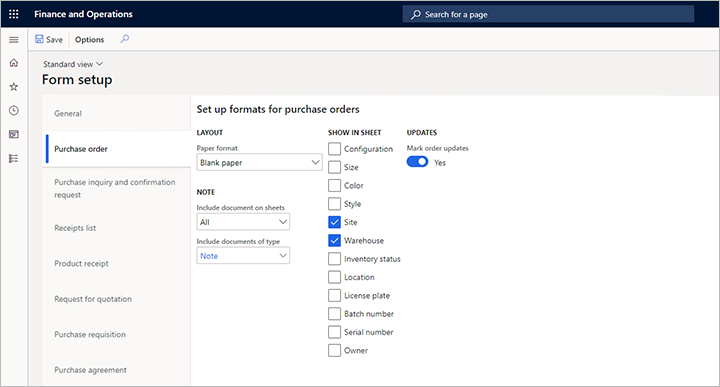

Attachments will be included with a purchase order only if their **Type** field is set to the value that you select in the **Include documents of type** field, and if their **Restriction** field is set to *External*. To create, view, or edit the attachments for a purchase order, go to **Procurement and sourcing \> All purchase orders**, select or create a purchase order, and then select the **Attachments** button (paperclip symbol) in the upper-right corner.

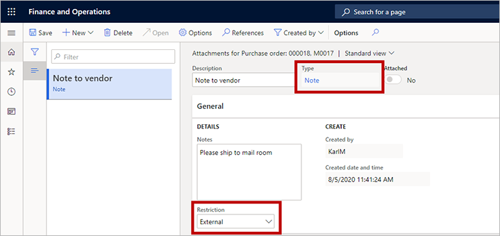

## View the cXML cart message log for external catalog PunchOut

When you set the **Punchout protocol type** field to *cXML* for an external catalog, the system will capture a message log of the carts that come back from vendors. This log can be used for troubleshooting and other data purposes.

To open the log for an external catalog, select the relevant catalog, and then, on the Action Pane, select **cXML cart message log**. The **cXML cart message log** page shows a list of the carts that have been returned, the XML that is related to those carts, and the lines that were created on the related purchase requisition.

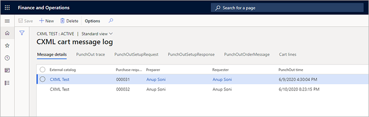

## Set the extrinsic elements for external catalog PunchOut

When you set the **Punchout protocol type** field to *cXML* for an external catalog, you can add custom extrinsic elements that will be inserted at the correct place in the request XML message.

To add extrinsic elements to an external catalog, follow these steps.

1. Go to **Procurement and sourcing \> Catalogs \> External catalogs**.
1. Select the relevant catalog.
1. On the **Message format** FastTab, in the **Extrinsics** section, select **Add** to add a row to the grid for each extrinsic element that you want to include. On each row, set the following fields:

    - **Name** – Enter a name for the element. This value will become the value of the **name** attribute for the **Extrinsic** XML element that is created by each row. Usually, you will work with your vendor to agree on the name for each extrinsic element.
    - **Value** – Select a value for the element. This value will become the value of the XML element that is created by each row. The following values are available:

        - **User name** – Use the name of the user who is doing the PunchOut. This name is the sign-in name for Supply Chain Management.
        - **User email** – Use the email address of the user who is doing the PunchOut. This address is the address that the user has set up on the **Account** tab of the **User options** page.
        - **Random value** – Use a unique random value.
        - **User full name** – Use the full name of the contact person who is associated with the user who is accessing the external catalog.
        - **Firstname** – Use the first name of the contact person who is associated with the user who is accessing the external catalog.
        - **Lastname** – Use the last name of the contact person who is associated with the user who is accessing the external catalog.
        - **Phone number** – Use the primary phone number of the contact person who is associated with the user who is accessing the external catalog.

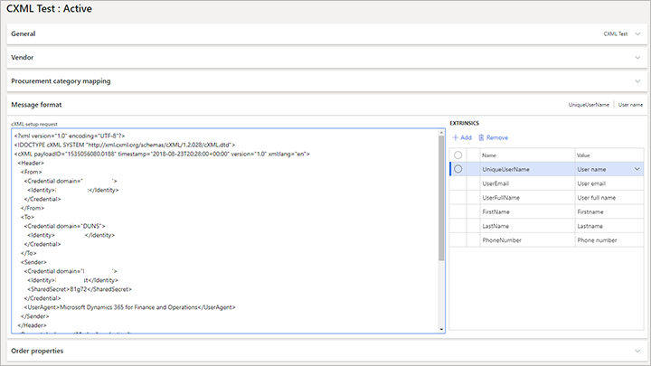

The user or admin won't see the extrinsic elements, because they aren't added until the user does a PunchOut. They will automatically be inserted between the **BuyerCookie** and **BrowserFromPost** elements in the cXML setup request message. Therefore, you don't have to set them manually in the XML when you set up the external catalog.

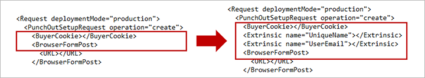

## Create and process a purchase order

When you create a purchase order for a vendor, it will inherit the setting of the **Send purchase order via cXML** option from that vendor. However, the setting remains available on the **Setup** FastTab in the **Header** view of the purchase order, so that you can change it later as required.

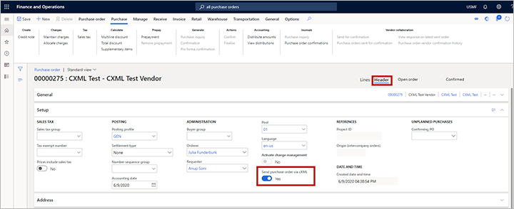

When you create a purchase order from a purchase requisition that came from a PunchOut flow, all the required line details will be filled in. You can then manually add purchase order lines or copy them from other purchase orders. Be sure to set all required fields. These required fields include the external reference number, which is the vendor number that will be used in the cXML message.

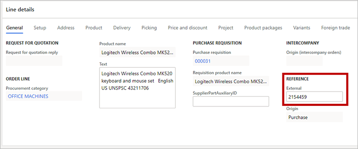

When you've finished filling in all the details for the purchase order, be sure to confirm it. No message is sent unless the purchase order is confirmed. To confirm a purchase order, on the Action Pane, on the **Purchase** tab, in the **Actions** group, select **Confirm**. 

After the purchase order is confirmed, you can view the status of the confirmation through the **Purchase order confirmations** journals. On the Action Pane, on the **Purchase** tab, in the **Journals** group, select **Purchase order confirmations**.

Each purchase order can have many confirmations. Each confirmation is marked with an incremental number. In the following illustration, the purchase order is *00000275*, and the confirmation is *00000275-1*. This numbering reflects standard Supply Chain Management functionality, where changes in a purchase order, and therefore the type of cXML message that should be sent to the vendor, are identified based on the confirmation. As the illustration shows, the **Purchase order confirmations** page also includes **Order send status** and **Order request vendor status** fields. For more information about the various status values that you might see on this page, see the [Monitor purchase order requests](#monitor-po-requests) section later in this article.

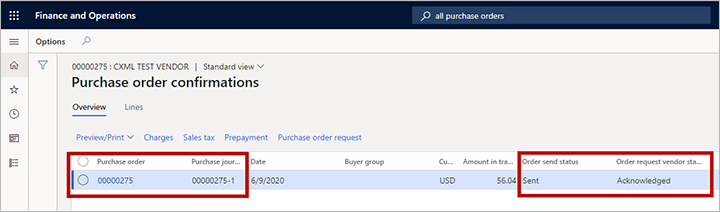

To view more information about the document, select **Purchase order request** above the grid.

The **Purchase order request** page includes two grids. The grid in the upper part of the page has one record for each purchase order that is marked for sending. The grid on the **Purchase order request history** tab in the lower part of the page might have several records for the selected purchase order, to indicate the status of each confirmation. The following illustration shows purchase order 00000275 in the upper grid and document 00000275-1 in the grid on the **Purchase order request history** tab.

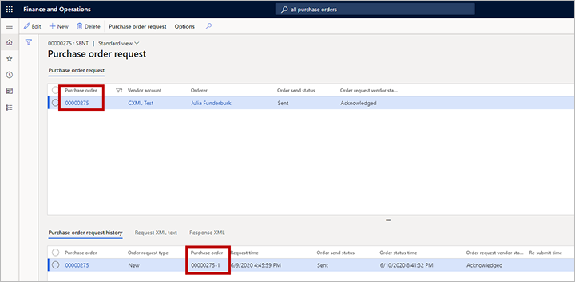

If the batch job is set up and running, the document will be sent. You can view the status change after the document has been sent. In the following illustration, the **Order send status** field is set to *Sent*. The **Order request vendor status** field is set to *Acknowledged* to indicate that the vendor received the document, and was able to read it and store it in its system. The grid on the **Purchase order request history** tab shows the time when the document was sent. For more information about the various status values that you might see on this page, see the [Monitor purchase order requests](#monitor-po-requests) section.

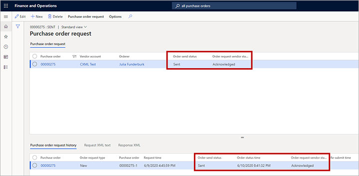

## Schedule the Purchase order request batch job

To activate the batch job for sending purchase order requests, go to **Procurement and sourcing \> Setup \> cXML Management \> Purchase order request**, and then, on the Action Pane, on the **Purchase order request** tab, in the **Batch** group, select **Submit job** to open the **Purchase request prepare and send** dialog box. You can use this dialog box to set up the recurrence, just as you usually do for batch jobs in Supply Chain Management. Select an interval, based on your order volume. Although you can run the batch job every minute, it's probably best to send batches throughout the business day, based on order receipt windows that match your vendors' schedules.

For example, your vendor has a policy that states that all orders that are received by 1 PM will be shipped on the same day. In this case, you might have to run the batch only a few times during the morning to communicate any orders that you have. The remaining orders will then be sent the next day. This decision is purely a business decision. You can review it and set the parameters for it accordingly.

The process will look for purchase order request documents that have a status of *Waiting*. If you have an order that you must send to a vendor immediately, you can select **Submit job** and set the **Batch processing** option to *No*.

## Monitor purchase order requests

### View the status of a purchase order

When orders that can be sent via cXML are confirmed, they go into *Waiting* status. As was described in the [Create and process a purchase order](#create-po) section, you can view the purchase order status on the **Purchase order request** page. Each purchase order request can have one of several statuses, depending on its parameters and data. This section describes the various status types and the values that they can have. This information can help you manage issues and understand the status of your purchase orders.

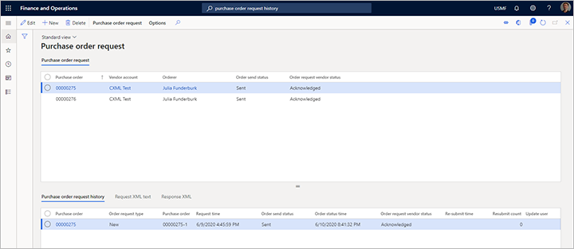

The grid in the upper part of the **Purchase order request** page might show the following status values:

- **Order send status** – This field can have one of the following values:

    - **Waiting** – The document is waiting to be sent.
    - **Sent** – The document has been sent.
    - **Stopped** – The document was marked as *Stopped* before it was sent. (To mark a document as *Stopped*, select **Stop** on the Action Pane of the **Purchase request** page.)
    - **Archive** – The document has been purged. (To purge a document, select **Purge** on the Action Pane of the **Purchase request** page.)

- **Order request vendor status** – This field can have one of the following values:

    - **Waiting** – The document is waiting to be sent.
    - **Acknowledged** – The document has been acknowledged as received by the vendor. You can review the detailed XML message that is returned from the vendor by selecting the **Response XML** tab in the lower part of the page.
    - **Error** – The document was sent to the vendor, but an error occurred. You can review the error message by selecting the **Response XML** tab in the lower part of the page.

The grid on the **Purchase order request history** tab in the lower part of the **Purchase order request** page might show the following values:

- **Order request type** – This field can have one of the following values:

    - **New** – The line is marked as new immediately after the purchase order is confirmed.
    - **Update** – If a confirmation has already been sent and acknowledged by the vendor, the next confirmation will be marked as *Update*. Updates will be sent only if the **Send purchase request updates** option is set to *Yes* in the [global cXML parameters](#cxml-parameters).
    - **Delete** – If a confirmation has already been sent and acknowledged by the vendor, but the purchase order is canceled, the confirmation that is waiting will be marked as *Delete*. Deletions will be sent only if the **Send purchase request delete** option is set to *Yes* in the [global cXML parameters](#cxml-parameters).

- **Request time** – The time when the order confirmation was created. You can compare the request time with the order status time to determine the time between confirmation and vendor acknowledgment.
- **Order send status** – This field is the same as the **Order send status** field in the upper part of the page. It's repeated here to make it easier to view the status at the confirmation level. If the **Order request type** field is set to *New*, and the purchase order is reconfirmed before a confirmation is sent, the **Order send status** field is set to *Archive*.
- **Order status time** – The time when the purchase order request history record was last updated. (The updates include status changes.)
- **Order request vendor status** – This field is the same as the **Order request vendor status** field in the upper part of the page. It's repeated here to make it easier to view the status at the confirmation level.
- **Re-submit time** – The time when the record was resubmitted.
- **Re-submit count** – The number of times that the record has been resubmitted. A high number indicates multiple failures, and therefore might indicate an issue with either your data setup or your vendor's data setup.

### View the XML for a purchase order request message

To view the XML for the purchase order request message, select the **Request XML text** tab at the bottom of the **Purchase order request** page. The information on this tab can be helpful during testing or error validation. To make the information easier to read, you can view it as a formatted message. Copy the contents of the tab to a text file, and then view it in an XML editor.

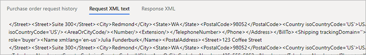

### View the details of the vendor response

To view the content of a vendor acknowledgment or error response, select the **Response XML** tab at the bottom of the **Purchase order request** page.

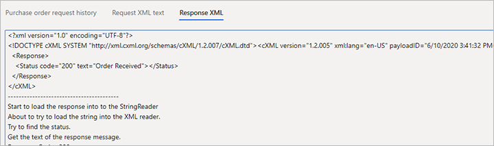

## Additional resources

- [Set up an external catalog for PunchOut e-procurement](set-up-external-catalog-for-punchout.md)
- [Use external catalogs for PunchOut e-procurement](use-external-catalogs-for-punchout.md)

[!INCLUDE[footer-include](../../includes/footer-banner.md)]
