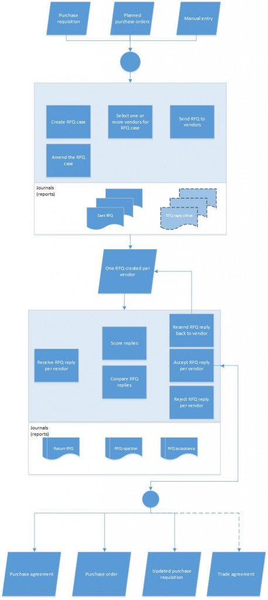

---
# required metadata

title: Requests for quotation (RFQs) overview
description: This article provides an overview of requests for quotation (RFQs). Organizations issue RFQs when they want to receive competitive offers from several vendors for the items or services that they must purchase.
author: GalynaFedorova
ms.date: 10/05/2020
ms.topic: overview
ms.prod: 
ms.technology: 

# optional metadata

ms.search.form: PurchRFQCaseTable, PurchRFQCaseTableListPage, PurchRFQCompare, PurchRFQReplyTable, PurchRFQVendReplyTableListPage, BOMExpandPurchRFQ, PurchRFQReplyFollowupItem, PurchRFQCaseVend, PurchRFQReplyFollowup, PurchRFQCaseAmendmentInfo, PurchRFQReplyFollowupCase, PurchRFQReplyStatus, PurchRFQCaseReplyFields, PurchRFQAddQuestionnaire, PurchRFQAmendmentWizard, PurchRFQReplyTableStatus, PurchRFQReplyTableListPage, PurchRFQCancelWizard
# ROBOTS: 
audience: Application User
# ms.devlang: 
ms.reviewer: kamaybac
# ms.tgt_pltfrm: 
ms.custom: ["2154"]
ms.collection: get-started
ms.assetid: 3936996e-d943-46ca-8385-84c042990f1d
ms.search.region: Global
# ms.search.industry: 
ms.author: gfedorova
ms.search.validFrom: 2016-02-28
ms.dyn365.ops.version: AX 7.0.0

---

# Requests for quotation (RFQs) overview

[!include [banner](../includes/banner.md)]

This article provides an overview of requests for quotation (RFQs). Organizations
issue RFQs when they want to receive competitive offers from several vendors for
the items or services that they must purchase. In an RFQ, you ask vendors to
provide the prices and delivery times for the item quantities that you specify.
You can also ask vendors to specify whether there are any incidental charges,
such as shipping costs, or any discounts for large orders or early payment of
the vendor invoice.

The RFQ process consists of the following tasks:

1. Create and send an RFQ to one or more vendors.
1. Receive and register bids (RFQ replies).
1. Transfer bids that you accept to a purchase order, purchase agreement, or purchase requisition.

The following illustration shows an overview of the RFQ process.

You can create an RFQ case from planned orders, from a purchase requisition, or
by manual entry. The RFQ case is the base document that you use to issue an RFQ
to each vendor.

After you prepare the RFQ case and add vendors, select **Send** (**Send and
publish** for public sector) on the RFQ case. An RFQ journal is generated for
each vendor that you sent the RFQ to. You can configure the Printing options for
the Send action so that it either prints a report for each vendor to an archive
or sends a report to each vendor's email address. In addition, you can use the
RFQ journal for each vendor to generate a report that you can send or resend to
the vendor later. You can also configure the Send action so that it generates a
reply sheet that the vendor can fill in.

This article covers the process for handling RFQs when vendor collaboration isn't
used. If your system is set up for vendor collaboration, vendors can enter bids
directly in Supply Chain Management. For more
information, see [Vendor collaboration with
customers](/dynamics365/unified-operations/supply-chain/procurement/vendor-collaboration-work-customers-dynamics-365-operations) and [Vendor collaboration with external vendors](vendor-collaboration-work-external-vendors.md).

If you must amend an RFQ after you send it, you can resend the RFQ to vendors
when you've finished by using the two amendment actions: Create and Finalize.

When you receive bids by email, you can handle these bids from the **Request for
quotations** page.

If a second iteration of a reply from a vendor is required, select **Return** on
the **Request for quotation** page. The Return action generates a new journal
and a report that will be printed, archived, and sent according to your Printing
settings.

If you added scoring criteria to your RFQ case, the RFQ will have a scoring
panel where you can enter the scores. The total scores will appear on the RFQ
and when you compare the replies on the **Compare replies** page. On the
**Compare replies** page, you can also compare other reply data, such as the
line price, delivery date, and total price.

After you choose a bid or a number of lines in a bid, you can accept all or some
lines and reject the rest. Acceptance journals, rejection journals, and
corresponding reports are generated, and will be printed, archived, and sent
according to your Printing settings. When you accept a bid or specific lines in
a bid, either a purchase agreement or a purchase order is generated, or a
purchase requisition is updated, depending on the purchase type of the RFQ. You
can create a trade agreement that you can use later for any of the replies,
regardless of whether you accepted or rejected them.

An RFQ case has two statuses: lowest and highest, you can view the status on the
list page for **All request for quotations**. The lowest status is the least
advanced stage of any line in the RFQ case, and the highest status is the most
advanced stage of any line in the RFQ case. For example, say that an RFQ case
with three lines is sent to two vendors, so there are two RFQs each with three
lines. All lines are **Sent**. Now a bid is entered from one of the vendors and
the RFQ lines get the status **Received**. This means that out of the three
lines on the RFQ case, all of them are **Sent** for one RFQ and **Received** for
another RFQ. The lowest status will then be **Sent,** and the highest status is
**Received.**

These statuses will be described in more detail later in this article.

## Setting up RFQ functionality

Before you can create an RFQ case, you must set up RFQ information on the
**Procurement and sourcing parameters** page. When you create an RFQ case, you
can specify default values that are copied to the RFQ. You can specify the
following default values:

- The purchase type of new RFQs: **Purchase order** or **Purchase agreement**
- The expiration date and time offset from the day the RFQ case is created.
- Solicitation type, which may default a specific scoring method to the RFQ case.
- Delivery information and payment terms.

You can override these values for a specific RFQ case.

You should also configure the amendment process. As part of this configuration,
you can turn on field locking. When field locking is turned on, a procurement
professional who wants to amend an RFQ must first select **Create** in the
**Amendment** section of the **Quotation** tab on the RFQ case. Then, after the
RFQ case has been updated with the amendment, the procurement professional must
complete the process by selecting **Finalize**. The Finalize action generates an
email that notifies the vendors about the amended RFQ.

On the **Procurement and sourcing parameters** page, you select the template to
use for the email notification that is sent to vendors. When a template is
created in **Email templates**, it can contain the following replacement
tokens:

- %RFQ case%
- %Reason for bid return%
- %Reason for amendment%
- %Amendment prepared by%
- %Company%
- %RFQ case name%
- %Expiry Date Time%
- %Date%

The %Reason for bid return% and %Reason for amendment% tokens are replaced by
text that the procurement professional can enter when they complete the
amendment in the **Amendment** wizard. The values for the %Amendment prepared
by% and %Company% tokens are automatically taken from the RFQ. The %Date% token
is replaced by the current date.

If you want to cancel an RFQ after it’s been sent, you can do that from the RFQ
case. For the cancellation, an email template is required to send the
cancellation notification to the vendor's contact persons. The template must be
selected on the **Procurement and sourcing parameters** page. When the template
is created, it can contain the following replacements tokens:

- %Reason for cancellation%
- %RFQ case%
- %RFQ cancelled by%
- %Company%
- %RFQ case name%
- %Date%

The %Reason for cancellation% token is replaced by text that the procurement
professional can enter in the **Cancellation** wizard. The %Date% token is
replaced by the current date.

If you want to use reason codes on a bid to indicate why it was rejected or
accepted, you must set up reason codes on the **Vendor reasons** page.

On the **Form setup** page in Procurement and sourcing, you can configure the
appearance of your printed or stored RFQ documents.

> [!NOTE]
> For a public-sector configuration, you must use the amendment process to change
an RFQ that has already been sent. When an RFQ is sent, fields are locked.
Therefore, to make changes to the RFQ, you must select **Create** to start the
amendment process, as described earlier. The locking behavior is controlled by
the **Lock RFQ when they are sent** option on the **Procurement and sourcing
parameters** page. By default, this parameter is set to **Yes**, and for a
public-sector configuration, the default setting can't be changed. Therefore,
although the amendment process can be handled manually in a non-public-sector
configuration, it must be used for a public-sector configuration.

When you create an RFQ case of the type Purchase order and add an inventory item
to the RFQ, an inventory transaction is generated that has a receipt status of
**Quotation receipt**. Only RFQ case lines that have this status are considered
when you use a master plan to calculate supplies. If you want the master plan to
include RFQ case lines as an expected receipt, you must configure this behavior
in the setup of master planning.

A purchasing manager or agent can create and maintain solicitation types to suit
the organization's procurement requirements. Each solicitation type can be
associated with a scoring method. Scoring methods consist of a set of criteria
that can be used when you score bids. You must set up solicitation types,
scoring methods, and scoring criteria on the **Solicitation type** and **Scoring
method** pages.

## Choose default fields to include in vendor RFQ reply forms

You can specify specific types of information that you want to receive from vendors when they reply to (bid on) a request for quotation (RFQ). Fields that you mark as default are included on the online form provided for vendor collaboration. To make these settings:

1. If you haven't already done so, use the [Feature management](../../fin-ops-core/fin-ops/get-started/feature-management/feature-management-overview.md) page to enable the *Select RFQ fields to include in vendor RFQ reply forms* feature.
1. Go to **Procurement and sourcing > Setup > Procurement and sourcing parameters**.
1. Open the **Request for quotation** tab.
1. Select the **Default requests for quotation** reply fields link under the **Set up default values for requests for quotations** heading.
1. The **Default request for quotation reply fields** dialog box opens.
1. The **RFQ fields included in vendor RFQ reply forms** section includes a slider for each field that is available for use in RFQ reply forms. Fields set to *Yes* in this section will be included (together with their values) in RFQ reply forms. Set the slider to *No* for each field where you want to prevent vendors from seeing data when reviewing bids. This allows you to enter estimated or expected values during RFQ entry for internal purposes without the vendor seeing what has been entered.

You can override these settings for individual RFQ cases as needed.

## Creating and sending an RFQ

You create an RFQ case, select the vendors that you want to bid on the RFQ case,
and then send RFQs to the vendors. You can use Printing settings to route the
RFQ report and reply sheet reports to your preferred destination.

You can manually create an RFQ case of either the **Purchase order** purchase
type or the **Purchase agreement** purchase type.

If the RFQ case is of the **Purchase order** type, the following behavior occurs
that deviates from other types of RFQ cases:

- When RFQ case lines are created, inventory transactions are generated that have a receipt status of **Quotation receipt**.
- When you accept a bid, a purchase order is generated.

If the RFQ is of the **Purchase agreement** type, the following behavior occurs that deviates from other RFQ cases:

- The RFQ case is used for an agreement to purchase a specific quantity or value of product over time. You must select the date range that applies to the purchase agreement and the name of the person who manages the purchase agreement.
- When you accept a bid, a purchase agreement is generated.

If the RFQ case is generated from a purchase requisition, the **Purchase
requisition** type is automatically assigned. You can't manually create an RFQ
case of the **Purchase requisition** type.

You can create an RFQ case from a purchase requisition only if the status of the
purchase requisition is **In review** and you're assigned to do the next
workflow task. The lines in the purchase requisition are automatically updated
as you accept lines from bids (RFQ replies) that you received from vendors. You
can't complete, reject, approve, or perform any other actions on the purchase
requisition until the requisition line is updated with an accepted RFQ line or
the RFQ case is cancelled.

When you create an RFQ case, you can select a solicitation type. The
solicitation type determines the set of scoring criteria that is used to score
RFQ replies to the RFQ case.

You can add a questionnaire to an RFQ case. This questionnaire then appears on
all RFQ replies after you send the RFQ. The completion of the questionnaire is
a mandatory task before the bid can be submitted.

Although defaults are provided, you can change the **RFQ fields included in vendor RFQ reply forms** settings for each individual RFQ case as needed. To do so, create or open an RFQ case. Then, on the Action Pane, open the **Quotation** tab and, from the **Replies** section, select **Set RFQ reply defaults**. The **Default request for quotation reply fields** dialog box opens, which works the same as it does when setting the defaults for vendor RFQ reply forms, except your changes here will only affect the current RFQ case. For details about how to enable this functionality and how it works, see [Choose default fields to include in vendor RFQ reply forms](#default-reply-fields).

There are three ways to select the vendors to add to an RFQ case:

- Add the vendors one by one.
- Search for all vendors that meet specific criteria.
- Automatically add all vendors that are approved for the procurement categories that are used on the RFQ case lines.

When the RFQ case is ready, select **Send**. The Send action generates journals and reports that will be printed, archived, and sent according to your printing settings.

If you set **Use vendor for recalculating prices** and **Use vendor specific
item information** to **Yes** on the **Sending request for quotation** page when
you sent the RFQ to a vendor, some vendor-specific information is automatically
entered in the RFQ for that vendor.

## Amending an RFQ case

Occasionally, you must change an RFQ case after you send it. You might have to
change an RFQ case if, for example, the delivery dates have changed, or you want
additional products or different quantities of products. You can configure the
amendment process so that it's either more restrictive or less restrictive.

If you configure the amendment process so that it's more restrictive, before you
can modify the fields on an RFQ case that has already been sent, you must select
**Create** on the RFQ case to start an amendment. After you've completed your
changes, you must select **Finalize**. You're then guided through the process of
adding information for the email that is sent to notify vendors about the
amendment. The updated RFQ report, which includes an amendment note, is
automatically attached to the email.

If you configure the amendment process so that it's less restrictive, you don't
have to select **Create** before you can modify the fields on an RFQ case that
has already been sent. However, you must manually add an amendment note on the
RFQ and send the case again. Be aware that this approach can be used only if
none of the replies (bids) have been edited. If you've entered a reply and it's
in a **Received** state, the **Send** button is unavailable. In this case, you
must select **Create** and then **Finalize**, as you must do in the more
restrictive process. The reply is then reset to reflect the changes to the RFQ
case.

If vendors use the vendor collaboration interface to enter bids, you must always
use the amendment process to notify vendors about changes to the RFQ case. This
process helps prevent the situation where vendors bid on an outdated RFQ case
while their bid is in progress. For more information about vendor collaboration,
see [Vendor collaboration with external
vendors](/dynamics365/unified-operations/supply-chain/procurement/vendor-collaboration-work-external-vendors).

If you want to invite additional vendors to bid, and no changes have been made
to the RFQ case, you can use the **Send** button. The vendors that you added
will appear on the **Send** page and will receive the email invitation.

## Receiving and registering RFQ replies

When you send an RFQ, a reply sheet is automatically generated. As you receive
bids on an RFQ, you must enter them via the **Request for quotation** page by
clicking the action **Edit RFQ reply.** This will allow you to enter the bid
information in a dedicated bid form. Initially, the **Reply progress** will be
**Not started**. When you click **Edit RFQ reply,** the progress status is
**Purchaser is updating** until the bid is submitted. Click **Submit** when you
have entered the bid information. The Reply progress status will change to
**Submitted by purchaser.** Similarly, with vendor collaboration enabled, the
**Reply progress** will update as the vendor interacts with the bid. The status
then changes from **Vendor is updating** to **Submitted by vendor**. When the
bid is submitted, a journal is created as **Received**. The reply (bid) has to
be submitted in order to be registered as received, and only then it can be
further processed as accepted or rejected.

If you need to update the bid, you should go through the same process as above
and submit again.

Note that editing the **Request for quotation** form is only allowed for
information that relates to processing the bid, not for entering the bid. To
enter or modify the bid, click **Edit RFQ reply.**

When you enter the bid information, and if the RFQ case allows for alternate
lines, you can add alternate lines for lines that only have a procurement
category and no catalog item specified,. Click **Add alternate** to add
alternate lines.

If you've entered a reply but require a new offer from the vendor, you can
return the RFQ. A new journal and a report are generated, that can be sent to
the vendor.

You can see an overview of all RFQs and their statuses: **Sent, Received,
Accepted, Rejected, Cancelled, Declined** on the **Request for quotation
follow-up** page.

### Accepting and rejecting bids, and transferring accepted bids to downstream documents

After you've identified the best bid, such as the bid that offers the best total
price, you accept the bid. You can accept some lines in a bid and reject others.
You can also accept lines from different vendors. Be aware that if you accept
some lines, you're prompted to reject all the other lines. Therefore, if you
want to accept other lines, you must select **Cancel** when you're prompted. The
status of the RFQ reply for each vendor that you accept bids or lines from is
updated to **Accepted**.

If you, while you prepare the purchase order or purchase agreement, need to add
an additional line to the RFQ, you can do so by clicking **Add line** on the
**Request for quotation** page line grid. You can only view and edit this line
in **Request for quotation** page. It will be visible on the bid page when it is
accepted.

When you accept a bid or one or more lines in a bid, a purchase order or a
purchase agreement is automatically generated. You can then reject the bids from
all the other vendors.

On the reply, you can add a reason code to explain why you accepted or rejected
a bid.

When you accept a bid of the **Purchase requisition** type, the purchase
requisition lines will be updated with the following information that reflects
the information of the accepted bid:

- Unit price
- Discount percentage
- Discount amount
- Purchase charges
- Line charges
- Vendor
- External number
- External description

The following table shows how the RFQ status changes as you accept and reject
bids from vendors.

## Statuses – highest and lowest

On the Vendor tab of the RFQ case, you can see the lines with the highest and
the lowest status for a particular vendor. When the vendor is added, and no
lines have yet been sent, both the lowest and the highest status is
<strong>Created.</strong> When the RFQ is sent to the vendor with all lines, the status of the
two lines will be <strong>Sent</strong>. If some lines in a bid from a vendor are accepted
and others are rejected, the rejected lines will get the lowest status which is
<strong>Rejected</strong>, and the accepted lines will get the highest status which is
<strong>Accepted</strong>.

On the RFQ case lines, you can see the highest and the lowest status per line
across all vendors. If you have sent a line to all the vendors in the RFQ case
and no one have responded yet both the lowest and the highest status is
**Sent.** When at least one vendor responds, the highest state will change to
**Received**. If you add a new vendor to the case, the lowest status will change
to **Created**

The highest and the lowest status on the RFQ case is an aggregation of the
status on the \<Vendor tab and the Lines tab.

The statuses are ranked in the following way from lowest to highest: Created,
Sent, Received, Rejected, Accepted, Declined, Canceled.

The following table shows how the RFQ case status changes when you create an RFQ
case with lines and then send it to vendors.

| **Action**                                | **Lowest RFQ case status** | **Highest RFQ case status** | **Lowest RFQ case line status** | **Highest RFQ case line status** |
|-------------------------------------------|----------------------------|-----------------------------|---------------------------------|----------------------------------|
| Create the RFQ case header and line.      | Created                    | Created                     | Created                         | Created                          |
| Send RFQs to all vendors in the RFQ case. | Sent                       | Sent                        | Sent                            | Sent                             |
| Add another vendor.                       | Created                    | Sent                        | Created                         | Sent                             |
| Send the RFQ to the second vendor.        | Sent                       | Sent                        | Sent                            | Sent                             |

All the lines on the RFQ’s that are related to the RFQ case will be in **Sent**
state.

The following table shows how the RFQ status changes as you receive bids and
register the information on the RFQ reply sheet.

| **Action**                                               | **Lowest status across all lines of all RFQs** | **Highest status across all lines of all RFQs** | **Lowest RFQ case header status** | **Highest RFQ case header status** | **Lowest RFQ case line status** | **Highest RFQ case line status** |
|----------------------------------------------------------|------------------------------------------------|-------------------------------------------------|-----------------------------------|------------------------------------|---------------------------------|----------------------------------|
| Register one vendor's bid to an RFQ, and save it.        | Sent                                           | Received                                        | Sent                              | Received                           | Sent                            | Received                         |
| Register the second vendor's bid to an RFQ, and save it. | Received                                       | Received                                        | Received                          | Received                           | Received                        | Received                         |

In the example below you can see the highest and lowest status on the RFQ case
where one bid has been received and the other bid has been accepted. When a
received bid is rejected, the lowest status will change from received to
rejected on the RFQ case header and line.

|            <strong>Action</strong>             | <strong>Lowest status across all lines of all RFQs</strong> | <strong>Highest status across all lines of all RFQs</strong> | <strong>Lowest RFQ case header status</strong> | <strong>Highest RFQ case header status</strong> | <strong>Lowest RFQ case line status</strong> | <strong>Highest RFQ case line status</strong> |
|------------------------------------------------|-------------------------------------------------------------|--------------------------------------------------------------|------------------------------------------------|-------------------------------------------------|----------------------------------------------|-----------------------------------------------|
| Accept one of the bids. (or at least one line) |                          Received                           |                           Accepted                           |                    Received                    |                    Accepted                     |                   Received                   |                   Accepted                    |
|           Reject all the other bids.           |                          Rejected                           |                           Accepted                           |                    Rejected                    |                    Accepted                     |                   Rejected                   |                   Accepted                    |

[!INCLUDE[footer-include](../../includes/footer-banner.md)]