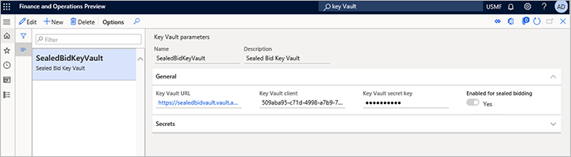
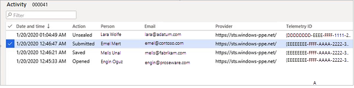

# Sealed bidding for RFQs

[!include [banner](../includes/banner.md)]

Sealed bidding keeps vendor bid replies secret until they are unsealed by purchasing personnel. All bids that are related to a request for quotation (RFQ) are first available to be unsealed upon bid expiry. Before a bid is unsealed, only users who have dedicated user roles and who represent the vendor can access it.

> [!IMPORTANT]
> Modifying or extending forms, or creating new forms or business logic may defeat the protection Microsoft provides for sealed bidding. You bear the risk of using any modifications, extensions, new forms or business logic, or the inability to use the sealed bidding feature due to such modifications, extensions, new forms, or business logic.  Microsoft is not responsible for any damages arising from any modifications or extensions to forms, or any new forms or business logic that you create, or any third party creates for you. Microsoft does not provide technical or other support for any modifications, extensions, new forms, or business logic made by you or any third party on your behalf. You are solely responsible for complying with all applicable laws or regulations concerning sealed bidding.

## How bids are kept secure

Sealed bidding uses asymmetric encryption to encrypt the bid encryption key (KEK) and symmetric encryption to encrypt the actual bid. The system integrates with Microsoft Azure Key Vault to generate and manage the encryption keys that are used to encrypt sealed bids. Each bid has its own encryption key. This encryption is kept safe in a key vault that is owned by the organization that runs Dynamics 365 Supply Chain Management. The system accesses the key vault on demand, whenever encryption and decryption are required.

## Setup and configuration

This section describes the prerequisites that must be in place before you can send out RFQs that require sealed bidding.

### Step 1: Set up user access to sealed bidding

When you use sealed bidding, only users who are set as the contact person for a vendor can view, edit, and submit bids for that vendor until the bidding period expires. These users must have the **Vendor (external)** role, and they must be set as a contact person for the vendor account. The contact person must also have permission to do vendor collaboration, as described in [Set up and maintain vendor collaboration](set-up-maintain-vendor-collaboration.md).

Because users who have appropriate permissions and who are set up as vendor contacts can access the sealed bids for a vendor, it's important to track who those users are. The system admin who sets up users and security roles is responsible for limiting access to sealed bids to those users who are really allowed to view them.

### Step 2: Enable the sealed bidding feature

To use this feature, it must be turned on for your system. As of Supply Chain Management version 10.0.32, it's turned on by default. As of Supply Chain Management version 10.0.36, the feature is mandatory and can't be turned off. If you're running a version older than 10.0.36, then admins can turn this functionality on or off by searching for the *Sealed bidding for RFQs* feature in the [Feature management](../../fin-ops-core/fin-ops/get-started/feature-management/feature-management-overview.md) workspace.

### Step 3: Set up Azure Key Vault

Supply Chain Management uses encryption keys to protect all sealed bids and keep them secret until the appropriate time. It takes advantage of the capabilities of Key Vault to generate and manage the required keys. Therefore, you must set up a connection from Supply Chain Management to a key vault to enable the system.

> [!IMPORTANT]
> The key vaults that you use for sealed bidding must meet the following requirements:
>
> - If you use a sandbox for development and testing, then you must have one dedicated key vault for the sandbox and a separate one for production.
> - Each key vault must be created in an Azure subscription that is owned by your organization (not the subscription where you're running Supply Chain Management).
> - Each key vault must be used exclusively for sealed bidding. You must not use your sealed-bidding key vaults for any other purpose.

Every bid retrieves its own secret key. This key is used every time that a user views, updates, or unseals the bid.

Key Vault generates the key that is used to retrieve the secret when the vendor selects **Bid** in the vendor collaboration interface. The key then expires after a fixed time that the procurement manager sets on the **Procurement and Sourcing Parameters** page in Supply Chain Management. After the key expires, nobody will be able to view, edit, or unseal the bid. Therefore, it's important to configure key expiration so that there is enough time for the bidding process to be completed.

In the next three steps, you will set up the connection to Key Vault. First, you will set up a key vault to use with sealed bidding. Next, you will configure Supply Chain Management to communicate with the key vault. Finally, you will set the expiration time for the key.

### Step 4: Set up a key vault to use with sealed bidding

To set up your key vault, follow these steps. The order of the steps is important.

1. If you haven't already set up an Azure subscription that is separate from the subscription where you're running Supply Chain Management, set it up.
1. Set up a key vault in your separate Azure storage. For more information, see [Maintaining Azure Key Vault storage](https://support.microsoft.com/help/4040294/maintaining-azure-key-vault-storage).
1. Set up your Supply Chain Management app to work as a client for your key vault. For more information, see [Setting up Azure Key Vault Client](https://support.microsoft.com/help/4040305/setting-up-azure-key-vault-client).

### Step 5: Configure Key Vault parameters in Supply Chain Management

To configure Supply Chain Management to communicate with the key vault during sealed bidding, follow these steps.

1. Sign in to Supply Chain Management, and go to **System administration \> Setup \> Key Vault parameters**.
1. Select **New** to create a record, and set the following fields for it:

    - **Name** – Enter a name.
    - **Description** – Enter a description.
    - **Key Vault URL** – Enter the default URL for your key vault.
    - **Key Vault client** – Enter the interactive client ID of the Active Directory application that is associated with a key vault for authentication.
    - **Key Vault secret key** – Enter the secret reference for the certificate.
    - **Enabled for sealed bidding** – Set this option to *Yes*.

> [!NOTE]
> You can enable only one key vault configuration for sealed bidding at a time. Before you disable an existing key vault configuration, you must make sure that all sealed bids that use it are unsealed. Inspect every RFQ case of the *Sealed* type, and make sure that all replies for it are unsealed.

### Step 6: Set the key expiration time

To set the expiration time that is applied to the key that is generated for every new bid, follow these steps.

1. Go to **Procurement and sourcing parameters \> Setup \> Procurement and sourcing parameters**.
1. On the **Request for quotation** tab, in the **Days offset** field, enter the number of days that the RFQ period should last. When an RFQ is created, the number of days that you enter here is added to the system date to define the default expiration date for the RFQ.
1. In the **Encryption key expiration day offset** field, enter the number of days that every encryption key should be valid after it's issued. After the encryption key expires, nobody will be able to view, edit, or unseal the sealed bid that uses it.

> [!TIP]
> The value of the **Encryption key expiration day offset** field should not be less than the value of the **Days offset** field.

### Step 7: Set the default bid type

Every RFQ case has a bid type. The bid type defines whether that RFQ case provides open or sealed bidding.

#### RFQ cases that don't have a solicitation type

To set the default bid type that is assigned to new RFQ cases that aren't assigned a solicitation type when they are created, follow these steps.

1. Go to **Procurement and sourcing parameters \> Setup \> Procurement and sourcing parameters**.
1. On the **Request for quotation** tab, set the **Bid type** field to *Sealed*.

#### RFQ cases that have a solicitation type

To set the default bid type that is assigned to new RFQ cases that are assigned a solicitation type when they are created, follow these steps.

1. Go to **Procurement and sourcing \> Setup \> Request for Quotation \> Solicitation type**.
1. Create a new solicitation type, or select an existing solicitation type where you want to use a bid type of *Sealed*.
1. Set the **Bid type** field to *Sealed*.
1. Repeat these steps for every additional solicitation type where you want to implement sealed bidding.

> [!TIP]
> A solicitation type doesn't have to be assigned when a new RFQ is created. If a solicitation type is assigned, the default bid type of an RFQ can retrieve it. Otherwise, the default solicitation type that is defined in Procurement and sourcing parameters can be used.

## The sealed bidding process

Sealed bidding follows almost the same process that is described in [Requests for quotation (RFQs) overview](request-quotations.md). The main difference is that the bid data and its attachments are kept encrypted until the bid is unsealed.

> [!IMPORTANT]
> [Questionnaires](/dynamicsax-2012/appuser-itpro/view-and-respond-to-questionnaires) are not encrypted and should not be used to collect sensitive information

Here is an outline of the process:

1. You create and send an RFQ to one or more vendors.
1. Vendors respond by submitting their sealed bid.
1. You unseal the bids after the bid entry expiration time.
1. The bids become visible, and you can evaluate and compare them.
1. After a bid is accepted, you generate a purchase order, generate a purchase agreement, or update a purchase requisition.

### Create an RFQ case that uses sealed bidding

The process of creating an RFQ case for sealed bidding is almost the same as the process for non-sealed bidding. For information about how to create both types of RFQ cases, see [Create a request for quotation](tasks/create-request-quotation.md). This section highlights a few important considerations when you create an RFQ for sealed bidding.

RFQ cases for sealed bidding must have a **Bid type** value of *Sealed*. There are three ways to assign this value to an RFQ case:

- Set the value directly on the RFQ case after you create it.
- Define sealed bidding as the default bid type for all RFQ cases in Procurement and sourcing parameters. (See the [Set the default bid type](#set-default-bid-type) section earlier in this article.)
- When you create a new RFQ case, select a solicitation type that is set up for sealed bidding. (See the [Set the default bid type](#set-default-bid-type) section.)

For sealed bidding, the RFQ case's **Expiration date and time** value establishes when the submitted bids can be unsealed. The **Expiration date and time** value on each line will match the value on the header.

You can't change the bid type after an RFQ case is sent.

### Vendors respond to an RFQ

Vendors that respond to a sealed bid use the same procedure that they use to respond to open bids, as outlined in [Working with RFQs in the Vendor bidding workspace](vendor-collaboration-work-customers-dynamics-365-operations.md#working-with-rfqs-in-the-vendor-bidding-workspace). For detailed instructions about how to work with both open bids and sealed bids, see [Enter and compare RFQ bids and award contracts](tasks/enter-compare-rfq-bids-award-contracts.md). The only difference between processing for sealed bids and processing for open bids is that, until the bidding period has expired, procurement professionals can't open a vendor's sealed bid. Only a contact person for the vendor can open that vendor's sealed bid.

> [!IMPORTANT]
> For sealed bidding, vendors can upload attachments only in PDF format. No other formats will be accepted.

After a registered vendor user selects **Bid** on a sealed-bid RFQ, they can enter their bid data, and that data will be kept secure. Vendors can save their work as they prepare a bid, return to it as often as required, and then submit it when it's ready. Vendors can also view their bid after they submit it. If vendors must change their bid after they submit it, they can recall it, update it, and resubmit it at any time until the bidding period expires.

The following conditions apply during sealed bidding:

- During sealed bidding, the system creates a *Request for quotation* journal.
- When a vendor submits a bid, RFQ journals without lines are created that have a sealed price.
- After the case is unsealed, RFQ journals are created that have a price and amount. You can access this journal by selecting **Request for quotation journals** on the **All requests for quotations** page.
- The system stores a log of each action that users perform on a sealed bid. These actions include viewing, editing, and saving the bid. This log is visible both to the vendor and to procurement professionals who have access to the bid.
- As the bid progresses, procurement professionals can view its status. The status will be either *Vendor is updating* or *Submitted by vendor*.
- The status of the lines in a sealed bid remains *Sent* until the bid is unsealed.
- If the vendor chooses to decline a bid, the bid will have a **Reply Progress** status of *Declined by vendor*. This status will be visible to procurement personnel.
- Answers in questionnaires are **not** stored in encrypted form in the database. Therefore, they aren't sealed. However, they won't be visible in the RFQ user interface until the case is unsealed.

### All sealed bid activities are logged

A detailed log records all user activities and actions for a bid. The activity log enables organizations to determine who updated a bid during its lifetime, and what the updates were. It also enables organizations to confirm that only authorized people accessed a sealed bid. The activity log is available on every bid's **Activity** page.

### Review RFQ activity

Every interaction with the bid is logged and can be viewed on the **Activity** page. The following illustration shows an example.

Vendors can access the **Activity** page by selecting **Activity** on the **Request for Quotation Sealed bid** page. Procurement personnel can access it by selecting **Activity** on the **Request for Quotation** page. The activity log provides full visibility for vendors and for the procurement personnel who have accessed the bid. Therefore, it can reveal any unauthorized access.

### Unseal sealed bids

When the **Expiration date and time** value that was configured for a sealed-bid RFQ case has passed, the **Unseal** button becomes available. Select **Unseal** to unseal all the bids for the selected RFQ case. All the bid data and attachments then become visible so that replies to the case can be managed. Additionally, journals are created that contain the submitted bid data.

The unsealing event is logged and can be viewed on the **Activity** page.

### Process accepted bids

The process of comparing and approving previously sealed bids is the same as the process for open bids. For information about how to score, compare, reject, and accept unsealed bids, see [Enter and compare RFQ bids and award contracts](tasks/enter-compare-rfq-bids-award-contracts.md).

## The RFQ activity log can never be deleted

Nobody, not even administrators and Microsoft Support, can edit or delete the RFQ activity log. This restriction helps ensure the fairness of the sealed bidding process. It also helps ensure that an accurate audit trail is maintained.
