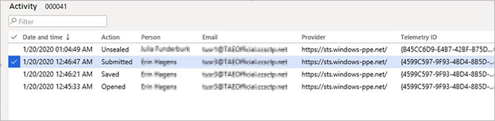

# Sealed bidding for RFQs

[!include [banner](../includes/banner.md)]
[!INCLUDE [preview-banner](../includes/preview-banner.md)]

Sealed bidding keeps vendors' bid replies secret until they are unsealed by purchasing personnel. All bids related to a request for quotation (RFQ) will be unsealed at the same time after the bid entry expiration date. Only users with dedicated user roles and representing the vendor can access the bid before it is unsealed.

<!--KFM: Legal disclaimer should go here once approved. -->

## How bids are kept secure

Sealed bidding uses asymmetric encryption for encrypting bid encryption key (KEK) and symmetric encryption for encrypting actual bid. The system integrates with Azure Key Vault to generate and manage the encryption keys used to encrypt sealed bids. Each bid has its own encryption key, which is kept safe in an Azure Key Vault owned by the organization running Dynamics 365 Supply Chain Management. The system accesses the vault on demand whenever encrypting and decrypting is needed.

## Setup and configuration

This section describes the prerequisites that must be in place before you can send out RFQs that require sealed bidding.

### Step 1: Set up user access to sealed bidding

When you use sealed bidding, only users that are set as the contact person for a vendor can view, edit, and submit bids for that vendor until the bidding period has expired. These users must have the **vendor (external)** role and be set as a contact person for the vendor account. The contact person must also have permission to do vendor collaboration, as described in [Set up and maintain vendor collaboration](set-up-maintain-vendor-collaboration.md).

Because users with appropriate permissions that are set up as vendor contacts can access their sealed bids, it's important to keep track of who these users are. The system admin who sets up users and security roles is responsible for limiting sealed-bid access to those users that truly are allowed to see the bid.

### Step 2: Enable the sealed bidding feature

Before you begin trying to set up or use this feature, you must make sure it's available on your system. Administrators can use the [Feature management overview](../../fin-ops-core/fin-ops/get-started/feature-management/feature-management-overview.md) workspace to check the status of the feature and turn it on. In the **Feature management** workspace, the feature is listed in the following way:

- **Module**: Procurement and sourcing
- **Feature name**: Sealed bidding for RFQ

### Step 3: Set up Azure Key Vault

Supply Chain Management uses encryption keys to protect all sealed bids and keep them secret until the appropriate time. It leverages the abilities of Azure Key Vault to generate and manage the required keys. You must therefore set up a connection from Dynamics 365 Supply Chain Management to an Azure Key Vault to enable the system.

> [!IMPORTANT]
> The Key Vault must be created in an Azure subscription owned by your organization (not the subscription where Supply Chain Management is running).

Every bid will retrieve its own secret key, which will be used each time a user views, updates or unseals the bid. Azure Key Value generates the key used to retrieve the secret when the vendor selects **Bid** on the vendor collaboration interface, and the key will expire at a fixed time after this date. The procurement manager sets an expiration time on the Dynamics 365 Supply Chain Management **Procurement and Sourcing Parameters** page. Once the key has expired, nobody will be able to view, edit, or unseal the bid, so it's important to configure key expiration to allow sufficient time for the bidding process to complete.

To set up the connection to Azure Key Vault:

1. Set up an Azure Key Vault for use with sealed bidding.
1. Configure Supply Chain Management to access the Key Vault.
1. Set the key expiration time.

### Step 4: Set up an Azure Key Vault for use with sealed bidding

Set up your Azure Key Vault by doing the following (the order is important):

1. If you haven't already done so, then set up an Azure subscription where you aren't running Supply Chain Management.
1. Set up a Key Vault in your separate Azure storage as described in the following support article: [Maintaining Azure Key Vault storage](https://support.microsoft.com/en-us/help/4040294/maintaining-azure-key-vault-storage).
1. Set up your Dynamics 365 Supply Chain Management app to function as a client for your Azure Key Vault as described in the following support article: [Setting up Azure Key Vault Client](https://support.microsoft.com/en-us/help/4040305/setting-up-azure-key-vault-client).

### Step 5: Configure Key Vault parameters in Supply Chain Management

To configure Dynamics 365 Supply Chain Management to communicate with the Azure Key Vault during sealed bidding:

1. Sign in to Supply Chain Management and go to **System administration \> Setup \> Key Vault parameters**.
1. Select **New** to create a new record and then make the following settings for it:
    - **Name** – Enter a name.
    - **Description** – Enter a description.
    - **Key Vault URL** – Enter the default URL for your key vault.
    - **Key Vault Client** – Enter the interactive client ID of the Active Directory application associated to a key vault for authentication.
    - **Key vault secret key** – Enter the secret reference for certificate.

1. Set the option **Enabled for sealed bidding** to *Yes*.

> [!NOTE]
> You can only enable one key vault configuration for sealed bidding at a time. Before disabling an existing key vault configuration, you must make sure that all sealed bids that use that configuration are unsealed. To check the status of your sealed bids, inspect each RFQ case of type *Sealed* and make sure its replies are all unsealed.

### Step 6: Set the key expiration time

To set expiration time applied to the key generated for each new bid, do the following:

1. Go to **Procurement and sourcing parameters \> Setup \> Procurement and sourcing parameters**.
1. Open the **Request for quotation** tab.
1. In the **Encryption key expiration day offset** field, enter the number of days that each encryption key should be valid after it's issued. Once the encryption key expires, nobody will be able to view, edit, or unseal the sealed bid that uses it.

> [!TIP]
> The value of **Encryption key expiration day offset** should not be less than the days offset.

### Step 7: Set the default bid type

Each RFQ case has a **Bid type**, which establishes whether that RFQ case provides open or sealed bidding.

To set the bid type assigned to new RFQ cases created without a solicitation type:

1. Go to **Procurement and sourcing parameters \> Setup \> Procurement and sourcing parameters**.
1. Open the **Request for quotation** tab.
1. Set the **Bid type** to *Sealed*.

### Step 8: Set the default bid type

To set the bid type assigned to new RFQ cases created with a solicitation type already assigned:

1. Go to **Procurement and sourcing \> Setup \> Request for Quotation \> Solicitation type**
1. Create a new solicitation type or select an existing where you want to drive a bid type of sealed
1. Set the **Bid type** to *Sealed*.
1. Repeat these steps for each solicitation type where you want to implement sealed bidding.

> [!TIP]
> It isn't mandatory to set up the solicitation type when creating a new RFQ. The default bid type on an RFQ can retrieve the solicitation type if one is assigned, or it can be defaulted from the **Procurement and sourcing parameters**.

## Process of Sealed bidding

Sealed bidding follows nearly the same process as described in [Requests for quotation (RFQs) overview](request-quotations.md). The major difference is that the bid data and its attachments are kept encrypted until the bid is unsealed.

Here's an outline of the process:

1. Create and send an RFQ to one or more vendors.
1. Vendors respond by submitting their sealed bid.
1. Unseal the bids after the bid entry expiration time.
1. The bids become visible and you can evaluate and compare them.
1. After a bid is accepted, generate a purchase order, generate a purchase agreement, or update a purchase requisition.

## Create an RFQ case with sealed bidding

The process of creating an RFQ case for sealed bidding is almost the same as for creating an RFQ case for non-sealed bidding. Instructions for creating both type of RFQ cases are provided in [Create a request for quotation](tasks/create-request-quotation.md). This section highlights a few important considerations for when you create an RFQ for sealed bidding.

RFQ cases for sealed bidding must be set with a **Bid type** of *Sealed*. There are three ways you can assign this to an RFQ case:

- Set it directly on the RFQ case after you create it.
- Set sealed bidding as the default for all RFQ cases in the **Procurement and sourcing parameters** (as described in [Set the default bid type](#set-default-bid-type)).
- On creating a new RFQ case, select a solicitation type that is set for sealed bidding (also as described in [Set the default bid type](#set-default-bid-type)).

For sealed bidding, the RFQ case **Expiration date and time** setting establishes when it will first be possible to unseal the submitted bids. The **Expiration date and time** setting for each line will be set to the same value as for the header.

You can't change the bid type after an RFQ case is sent.

## Vendors respond to an RFQ

Vendors responding to a sealed bid will use the same procedure as when responding to open bids, as outlined in [Working with RFQs in the Vendor bidding workspace](vendor-collaboration-work-customers-dynamics-365-operations.md#working-with-rfqs-in-the-vendor-bidding-workspace). For detailed instructions, see also [Enter and compare RFQ bids and award contracts](tasks/enter-compare-rfq-bids-award-contracts.md), which describes how to work with both open and sealed bids. The only difference between processing sealed and open bids is that, until the bidding period has expired, only a contact person from the vendor (and not the procurement professionals) can open their sealed bid.

> [!IMPORTANT]
> For sealed bidding, vendors are only permitted upload attachments in PDF format. Other formats won't be accepted.

After a registered vendor user selects **Bid** on a sealed-bid RFQ, they will be able to enter their bid data and that data will be kept secure. Vendors can save their work as they prepare a bid, return to it as often as needed, and then finally submit the bid when it's ready. The vendor can also view the bid after they submit it. If a vendor needs to change their bid after submitting it, they just can recall it, update, and resubmit at any time until the bidding period has expired.

The following conditions apply during sealed bidding:

- During Sealed bidding, the system creates a *Request for quotation* journal.
- When vendor submit a bid, RFQ journals without lines are created with sealed price.
- After the case is unsealed, RFQ journals are created with price and amount. It can be accessed by selecting **Request for quotation journals** on the **All requests for quotations** page.
- The system stores a log of each action that a user performs on a sealed bid, including viewing, editing, and saving. This log is visible both to the vendor and to procurement professionals that had access to the bid.
- As the bid progresses, procurement professionals can see its status, which will be either *Vendor is updating* or *Submitted by vendor*.
- The status of the lines on a sealed bid will be shown as *Sent* until the bid is unsealed.
- If the vendor chooses to **Decline** a bid then the bid will show a **Reply Progress** status of *Declined by vendor*, which will be visible to the procurement personnel.
- Answers in questionnaires are *not* stored encrypted in the database so are not sealed, but they won't be visible in the RFQ user interface until the case is unsealed. 

## All sealed-bid activities are kept

A detailed log records all user activities and actions on a bid. The log allows organizations to answer the question who/what updates were made on a bid during the lifetime of the bid. The activity log also makes it possible to confirm that only authorized people have accessed a sealed bid. The log is available on each bid's **Activity** page.

## Review RFQ activity

Every interaction with the bid will be logged and visible on the **Activity** page, as illustrated in the following screen shot.

This page can be accessed by the vendor user via the **Request for Quotation Sealed bid** page **Activity** action or by the procurement personnel via **Request for Quotation** page **Activity** action. The **Activity** log provides full visibility for the vendor and the procurement personnel who have accessed the bid. This can expose any unauthorized access.

## Unseal sealed bids

When the configured **Expiration date and time** has passed for a sealed-bidding RFQ case, the **Unseal** button becomes active. Select this button to unseal all the bids for the selected RFQ case, which will make all the bid data and attachments visible when managing replies to the case and will also create journals containing the submitted bid data.

The unsealing event is logged and visible in the **Activity** form.

## Process accepted bids

The process of comparing and approving previously sealed bids is the same as the process for open bids. For details about how to score, compare, reject and accept unsealed bids, see [Enter and compare RFQ bids and award contracts](tasks/enter-compare-rfq-bids-award-contracts.md)

## The RFQ activity log can never be deleted

To ensure the fairness of the sealed bidding process, and to maintain an accurate audit trail, it isn't possible to delete the RFQ activity log. Nobody, including administrators and Microsoft Support, has the ability to edit or delete this log.
