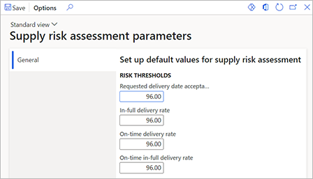

# Configure supply risk assessment

[!include [banner](../includes/banner.md)]
[!INCLUDE [preview-banner](../includes/preview-banner.md)]
<!-- KFM: Preview until 10.0.31 GA -->

## Prerequisites

To use this feature, your system must meet the following requirements:

- You must be running Supply Chain Management 10.0.31 or later.
- The feature called *Assess supply risks to prevent supply chain disruptions* must be turned on in [feature management](../../fin-ops-core/fin-ops/get-started/feature-management/feature-management-overview.md).

## Configure thresholds

Use the following procedure to configure the feature by choosing the minimum rates you would like the system to apply when calculating your supply risks.

1. Go to **Procurement and sourcing \> Setup \> Supply risk assessment parameters**.

    

1. Make the following settings on the **General** tab:
    - **Requested delivery date acceptance rate** – Enter the minimum percentage of orders where vendors are expected to return a confirmed delivery date (CDD) that meets your requested delivery date (RDD).
    - **In-full delivery rate** – Enter the minimum percentage of deliveries expected to arrive in-full (IF).
    - **On-Time delivery rate** – Enter the minimum percentage of deliveries expected to arrive on-time (OT).
    - **On-time in-full delivery rate** – Enter the minimum percentage of deliveries expected to arrive on-time and in-full (OTIF).

    Each of these metrics is calculated as a rate within the relevant scope of analysis. Set the rates that you would regard as representing a risk for your business. By default, each rate threshold is set to 96%.

1. On the Action Pane, select **Save**.

## Initialize workspace data and configure refresh options

When you first turn on and set up this feature, the **Supply risk assessment** workspace won't show any data. The system updates this data periodically, so it will eventually populate, but you can also choose to initialize or refresh it manually, as described in the following procedure.

1. Go to **Procurement and sourcing \> Workspaces \> Supply risk assessment**. (You must visit this page at least once after enabling the feature to make the required data cache configuration available. You don't have to do anything more here right now.)
1. Go to **System administration \> Setup \> Data cache \> Data set cache configuration**.
1. On the Action Pane, select **Edit**.
1. In the grid, select the row where **Consumer** is *VendSupplyRiskCacheDataSet* and make the following settings for it:
    - **Enabled** – Select this checkbox to allow the system to keep the **Supply risk assessment** workspace data up to date. If you clear this checkbox, the data will never be updated.
    - **Refresh frequency (seconds)** – Specify how often (in seconds) the system should refresh the data shown on the **Supply risk assessment** workspace.
    - **Manual refresh** – Select this checkbox to enable the **Refresh data** button on the **Supply risk assessment** page. Clear this checkbox to disable the button (it will still be shown, but won't do anything).
1. On the Action Pane, select **Save**.
1. If you chose to enable **Manual refresh** and want to initialize or refresh the **Supply risk assessment** workspace now, do the following steps:
    - Go to **Procurement and sourcing \> Workspaces \> Supply risk assessment**.
    - Open the **Overview** tab.
    - ON the **Data refresh status** tile, select **Refresh data**.

## Refresh the analytics entity store data used by Power BI reports

If you haven't been using purchase data for Power BI until now, then you may need to refresh this data and/or set it to update automatically going forward. If this data hasn't been refreshed, then your Power BI reports for supply risk assessment will show errors.

1. Go to **System administration \> Setup \> Entity store**.
1. On the list pane, find and select the record called *Purchase cube*.
1. On the Action Pane, select **Edit**.
1. Select **Refresh** to start the refresh process, which will take about 15 minutes.
1. If you'd like to set up a scheduled refresh (recommended), set **Automatic refresh enabled** to *Yes* and then set **Recurrence** to your desired refresh interval.
