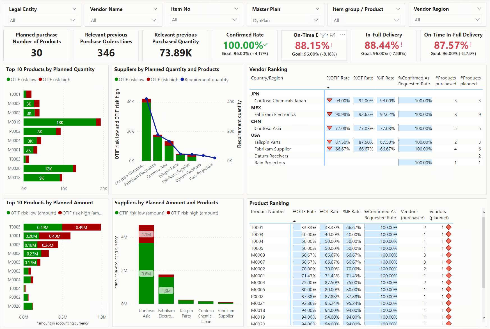

# Supply risk assessment overview

[!include [banner](../includes/banner.md)]

Supply risk assessment for Microsoft Dynamics 365 Supply Chain Management lets you identify supply risks, so that you can act to help prevent supply chain disruptions.

The [Supply risk assessment workspace](supply-risk-assessment-workspace.md), together with the [supplier performance and risk analysis reports](supply-risk-assessment-reports.md), helps supply managers understand the risk of encountering sourcing shortages and delays. It enables businesses to take proactive actions to balance cost and resilience when they optimize their supply chains.

The following illustration shows an example of the **Supply risk assessment** workspace.

The following illustration shows an example of the **Risk assessment** report for planned purchases. This report is one of the supplier performance and risk analysis reports.

The first release of this set of capabilities is available in release version 10.0.31. This release is focused on delivery performance by suppliers. It enables ranking and risk assessment based on planned orders.

The capabilities let you perform the following tasks:

- Measure the supply delivery performance of suppliers and products along several dimensions.
- Derive a risk assessment for future planned supply.

This release doesn't include the following capabilities:

- Holistic assessment of vendors along other aspects, such as financial ratings, compliance, security, and other risks
- Risks from other types of supply, such as production

## The Supply risk assessment workspace as your point of entry

The **Supply risk assessment** workspace consists of lists of actionable items and embedded Power BI reports. It shows metrics such as on-time in-full (OTIF) ratings for vendors and product rankings. It also represents the past performance as a risk for future supply. Planned purchase orders can be used to quantify risk in terms of the quantity and amount that are at risk if the same performance and trend continue into the future.

To help mitigate the risks that are discovered, you can take different approaches. For example, you can diversify vendors, or you can use different shipping methods or sourcing locations for planning. After you've updated the plan, you can reassess the supply risks and validate the improvements.

## Next steps

- Turn on and set up the feature as described in [Configure Supply risk assessment](supply-risk-assessment-configuration.md).
- Open the **Supply risk assessment** workspace to start to discover products and vendors that had low ratings in the past, and to access the Power BI reports for performance and supply risk analysis, as described in [Actionable workspace for discovering and handling supplier risks](supply-risk-assessment-workspace.md).
- Open the [Power BI reports](supply-risk-assessment-reports.md) for detailed performance and risk analysis.
