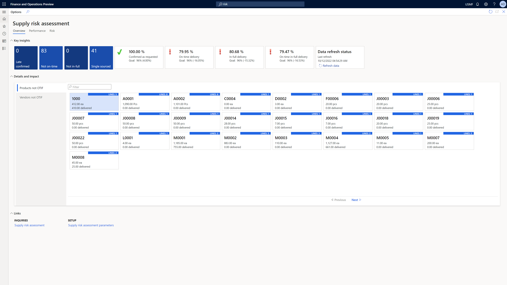

# Supply risk assessment overview

[!include [banner](../includes/banner.md)]
[!INCLUDE [preview-banner](../includes/preview-banner.md)]
<!-- KFM: Preview until 10.0.31 GA -->

Supply risk assessment for Dynamics 365 Supply Chain Management lets you identify supply risks so you can act to prevent supply chain disruptions.

The [Supply risk assessment workspace](supply-risk-assessment-workspace.md) together with the [Supplier performance and risk analysis reports](supply-risk-assessment-reports.md) help supply managers understand the risk of encountering sourcing shortages and delays. It enables businesses to take proactive actions to balance cost and resilience when optimizing their supply chains.

|&nbsp;|&nbsp;|
|---------|---------|
| *Supply risk assessment workspace*| *Supplier performance and risk analysis report*|

The first release of this set of capabilities is available in release version 10.0.31. The release focuses on delivery performance by suppliers, allows ranking and risk assessment based for planned orders.

What you can do with the capabilities:

- Measure supply delivery performance of suppliers and products along several dimensions.
- Derive a risk for future planned supply.

What is not included in this release:

- Holistic assessment of vendors along other aspects like financial ratings, compliance, security, and other risks
- Risks from other supply kinds like production

## Your entry point is the supply risk assessment workspace

The workspace is composed of actionable items lists and embedded Power BI reports, shows metric like On-Time In-Full (OTIF) ratings for vendor and product ranking. And it represents the past performance as a risk for future supply. Using planned purchase orders, risks can be quantified in quantity and amount at risk if the same performance and trend continues into the future.

To mitigate discovered risks you can take different approaches, such as diversifying vendors, planning with different shipping methods or sourcing locations. Once you've updated the plan, you can reassess the supply risks and validate the improvements.

## Next steps

- Turn on and set up the feature as described in [Configure supply risk assessment](supply-risk-assessment-configuration.md)
- Go to the **Supply risk assessment** workspace to start your discovery of products and vendors with low ratings in the past and access the Power BI reports for performance and supply risk analysis, as described in [Actionable workspace to discover and handle supplier risks](supply-risk-assessment-workspace.md)
- Open the [Power BI reports](supply-risk-assessment-reports.md) for detailed performance and risk analysis.
