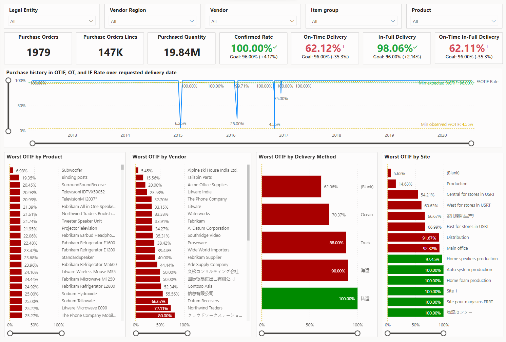
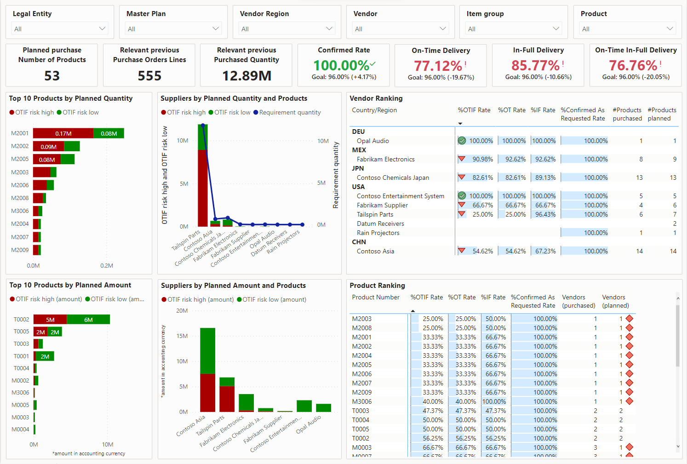
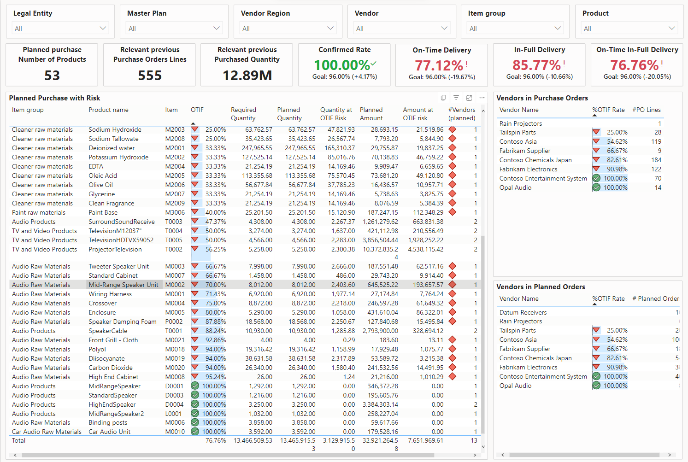
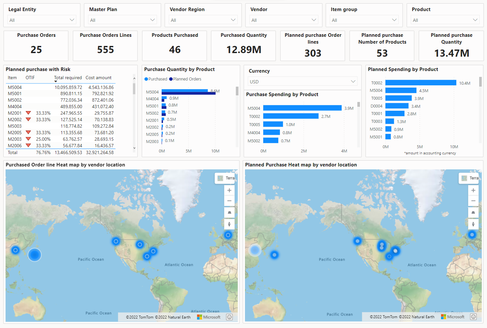

# Power BI reports for risks analysis and performance ranking

[!include [banner](../includes/banner.md)]

Microsoft Dynamics 365 Supply Chain Management provides an integrated risk and performance report, and also two reports that are embedded into the **Supply risk assessment** workspace (supplier performance analysis and risk assessment analysis). All three reports use Power BI and are based on the same metrics as the workspace. Each report offers rich filtering and data slicing options to help you identify the most pressing supplier performance issues and potential risks for planned supply.

The tiles for metrics and key performance indicators (KPIs) at the top of each report page show relevant key figures that summarize the performance in each currently selected filter scope (including the total number of purchase orders and order lines). Some risk assessment reports show information about the planned order volume. Typically, you'll also find performance rates for the percentage of order lines that have delivery data on or before the requested date, based on order line receipts and the rates of order lines that were delivered on time (OT), in full (IF), and on time and in full (OTIF).

The metrics and KPI tiles are updated when you filter or select different vendors, products, regions, or delivery methods. This changing information can help you identify correlations with different factors that affect supply performance.

## Integrated risk and performance report

The integrated risk and performance report shows information only about planned orders and is therefore most relevant for risk assessment. It combines elements of the two embedded reports. For information about how to use and interpret the various views of this report, see the later sections of this article.

You can open the integrated risk and performance report in two ways:

- Go to **Procurement and sourcing \> Inquiries and reports \> Supply risk assessment \> Supply risk assessment**.
- Go to **Procurement and sourcing \> Workspaces \> Supply risk assessment**, and then, on the **Links** FastTab, select the **Supply risk assessment** link.

## Embedded supplier performance analysis

The workspace-embedded supplier performance report shows a holistic performance assessment, not only for planned orders but also for all products that have previously been purchased.

To open the embedded supplier performance analysis report, go to **Procurement and sourcing \> Workspaces \> Supply risk assessment**, and then select the **Performance** tab.

All supply performance analysis reports provide a header that includes slicers and filters. To limit your analysis, select products, and then use the slicers and filters to select the relevant legal entities (companies), regions, vendors, and item groups. The filters will be carried through the different report pages. Therefore, you don't have to repeatedly reapply the filter settings.

### Vendor and product ranking report

Use the two similar reports for product and vendor ranking to study the historic order performance in terms of OTIF deliveries. You can find OTIF trends and outliers in the timeline of deliveries, and see them in relation to the total line amounts.

You can zoom in on the timeline and select individual data points to see the related vendors or products. Alternatively, you can select one or more vendors, based on their ranking, and see the appropriate performance timeline.

### Multi perspective OTIF ranking

On this report, the worst OTIF rankings are calculated from various perspectives and shown side-by-side for products, vendors, delivery methods, and sites. You can use individual or combined dimensions to identify bottlenecks that might cause a drop in supply performance.

## Embedded supply risk assessment analysis

The workspace-embedded supply risk assessment report shows a holistic performance assessment, not only for planned orders but also for all products that have previously been purchased.

To open the embedded supplier performance analysis report, go to **Procurement and sourcing \> Workspaces \> Supply risk assessment**, and then select the **Risk** tab.

The risk assessment report turns the performance observations into a risk calculation for planned orders, based on purchase order receipts.

All supply risk analysis reports provide a slicer and filter header that includes a master plan selector. You can use this filter to select a single master plan. In this way, you can help prevent the unwanted double accounting of planned orders from multiple plans.

### Risk assessment overview report

This report helps you analyze the calculated risks for your planned purchases. After you filter to the desired scope, you'll see the top-10 products ranked by risk in their aggregated quantity and amount. The high-risk classification is derived from the planned product quantity and amount multiplied by the observed OTIF rate of past orders. The low OTIF risk is the remaining total quantity or amount.

> [!NOTE]
> The risk assessment is most statically significant when most of the order lines in the observed time frame are for products where few fundamental changes are expected to surrounding factors.

After you zoom in on a group of planned product supplies, you can study additional performance statistics for the products and vendors that are assigned to the planned orders.

### Detailed sourcing risk breakdown

The detailed planned purchase risk breakdown lists show all at-risk products within their item groups, together with the planned quantity and amount, and the corresponding risk amounts.

This view can help you study vendors that were used for past orders that led to bad performance. Consider using other or additional vendors to help reduce the risk for future planned purchases.

### Compare vendor locations between past order and planned orders

To better compare the overall supply-originating location (vendor location), you can study the side-by-side geographic maps. These maps are heat maps that highlight where supply was coming from for purchase orders versus planned supply orders.

### Supply flow comparison from the past against planned supply

You can dive deeper into the supply from source to delivery location in comparison to past purchase and planned supply. You can filter by items that have been identified as at risk and by delivery methods. In this way, you can identify potential risks that are imposed by the route and method of delivery.

