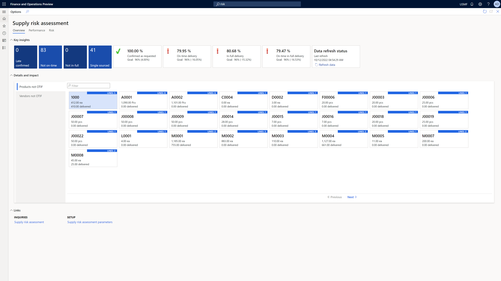
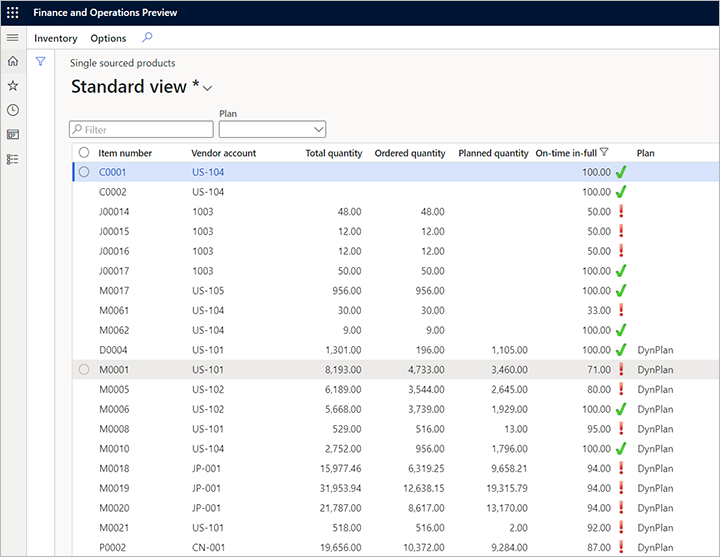
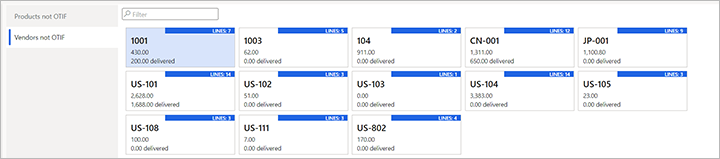

# Actionable workspace for discovering and handling supplier risks

[!include [banner](../includes/banner.md)]

The **Supply risk assessment** workspace provides a direct view of the top key insights that are related to supplier performance and related risks. It also provides [embedded reports](supply-risk-assessment-reports.md) that you can use for detailed performance and risk analysis.

## Open the Supply risk assessment workspace

To open the workspace, go to **Procurement and sourcing \> Workspaces \> Supply risk assessment**.

The workspace provides three tabs for direct actionable navigation and embedded analytic reporting that uses Microsoft Power BI:

- Overview
- Performance
- Risk

Each tab is described in detail later in this article.

> [!NOTE]
> If the workspace is blank or doesn't show the latest data that you expect to see, you might have to initialize or refresh the data. For instructions, see [Configure supply risk assessment](supply-risk-assessment-configuration.md).

## Overview tab

The **Overview** tab shows metrics and actionable content that let you navigate to relevant views and records in Dynamics 365 Supply Chain Management, such as planned orders, products, and vendors. The data on the **Overview** tab is filtered by the currently selected legal entity.

### Key insights FastTab

The **Key insights** FastTab of the **Overview** tab shows the following tiles. Each tile reports a metric that is calculated for the scope of the workspace.

- **Late confirmed** – The number of purchase order lines where vendors returned a confirmed delivery date (CDD) that was later than your requested delivery date (RDD).
- **Not on time** – The number of purchase order lines that weren't delivered on time (OT).
- **Not in full** – The number of purchase order lines that weren't delivered in full (IF).
- **Single sourced** – The number of planned order items that only one vendor is assigned to. These items might indicate increased risk.

Each tile summarizes a details view, which you can open by selecting the tile. The following illustration shows the details view that is available from the **Single sourced** tile. It shows on-time in-full (OTIF) ratings and highlights whether your [configured threshold](supply-risk-assessment-configuration.md) was met for each item.

### Details and impact FastTab

The **Details and impact** FastTab has two tabs. The **Products not OTIF** tab shows a tile for each product that didn't meet the OTIF rate expectations, based on past purchase orders, whereas the **Vendors not OTIF** tab shows a tile for each vendor that didn't meet the OTIF rate expectations.

Each tile shows the number of items that were ordered and the number of items that were delivered in the relevant unit of measure. The header of each tile shows the number of relevant order lines for this calculation. The following illustration shows an example of tiles on the **Vendors not OTIF** tab.

Select a tile to view the list of order lines that have been counted by that tile.

### Links FastTab

The **Links** FastTab provides convenient links to the **Supply risk assessment parameters** page (see [Configure supply risk assessment](supply-risk-assessment-configuration.md)) and to the integrated supply risk assessment report (see [Power BI reports for risks analysis and performance ranking](supply-risk-assessment-reports.md)).

## Performance and Risk tabs

The **Performance** and **Risk** tabs provide in-depth analytics reports of your vendor and supply performance, and the calculated risks for your planned supply orders. For more information about how to work with these reports, see [Power BI reports for risks analysis and performance ranking](supply-risk-assessment-reports.md).
