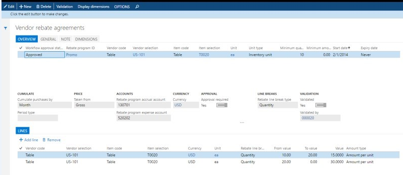
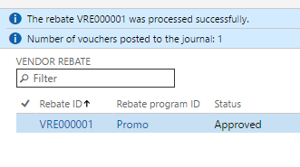

# Vendor rebates

[!include [banner](../includes/banner.md)]

Vendor rebates help companies better manage their supplier rebate programs by automating tasks that are required in order to administer, track, and claim rebates that are earned.

This article provides an overview of the most common tasks that you might want to perform when you work with vendor rebates. The overview covers the following tasks:

- Review details of a rebate agreement.
- Identify orders that qualify for rebates, and generate rebate claims.
- Review and approve claims.

## Audience and purpose

The information in this article is intended for business decision makers in enterprise companies, in positions such as purchase manager, chief financial officer (CFO), and accounting manager, who have the following responsibilities:

- Negotiate vendor price, discount, and rebate agreements.
- Manage staff that processes rebate claims and collects payments.
- Order inventory at the best possible prices.

People in these positions are looking for ways to achieve various goals. Here are some examples:

- Flexibly accommodate different types of vendor promotion programs and rebate conditions.
- Reduce the administrative burden and errors that are associated with monitoring promotion performance and processing claims.
- Improve cash flow forecasts by accruing for future receivables.
- Have a quantified basis for ongoing and future negotiations with vendors about rebates.

## Review details of a vendor rebate agreement

A vendor rebate agreement is a record of a contract with a vendor that specifies the negotiated terms and conditions under which the company qualifies for a monetary reward in return for achieving preset purchase targets. Vendor rebate agreements are recorded on the **Rebate agreements** page.

To open the **Vendor rebate agreements** page, select **Procurement and sourcing** &gt; **Vendor rebates** &gt; **Rebate agreements**.

On the **Vendor rebate agreements** page, you can view details about the negotiated conditions of a vendor agreement.

The agreement's header specifies the general conditions that qualify a company for rebates. In effect, the header information specifies that a vendor grants a rebate when a specific product is bought in a specific quantity. On the header, you also specify the unit of measure rebate option and the calculation date type.

- On the **Overview** tab, if you have lines with **Item code** set to *table* to specify the item, then the agreement is for that specific item. If you have lines with **Item code** set to *Group* or *All* to specify the items, then the vendor rebate agreement will be individually processed per item qualifying for the item code, not across all items qualifying for the item code.

- On the **General** tab, in the **Unit of measure rebate option** field, you can define whether a unit of measure should be a condition for the purchase order line to qualify for a rebate claim.

    - **Convert** – A purchase order line qualifies for a vendor rebate per the rebate agreement. You will receive a rebate regardless of the unit of measure that is applied on the line.
    - **Exact match** – To qualify for a rebate, a purchase line must have the same unit of measure that is specified on the agreement.

- On the **General** tab, in the **Calculation date type** field, select the date that is used to determine whether the purchase occurs in the validity period of the rebate agreement.

    - **Created** – Use the creation date of the purchase order.
    - **Requested delivery** – Use the requested receipt date.

On the agreement lines, you can specify the vendor rebate agreement in more detail.

- In the **Cumulate purchase by** field, you can set the calculation of the rebate claim. The amount can be set to depend on a period (of week, month, year, lifetime or a customized period). The **Invoice** value indicates that a rebate claim will be determined every time that a purchase order line is invoiced.
- In the **Taken from** field, you can specify the basis for the rebate calculation.

    - **Gross** – The rebate is calculated based on the gross price of the item.
    - **Net** – The rebate is calculated based on the net price of the item (that is, the price after other discounts have been applied).

- The **Rebate program accrual account** and **Rebate program expense account** fields specify account numbers that will receive accrued rebate amounts during the intermediate stage between approval and processing.
- When the **Approval required** option is set to **Yes**, the rebate claim must be approved before it can be accrued or paid out.
- The **Rebate line break type** field specifies the basis for the rebates.

    - **Quantity** – The rebates are volume-based.
    - **Amount** – The rebates are amount-based.

- On the **Lines** FastTab, you can see how different quantity tiers can be set up to grant different rebates. For example, in the previous illustration, the **From value** and **To value** fields indicate that a product quantity between 10 and 19 units will qualify for a rebate of USD 15 per unit.

    > [!NOTE]
    > The **From value** value is inclusive, whereas the **To value** value is exclusive. For example, the **Rebate line break type** field is set to **Quantity**, and you enter **1** in the **From value** field and **3** in the **To value** field. In this case, the rebate amount applies when you purchase one or two items, but not when you purchase three items.

- In the **Workflow approval status** field, the **Approved** value indicates that the agreement can be applied to purchase orders that meet the agreement’s conditions.

## Identify orders that qualify for rebates, and generate rebate claims

When purchase orders are placed with a vendor that the company has a rebate agreement with, the program identifies any future vendor credit payments. If the purchase orders qualify for a rebate, a rebate claim is generated for every order line as soon as a purchase invoice has been posted. This process is automatic. Later, you can review the expected rebates and see the impact of those rebates on the product’s cost and profit margin.

### View details of rebates that are applied to a purchase order line per the vendor rebate agreement

1. On the **Purchase order** page, select an order line, and then select **Purchase order line** &gt; **View** &gt; **Price details**.
2. On the **Price details** page, select the **Rebates** FastTab.

The rebate information is also shown in the **Vendor rebate** field in the **Margin estimation** section of the **Price details** page.

> [!NOTE]
> On the **Procurement and sourcing parameters** page, on the **Prices** tab, verify that the **Enable price details** option is set to **Yes**. If the option is set to **No**, you won’t be able to view the rebates.

## Review and approve claims

Rebate claims that are generated represent the future payments that can be expected from the vendor. Before a credit note is issued to the vendor, the agreement owner typically wants to review the claims and approve them. However, note that the status of a claim determines whether the claim is ready to go through the approval process.

### The status of claims and the effect on the approval process

When a claim is generated, its status is set to **To be calculated** if the rebate is granted on a cumulative basis or **Calculated** if the rebate is granted per invoice. If the status of a claim is **To be calculated**, the claim must go through a calculation process that is handled by the Cumulate function. Only claims that have a status of **Calculated** can be included in the approval process.

> [!NOTE]
> If the **Approval required** option on a vendor rebate agreement is set to **No**, any claims that are generated will have a status of **Approved**. The approval is mandatory for claims that are granted on a cumulative basis.

### Approve claims, and view postings and invoice details

When claims have been approved, they can be processed by Accounts payable (A/P). A credit memo (vendor invoice) for the rebate claim amount is automatically generated. The credit can then be added to the vendor balance, and the A/P team can include it in the regular settlement process.

1. Select **Procurement and sourcing** &gt; **Vendor Rebates** &gt; **Rebate claims** to open a rebate claim.
2. Close the rebate claim.
3. Mark the claim, and then, on the Action Pane, select **Approve**.
4. On the request page, in the **Vendor** field, select the vendor that you’re authorized to receive a rebate from, and then select **OK**.

    A Rebate accrual journal is posted for the claim amount. This posting debits the Accrued Vendor Rebates Receivable account for the expected vendor credit and credits the interim Accrued Vendor Rebates Received account for the expected gain.

    

5. In the rebate list, select the line, and then, on the Action Pane, select **Rebate transactions** to see and navigate to the journal batch number for this rebate accrual posting.

    To move the claims to the regular A/P process, the A/P clerk must now complete the rebate claim handling by running the Process function.

6. On the Action Pane, select **Process**, and then select **Filter**. In the **Criteria** field for the **Vendor account** field, select the vendor to process rebate claims for, select other relevant filters, and then select **OK**.

    The message bars and the fact that the status is changed to **Completed** indicate that the following events have occurred:

    - A Rebate accrual journal posting has reversed the previous interim amounts on the accrual receivable and expense accounts.
    - A vendor invoice (credit note) for the rebate amount has been created.

        > [!NOTE]
        > The setting of the **Manual invoice posting** option on the **Rebate program** tab of the **Procurement and sourcing parameters** page determines whether a vendor invoice is posted manually or automatically as part of claim processing.

    - When the vendor invoice is posted, either automatically or manually, the vendor’s Payable account has been debited, and the Discounts and Allowances Received account has been credited.

        > [!NOTE] 
        > The Discounts and Allowances Received account number is specified for the procurement category that is used on the purchase invoice line for the rebate. The procurement category, in turn, is set on the **Rebate program** tab of the **Procurement and sourcing parameters** page.

7. In the rebate list, select the line, and then, on the Action Pane, select **Rebate transactions** to see and navigate to the journal batch number for this rebate accrual posting and also the vendor invoice number.
8. Select the line for the vendor invoice transaction, and then, on the Action Pane, select **Vendor invoice**. If the vendor invoice has been posted, you will see the Invoice journal. Otherwise, you will see the vendor invoice as a pending vendor invoice that requires manual posting.

    The invoice line specifies the details of the vendor invoice for the **Commissions and Rebates** procurement category.

9. On the **All vendors** page, select the vendor that you receive a rebate from, and then, on the Action Pane, select **Transactions**. Find the line for the invoice. The rebate amount has now been added to the vendor balance.

## Summary

The process for handling vendor rebates involves multiple manual tracking tasks that are often tedious. By automating these tasks, the vendor rebate management feature can help you move through the following processes:

- Generating accurate rebate claims
- Accruing the expected receivable and interim gain in the general ledger
- Updating the vendor balance and the income statement with the allowance that is due

[!INCLUDE[footer-include](../../includes/footer-banner.md)]