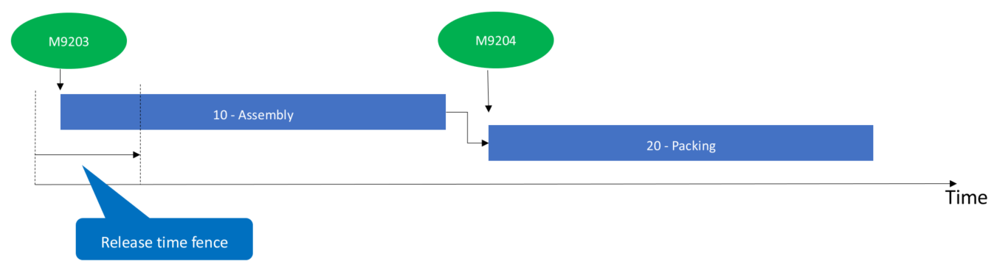

**Releasing BOM and formula lines to the warehouse**

This article describes the process of releasing raw materials for BOM and
formula lines to the warehouse. When releasing a BOM or formula line to the
warehouse, it is first examined if material is already available at the
production input location at the shop floor where the material is set up to be
consumed for the production process.

-   If the material is available at the location, the material will be picked
    from the location immediately at the release to warehouse signal.

-   If the material is not available on the production input location, the
    material release signals a need to move material from locations in the
    warehouse to the production input location. The material is moved with the
    use of warehouse work for raw material picking and requires the
    configuration of warehouse processes for raw material picking. For more
    information, see
    <https://docs.microsoft.com/en-us/dynamics365/unified-operations/supply-chain/warehousing/replenishment>
    and
    https://docs.microsoft.com/en-us/dynamics365/unified-operations/supply-chain/warehousing/control-warehouse-location-directives

**Methods to release BOM and formula lines**

Releasing BOM and formula lines can be configured to happen as part of releasing
a production or batch order or it can be controlled by a batch job or as a
manual interaction.

The method to release BOM and formula lines is controlled by the parameter
**Production line release** which is located under **Production control** \>
**Setup** \> **Production parameters**.

**On production order release:** This method will release BOM and formula lines
for a production or batch order as part of releasing the order. Releasing a
production or batch order normally describes the process where production jobs
are released to the shop floor workers and production papers are printed. The
order also change status to **Released** in this process.

**Batch job or manually released:** With the use of this method, BOM and formula
lines can only be released using the batch job **Automatic release of BOM and
formula lines** or as a manual interaction with the use of the function
**Release to warehouse**. You can select **Release to warehouse** from the
action pane on the production order list or details page.

**Releasing the BOM and formula lines with a batch job**

The **Automatic release of BOM and formula lines** batch job will run through
selected BOM and formula lines that have remaining quantity to release. Only
orders with the status **Released**, **Started** or **Reported as finished**
will be considered by the batch job. If a BOM or formula line has a remaining
quantity to release, then the job releases up to the quantity that can be
covered by an already physically reserved quantity and what is physically
available.

**Example of a batch job release**

| **Scenario** | **Remaining quantity to release** | **Already physical reserved** | **Physical available** |   | **Quantity released by the batch job** |
|--------------|-----------------------------------|-------------------------------|------------------------|---|----------------------------------------|
| 1            | 100                               | 20                            | 90                     |   | 100                                    |
| 2            | 100                               | 20                            | 70                     |   | 90                                     |
| 3            | 100                               | 0                             | 90                     |   | 90                                     |
| 4            | 100                               | 0                             | 110                    |   | 100                                    |
| 5            | 100                               | 20                            | 0                      |   | 20                                     |

**Batch job setup**

In the query of the release batch job, a filter criteria can be set up to
control how many days ahead the job should be looking for lines with unreleased
quantities. For this setup, use the function **(LessThanDate())** as a filter
criteria in the field **Raw material date** in the query of the job. The
illustration below shows a production order with two jobs. Each job is set up to
consume a quantity of material. In the illustration, the release time fence
equals the number of days that has been specified in the **(LessThanDate())**
crietria. **(LessThanDate(2))** will, for example, imply that the job will only
look for unreleased quantities within a time horizon of two days.

**Release material per operation number or proportionally to the amount of
finished goods**

When you release materials using the **On production order release** parameter
setting and when you carry out a manual release, you can control the material
release with these two options:

-   Releasing material per operation number

-   Releasing material proportional to amount of finished goods

**Release material per operation number**

-   To control which operations materials should be released to, open the
    **Release to warehouse** page: Click **Production control** \> **Production
    orders** \> **All production orders**, select a production order and, on the
    **Warehouse** tab, click **Release to warehouse**. Then use the fields
    **From Oper. No.** and **To Oper. No**

In the following example there is a production order with two operations, 10 and
20. You can for example limit the release to operation 10. In that case only
material M9203 will be released.

**Release materials for a partial quantity of finished goods**

-   To release raw material for a partial quantity of finished goods, open the
    **Release to warehouse** page: Click **Production control** \> **Production
    orders** \> **All production orders**, select a production order and, on the
    **Warehouse** tab, click **Release to warehouse**. Then enter a quantity in
    the **Quantity** field.

Say, for example, that a production order exists that is created and scheduled
for 1000 pcs. The shop floor supervisor wants to plan the production of 100 pcs.
for the coming shift, and only wants to release materials for the coming shift.
In this case he can use the **Quantity** field to release materials for the 100
pcs. he is planning for the next shift.

-   To release materials in a specific unit, open the **Release to warehouse**
    page: Click **Production control** \> **Production orders** \> **All
    production orders**, select a production order and, on the **Warehouse**
    tab, click **Release to warehouse**. Then then use the **Unit** field to
    select in which unit of the finished good you want to release materials.

The units that are available are defined in the **Unit sequence group ID** on
the finished good.

Say, for example, that a finished good has a unit conversion between pounds
(lbs) and pallet (PL) that is 1 PL = 100 lbs. If you create a production order
for 10000 lbs of the finished goods, you can choose to release raw materials for
the number of pallets you plan to produce by selecting the unit PL and a
corresponding number in the **Quantity** field.
