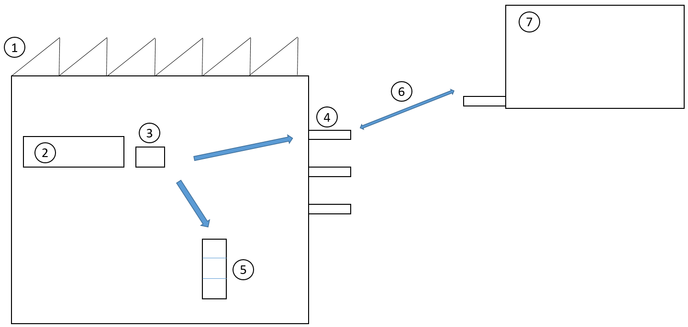

---
# required metadata

title: Cross-docking from production orders to outbound docks
description: This topic describes how to manage the process of cross-docking material that is being reported as finished from a production line to an outbound transportation dock.
author: johanhoffmann
ms.date: 06/20/2017
ms.topic: article
ms.prod: 
ms.technology: 

# optional metadata

ms.search.form: WHSCrossDockOpportunityPolicy, WHSReservationHierarchy, WHSInventTableReservationHierarchy, WHSItemGroupLoadTemplate
# ROBOTS: 
audience: Application User
# ms.devlang: 
ms.reviewer: kamaybac
# ms.tgt_pltfrm: 
ms.custom: 1705903
ms.assetid: 427e01b3-4968-4cff-9b85-1717530f72e4
ms.search.region: Global
# ms.search.industry: 
ms.author: johanho
ms.search.validFrom: 2016-02-28
ms.dyn365.ops.version: AX 7.0.0
---

# Cross-docking from production orders to outbound docks

[!include [banner](../includes/banner.md)]

This topic describes how to manage the process of cross-docking material that is being reported as finished from a production line to an outbound transportation dock.

## Introduction

Cross-docking from production to an outbound location is relevant for manufacturers who produce high volume and ideally want to ship the finished products as soon as they are reported as finished from the production lines. The purpose is to ship the products to distribution centers that are physically located close to the customer demand, rather than build up inventory at the manufacturing site.

In case there is no immediate demand for a product, it must be put away to warehouse locations on the manufacturing site. This process is also known as *opportunistic cross-docking*, which indicates that if there is a demand for shipping the product, then this opportunity should be used instead of putting the product away for internal storage.

The following example shows three variations of a flow that starts at the end of the production line (2).

A product is reported as finished to the production output location (3) and a fork lift driver will pick up the pallet at this location (3).

-   If there is a planned activity (6) for transferring the product from manufacturing (1) to a distribution center (7), then the truck driver will be directed by the system to put the pallet by a bay-door location (4).
-   If a trailer is already assigned to the bay door, the truck driver will be directed to load the product directly to the trailer.
-   If there is no planned activity for transferring the product, the fork lift driver will be directed to put the product away to a location in the internal warehouse (5).

## Configure cross-docking
You configure the cross-docking process in **work policies**. A work policy includes a work order type, location, and product. In the following example, cross-docking is configured for product X and location Y.

#### Work order types

-   Work order type: Finished goods put way
-   Work creation method: Cross docking
-   Cross docking policy name: Transfer orders

#### Inventory locations

-   Warehouse: 51
-   Location: Y

#### Products

-   Item number: X

Currently, cross-docking can be configured for only two work order types:

-   Finished goods put away
-   Co-product and by-product put away

In the **cross-docking policy**, you define which document types are applicable for cross-docking. Currently, the only document type that is supported is **Transfer orders**. The following example shows the configuration of a cross-docking policy.

### Cross-docking policy name: Transfer order

- Sequence number: 10
  -   Work order type: Transfer issue
- Cross docking demand requires location: False
- Cross docking strategy: Date and time

### Sequence number

The **sequence number** indicates the priority of the document type. Currently, **Transfer issue** is the only type that is supported. Therefore, the sequence number will become relevant only when more work order types are supported.

### Cross-docking policy

The cross-docking policy also sets the policy for the prioritization of transfer order demand. For example, if multiple transfer orders exist for the same product, the scheduled date and time that are set on the load, and associated with the transfer order, determine the prioritization between the orders. The scheduled date and time can be set directly on the load, or they can be set on an **appointment schedule** that is associated with the load. The prioritization is determined by the cross-docking strategy. Currently, there is only one strategy: **Date and time**.

### Cross-docking demand requires location

In the cross-docking policy, you can set up a criterion to require that transfer orders have an assigned location in order to be eligible for cross-docking. This criterion is set in the **Cross docking demand requires location** field. The location on the appointment schedule that is associated with the load is used as the final location for the goods that are being cross-docked. The final location for the goods that are being cross-docked is determined by the location directive for **Transfer issue** for the **Put** work order type. You might find it useful to set the **Cross docking demand requires location** field in a scenario where the finished goods should be cross-docked only if a trailer is assigned to a bay door. In this scenario, the goods are moved directly from the production line into the trailer. When a trailer is assigned to the bay door, a user will assign the location to the appointment schedule and will therefore make the location applicable for cross-docking. The following sections walk you through two examples.

#### Scenario 1 – Cross-docking from production to transfer orders

After a product is reported as finished at the production line it is transferred to a bay-door location where it is loaded to a truck and transferred to a distribution center. Use company USMF.

1.  Enable a new number sequence for cross-docking. Go to the **Number sequences** page, and select the **Generate** button. A wizard will guide you through the process.
2.  Create a cross-docking policy. Go to the **Cross docking policy** page, and create a new policy that is named **Cross docking to transfer order**. Note that the only work order type that you can select is **Transfer issue**, and the only cross-docking strategy that is available is **Date and time**.
3.  Create a work policy. Go to the **Work policies** page, and create a new work policy that is named **Cross Dock L0101**.
4.  Set up loads so that they are created automatically for transfer orders. In the warehouse parameters, set up loads so that they are created automatically when transfer orders are created. A load is a prerequisite for making the transfer order eligible for cross-docking.
5.  Set up the item load mapping. Go to the **Item load mapping** page, and set up a standard load template for the **CarAudio** item group. This mapping will automatically insert the load template on the load when the transfer order is created.
6.  Create a transfer order. Create the transfer order for item number L0101. Quantity = 20.
7.  Release the transfer order from the load planning workbench. On the **Ship** tab, select the menu item for the load planning workbench and on the **Release** menu of the load line, select **Release to warehouse**. An open wave line of type **Transfer issue** now exists for the transfer order.
8.  Create a production order. Go to the **Production order** list page, and create a production order for product L0101. Quantity = 20. Estimate and start the production order. Note that the **Post picking list now** field remains set to **No**.
9.  Report as finished from the mobile device. Go to the mobile device portal and select menu item **Report as finished and put away**. Now report as finished L0101 from the handheld device. Quantity = 10. Note that the put location is **BAYDOOR**. This location is found from the **Transfer issue** location directive for the **Put** work order type. Also notice that work of the type **Transfer issue** has been created and completed. Go to the transfer order work details to verify the work.
10. Now report additional 10 pieces from the mobile device. Note that the put location again is **BAYDOOR**. Also notice that a new work of type **Transfer issue** has been created for the 10 pieces.
11. Now try to start 20 pieces more on the production order and then try to report 20 ea as finished by using the handheld device. This time, location **LP-001** is suggested as the put location. This location is found from the location directive for **Finished goods put away**. This location directive is being used, because no opportunity for cross-docking exists. The transfer order for LP-001 was completely fulfilled by the two cross-docking activities in step 9 and 10. Notice that work of the type **Finished goods put away** was created and processed.

#### Scenario 2 - Cross-docking from production to transfer orders with an appointment schedule

After a product is reported as finished at the production line it is transferred to a bay-door location that is identified by an appointment schedule for the bay-door locations. Use company USMF.

1.  Change the cross-docking policy. Change the cross-docking policy that you created in scenario 1 by selecting the **Cross docking demand requires location** check box.
2.  Create a new transfer order.
3.  Open the **Load planning workbench**.
4.  From the load planning workbench, go to the **Loads** section, and select **Appointment schedule** on the **Transportation** menu to create a new appointment schedule. Note that the appointment schedule has a reference to the transfer order in the **Order number** field. In the **Planned start date/time at location** field, you can set the date and time for the appointment. This date and time will be used when cross-docking demand is prioritized during the cross-docking process. The date and time that you set in this field will update the **Scheduled load shipping date and time** field on the corresponding load. The location on the **Shipping details** FastTab determines the location that the transfer order is shipped on.
5.  On the **Load planning workbench** release to the warehouse.
6.  Create a production order for item number **L0101**, and set the status to **Started**, with a quantity of 20.
7.  Report as finished from the mobile device.
8.  Go to the mobile device portal, and select the **Report as finished and put away** menu item.
9.  Report item number **L0101** as finished from the handheld device. Note that the put location is now **BAYDOOR 2**. This location is found from the appointment schedule instead of the **Transfer receipt** location directive.

### Additional information

-   The cross docking scenario is supported for batch and serial controlled items, both with the batch and serial number dimensions defined above and below location in the reservation hierarchy. 

[!INCLUDE[footer-include](../../includes/footer-banner.md)]