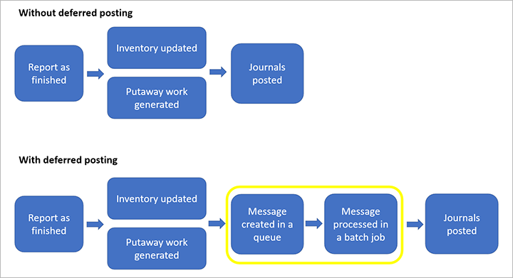

# Make finished goods physically available before posting to journals

[!include [banner](../includes/banner.md)]

When a worker reports a manufactured item as finished, the system registers it as available for further physical processing (such as shipment or putaway). During this process, one or more journals are also posted (such as the report as the finished journal, picking list journal, and route card journal). If you want to make your items physically available before all postings have been processed, you can set up the system to defer the journal postings. Deferred postings are then managed by a batch job that will process the postings as system resources allow.

The following illustration shows how processes for posting journals are invoked both with and without deferred posting.

## Turn on deferred journal posting for your system

Before you can use deferred journal posting, it must be turned on in your system. Admins can use the [Feature management](../../fin-ops-core/fin-ops/get-started/feature-management/feature-management-overview.md) workspace to check the status of the feature and turn it on. In the **Feature management** workspace, the feature is listed in the following way:

- **Module:** *Production control*
- **Feature name:** *Make finished goods physically available before posting to journals*

## Set up journal posting options for reporting as finished

Workers can report items as finished by using any of the following clients:

- Web client
- Warehouse Management mobile app
- Production floor execution interface

The web client uses the same posting method configuration as the Warehouse Management mobile app. However, the posting method that the production floor execution interface uses must be configured separately.

### Set journal posting options for the web client and the Warehouse Management mobile app

In the mobile app, workers report items as finished by opening a mobile device menu item where the **Work creation process** value is *Report as finished* or *Report as finished and put away*. In the web client, workers report items as finished from the **All production orders** list page or the **Production order (details)** page. You can configure a company-wide default method and can also set up warehouse-specific overrides as you require.

Use the following procedure to configure the company-wide default posting method for reporting items as finished from the web client or the Warehouse Management mobile app.

1. Go to **Production control \> Setup \> Production control parameters**.
1. On the **Journals** tab, in the **Report as finished journal** section, set the **Posting method** field to one of the following values:

    - *Immediate* – When an item is reported as finished, the system fully processes all related journal postings before it marks the finished item as physically available.
    - *Deferred* – When an item is reported as finished, the system marks the finished item as physically available and adds the journal postings to a message queue. The system doesn't wait until the postings are fully processed before it marks the finished item as physically available.

Use the following procedure to configure warehouse-specific overrides for the default posting method that is configured on the **Production control parameters** page.

1. Go to **Warehouse management \> Setup \> Inventory breakdown \> Warehouses**.
1. Select the warehouse that you want to set up.
1. On the Action Pane, select **Edit**.
1. On the **Warehouse** FastTab, in the **Production orders** section, set the **Posting method** field to one of the following values:

    - *Inherit* – The selected warehouse inherits the setting from the **Production control parameters** page.
    - *Immediate* – When an item is reported as finished, the system fully processes all related journal postings before it marks the finished item as physically available.
    - *Deferred* – When an item is reported as finished, the system marks the finished item as physically available and adds the journal postings to a message queue. The system doesn't wait until the postings are fully processed before it marks the finished item as physically available.

### Set journal posting options for the production floor execution interface

Use the following procedure to configure the posting method that is used when items are reported as finished from the production floor execution interface.

1. Go to **Production control \> Setup \> Manufacturing execution \> Production order defaults**.
1. On the **Report as finished** tab, in the **Report as finished journal** section, set the **Posting method** field to one of the following values:

    - *Immediate* – When an item is reported as finished, the system fully processes all related journal postings before it marks the finished item as physically available.
    - *Deferred* – When an item is reported as finished, the system marks the finished item as physically available and adds the journal postings to a message queue. The system doesn't wait until the postings are fully processed before it marks the finished item as physically available.

## Schedule the message processor batch job to process deferred postings

The message processor batch job is responsible for processing the journal postings after they have been queued. To ensure that your journal postings are processed, you must configure this job to run at a regular interval. Use the following procedure to set up the required batch job.

1. Go to **System administration \> Message processor \> Message processor**.
1. On the **Parameters** FastTab, set the **Message queue** field to *Production*.
1. On the **Run in the background** FastTab, set the **Batch processing** option to *Yes*. Then set up a recurrent schedule, and configure other settings as required. The settings work just as they work for other types of [background jobs](../../fin-ops-core/dev-itpro/sysadmin/batch-processing-overview.md) in Microsoft Dynamics 365 Supply Chain Management.

## Track the progress of your deferred postings

Deferred journal postings are queued as *message processor messages* that wait until they are processed by the *message processor*. The message processor should be set up to run as a scheduled batch job. To view the deferred posting messages that have been or will be processed by the message processor, go to **Production control \> Production orders \> Deferred production order posting**.

### Message grid columns and filters

You can use the fields at the top of the **Deferred production order posting** page to help find any specific messages that you're looking for.

The following filters are available:

- **Message type** – Specify the type of messages that are shown in the grid.
- **Message state** – Specify the state of the messages that are shown in the grid. The following states exist:

    - *Queued* – The message is ready to be processed by the message processor.
    - *Processed* – The message was successfully processed by the message processor.
    - *Canceled* – The message failed to be processed during the final attempt and was then canceled by the user.
    - *Failed* – The message failed to be processed during the last attempt. The system will retry failed messages three times. It will then give up and leave the message in the *Failed* state. Note that you can't manually cancel or edit a message until after the last of these three attempts.

- **Message content** – This filter does a full-text search of message content. (Message content isn't shown in the grid.) The filter treats most special symbols (such as hyphens) as space characters, and it treats all space characters as Boolean OR operators. For example, if you search for a specific `journalid` value that equals *USMF-123456*, the system will find all messages that contain either "USMF" or "123456." In this case, the list of results is likely to be long. Therefore, it's better to enter just *123456*, because you will get more specific results.

You can also sort and filter the list by selecting any of the column headings and entering criteria in the drop-down dialog box.

### View the message log, message content, and details

You can find detailed information about a message by selecting it in the grid and then selecting the **Log** or **Raw content** tab under the message grid, where each processing event is shown.

The toolbar on the **Log** tab includes the following buttons:

- **Log** – Select this button to show the processing results. This button is especially useful when messages have a **Processing result** value of *Failed*, and you want to learn the reasons for the processing failure.
- **Bundle** – Multiple message processing operations can run as part of the same batch process. Select this button to view this detailed data. For example, you can see whether dependencies exist that require a specific processing order for some messages.

### Manually process or cancel a message

You can manually process or cancel a message as you require, depending on its current state. Select the message in the grid, and then select **Process** or **Cancel** on the Action Pane.

### Set up business events to deliver alerts for failed processing results

You can set up [business events](../../fin-ops-core/dev-itpro/business-events/home-page.md) that alert you about failed processing results. Go to **System administration \> Setup \> Business events \> Business events catalog**, and activate the business event that is named *Message processor message processed*.

As part of the activation process, you're prompted to specify whether the event is specific to one legal entity or applies to all legal entities. You're also prompted to provide an **Endpoint name** value. This value must be defined first.

> [!NOTE]
> If the **When a Business Event occurs** field is set to *Microsoft Power Automate* (instead of *HTTPS*, for example), the **Endpoint name** value is automatically created in Supply Chain Management, based on the *Microsoft Power Automate* setup.
