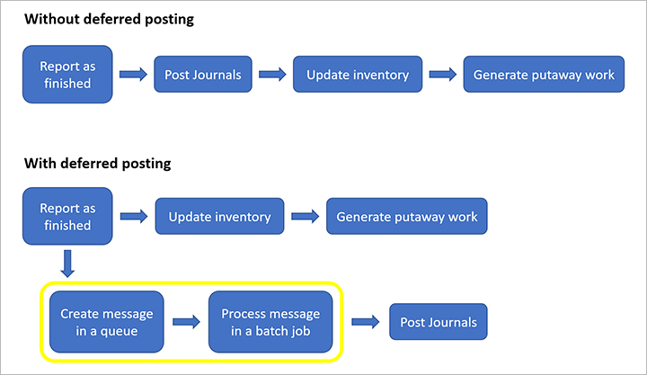

# Make finished goods physically available before posting to journals

[!include [banner](../includes/banner.md)]
[!INCLUDE [preview-banner](../includes/preview-banner.md)]

When a worker reports a manufactured item as finished, the system registers the item as available for further physical processing (such as shipment or putaway). During this process, one or more journals are also posted (such as the report as the finished journal, picking list journal, and route card journal). If you'd like to make your items physically available before all postings have been processed, then you can set the system to defer the journal postings. Deferred postings are then managed by a batch job, which will process the postings as system resources allow.

The following illustration shows how processes for posting journals are invoked both with and without deferred posting.

## Turn on deferred journal posting for your system

Before you can use deferred journal posting, it must be turned on in your system. Admins can use the [feature management](../../fin-ops-core/fin-ops/get-started/feature-management/feature-management-overview.md) workspace to check the status of the feature and turn it on. In the **Feature management** workspace, the feature is listed in the following way:

- **Module:** *Production control*
- **Feature name**: *(Preview) Make finished goods physically available before posting to journals*

## Set up journal posting options for reporting as finished

You can report items as finished using any of the following clients:

- Web client
- Production floor execution interface
- Warehouse Management mobile app

Journal posting options for reporting as finished are configured separately for each client. Depending on your needs, you might choose to use deferred posting on some clients but not for others.

### Web client

When using the web client, workers can report as finished from the order list or details page. Use the following procedure to configure how the system will process journal postings when reporting as finished from the web client.

1. Go to **Production control \> Setup \> Production control parameters**.
1. Open the **Journals** tab.
1. In the **Report as finished journal** field group, set **Posting method** to one of the following values:

    - *Immediate* – The system will fully process all related journal postings before marking a finished item as physically available.
    - *Deferred* – The finished item will be marked as physically available and the journal postings will be added to a message queue to be processed as system resources allow. The system won't wait until the postings are fully processed before marking the finished item as physically available.

### Production floor execution interface

Use the following procedure to configure how the system will process journal postings when reporting as finished from the production floor execution interface.

1. Go to **Production control \> Setup \> Manufacturing execution \> Production default parameters**.
1. Open the **Journals** tab.
1. In the **Report as finished journal** field group, set **Posting method** to one of the following values:

    - *Immediate* – The system will fully process all related journal postings before marking a finished item as physically available.
    - *Deferred* – The finished item will be marked as physically available and the journal postings will be added to a message queue to be processed as system resources allow. The system won't wait until the postings are fully processed before marking the finished item as physically available.

Go to **Production control \> Setup \> Manufacturing execution \> Production default parameters \> tab: Report as finished \> Field group: Report as finished journal \> field: Posting method**

In the **Posting method** field, you can choose between the following two values:

- Immediate
- Deferred

### Warehouse Management mobile app

The warehouse management app has two flows for reporting as finished production or batch orders. You configure a flow for the app by creating a mobile device menu item. Follow these steps to configure a mobile device menu item if it does not already exist in your dataset:

1. Go to **Warehouse management \> Setup \> Mobile device \> Mobile device menu items**
1. Select **New**, to create a new menu item and set the following values

    - **Menu item name** – Set a name for your menu item
    - **Title –** Set a title for your menu item.
    - **Mode** – Select *Work* in the dropdown menu.
    - **Work creation process –** Select either *Report as finished,* or*Report as finished and put away.*

When a menu item is created, you must associate it a mobile device menu. Follow these steps to associate the menu item to an existing menu in the USMF demo dataset:

1. Go to **Warehouse management \> Setup \> Mobile device \> Mobile device menu**
1. In the left side of the page, select the Mobile device menu called *Production*.
1. In the box *Available menus and menu items*, select the menu item you created in previous step.
1. Select the icon with the right arrow so the menu item is selected for the *Production menu* in the box*Menu structure*.

Deferred journal postings when reporting as finished with the warehouse app is configured in the warehouse management parameters. Follow these steps to set up the configuration:

1. Go to **Warehouse management \> Setup \> Inventory breakdown \> Warehouses**
1. Select a warehouse in the left section of the page.
1. Expand the **Warehouse** FastTab and find the field **Posting method** in the field group: **Production orders.**

The field **Posting method** has the following three values:

- Inherit
- Immediate
- Deferred

If choosing *Inherit*, the system will inherit the setting of the parameter in the Production control parameters. The values*Immediate* and*Deferred* have the same functional impact as explained for the production control parameters, and the production default parameter.

## Set up the batch job

This feature depends on the "Message processor" batch job, so after enabling the feature, set up the required batch job by going to **System administration \> Message processor \> Message processor**.

## Example scenario

This section provides an example of how the report as finished process works when using deferred posting. In this example, the finished goods D0003 in the USMF demo data set is used.

As this item is not enabled for the advanced warehouse processes, the parameter for deferred posting must be set up in the production control parameters. Follow these steps to set up the parameter:

1. Go to **Production control \> Setup \> Production control parameters \> tab: Journals \> Field group: Report as finished journal**
1. In the field **Posting method** select: Deferred.
1. Go to **Production control \> Production orders \> All production orders**
1. Select **New production order**, and set the following value in the **Create production order** dialog:

    - **Item number:** *D0003*

1. Select **Create**.
1. Select **Estimate** in the action pane under the Production order tab to open the Estimate dialog.
1. Confirm the **Estimate** dialog with **OK.**
1. Select **Start** in the action pane under the Production order tab to open the Start dialog.
1. Confirm the **Start** dialog with OK.
1. Select **Report as finished** in the action pane under the Production order tab to open the Report as finished dialog.
1. Confirm the **Report as finished** dialog.
1. Verify that no report as finished journal has been posted by selecting the menu item **Reported as finished** in the action pane under the **View** tab.
1. Verify that the inventory transaction for the production order has status: **Registered**, by selecting the menu item **Transactions** in the action pane under the **Production order** tab. The transaction is in the status because the journal postings have been setup to be deferred. If the posting method was *Immediate,* then the status of the transaction would have been: *Received.*
1. Go to **Production control \> Production orders \> Deferred production order posting**
1. In the **Deferred production order postings** page find the record for the production order you reported as finished in previous step. Use the field **Production order** to find the record.
1. Notice that the record has **Message type** = Queued.
1. Process the message by selecting *Process* in the action pane. Verify that the message type of the message change status to: *Processed*.
1. Go back to the production order list page and find the production order.
1. Verify that the Report as finished journal now has been created and posted after the message has been processed.

> [!NOTE]
> Normally, the messages are set up to be automatically processed by a batch job. You set up that batch job under the following path: **System administration \> Message processor.**
