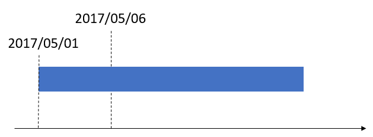

---
# required metadata

title: Visibility into material exceptions
description: This topic describes how you can get better visibility into exceptions for raw materials for production orders and batch orders.
author: johanhoffmann
ms.date: 10/30/2017
ms.topic: article
ms.prod: 
ms.technology: 

# optional metadata

ms.search.form: JmgShopSupervisorWorkspace, WHSProdWaveTableListPage, WHSProdWaveTableManageBOMPool
# ROBOTS: 
audience: Application User
# ms.devlang: 
ms.reviewer: kamaybac
# ms.tgt_pltfrm: 
ms.custom: 1705903
ms.search.region: Global
# ms.search.industry: 
ms.author: johanho
ms.search.validFrom: 2017-12-31
ms.dyn365.ops.version: 7.3
---
# Visibility into material exceptions

[!include [banner](../includes/banner.md)]

In the **Production floor management** workspace, three tiles give you better visibility into exceptions for raw materials for production orders and batch orders:

- Unreleased material lines needing attention
- Unprocessed waves needing attention
- Open warehouse work needing attention

For all three tiles, the raw material date of the bill of materials (BOM) lines and formula lines is compared against the workspace date, and also against the filters for **Production unit**, **Resource group**, and **Resource** that are set on the **Configure my work space** menu. By default, the workspace date is set to the current date, but you can adjust it.

An unreleased BOM line or formula line requires attention if the raw material date of the line is the same as or earlier than the workspace date, and if it meets the criteria that are defined by the filters in the workspace.

In the following figure, the blue bar represents a production job that is scheduled on a resource. The job is scheduled to start on May 1, 2017 (2017/05/01). This date is the raw material date. In other words, the materials that are assigned to the job on the BOM and formula lines must be ready on this date. The other date in the figure, May 6, 2017 (2017/05/06), represents the workspace date. In this example, the raw material date is earlier than the workspace date. Therefore, the date when consumption of the raw material was supposed to start has passed, and the BOM and formula lines meet the criteria for requiring attention.

## Unreleased material lines needing attention

A BOM or formula line can be released to the warehouse in three ways:

- As part of a production order or batch order release
- As a manual release
- Automatically through a batch job

For more information, see [Release BOM and formula lines to the warehouse](releasing-bom-and-formula-lines-to-warehouse.md). 

If a BOM or formula line hasn't been released or has been only partly released, and if the date and filter criteria of the workspace are met, the line is included in the calculation of the number that appears on the **Unreleased material lines needing attention** tile.

When you select the tile, the **Release to warehouse** page is opened. This page shows the number of unreleased BOM and formula lines that is indicated by the number on the tile. The unreleased lines appear in the upper grid. This grid shows the quantity that was originally estimated for the line, the quantity that has already been released, and the remaining quantity that must still be released. You can add lines from the upper grid to the lower grid. From the lower grid, you can then release the selected lines to the warehouse. From the lower grid, you can also adjust the quantity to release so that only a partial quantity is released.

## Unprocessed waves needing attention

When a BOM or formula line is released, it's added to either a new production wave or an existing open wave, depending on the configuration of the production wave template. Through the configuration of the wave template, you can also set up a wave so that it's automatically processed when a BOM or formula line is released. When the wave is processed, warehouse work for raw material picking is generated. If the wave template is configured so that waves aren't processed at the time of release, the wave remains in an unprocessed state. The **Unprocessed waves needing attention** tile shows the number of BOM and formula lines that have been released to the warehouse on unprocessed waves, and that have a raw material date that is earlier than or the same as the workspace date. The lines must also be consumed by an operation resource that applies to the filter of the workspace.

When the tile is selected, the **All production waves** page opens. This page is filtered by the number of open waves that contain wave lines from released BOM and formula lines that meet the criteria for the tile.

### Manually maintain production waves

On the **All production waves** page, you can use buttons on **Wave** tab of the Action Pane to manually **Process** and **Release** a wave. You can also use the **Maintain productions** option to view and maintain **Prod BOM Pool** data, which is used to handle the waving process.

## Open warehouse work needing attention

The **Open warehouse work needing attention** tile shows the number of BOM and formula lines that have been released to the warehouse, that have unprocessed work, and that have a raw material date that is earlier than or the same as the workspace date. The lines must also be consumed by an operation resource that applies to the filter of the workspace.

When the tile is selected, the **All work** page is opened. This page is filtered by the number of open work headers that contain work lines from released BOM and formula lines that meet the criteria for the tile. From the **All work** page, you can manually process the work.

[!INCLUDE[footer-include](../../includes/footer-banner.md)]