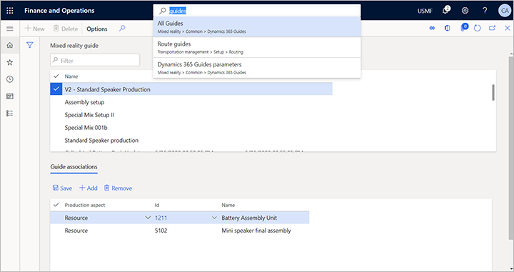
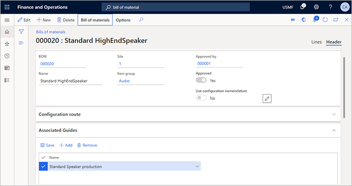
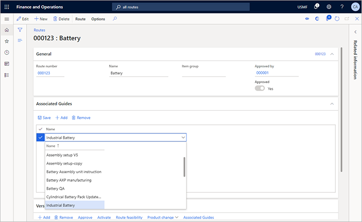
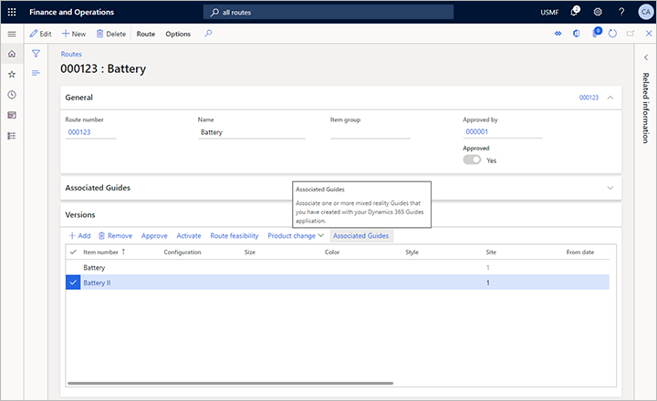
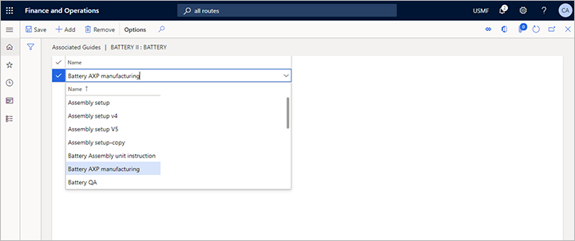
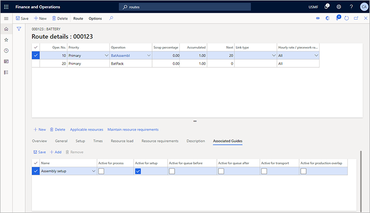
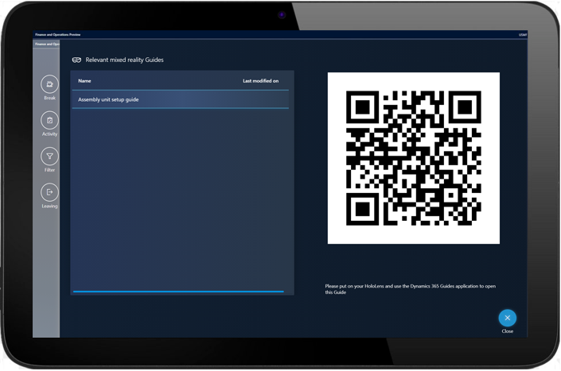

---
# required metadata

title: Provide mixed-reality Guides for workers in production
description: This article explains how to integrate the production management module in Microsoft Dynamics 365 Supply Chain Management with Dynamics 365 Guides.
author: johanhoffmann
ms.date: 11/13/2020
ms.topic: article
ms.prod: 
ms.technology: 

# optional metadata

ms.search.form: WorkGuidesManufacturing
# ROBOTS: 
audience: Application User
# ms.devlang: 
ms.reviewer: kamaybac
# ms.tgt_pltfrm: 
ms.collection: get-started
ms.assetid: a3847f07-fca4-4140-a26f-d83c6ac68dde
ms.search.region: Global
ms.search.industry: Manufacturing
ms.author: johanho
ms.search.validFrom: 2020-08-01
ms.dyn365.ops.version: AX 10.0.15

---

# Provide mixed-reality Guides for workers in production

[!include [banner](../includes/banner.md)]

Workers in production processes will benefit from relevant instructions that are provided at the right time in the context of their work. *Instructions* apply in several domains of work, including: assembly, service, operations, certification, and safety. Across all of these core business functions, ongoing training instructions can help empower workers to achieve more and work better.

## Introduction

You can provide instructions in different ways. One efficient system that ships out of the box uses [Dynamics 365 Guides](https://dynamics.microsoft.com/mixed-reality/guides/).

Dynamics 365 Guides can help empower your employees with hands-on learning. You can define standardized processes with step-by-step instructions that guide your employees to the tools and parts they need and show employees how to use these tools in real work situations.

You can attach guides to various aspects of production control including:

- [Resources](#resources)
- [Resource groups](#resource-groups)
- [Released products](#released-products)
- [Formulas](#formulas)
- [Formula versions](#formula-versions)
- [Bills of material (BOMs)](#bom)
- [BOM versions](#bom-versions)
- [Routes](#routes)
- [Route versions](#route-versions)
- [Route operation relations](#route-operation-relations)

> [!NOTE]
> You can also attach Guides with Asset Management. For more information about that option, see [Integrate Dynamics 365 Supply Chain Management (Asset Management) with Dynamics 365 Guides](../asset-management/asset-management-guides-integration.md).

When a first-line worker chooses a job on the shop floor through Supply Chain Management, the worker can see [the relevant guides](#logic) on the job card. When the worker chooses a specific guide, a QR code for that guide is shown on the screen. The worker then uses their HoloLens to scan the QR code, which launches Guides and shows the required instructions.

The following subsections describe a few selected scenarios where companies across industries can see the biggest value when using Guides to present instructions for manufacturing.

### Assembly

Instructions in assembly operations show workers the tools and parts they need and how to use them in real work situations.

Production managers can create and assign Guides, for example, for [production routes](routes-operations.md), [operation relations](routes-operations.md#operation-relations), or [bills of material](bill-of-material-bom.md). Workers will find the relevant instructions on the respective operation experience on the shop floor.

### Service

Equip technicians with guided instructions at the job site, eliminating the need to schedule additional visits.

Service managers can assign Guides, for example, to specific [products](../../commerce/product.md) that walk through routines of quality assessment.

### Quality

Rollout new processes and ensure increased consistency by turning employee knowledge into a repeatable tool.

Quality assurance managers can assign guides, for example, to [products](../../commerce/product.md) that walk through routines of quality assessment.

### Certifications

Ensure every employee meets high standards by quickly identifying who needs help and where.

### Safety

Provide instructions that walk through dangerous procedures virtually before attempting in the physical environment. With a mixed reality approach, workers can experience dangerous procedures virtually.

Production managers can provide dedicated handling instructions for hazardous material handling or delicate handling procedures by assigning instructions to [product items](../../commerce/product.md), [routes](routes-operations.md), and [operations](routes-operations.md#operation-relations).

## Get started with instructions and Guides

To enable instructions in production processes, Supply Chain Management provides an out-of-the-box integration with Dynamics 365 Guides. A licensed and installed application instance of Guides is required to build, maintain, and assign mixed reality instructions to production assets and work.

### Prerequisites

To use this feature, your system must include the following:

- Dynamics 365 Supply Chain Management version 10.0.15 or later
- [Dual-write](../../fin-ops-core/dev-itpro/data-entities/dual-write/enable-dual-write.md) for Supply Chain Management apps.
- [Dynamics 365 Guides](/dynamics365/mixed-reality/guides/setup#step-2-create-a-common-data-service-environment-and-install-the-dynamics-365-guides-solution) version 400.0.1.48 or later

### Turn on the feature

To make the feature available on your system, you must enable its configuration keys. You only need to do this once. To do this, an administrator must do the following:

1. Place your system into maintenance mode as described in [Maintenance mode](../../fin-ops-core/dev-itpro/sysadmin/maintenance-mode.md).
1. Go to **System administration \> Setup \> License configuration**.
1. Expand the **Mixed reality** section and then select the **Mixed reality guide** check box.
1. Expand the **Production management** section and then select the **Production instructions** check box.
1. Turn off maintenance mode as described in [Maintenance mode](../../fin-ops-core/dev-itpro/sysadmin/maintenance-mode.md).
  
## Configure how Guides appear on the shop floor

To configure how Guides appear on the shop floor, go to **Mixed Reality \> Dynamics 365 Guides \> Configure Guides integration**.

Set the following fields:

- **Microsoft Dataverse URL** - Specify the URL for the Microsoft Dataverse environment where you create your Guides. The format is "contoso.crm4.dynamics.com", where the first part of the URL is typically named after your organization (such as "contoso."), the second part is specific to the data region of your environment (such as "crm4."), and the last part is the domain (such as "dynamics.com"). One way to find the right URL is to go to [home.dynamics.com](https://home.dynamics.com/) and then open your Guides app. When Guides opens, you will see the URL in the address bar of your browser (only take the base URL, which should resemble the previous example). This value is used to compose addresses for your guides and will be encoded into the QR codes."
- **QR code size** - Set the size of the rendered QR code. We recommend choosing a size that will fill most of your display screen, but not more. Typically, *15* is a good value.
- **QR code error correction level** - Set the granularity of the QR code. Higher granularity can help increase the code's reliability, but your **QR code size** must be large enough to support the level of detail required by your selected correction level.

> [!TIP]
> - QR codes sizes that are too large for your display will take a bit longer to render and then be scaled down to fit your display. These do not provide a benefit.
> - QR code sizes that are too small may decrease the ability of HoloLens to read the code properly in some environments.
> - We recommend that you test the settings for each device that will display QR codes for HoloLens users. Choose settings that provide sufficient readability in your shop floor environment.  

## Get an overview of all Guide assignments

Use the **All Guides** page to see the list of all available Guides in your organization and all assignments to your production processes and resources. To open it, go to **Mixed reality \> Guides \> All Guides**. The list at the top shows all the available Guides and you can use the field here to filter the list. The list at the bottom shows all Guide assignments and provides a toolbar for managing them.

The following sections describe the types of objects that you can assign Guides to. Each assigned guide provides instructions that are automatically attached to the respective production jobs and will be available on the shop floor.

## Associate a Guide to a resource

Add a Guide to a [resource](operations-resources.md) to offer the Guide in the context of relevant production jobs.

### Typical scenario using resources

For example, you could attach a Guide with general machine security or handling instructions to a resource of type machine. Then, the Guide will be available on every job that is performed on the machine.

### Add a Guide to a resource

To add a Guide to a resource:

1. Go to **Production control \> Setup \> Resources \> Resources**.
1. From the list pane, select the resource you want to assign a Guide to.
1. Expand the **Associated Guides** FastTab.
1. Select **Add** from the **Associated Guides** toolbar. A new line is added to the grid.
1. For the new line, use the drop-down list in the **Name** column to choose the Guide you want to assign. If you have a large number of Guides, then you can filter the list to find the one you are looking for.
    

## Associate a Guide to a resource group

You can add a guide to [resource groups](tasks/define-discrete-manufacturing-resource-group.md) if you use them to manage groups of machines, production lines, or work cells.

### Typical scenarios using resource groups

**Example 1:** You have defined a resource group for several machines of the same model. Instead of assigning the relevant handling instruction guide for the machine model to every relevant resource, you could instead assign the Guide to the resource group that reflects that machine model.

**Example 2:** You have defined a resource group for a work cell that contains different machines and you have a Guide that provides general instructions for how to maintain the work cell. The Guide applies to any production activity in this work cell.

### Add a Guide to a resource group

To add a Guide to a resource group:

1. Go to **Production control \> Setup \> Resources \> Resource groups**.
1. From the list pane, select the resource group you want to assign a Guide to.
1. Expand the **Associated Guides** FastTab.
1. Select **Add** from the **Associated Guides** toolbar. A new line is added to the grid.
1. For the new line, use the drop-down list in the **Name** column to choose the Guide you want to assign. If you have a large number of Guides, then you can filter the list to find the one you are looking for.
    

## Associate a Guide to a released product

You can add a guide to any [released product](../pim/tasks/create-released-product-single-company.md).

### Typical scenario using released products

Product-level Guides help shop floor workers with instructions relevant to operating or handling a specific released product or item.

### Add a Guide to a released product

To add a Guide to a released product:

1. Go to **Production information management \> Products \> Released products**.
1. Open the product you want to assign a Guide to.
1. On the Action Pane, open the **Engineer** tab and from the **View** group, select **Associated Guides**.
1. The **Associated Guides** page opens for your selected product.
1. Select **Add** on the Action Pane to add a new line to the grid. 
1. For the new line, use the drop-down list in the **Name** column to choose the Guide you want to assign.
    

## Associate a Guide to a formula

You can add a guide to any [formula](bill-of-material-bom.md#formulas-co-products-and-by-products).

### Typical scenario using formulas
  
Formula-level Guides provide shop floor workers with guided handling instructions in the context of a formula or recipe. Guides can also be assigned to versions of a formula.

> [!NOTE]
> You can assign guidance relevant for production processes based on a formula to a route, route version, or route operation relations.  

> Guides can't currently be attached to individual formula lines.

### Add a Guide to a formula

To add a Guide to a formula:

1. Go to **Production information management \> Bills of materials and formulas \> Formulas**.
1. Open the formula you want to assign a Guide to.
1. Open the **Header** tab above the top FastTab.
1. Expand the **Associated Guides** FastTab.
1. Select **Add** from the **Associated Guides** toolbar. A new line is added to the grid.
1. For the new line, use the drop-down list in the **Name** column to choose the Guide you want to assign.
    

## Associate a Guide to a formula version

You can add a guide to any [formula version](bill-of-material-bom.md#bom-and-formula-versions).

### Typical scenario using formula versions

Guides attached to an individual version of a formula provide shop floor workers with instructions that walk through the production of that version of the formula recipe.

> [!TIP]
> You can assign guidance relevant for production processes based on this formula version to a route, route version, or route operation relations.  

> [!NOTE]
> Guides can't currently be attached to individual formula lines.

### Add a Guide to a formula version

To add a Guide to a formula version:

1. Go to **Production information management \> Bills of materials and formulas \> Formulas**.
1. Open the formula that includes a version that you want to assign a Guide to.
1. Open the **Header** tab above the top FastTab.
1. On the **Formula versions** FastTab, select the version you want to assign a Guide to.
1. On the **Formula versions** toolbar, select **Associated Guides**.
    
1. The **Associated Guides** page opens for your formula version.
1. Select **Add** on the Action Pane to add a new line to the grid. 
1. For the new line, use the drop-down list in the **Name** column to choose the Guide you want to assign.
    

## Associate a Guide to a bill of materials

You can add a guide to any [bill of materials](bill-of-material-bom.md) (BOM).

### Typical scenario using bills of materials

Guides attached to a BOM provide shop floor workers with instructions that explain how to prepare and handle material from a BOM. Guides can also be assigned to versions of a BOM.

> [!NOTE]
> Guides can't currently be attached to individual BOM lines.

### Add a Guide to a bill of materials

To add a Guide to a bill of material:

1. Go to **Production information management \> Bills of materials and formulas \> Bills of materials**.
1. Open the bill of materials that you want to assign a Guide to.
1. Open the **Header** tab above the top FastTab.
1. Expand the **Associated Guides** FastTab.
1. Select **Add** from the **Associated Guides** toolbar. A new line is added to the grid.
1. For the new line, use the drop-down list in the **Name** column to choose the Guide you want to assign.
    

## Associate a Guide to a bill of materials version

You can add a guide to any [bill of materials version](bill-of-material-bom.md#bom-and-formula-versions).

### Typical scenario using bill of materials versions

Guides attached to an individual BOM version provide shop floor workers with instructions that explain how to prepare and handle material for a version of a BOM that is different from the generic BOM or other versions of it.

> [!NOTE]
> Guides can't currently be attached to individual BOM lines.

### Add a Guide to a bill of materials version

To add a Guide to a bill of materials version:

1. Go to **Production information management \> Bills of materials and formulas \> Bills of materials**.
1. Open the BOM that includes a version that you want to assign a Guide to.
1. Open the **Header** tab above the top FastTab.
1. On the **BOM versions** FastTab, select the version you want to assign a Guide to.
1. On the **BOM versions** toolbar, select **Associated Guides**.
    
1. The **Associated Guides** page opens for your BOM version.
1. Select **Add** on the Action Pane to add a new line to the grid.
1. For the new line, use the drop-down list in the **Name** column to choose the Guide you want to assign.
    

## Associate a Guide to a route

You can add a guide to any [route](routes-operations.md).

### Typical scenario using routes

Routes are typically used to specify how a certain released product shall be produced based on a BOM or BOM version and with a set of resources or resource groups.

Assign a Guide to a route to provide step-by-step instructions for the respective production process.

### Add a Guide to a route

To add a Guide to a route:

1. Go to **Production control \> All routes**.
1. Open the route that you want to assign a Guide to.
1. Expand the **Associated Guides** FastTab.
1. Select **Add** from the **Associated Guides** toolbar. A new line is added to the grid.
1. For the new line, use the drop-down list in the **Name** column to choose the Guide you want to assign.
    

## Associate a Guide to a route version

You can add a guide to any [route version](routes-operations.md#route-versions).

### Typical scenario using route versions

Routes versions are typically used to specify variants of production processes based on an existing route. You can assign different Guides to each route version.

### Add a Guide to a route version

To add a Guide to a route version:

1. Go to **Production control \> All routes**.
1. Open the route that you want to assign a Guide to.
1. On the **Versions** FastTab, select the version you want to assign a Guide to.
1. On the **Versions** toolbar, select **Associated Guides**.
    
1. The **Associated Guides** page opens for your BOM version.
1. Select **Add** on the Action Pane to add a new line to the grid.
1. For the new line, use the drop-down list in the **Name** column to choose the Guide you want to assign.
    

## Associate a Guide to a route operation relation

You can add a guide to any [route operation relation](routes-operations.md#operation-relations).

### Typical scenario using route operation relations

Operation relations are the most specific way to add guidance to a product process and its related operations. You can specify guidance for each operation in a route and specify different guidance for any type of relation context specified for a route, such as for specific items, configurations, and more. You can also specify to which stages in the operation the guidance applies (such as setup, queueing, process, or transport).

> [!NOTE]
> If you specify guides for several operation relations of a route, among those guides, only the guide from the most specific relation will be show on the shop floor for the generated job.

### Add a Guide to a route operation relation

To add a Guide to a route operation relation:

1. Go to **Production control \> All routes**.
1. Open the route that you want to assign a Guide to.
1. On the Action Pane, open the **Route** tab and from the **Maintain** group, select **Route details**.
1. The **Route details** page opens for your selected rout.
1. In the top grid, select the operation you want to provide guidance for.
1. In the bottom grid, select a specific relation (or the generic **All** relation).
    
1. Above the bottom gird, open the **Associated Guides** tab.
    
1. Select **Add** from the toolbar at the top of the bottom grid to add a new line to the grid.
1. For the new row, use the drop-down list in the **Name** column to choose the Guide you want to assign. In the rest of the row, select the check box for each context where the selected Guide should be available.

> [!NOTE]
> You can add one or more guides for each stage of each operation.

## Select guides from the shop floor execution interface

When a worker opens a job list on the shop floor execution interface, Supply Chain Management finds the relevant guides for the jobs shown. Use the **Guides** button to view the relevant guides.

Then put on a HoloLens and access the respective guide by glancing at the QR code and activating the respective Guide.

## Resolving the logic for selecting Guides

You can add Guides to the following production data:

- [Resources](#resources)
- [Resource groups](#resource-groups)
- [Released products](#released-products)
- [Formulas](#formulas)
- [Formula versions](#formula-versions)
- [Bills of material (BOMs)](#bom)
- [BOM versions](#bom-versions)
- [Routes](#routes)
- [Route versions](#route-versions)
- [Route operation relations](#route-operation-relations)

When Supply Chain Management generates the jobs for the production floor, it will collect the relevant Guides from those sources. Take note of the following important rules.

- If you attach a BOM version or formula version to a route or production order, then any Guides attached to this version, and also the Guides attached to the parent BOM or formula of that version, will be shown on the job.
- If you attach a route version to a production order, then any Guides attached to this version, and also the Guides attached to the parent route of that version, will be shown on the job.
- If you define several route operation relations that include the *All* relation and assign Guides to those, only the Guides from the most specific relation will be shown for the job.  

[!INCLUDE[footer-include](../../includes/footer-banner.md)]