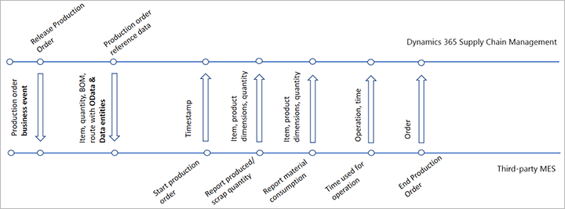

# Integrate with third-party manufacturing execution systems

[!include [banner](../includes/banner.md)]

Some manufacturing organizations that use Microsoft Dynamics 365 Supply Chain Management use the native functionality in Dynamics 365 to control their manufacturing activities for machines, equipment, and personnel. However, other manufacturing organizations, especially those that have advanced manufacturing requirements, use a third-party manufacturing execution system (MES) instead. Organizations might choose a third-party MES solution because, for example, it's specifically tailored to their vertical industry.

In the integrated solution, data exchange is fully automated and occurs in near-real time. Therefore, data is kept current in both systems, and no manual data entry is required. For example, when material consumption is registered in the MES, the integration ensures that the same consumption is also registered in Dynamics 365. Therefore, up-to-date inventory records are available to other important processes, such as planning and sales.

The solution makes it faster, easier, and cheaper for Supply Chain Management users to integrate with third-party MESs. It offers the following features:

- Business events and interfaces that support [key manufacturing execution processes](#processes-available-for-mes-integration)
- A centralized dashboard where you can track the event processing history, and troubleshoot and fix processes that fail

The following illustration shows a typical collection of business events, processes, and messages that are exchanged in an integrated solution.



## Turn on the MES integration feature

Before you can use this feature, an administrator must turn it on in your system as described in the following procedure.

1. Go to **System administration \> Setup \> License configuration**.
1. Make sure that the **Time and attendance** license key is enabled (shows a check mark). This license key is required because it controls the manufacturing execution system's functionality and data. If it isn't enabled, do the following steps:
    1. Put your system into maintenance mode, as described in [Maintenance mode](../../fin-ops-core/dev-itpro/sysadmin/maintenance-mode.md).
    1. On the **License configuration** page, select the **Time and attendance** check box.
    1. Turn off maintenance mode, as described in [Maintenance mode](../../fin-ops-core/dev-itpro/sysadmin/maintenance-mode.md)
1. Go to the **System administration \> Workspaces \> Feature management**.
1. Use the [Feature management](../../fin-ops-core/fin-ops/get-started/feature-management/feature-management-overview.md) workspace to turn on the *Manufacturing execution system integration* feature. (As of Supply Chain Management version 10.0.29, this feature is turned on by default. As of Supply Chain Management version 10.0.32, it's mandatory and can't be turned off.)

## Processes available for MES integration

You can enable any or all of the following processes for integration.

| Process name | Description |
|---|---|
| Release production orders and production order status change business events | This process provides a business event that the MES can listen to, to get information about the production orders that should be produced. Reference data that is related to the production order is expected to be shared from Supply Chain Management to the MES through Open Data Protocol (OData) or data entities. |
| Start production order | This process provides Supply Chain Management with information about production orders that are being started by using the MES. It ensures that both systems have an up-to-date view of all manufacturing activities. |
| Report produced or scrapped quantity | This process provides Supply Chain Management with information about the good and error quantities that are reported on a production job by using the MES. It ensures that shop floor supervisors have an up-to-date view of production plan progress. |
| Report material consumption | This process provides Supply Chain Management with information from the MES about the quantities of materials that are consumed. It makes up-to-date inventory records available to other important processes, such as planning and sales. |
| Report time consumed for the operation | This process provides Supply Chain Management with information about the time that is used for a specific operation. |
| End production order | This process informs Supply Chain Management that the MES has updated a production order to its final status of *Ended*. This status indicates that no more quantities will be produced on the production order. |

## Monitor incoming messages

To monitor the incoming MES messages to the system, go to **Production control \> Setup \> Manufacturing execution \> Manufacturing execution systems integration**.

All messages for a specific production order are processed in the sequence they are received. However, messages for different production orders may not be processed in the received sequence because batch jobs are processed in parallel. In case of failure, the batch job will attempt to process each message three times before setting it to *Failed* status.

The **Manufacturing execution systems integration** page works in the same way as the **Message processor messages** page and represents very similar functionality. (It even shows MES messages in addition to other types of messages.) For information about how to use either page to review messages, find and fix failed messages, and more, see [Message processor messages page](../supply-chain-dev/message-processor.md#message-processor-page)

## Call the API

To call the MES integration API, send a `POST` request to the following endpoint URL:

`/api/services/SysMessageServices/SysMessageService/SendMessage`

The body of the request that you send should resemble the following example. Replace the values for `_companyId`, `_messageType`, and `_messageContent` as required. For information about the various message types that the API supports and how to design their content, see the next section.

```json
{
    "_companyId": "USMF",
    "_messageQueue": "JmgMES3P",
    "_messageType": "ProdProductionOrderReportFinished",
    "_messageContent":
    "{\"ProductionOrderNumber\": \"P000123\", \"ReportFinishedLines\": [{\"ItemNumber\": \"A0001\", \"ReportedGoodQuantity\": 10, \"ReportAsFinishedDate\": \"2021-01-01\"}]}"
}
```

## API message types and content

This section describes each type of message that can be exchanged through the MES integration API.

### Start production order message

For the *start production order* message, the `_messageType` value is `ProdProductionOrderStart`. The following table shows the fields that this message supports.

| Field name | Status | Type |
|---|---|---|
| `ProductionOrderNumber` | Mandatory | String |
| `StartedQuantity` | Optional | Real |
| `StartedDate` | Optional | Date |
| `AutomaticBOMConsumptionRule` | Optional | Enum (FlushingPrincip \| Always \| Never) |

### Report as finished message

For the *report as finished* message, the `_messageType` value is `ProdProductionOrderReportFinished`. The following table shows the fields that this message supports.

| Field name | Status | Type |
|---|---|---|
| `ProductionOrderNumber` | Mandatory | String |
| `ReportFinishedLines` | Mandatory | A list of lines (at least one), each of which contains the payload that is described in the next table |

The following table shows the fields that each line in the `ReportFinishedLines` section of the `ProdProductionOrderReportFinished` message supports.

| Field name | Status | Type |
|---|---|---|
| `LineNumber` | Optional | Real |
| `ItemNumber` | Optional | String|
| `ProductionType` | Optional | Enum (MainItem \| Formula \| BOM \| Co_Product \| By_Product \| None), extensible |
| `ReportedErrorQuantity` | Optional | Real|
| `ReportedGoodQuantity` | Optional | Real|
| `ReportedErrorCatchWeightQuantity` | Optional | Real |
| `ReportedGoodCatchWeightQuantity` | Optional | Real |
| `AcceptError` | Optional | Enum (Yes \| No) |
| `ErrorCause` | Optional | Enum (None \| Material \| Machine \| OperatingStaff), extensible |
| `ExecutedDateTime` | Optional | DateTime |
| `ReportAsFinishedDate` | Optional | Date |
| `AutomaticBOMConsumptionRule` | Optional | Enum (FlushingPrincip \| Always \| Never) |
| `AutomaticRouteConsumptionRule` | Optional |Enum (RouteDependent \| Always \| Never) |
| `RespectFlushingPrincipleDuringOverproduction` | Optional | Enum (Yes \| No) |
| `ProductionJournalNameId` | Optional | String |
| `PickingListProductionJournalNameId` | Optional | String|
| `RouteCardProductionJournalNameId` | Optional | String |
| `FromOperationNumber` | Optional | Integer|
| `ToOperationNumber` | Optional | Integer|
| `InventoryLotId` | Optional | String |
| `BaseValue` | Optional | String |
| `EndJob` | Optional | Enum (Yes \| No) |
| `EndPickingList` | Optional | Enum (Yes \| No) |
| `EndRouteCard` | Optional | Enum (Yes \| No) |
| `PostNow` | Optional | Enum (Yes \| No) |
| `AutoUpdate` | Optional | Enum (Yes \| No) |
| `ProductColorId` | Optional | String|
| `ProductConfigurationId` | Optional | String |
| `ProductSizeId` | Optional | String |
| `ProductStyleId` | Optional | String |
| `ProductVersionId` | Optional | String |
| `ItemBatchNumber` | Optional | String |
| `ProductSerialNumber` | Optional | String |
| `LicensePlateNumber` | Optional | String |
| `InventoryStatusId` | Optional | String |
| `ProductionWarehouseId` | Optional | String |
| `ProductionSiteId` | Optional | String |
| `ProductionWarehouseLocationId` | Optional | String |
| `InventoryDimension1` to `InventoryDimension12` | Optional | String |

The 12 extensible dimensions (`InventoryDimension1` through `InventoryDimension12`) require customization and aren't always used. For more information about them, see [Add new inventory dimensions through extension](../../fin-ops-core/dev-itpro/extensibility/inventory-dimensions.md).

### Material consumption (picking list) message

For the *material consumption (picking list)* message, the `_messageType` value is `ProdProductionOrderPickingList`. The following table shows the fields that this message supports.

| Field name | Status | Type |
|---|---|---|
| `ProductionOrderNumber` | Mandatory | String |
| `JournalNameId` | Optional | String |
| `PickingListLines` | Mandatory | A list of lines (at least one), each of which contains the payload that is described in the next table |

The following table shows the fields that each line in the `PickingListLines` section of the `ProdProductionOrderPickingList` message supports.

| Field name | Status | Type |
|---|---|---|
| `ItemNumber` | Mandatory | String |
| `ConsumptionBOMQuantity` | Optional | Real |
| `ProposalBOMQuantity` | Optional | Real |
| `ScrapBOMQuantity` | Optional | Real |
| `BOMUnitSymbol` | Optional | String |
| `ConsumptionInventoryQuantity` | Optional | Real |
| `ProposalInventoryQuantity` | Optional | Real |
| `ConsumptionCatchWeightQuantity` | Optional | Real |
| `ProposalCatchWeightQuantity` | Optional | Real |
| `ConsumptionDate` | Optional | Date |
| `OperationNumber` | Optional | Integer |
| `LineNumber` | Optional | Real |
| `PositionNumber` | Optional | String |
| `IsConsumptionEnded` | Optional | Enum (Yes \| No) |
| `ErrorCause` | Optional | Enum (None \| Material \| Machine \| OperatingStaff), extensible |
| `InventoryLotId` | Optional | String |

### Time used for operation (route card) message

For the *time used for operation (route card)* message, the `_messageType` value is `ProdProductionOrderRouteCard`. The following table shows the fields that this message supports.

| Field name | Status | Type |
|---|---|---|
| `ProductionOrderNumber` | Mandatory | String |
| `JournalNameId` | Optional | String |
| `RouteCardLines` | Mandatory | A list of lines (at least one), each of which contains the payload that is described in the next table |

The following table shows the fields that each line in the `RouteCardLines` section of the `ProdProductionOrderRouteCard` message supports.

| Field name | Status | Type |
|---|---|---|
| `OperationNumber` | Mandatory | Integer |
| `OperationPriority` | Optional | Enum (Primary \| Secondary1 \| Secondary2 \| ... \| Secondary20) |
| `OperationId` | Optional | String |
| `OperationsResourceId` | Optional | String |
| `Worker` | Optional | String |
| `HoursRouteCostCategoryId` | Optional | String |
| `QuantityRouteCostCategoryId` | Optional | String |
| `HourlyRate` | Optional | Real |
| `Hours` | Optional | Real |
| `GoodQuantity` | Optional | Real |
| `ErrorQuantity` | Optional | Real |
| `CatchWeightGoodQuantity` | Optional | Real |
| `CatchWeightErrorQuantity` | Optional | Real |
| `QuantityPrice` | Optional | Real |
| `ProcessingPercentage` | Optional | Real |
| `ConsumptionDate` | Optional | Date |
| `TaskType` | Optional | Enum (QueueBefore \| Setup \| Process \| Overlap \| Transport \| QueueAfter \| Burden) |
| `ErrorCause` | Optional | Enum (None \| Material \| Machine \| OperatingStaff), extensible |
| `OperationCompleted` | Optional | Enum (Yes \| No) |
| `BOMConsumption` | Optional | Enum (Yes \| No) |
| `ReportAsFinished` | Optional | Enum (Yes \| No) |

### End production order message

For the *end production order* message, the `_messageType` value is `ProdProductionOrderEnd`. The following table shows the fields that this message supports.

| Field name | Status | Type |
|---|---|---|
| `ProductionOrderNumber` | Mandatory | String |
| `ExecutedDateTime` | Optional | DateTime |
| `EndedDate` | Optional | Date |
| `UseTimeAndAttendanceCost` | Optional | Enum (Yes \| No) |
| `AutoReportAsFinished` | Optional | Enum (Yes \| No) |
| `AutoUpdate` | Optional | Enum (Yes \| No) |

## Other production information

The messages support actions or events that happen on the shop floor. They are processed using the MES integration framework described in this article. The design assumes that other reference information to be shared with the MES (such as product-related information, or the bill of materials or route (with its specific setup and configuration times) used in a specific production order) will be retrieved from the system using [data entities](../../fin-ops-core/dev-itpro/data-entities/data-entities-data-packages.md#data-entities) via file transfer or OData.

## Receive feedback about the state of a message

After the MES has sent a message to Supply Chain Management, it might be relevant for Supply Chain Management to return feedback about the state of the message. Here are some examples of cases where this behavior might be relevant:

- There is no person who is responsible for constantly supervising the MES integration.
- The person who is responsible for supervising the MES integration wants to be notified by email when a message fails, so that they know that they have to take action.
- The MES must show an error message to inform the shop floor operator or somebody from the IT department that they have to take action.
- The MES must recalculate the order schedule after it receives a failure message (for example, because a production order failed to start).

In these cases, you can take advantage of the standard alert feature in Supply Chain Management. For information about how standard alerts work, see the following resources:

- Help article: [Alerts overview](../../fin-ops-core/fin-ops/get-started/alerts-overview.md)
- Video: [Alert rule options in finance and operations](https://www.youtube.com/watch?v=cpzimwOjicM&ab_channel=MicrosoftDynamics365)

For example, you might set up the following alerts to provide feedback about the state of a message:

- Create a business event ("Send externally") that is used when a message is *Failed*.
- Send a notification and email to the IT admin or production floor manager.

