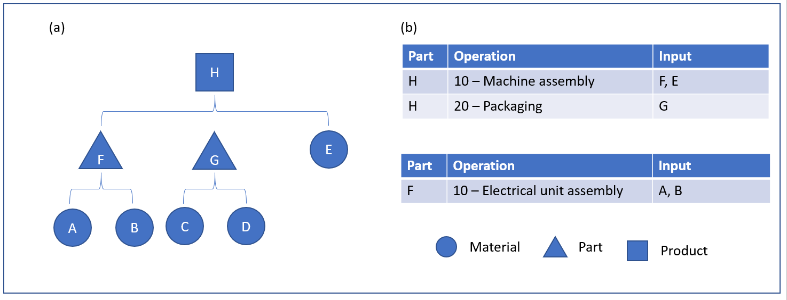
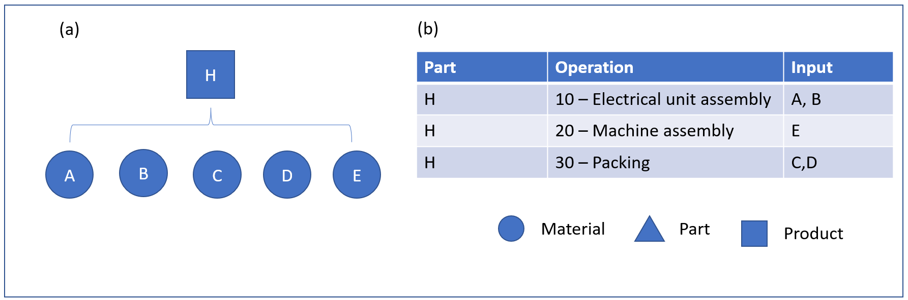
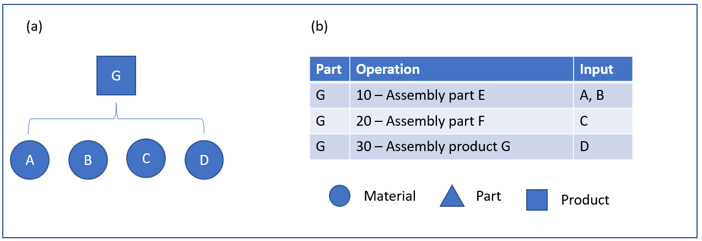
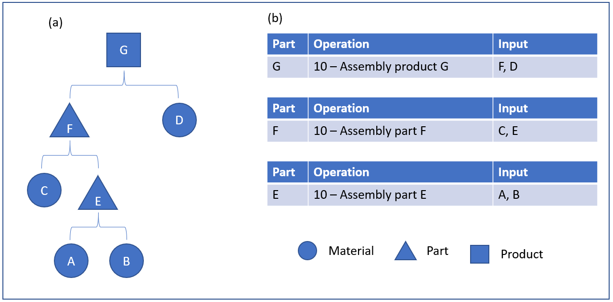
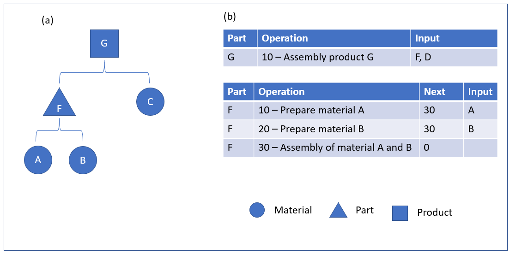
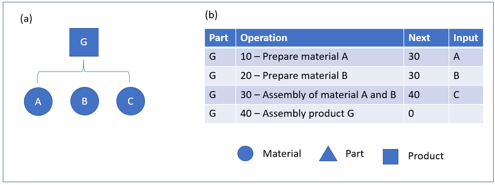

---
# required metadata

title: Phantom items
description: This topic describes, in detail, how the Phantom line type can be used for the lines of a bill of materials (BOM) and a formula in Dynamics 365 Supply Chain Management.
author: johanhoffmann
ms.date: 06/15/2018
ms.topic: article
ms.prod: 
ms.technology: 

# optional metadata

ms.search.form: SysOperationTemplateForm   
audience: Application User
# ms.devlang: 
ms.reviewer: kamaybac
# ms.tgt_pltfrm: 
ms.custom: 1705903
ms.search.region: Global
# ms.search.industry: 
ms.author: johanho
ms.search.validfrom: 
ms.dyn365.ops.version: 8.1
---

# Phantom items

[!include [banner](../includes/banner.md)]

This topic describes, in detail, how the Phantom line type can be used for the lines of a bill of materials (BOM) and a formula.

In the following illustration, (a) is the BOM for product H and parts F and G, and (b) is the route sheet for products H and part F.

This illustration shows an example of a BOM structure in two levels. Finished product H represents a product for a machine assembly. The machine assembly consists of two parts, an electrical unit (F) that has two materials (A and B) and a group of packaging materials (G) that also has two materials (C and D). Another material (E) is used during the general assembly of the machine.

The preceding illustration represents the Engineering BOM for product H. This structure provides a good overview of the parts and components of the overall machine assembly. However, although product designers might prefer to see the BOM represented in this way, this structure might not correctly represent the way that the machine is built on the shop floor.

For example, the Engineering BOM in the preceding illustration indicates that electrical unit F is assembled as a separate part on a separate work order. However, on the shop floor, it might be judged more optimal to assemble the electrical unit as part of the overall machine assembly, not as a separate work order.

This Engineering BOM also indicates that part G is a separate part. However, in this structure, part G doesn’t represent a physical part but a collection of packaging materials.

Therefore, although an Engineering BOM provides great value for the design of a product and maintenance of that design, it might not be the most logical way to support the manufacturing execution process of the product. By contrast, a Manufacturing BOM represents the best way to build a product.

The following illustration shows how the preceding Engineering BOM is transitioned into a Manufacturing BOM. In this illustration, (a) is the BOM for product H, and b is the route sheet for product H.

In this structure, you can see that there is no notion of parts F and G, and the materials that these parts consist of have been elevated to the next BOM level.

Unlike the Engineering BOM, which had two operations sheets, the Manufacturing BOM has only one operations sheet. The packaging operation that was linked to part G has also been elevated and is now part of the operations sheet for product H. The assembly of the electrical unit is the first operation. This order makes good sense, because this unit is used in the next operation, which is the machine assembly. The last operation is the packaging operation, which consumes two packing materials (C and D).

The transition between the Engineering BOM and the Manufacturing BOM is enabled through the Phantom BOM line type. As the term “phantom” indicates, parts F and G have disappeared during the transition between the two BOM types. In this example, the Phantom line type is applied to the BOM lines for parts F and G in the Engineering BOM. When a production or batch order is created, the Engineering BOM is copied to the production or batch order. Then, when the order is estimated, the transition from the Engineering BOM to the Manufacturing BOM occurs, as shown in the preceding illustrations. From the operations sheet in the second illustration, packaging materials C and D are input for the operation.

## Multilevel phantom BOM structures

The Phantom line type can be used in multilevel BOM structures, as shown in the following illustration. In this illustration, (a) is the BOM for product G, and (b) is the route sheet for parts E and F and product G.

The following illustration shows the resulting Manufacturing BOM and route sheet if the BOM lines for parts E and F are configured so that the line type is Phantom. In this illustration, (a) is the BOM for product G, and (b) is the route sheet for product G.

## Phantom and route network

Phantom BOMs can also be used for a BOM that has a route network. In a route network, one or more operations run in parallel. The following illustration shows an example of a route network that is used in a multilevel BOM. In this illustration, (a) is the BOM for product G and part F, and (b) is the route sheet for product G and part F, which has a route network.

In the following illustration, (a) is the BOM for product G and part F, and (b) is the route sheet for product G and part F.

[!INCLUDE[footer-include](../../includes/footer-banner.md)]