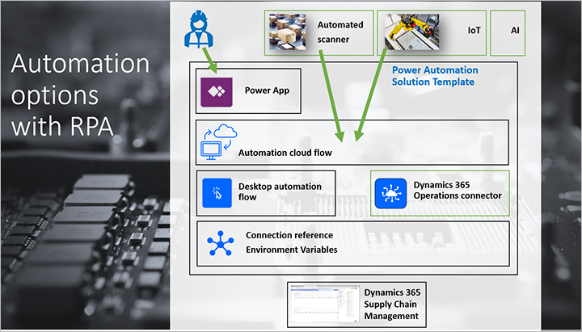
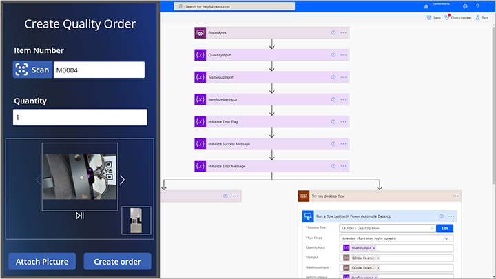

# Invoke process automation flows to create quality orders

[!include [banner](../includes/banner.md)]

Organizations have an increasing demand to automate standard business processes, provide more convenient interactions to the staff, and utilize various data signals and systems to drive business processes automatically. With robotic process automation (RPA) and Microsoft Power Automate, businesses can use a no-code experience to automate repetitive processes, thus gaining efficiency and accuracy.

The downloadable automation solution template for Supply Chain Management showcases how Power Automate can be used to automate business processes using quality orders as an example.

You can download the automation solution template [here](https://aka.ms/D365SCMQualityOrderRPASolution).

For an overview of this feature and its capabilities, see the following video: [Utilize RPA to create quality orders in Dynamics 365 Supply Chain Management](https://www.youtube.com/watch?v=LFbzJ6-H89w)

The Power Automate solution template includes a cloud automation flow and a desktop automation flow that automate the creation of quality orders in Supply Chain Management.

The automation can be started in response to many events and signals, including user input or machine signals (including the Internet of Things (IoT)). The *Q-Order* Power Application example is included in the solution template. It allows the user to scan an item QR code, enter quantity, and attach pictures using a camera.

Solution parameters are included to configure the automation for a specific use case in a production facility.

For a complete step-by-step guide about how to download, install, and use the sample solution for automating quality order creation, see [Automate quality order creation on Dynamics 365 Supply Chain Management with Robotic Process Automation using Power Automate Desktop](/power-automate/desktop-flows/dynamics365-scm-rpa).

