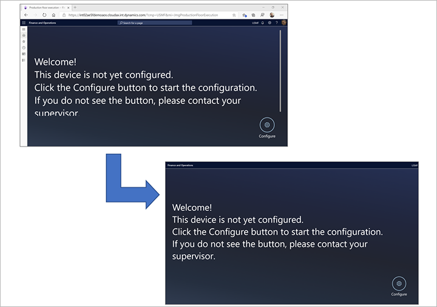

# Set up a device to run the production floor execution interface

[!include [banner](../includes/banner.md)]

The production floor execution interface is set up for every device on the production floor. Companies typically set up each device differently, depending on the purpose that the device serves. For example, a company might have one device in the reception area, where workers clock in and clock out, and another on the shop floor, where workers manage their jobs.

## Set the configuration and filters for a specific device

To set the configuration and job filters for a device, sign in to the **Production floor execution** page by using an account that has a security role that includes the *Maintain time supervision* duty. (Among the out-of-box security roles, only *Shop floor supervisor* has this duty.) Then follow these steps.

1. Go to the device that you want to set up, and sign in to Microsoft Dynamics 365 Supply Chain Management as a shop floor supervisor. (Use an account that includes the *Maintain time supervision* duty.)
1. Make sure that a configuration is available for the device that you're setting up. If no configuration already exists, a default configuration is provided. For more information about how to set up a configuration, see [Configure the production floor execution interface](production-floor-execution-configure.md).
1. Go to **Production control \> Manufacturing execution \> Production floor execution**.

    If the production floor execution interface has already been configured at least one time on the current device, a sign-in page appears. Otherwise, a welcome page appears.

1. On either the sign-in page or the welcome page, select **Configure**.
1. Select a configuration in the list.
1. Select **Next**.
1. Select one or more filters to apply to the current device. These filters will help ensure that only relevant jobs are shown on the device. To set a filter, select the filter type to open a list of values, and then select the value to filter on. The following filters are available:

    - **Production unit** – This filter is the highest-level filter. It typically refers to a large work area that has several resource groups and individual resources in it.
    - **Resource group** – This filter is a mid-level filter. It typically refers to a collection of related resources in a limited area of the workspace. If you select a **Production unit** filter first, the list of resource groups shows only groups from that unit. Otherwise, it shows all available resource groups.
    - **Resource** – This filter is the most specific filter. It typically refers to a specific machine or other single resource. If you select a **Resource group** and/or **Production unit** filter first, the list of resources shows only resources from that group and/or unit. Otherwise, it shows all available resources.

1. Select **OK**.
1. The sign-in page appears, and your device is ready for use.

## Allow a worker to override the default filters

You can give specific workers permission to change the filter settings on any device that they use. For workers who have this permission, the production floor execution interface provides a **Filter** button on the **All jobs** and **Active job** pages.

> [!NOTE]
> If a worker changes a filter, the new filter applies from that point forward, for all users who sign in to the device.

To allow a worker to override the default job filters that have been set up for a device, follow these steps.

1. Go to **Time and attendance \> Setup \> Time registration workers**.
1. Select a worker in the list to open that worker's **Time registration workers** page.
1. On the **Time registration** tab, set the **Set filters** option to *Yes*.

For more information about how to set up worker accounts to access the production floor execution interface, see [Set up worker accounts to use the production floor execution interface](production-floor-execution-worker-accounts.md).

## Run the interface in full-screen mode

Often, you will run the production floor execution interface on a device that is used exclusively for that purpose. Therefore, it might make sense to run the interface in full-screen mode, without showing any navigation and/or browser chrome.

- To hide the navigation pane that is shown in Supply Chain Management, add the following text to the end of the URL in the browser's address bar: `\&limitednav=true`.
- To also hide the browser's address bar, use the browser's native full-screen mode. (For instructions, see your browser's documentation.)

The upper part of the following illustration shows how the interface looks by default. The lower part shows how it looks in full-screen mode when the navigation pane is hidden.

## Extend the session past 12 hours

By default, the production floor execution interface automatically signs out if nobody uses it for 12 hours. A Supply Chain Management user must then sign in again. However, you can extend the time-out limit to up to 90 days.

To extend the time-out limit, sign in to Supply Chain Management, and go to **System administration \> Users \> Session extensions**. Specify the Supply Chain Management user account that is used to sign in to the device, and the number of hours that the session should stay active for.

[!INCLUDE[footer-include](../../includes/footer-banner.md)]
