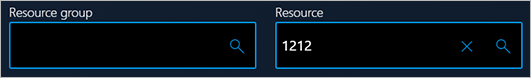

---
# required metadata

title: User interface control styles for production floor execution
description: The topic explains how to configure form controls so that the default production floor execution styles are applied to them.
author: inkharki
ms.date: 02/22/2021
ms.topic: article
ms.service: dynamics-365-supply-chain
ms.prod:
ms.technology:

# optional metadata

audience: Developer
ms.reviewer: kamaybac
ms.search.region: Global
ms.author: inkharki
ms.search.validFrom: 2021-02-22
ms.dyn365.ops.version: Release 10.0.15
---

# User interface control styles for production floor execution

[!include [banner](../includes/banner.md)]

The topic explains how to configure form controls so that the default production floor execution styles are applied to them.

## Grid

Styles are automatically applied. No specific configuration is required.

## Card view

Styles can be applied to card view controls only if the following requirements are met:

+ Each card view is contained in a form group.
+ The group name starts with **CardGroup** (for example, **CardGroupJobsView**).

The following illustration shows a card view that has no controls inside it.


The following illustrations show card views that have controls inside them.


## Business card

Styles can be applied to business card controls only if the following requirements are met:

+ Each business card is contained in a form group.
+ The group name starts with **BusinessCardGroup** (for example, **BusinessCardGroupJobsList**).

Set the following properties on the business card:

- **Style**: **list**
- **Extended style**: **cardList**
- **Multi Select**: **No**
- **Show Col Labels**: **No**


## Radio button

Styles can be applied to radio buttons only if the following requirements are met:

+ Each radio button is contained in a form group.
+ The group name starts with **RadioTextBelow** or **RadioTextRight**, depending on where you want the text to appear.

Set the following properties on the radio button:

- **Toggle button**: **Check**
- **Toggle value**: **On** if the radio button should be selected; otherwise, **Off**

The following illustration shows an example where the text appears below the radio buttons.


The following illustration shows an example where the text appears to the right of the radio buttons.


### Radio buttons in Internet Explorer

Radio button styles aren't supported in Internet Explorer. The following illustration shows what radio buttons look like in Internet Explorer.


## Buttons

Styles can be applied to buttons only if the following requirements are met:

+ Each group of buttons is contained in a form group. All the buttons in the group will have the same style.
+ There are no requirements about the name of the group.

Set the following properties on the buttons:

- **Button Display**: **TextWithImageLeft**.
- **Normal Image**: This property can't be blank. For example, use **CoffeeScript**.
- **Text**: This property can't be blank. For example, use **Start Break**.
- **Width**: **Auto**.
- **Height**: **Auto**.

### Primary button

Styles can be applied to a primary button only if the following requirements are met:

+ The button is contained in a form group.
+ The group name starts with **DefaultButtonGroup** or **PrimaryButtonGroup** (for example, **DefaultButtonGroup10**).


### Secondary button

Styles can be applied to a secondary button only if the following requirements are met:

+ The button is contained in a form group.
+ The group is named **Right panel**, or the group name starts with **SecondaryButtonGroup**.


### Third-group button

Styles can be applied to a third-group button only if the following requirements are met:

+ The button is contained in a form group.
+ The group is named **Left panel**, or the group name starts with **ThirdButtonGroup**.


### Fourth-group button

Styles can be applied to a fourth-group button only if the following requirements are met:

+ The button is contained in a form group.
+ The group name starts with **FourthButtonGroup**.

Set the following properties on the button:

- **Button Display**: **TextOnly**.
- **Normal Image**: This property must be blank.
- **Text**: This property can't be blank. For example, use **View** or **Edit**.
- **Width**: **Auto**.
- **Height**: **Auto**.


### Flat button

Styles can be applied to a flat button only if the following requirements are met:

+ The button is contained in a form group.
+ The group name starts with **FlatButtonGroup**.

Set the following properties on the button:

- **Button Display**: **ImageOnly**.
- **Normal Image**: This property can't be blank. For example, use **CoffeeScript**.
- **Text**: This property must be blank.
- **Width**: **Auto**.
- **Height**: **Auto**.


## Combo box

A combo box is a combination of three controls: an input control, a button that clears the input control, and a button that runs a search.

Styles can be applied to a combo box only if the following requirements are met:

+ The combo box is contained in a form group.
+ The group name starts with **Combobox**.
+ Inside the group, the first control is an **AxFormStringControl** control. This control shows the current value, and it's where the user enters the required value.
+ The second control is a **CommonButton** control, and its name starts with **ClearButton**. This button must contain code that uses the **enable** property to show or hide the button. For example, to show or hide the **Clear** button while the user is typing information in the input control, you can use the following code.

    ```xpp
    public void textChange()
    {
        super();
        ClearButtonSerial.enabled(this.text()? true : false);
    }
    ```

    You should have one method where the data is set in the input control. Enable the **Clear** button in that method. Here is an example.

    ```xpp
    public void setSerialId(str _serialId)
    {
        JmgTmpJobBundleProdFeedback.InventSerial = _serialId;
        ClearButtonSerial.enabled(_serialId? true : false);

        if (_serialId)
        {
            this.addSerialNumber();
        }
    }
    ```

    Use the following code for the **clicked** method of the **Clear** button.

    ```xpp
    public void clicked()
    {
        element.setSerialId('');
        InventSerialId.setFocus(); // set focus back to the input box
    }
    ```

    Set the value of the input control, **AxFormStringControl**, when the form is initialized by using the **init** method. If the value isn't blank, enable the **Clear** button. If the value is blank, disable the **Clear** button.

+ The third control is a **CommonButton** control, and its name starts with **SearchButton**.

The following illustration shows two combo box controls. The combo box on the left has an empty text box, and the **Clear** button is disabled. The combo box on the right has text in the text box, and the **Clear** button is enabled.



## Dialog

Styles can be applied to a form or dialog only if the following requirements are met:

+ If the form or dialog must follow RAF/Scrap design guidelines, then the name must start with **JmgProductionFloorExecutionCustomInputDialog**.
+ The form or dialog may contain a detail form part. To apply styles to the detail form part, the name must start with **JmgProductionFloorExecutionCustomDetailsDialog**.
+ If the form or dialog must have a simple view, then the name must start with **JmgProductionFloorExecutionCustomDialog**.
+ All the controls in the dialog must be configured as described in this topic.

Styles can be applied to the **OK** button in a dialog only if the following requirements are met:

+ The button is contained in a form group.
+ The group name starts with **OkButtonGroup**.

Styles can be applied to the **Cancel** button in a dialog only if the following requirements are met:

+ The button is contained in a form group.
+ The group name starts with **CancelButtonGroup**.

[!INCLUDE[footer-include](../../includes/footer-banner.md)]
