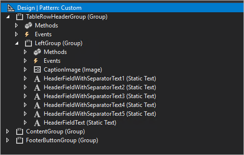
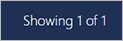
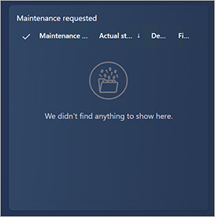
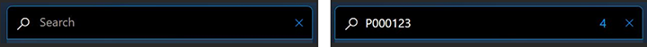
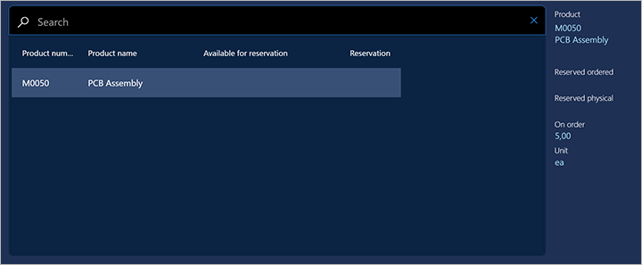
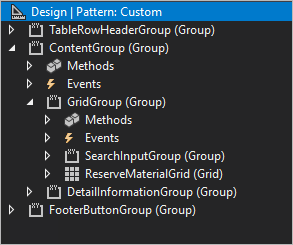

# Style the production floor execution interface

[!include [banner](../includes/banner.md)]

The topic explains how to configure form controls so that the default production floor execution styles are applied to them.

## Forms and dialogs

Styles can be applied to a form or dialog only if the following requirements are met:

- If the form should resemble the existing report progress form, the name of your form or dialog must start with `JmgProductionFloorExecutionCustomInputDialog`.
- The form or dialog can contain a detail form part. To apply styles to it, the name of the detail form part must start with `JmgProductionFloorExecutionCustomDetailsDialog`.
- If the form or dialog should have a simple view, then the name of the simple view must start with `JmgProductionFloorExecutionCustomDialog`. Examples of forms that have a simple view include the start form and the indirect activity form.
- All the controls in the dialog must be configured as described in this topic.

> [!IMPORTANT]
> The features mentioned in the first two bullet points of this list require Supply Chain Management version 10.0.19 or later.

Styles can be applied to the **OK** button in a dialog only if the following requirements are met:

- The button is contained in a form group.
- The group name starts with `OkButtonGroup`.

Styles can be applied to the **Cancel** button in a dialog box only if the following requirements are met:

- The button is contained in a form group.
- The group name starts with `CancelButtonGroup`.

### Header

The following illustration shows a typical form or dialog header.


In Visual Studio, headers are created by using a structure such as the one that is shown in the following illustration.



To add text to your header, use code such as the following example.

```xpp
private void setCaption()
{
    HeaderFieldWithSeparatorText1.text("Report Progress");
    HeaderFieldWithSeparatorText2.text(ProdId);

    …

    HeaderFieldText.text(OprNum);
}
```

When you write your header code, apply the following rules:

- The name of main group must be `TableRowHeaderGroup`.
- Each block of text (separated by bullets) must start with `HeaderFieldWithSeparatorText`.
- The last text name must start with `HeaderFieldText`.
- `CaptionImage` can be skipped.

### Progress indicator

You can include a progress indicator, which is shown to the right of the header. The following illustration shows a progress indicator.



To show the progress indicator, the text field must be named `ShowProgress`.

## Grid

Styles are automatically applied. No specific configuration is required.

The grid should have a `TabularView` style, and the `run()` method on the custom form must be overwritten, because a new grid isn't yet supported. Add the following code.

```xpp
public void run()
{
    super();
    // To opt out a page from the new grid
    this.forceLegacyGrid();
}
```

To refresh data in a main view, you might want to use something like `this.parmParentForm().updateLayout();` in a `click` method of your action. (For an example, look at the `JmgProductionFloorExecutionReportFeedbackAction` class.) Just make sure that `parmDataSource` is set in the `init` method of your new form (`formCaller.parmDataSource(this.dataSource(1));`). For an example, look at the `JmgProductionFloorExecutionMainGrid` form.

## Card view

Styles can be applied to card view controls only if the following requirements are met:

- Each card view is contained in a form group.
- The group name starts with `CardGroup` (for example, `CardGroupJobsView`).

The following illustration shows a card view that has no controls inside it.


The following illustrations show card views that have controls inside them.




## Business card

Styles can be applied to business card controls only if the following requirements are met:

- Each business card is contained in a form group.
- The group name starts with `BusinessCardGroup` (for example, `BusinessCardGroupJobsList`).

Set the following properties on the business card:

- **Style:** *list*
- **Extended style:** *cardList*
- **Multi Select:** *No*
- **Show Col Labels:** *No*


## Radio button

Styles can be applied to radio buttons only if the following requirements are met:

- Each radio button is contained in a form group.
- The group name starts with `RadioTextBelow` or `RadioTextRight`, depending on where you want the text to appear.

Set the following properties on the radio button:

- **Toggle button:** *Check*
- **Toggle value:** *On* if the radio button should be selected; otherwise, *Off*

The following illustration shows an example where the text appears below the radio buttons.


The following illustration shows an example where the text appears to the right of the radio buttons.


### Radio buttons in Internet Explorer

Radio button styles aren't supported in Internet Explorer. The following illustration shows what radio buttons look like in Internet Explorer.


## Buttons

Styles can be applied to buttons only if the following requirements are met:

- Each group of buttons is contained in a form group. All the buttons in the group will have the same style.
- There are no requirements about the name of the group.

Set the following properties on the buttons:

- **Button Display:** *TextWithImageLeft*
- **Normal Image:** This property can't be blank. For example, use *CoffeeScript*.
- **Text:** This property can't be blank. For example, use *Start Break*.
- **Width:** *Auto* or *SizeToContent*
- **Height:** *Auto* or *SizeToContent*

### Primary button

Styles can be applied to a primary button only if the following requirements are met:

- The button is contained in a form group.
- The group name starts with `DefaultButtonGroup` or `PrimaryButtonGroup` (for example, `DefaultButtonGroup10`).


### Secondary button

Styles can be applied to a secondary button only if the following requirements are met:

- The button is contained in a form group.
- The group is named **Right panel**, or the group name starts with `SecondaryButtonGroup`.


### Third-group button

Styles can be applied to a third-group button only if the following requirements are met:

- The button is contained in a form group.
- The group is named **Left panel**, or the group name starts with `ThirdButtonGroup`.


### Fourth-group button

Styles can be applied to a fourth-group button only if the following requirements are met:

- The button is contained in a form group.
- The group name starts with `FourthButtonGroup`.

Set the following properties on the button:

- **Button Display:** *TextOnly*
- **Normal Image:** This property must be blank.
- **Text:** This property can't be blank. For example, use *View* or *Edit*.
- **Width:** *Auto*
- **Height:** *Auto*


### Flat button

Styles can be applied to a flat button only if the following requirements are met:

- The button is contained in a form group.
- The group name starts with `FlatButtonGroup`.

Set the following properties on the button:

- **Button Display:** *ImageOnly*
- **Normal Image:** This property can't be blank. For example, use *CoffeeScript*.
- **Text:** This property must be blank.
- **Width:** *Auto* or *SizeToContent*
- **Height:** *Auto* or *SizeToContent*


### Continue button

Styles can be applied to a continue button only if the following requirements are met:

- The button is contained in a form group.
- The group name starts with `ContinueButtonGroup`.

Set the following properties on the button:

- **Button Display:** *ImageOnly*
- **Normal Image:** *Forward*
- **Text:** This property must be blank.
- **Width:** *Auto* or *SizeToContent*
- **Height:** *Auto* or *SizeToContent*


## Combo box

A combo box is a combination of three controls: an input control, a button that clears the input control, and a button that runs a search.

Styles can be applied to a combo box only if the following requirements are met:

- The combo box is contained in a form group.
- The group name starts with `Combobox`.
- Inside the group, the first control is an `AxFormStringControl` control. This control shows the current value, and it's where the user enters the required value.
- The second control is a `CommonButton` control, and its name starts with `ClearButton`. This button must contain code that uses the `enable` property to show or hide the button. For example, to show or hide the **Clear** button while the user is typing information in the input control, you can use the following code.

    ```xpp
    public void textChange()
    {
        super();
        ClearButtonSerial.enabled(this.text()? true : false);
    }
    ```

    You should have one method where the data is set in the input control. Enable the **Clear** button in that method. Here is an example.

    ```xpp
    public void setSerialId(str _serialId)
    {
        JmgTmpJobBundleProdFeedback.InventSerial = _serialId;
        ClearButtonSerial.enabled(_serialId? true : false);

        if (_serialId)
        {
            this.addSerialNumber();
        }
    }
    ```

    Use the following code for the `clicked` method of the **Clear** button.

    ```xpp
    public void clicked()
    {
        element.setSerialId('');
        InventSerialId.setFocus(); // set focus back to the input box
    }
    ```

    Set the value of the input control, `AxFormStringControl`, when the form is initialized by using the `init` method. If the value isn't blank, enable the **Clear** button. If the value is blank, disable the **Clear** button.

- The third control is a `CommonButton` control, and its name starts with `SearchButton`.

The following illustration shows two combo box controls. The combo box on the left has an empty text box, and the **Clear** button is disabled. The combo box on the right has text in the text box, and the **Clear** button is enabled.


## Quick filter

The quick filter control adds a search field to the page. You can apply styles to a quick filter provided the following requirements are met:

- The quick filter is contained in a form group.
- The group name starts with `SearchInputGroup`.
- Inside the group, the first control is a `QuickFilter` control. (This control is where the user enters the search string.)
- The second control is a `FormStaticTextControl` that is named `NumberOfResults`. (This control is optional. If it's included, it shows the number of found items.)
- The third control is a `CommonButton` control, and its name starts with `ClearButton`.

The following illustration shows two quick filter controls. The quick filter on the left has an empty quick filter, and the number of results isn't visible. The quick filter on the right contains a search string and shows the number of results.



## Center-align elements on a tab

To align elements in the center of a tab, the group name must start with `TabContentGroup`, and the group must have the following properties:

- **Width Mode:** `SizeToAvailable`
- **Height Mode:** `SizeToAvailable`

## Align a grid, detail part, and quick filter

To arrange a customized grid, detail part, and quick filter so that they resemble the standard design, keep the following points in mind when you put them all together:

- If the grid has a quick filter, both the grid and the quick filter should be inside the group that has a name that starts with `GridGroup`.
- To apply styles to a detail part, the group name must start with `DetailInformationGroup`,

The following illustration shows a typical grid that includes a quick filter and a detail part on the right.



In Visual Studio, a grid, detail part, and quick filter can be created by using a structure such as the one that is shown in the following illustration.



## Additional resources

- [Customize the production floor execution interface](production-floor-execution-customize.md)
- [Design the production floor execution interface](production-floor-execution-tabs.md)

[!INCLUDE[footer-include](../../includes/footer-banner.md)]
