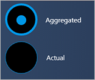
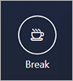

---
# required metadata

title: User interface control styles for production floor execution
description: This topic contains the requirements through which the different form controls can automatically pick up the default Production Floor Execution styles. 
author: TBD
manager: tfehr
ms.date: 02/22/2021
ms.topic: article
ms.prod: 
ms.technology: 

# optional metadata

audience: Developer
ms.reviewer: kamaybac
ms.search.region: Global
ms.author: inkharki
ms.search.validFrom: 2021-02-22
ms.dyn365.ops.version: Release 10.0.15
---

# User interface control styles for production floor execution

[!include [banner](../includes/banner.md)]

[!include [preview banner](../includes/preview-banner.md)]

This topic contains the requirements through which the different form controls can automatically pick up the default Production Floor Execution styles. 

# Grid 

Styles are applied automatically.

# Card view 

Each card view should be nested inside a form group. Requirements:

+ The group name should start with **CardGroup**, for example, **CardGroupJobsView**. 

An example the card view without elements inside: 

An example the card view with elements inside: 

# Business card  

Each business card should be nested inside a form group. Requirements:

+ The group name should start with **BusinessCardGroup**, for example, **BusinessCardGroupJobsList**.
+ The grid should have the following setup: 

    - Style: list 
    - Extended style: cardList 
    - Multi Select: No 
    - Show Col Labels: No 

## Radio button (notice it is not supported by IE) 

Radio buttons are not supported in Internet Explorer.

Implementing a radio button has the following requirements. 

+ Command Buttons should be added with the following setup: 

    - Toggle button: Check 
    - Toggle value: On if radio button should be selected; otherwise, Off. 
    - All command buttons should be placed in a group the name which starts from: "RadioTextBelow" or "RadioTextRight" accordingly. 

Radio text below 

Radio text right 

In Internet Explorer, the radio buttons look like:

## Buttons

All buttons, in order to be styled similarly to the default Production Floor Execution buttons are required to : 

+ Button should have the next property: 

    - Button Display set to TextWithImageLeft 
    - Normal Image should not be empty. For ex: CoffeeScript 
    - Text should not be empty. For ex: Start Break 
    - Width and Height set to Auto 

Each group of buttons should be nested inside a form group. All buttons within each group will have the same styles. 

## Primary button 

In order to highlight a button, it should be located inside group which has "DefaultButtonGroup" or  PrimaryButtonGroup"  in its name (for ex: DefaultButtonGroup10) : 

## Secondary button 

Buttons inside groups with the following names : exactly "Right panel" or starts with "SecondaryButtonGroup" have the following styles :  

 
## Tertiary button 

Buttons inside groups with the following names : exactly "Left panel" or starts with "ThirdButtonGroup" have the following styles :  

 
## Quaternary button

Buttons inside groups with the following names : starts with "FourthButtonGroup". 

Property setup: 

    - Button Display set to TextOnly 
    - Normal Image should be empty. 
    - Text should not be empty. For ex: View or edit 
    - Width and Height set to Auto 

# FlatButtonGroup 

  

Buttons inside groups with the following names : starts with "FlatButtonGroup" have the following styles : 

Property setup: 

Button Display set to ImageOnly 

Normal Image should not be empty. For ex: CoffeeScript 

Text should be empty.  

Width and Height set to Auto 

  

  

 

  

  

    

  

  

  

Combobox 

Each combobox should be nested inside a form group. Requirements : 

a)The name of the group should start with "Combobox".  

b)Inside the group, the first control should be an AxFormStringControl which will be used as the display of the current value as well as the box where the user can type the required value. 

c)The second control should be a CommonButton control. The name should start with "ClearButton". 

 Note : this element must contain the logic below. In order to hide/show button the enable property should be used. 

Example: 

In order to hide/show the clear button when the user is typing information into the input field, the following code should be used: 

public void textChange() 

        { 

            super(); 

  

            ClearButtonSerial.enabled(this.text()? true : false); 

        } 

It is preferable to have one method where the data is set into the input box and add enabling Clear button there. Example: 

public void setSerialId(str _serialId) 

    { 

        JmgTmpJobBundleProdFeedback.InventSerial = _serialId; 

        ClearButtonSerial.enabled(_serialId? true : false); 

  

        if (_serialId) 

        { 

            this.addSerialNumber(); 

        } 

    } 

Then you can use the following code for the clear button clicked method : 

 public void clicked() 

        { 

            element.setSerialId(''); 

            InventSerialId.setFocus(); // set focus back to the input box 

        } 

Remember to use the method of setting value into the input box for combobox when the form is initialized (method init). If value is set - clear button should be enabled, otherwise disabled.  

  

d)The third control should be a CommonButton control. The name should start with "SearchButton". 

  

The result should look like this : 

 

  

Dialogs 

  

The styles for all the above controls keep the same rules when included in a dialog form as long as the name of the dialog form starts with "JmgProductionFloorExecutionDialog". 

In order to apply the correct style for the ok and cancel buttons : 

Ok button. It should be located in a group with name="OkButtonGroup" 

Cancel button. It should be located in a group with name="CancelButtonGroup" 

 
