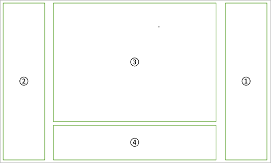
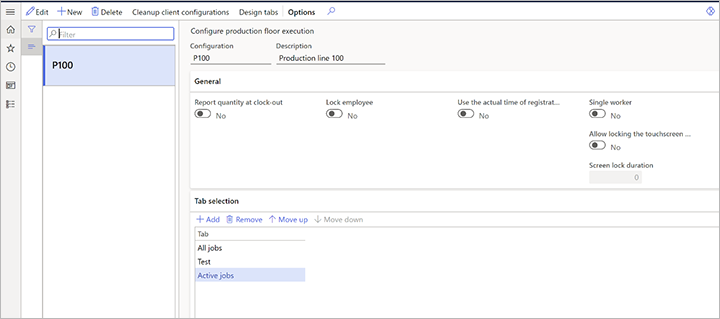

---
# required metadata

title: Design the content of the production floor execution interface
description: This topic describes how to design the content of the user interface for each configuration.
author: johanhoffmann
manager: tfehr
ms.date: 12/01/2020
ms.topic: article
ms.prod: 
ms.service: dynamics-ax-applications
ms.technology: 

# optional metadata

# ms.search.form:  [Operations AOT form name to tie this topic to]
audience: Application User
# ms.devlang: 
ms.reviewer: kamaybac
ms.search.scope:  Core, Operations
# ms.tgt_pltfrm: 
# ms.custom: [used by loc for topics migrated from the wiki]
ms.search.region: Global
# ms.search.industry: [leave blank for most, retail, public sector]
ms.author: johanho
ms.search.validFrom: 2020-12-01
ms.dyn365.ops.version: Release 10.0.16
---

# Design the content of the production floor execution interface

[!include [banner](../includes/banner.md)]
[!include [preview banner](../includes/preview-banner.md)]

You can design the content of the user interface for each configuration used by the production floor execution interface. For example, workers in one work cell might need to be able to open job instructions on the production floor, while in another work cell, instructions are not needed. In that case, two configurations should be created, one with a button for opening document attachments and one without this button.

## Design a tab

On the **Configure production floor execution** page, you can create and configure tabs by selecting **Design tabs** on the Action Pane.

Each tab is divided into four sections, as shown in the following illustration.

The following elements are shown in the illustration:

1. Primary toolbar
1. Secondary toolbar
1. Main view
1. Detailed view

To create and configure a new tab, follow these steps:

1. Go to **Production control &gt; Setup &gt; Manufacturing execution**.

1. Select **Design tabs** on the Action Pane to open the **Design tabs** page.

    

1. Select **New** on the Action Pane.

1. Make the following settings in the header of the page:

    - **Tab name** - Specify a name for the tab.
    - **Main view** - Select between the two pre-defined job lists (*Active jobs* or*All jobs*).
    - **Details view** - Select between a blank value or *Job details***.** If you select the blank value, there will be no detailed view in the tab. If you select **Job details**, the detailed view will contain a detailed description of the job selected in the job list in the main view.

1. In the **Primary toolbar** section, choose which buttons should be available in the primary toolbar. The **Available actions co**lumn shows a list of all the buttons can be added. The **Selected actions** columns shows a list of all the buttons that are included in the current configuration. Use the buttons between the columns to move selected items between the columns as needed. Use the up and down buttons next to the **Selected actions** column to control in which the buttons are presented in the user interface.

1. In the **Secondary** **toolbar** section, choose which buttons should be available in the secondary toolbar. The **Available actions co**lumn shows a list of all the buttons can be added. The **Selected actions** columns shows a list of all the buttons that are included in the current configuration. Use the buttons between the columns to move selected items between the columns as needed. Use the up and down buttons next to the **Selected actions** column to control in which the buttons are presented in the user interface.

## Associate a tab with a configuration

When you designed all the tabs you need, you can associate them with a configuration.

1. Go to **Production control &gt; Setup &gt; Configure production floor execution**.

    

1. On the **Tab selection** FastTab toolbar, select **Add**.

1. A new row is added to the grid. For this new row, select the name of a tab you want to add to the configuration.

1. Continue to add additional tabs as needed.

1. Use the **Move up** and **Move down** buttons on the toolbar to arrange the tabs as needed. The tabs will be displayed from left to right in the order shown here (the tab at the top is shown on the left).
