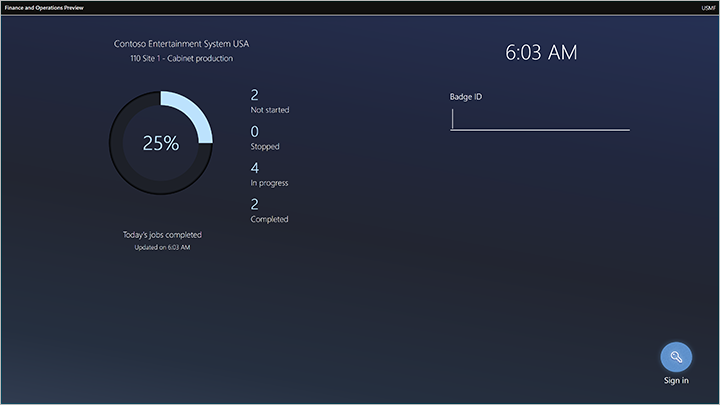
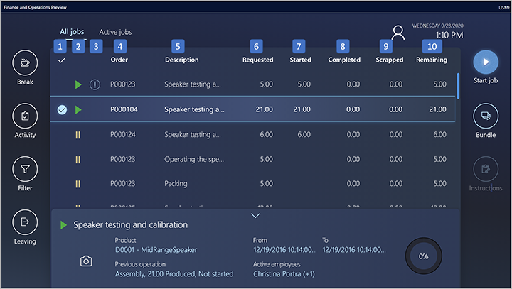
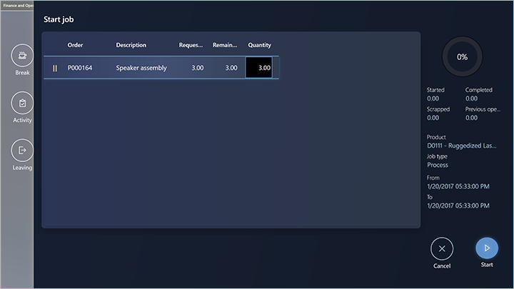

---
# required metadata

title: How workers use the production floor execution interface
description: This topic describes how to use the production floor execution interface from a worker's point of view.
author: johanhoffmann
manager: tfehr
ms.date: 10/05/2020
ms.topic: article
ms.prod: 
ms.service: dynamics-ax-applications
ms.technology: 

# optional metadata

# ms.search.form:  [Operations AOT form name to tie this topic to]
audience: Application User
# ms.devlang: 
ms.reviewer: kamaybac
ms.search.scope:  Core, Operations
# ms.tgt_pltfrm: 
# ms.custom: [used by loc for topics migrated from the wiki]
ms.search.region: Global
# ms.search.industry: [leave blank for most, retail, public sector]
ms.author: johanho
ms.search.validFrom: 2020-10-05
ms.dyn365.ops.version: Release 10.0.15
---

# How workers use the production floor execution interface

[!include [banner](../includes/banner.md)]
[!include [preview banner](../includes/preview-banner.md)]

The production floor execution interface is optimized for touch interaction. It's design provides visual contrast that meets accessibility requirements for shop floor environments. It offers the same functional capabilities as the job card device, but also offers the ability to start multiple jobs in parallel from a job list (this is also known as job bundling). From the job list, workers can open a Dynamics 365 Guide to get visual instructions using a HoloLens.

## Sign in to the production floor execution interface as a worker

A supervisor or technical staff must prepare the device and open the right page in Supply Chain Management before the workers can start using it. To learn more about how to set up the device, see [Set up a device to run the production floor execution interface](production-floor-execution-setup.md).

Once the device has been prepared, it shows the sign-in page, which shows information about the status of jobs for the local work cell (updated periodically). Workers sign in here using their badge IDs. Workers don't need to have a user account for Supply Chain Management, but they must have a *time registered worker* account to use when signing in.

The remaining sections of this topic describe how workers will interact with the interface.

## The All jobs tab

The **All jobs** tab provides a job list, which shows all the production jobs that have a status of *Not started*, *Stopped* or*Started*.

The list provides the following columns, which are also numbered in the previous screen shot:

1. **Selection column**: The left-hand column shows a check mark to indicate which jobs have been selected by the worker. It is possible to select multiple jobs in the list. To select all the jobs, tap the check mark in the column header. When a single job is selected, details about that job are shown at the bottom of the screen.
1. **Job status column**: This column indicates the status of each job using icons. Jobs with no icon have a status of *Not started*. A green triangle icon indicates jobs with a status of*Started*. The icon with the two yellow vertical lines indicates jobs with a status of*Stopped*.
1. **High priority column**: Jobs that show an exclamation mark in this column have high priority.
1. **Oder**: Shows the production order number for a job.
1. **Description**: Shows a description of the operation that a job is part of.
1. **Requested**: Shows the quantity that a job is planned to produce.
1. **Started**: Shows the quantity that has already been started for a job.
1. **Completed**: Shows the quantity that has already been completed for a job.
1. **Scrapped**: Shows the quantity that has already been scrapped for a job.
1. **Remaining**: Shows the quantity that remains to be completed for a job.

## The Active jobs tab

The list provides the following columns:

- **Selection column**: The left-hand column shows a check mark to indicate which jobs have been selected by the worker. It is possible to select multiple jobs in the list. To select all the jobs, tap the check mark in the column header. When a single job is selected, details about that job are shown at the bottom of the screen.
- **Oder**: Shows the production order number for a job.
- **Description**: Shows a description of the operation that a job is part of.
- **Requested**: Shows the quantity that a job is planned to produce.
- **Started**: Shows the quantity that has already been started for a job.
- **Completed**: Shows the quantity that has already been completed for a job.
- **Scrapped**: Shows the quantity that has already been scrapped for a job.
- **Remaining**: Shows the quantity that remains to be completed for a job.

## Start and complete a production job

Workers start a production job by selecting a job on the **All jobs** tab, and then pressing the **Start job** button to open the **Start job** dialog box.

Workers use the **Start job** dialog box to confirm the production quantity and then start the job. The **Quantity** field initially shows the quantity remaining for the job. Workers can adjust the quantity by selecting the **Quantity** field, which opens a numeric keyboard that they can use to adjusted quantity. Workers then select the **Start** button and begin work. The **Start job** dialog box closes and the job is now added to the **Active jobs** tab.

Workers can start a job in all statuses. When a worker starts a job with status *Not started*, the **Quantity** field initially shows the full quantity on **Start job** dialog box. When a worker starts a job that is in status *Started* or*Stopped*, then the **Quantity** field initially shows the remaining quantity.

## Report good quantities

On completing (or partially completing) a job, workers can report good quantities produced by going to the **Active jobs** tab, selecting a job, and then selecting the **Report progress** button, which opens the **Report progress** dialog box. The worker then enters the good quantity using the numeric keyboard. The quantity is empty by default. After entering a quantity, the worker can update the status of the job to *In progress*, *Stopped*, or*Completed*.

## Report scrap

On completing (or partially completing) a job, workers can report scrap by going to the **Active jobs** tab, selecting a job, and then selecting the **Report scrap** button, which opens the **Report**

**scrap** dialog box. The worker then enters the scrap quantity using the numeric keyboard and selects a reason (*None*, *Machine*, *Operator*, or*Material*).

## Complete a job and start a new job

Usually, workers complete a job by selecting one ore more current jobs on the **Active jobs** tab and selecting **Report progress.** Then they enter the quantity produced (good quantity) and setting the status to *Complete*. If more than one job was selected, then the worker uses the **Previous** and **Next** buttons to switch between them. The worker then selects a new job from the **All jobs** list and start it by selecting the **Start job** button.

Workers can also start a new job while their previous job is still open by going to the **All jobs** page, selecting a new job, and then selecting the **Start job** button. In this case, the **Start job** dialog box will inform the worker that she or he is currently working on a job, so they must choose to either **Stop** or **Complete** this job before starting the next one.

## Working on multiple jobs in parallel

One worker can work on multiple jobs at the same time. In this case, the collection of jobs the worker is working on is called a *job bundle*. The worker can add new jobs to the bundle or complete one or more jobs in the bundle. The following two scenarios explain how to work on jobs in parallel.

### Scenario 1: The worker has no active jobs and wants to start two jobs to work on parallel

The worker selects the two jobs in the **All jobs** tab and then selects **Start job.** The **Start job** dialog shows both selected jobs, and the worker can adjust the quantity to start on each job. On confirming the dialog, the worker can start on both jobs.

### Scenario 2: The worker has two active jobs in progress and wants to start a third job to work on in parallel with the other two

The worker selects the third job on the **All jobs** tab and selects the **Bundle** button. In the **Bundle** dialog, the worker adjusts the quantity to start and confirms by selecting the **Bundle** button.

## Working on indirect activities

Indirect activities are activities that are not directly related to a production order. The indirect activities can be flexibly defined, as described in [Set up indirect activities for time and attendance](https://docs.microsoft.com/dynamicsax-2012/appuser-itpro/set-up-indirect-activities-for-time-and-attendance).

For example, Shannon, a floor worker at Contoso, wants to attend a company meeting, and meetings are considered an indirect activity. One of the following two scenarios applies:

- **Shannon is working on one or more active jobs**: She selects the **Activity** button, identifies the activity (meeting) and confirms the selection. A message appears informing her that she has jobs in progress. From the message, she can choose to complete or stop the jobs she is working on before going to the meeting.

- **Shannon does not have any active jobs**: She selects the **Activity** button and identifies the activity (meeting). When she confirms her selection, she is now registered as being at the meeting.

For both scenarios, when Shannon confirms the selection, she will either return to the sign-in screen or to a screen that will wait for her to confirm that she has returned from her indirect activity, depending on how the production floor execution interface is configured (see also [Configure the production floor execution interface](production-floor-execution-configure.md)).

## Working on breaks

The worker can register a break. Breaks can be flexible defined, as described in [Pay based on registrations](pay-based-on-registrations.md).

The worker registers a break by selecting the **Break** button and then selects the card that represent the break type (such as lunch). On confirming the selection, the device either shows the sign-in screen or a screen that will wait for her to confirm that she has returned from her break, depending on how the production floor execution interface is configured (see also [Configure the production floor execution interface](production-floor-execution-configure.md)).

## Open an instruction

Workers can open a document attached to a job by selecting the **Instructions** button. This button is only enabled if a document is associated with the job in the master data. For example, a document attached to the product on the **Released products** page in Supply Chain Management will be available to open on the shop floor execution interface.

## Open a mixed-reality Guide for HoloLens

When a worker chooses a job, the production floor execution interface can show a list of relevant Guides (if available) that can provide mixed-reality instructions through a Microsoft HoloLens. When the worker chooses a guide, a QR code for that guide is shown on the screen. The worker then uses their HoloLens to scan the QR code, which launches Guides and starts showing the required instructions. For information about creating and using Guides for HoloLens, see [Provide mixed-reality Guides for workers in production](instruction-guides-in-production-overview.md).