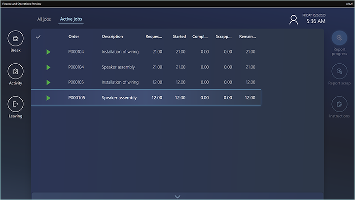

---
# required metadata

title: How workers use the production floor execution interface
description: This topic describes how to use the production floor execution interface from a worker's point of view.
author: johanhoffmann
manager: tfehr
ms.date: 10/05/2020
ms.topic: article
ms.prod: 
ms.service: dynamics-ax-applications
ms.technology: 

# optional metadata

# ms.search.form:  [Operations AOT form name to tie this topic to]
audience: Application User
# ms.devlang: 
ms.reviewer: kamaybac
ms.search.scope:  Core, Operations
# ms.tgt_pltfrm: 
# ms.custom: [used by loc for topics migrated from the wiki]
ms.search.region: Global
# ms.search.industry: [leave blank for most, retail, public sector]
ms.author: johanho
ms.search.validFrom: 2020-10-05
ms.dyn365.ops.version: Release 10.0.15
---

# How workers use the production floor execution interface

[!include [banner](../includes/banner.md)]
[!include [preview banner](../includes/preview-banner.md)]

The production floor execution interface is optimized for touch interaction. Its design provides visual contrast that meets accessibility requirements for shop floor environments. It offers all the same functional capabilities as the job card device. However, it also enables multiple jobs to be started in parallel from a job list. (This capability is also known as *job bundling*.) Additionally, from a job list, workers can open a guide that was created in Microsoft Dynamics 365 Guide. In this way, they can get visual instructions on a HoloLens.

## Sign in to the production floor execution interface as a worker

Before workers can start to use the device, a supervisor or technical staff must prepare it and open the correct page in Dynamics 365 Supply Chain Management. For more information about how to set up the device, see [Set up a device to run the production floor execution interface](production-floor-execution-setup.md).

After the device has been prepared, the sign-in page appears on it. This page shows information about the status of jobs for the local work cell. This information is updated periodically. On the page, workers use their badge IDs to sign. Although workers don't have to have a user account for Supply Chain Management, they must have a *time registered worker* account that they can use when they sign in.

The remaining sections of this topic describe how workers interact with the interface.

## All jobs tab

The **All jobs** tab provides a job list that shows all the production jobs that have a status of *Not started*, *Stopped*, or *Started*.

The job list has the following columns. (The numbers correspond to the numbers in the previous illustration.)

1. **Selection column** – The leftmost column uses check marks to indicate jobs that have been selected by the worker. Workers can select multiple jobs in the list at the same time. To select all the jobs in the list, select the check mark in the column header. When a single job is selected, details about that job are shown in the lower part of the page.
1. **Job status column** – This column uses symbols to indicate the status of each job. Jobs that have no symbol in this column have a status of *Not started*. A green triangle indicates jobs that have a status of *Started*. Two yellow vertical lines indicate jobs that have a status of *Stopped*.
1. **High priority column** – This column uses exclamation marks to indicate jobs that have high priority.
1. **Order** – This column shows the production order number for a job.
1. **Description** – This column shows a description of the operation that a job is part of.
1. **Requested** – This column shows the quantity that a job is planned to produce.
1. **Started** – This column shows the quantity that has already been started for a job.
1. **Completed** – This column shows the quantity that has already been completed for a job.
1. **Scrapped** – This column shows the quantity that has already been scrapped for a job.
1. **Remaining** – This column shows the quantity that remains to be completed for a job.

## Active jobs tab

The job list on the **Active jobs** tab has the following columns:

- **Selection column** – The leftmost column uses check marks to indicate jobs that have been selected by the worker. Workers can select multiple jobs in the list at the same time. To select all the jobs in the list, select the check mark in the column header. When a single job is selected, details about that job are shown in the lower part of the page.
- **Order** – This column shows the production order number for a job.
- **Description** – This column shows a description of the operation that a job is part of.
- **Requested** – This column shows the quantity that a job is planned to produce.
- **Started** – This column shows the quantity that has already been started for a job.
- **Completed** – This column shows the quantity that has already been completed for a job.
- **Scrapped** – This column shows the quantity that has already been scrapped for a job.
- **Remaining** – This column shows the quantity that remains to be completed for a job.

## Starting and completing production jobs

Workers start a production job by selecting a job on the **All jobs** tab and then selecting **Start job** to open the **Start job** dialog box.

Workers use the **Start job** dialog box to confirm the production quantity and then start the job. The **Quantity** field initially shows the remaining quantity for the job. Workers can adjust the quantity by selecting the **Quantity** field and then using the numeric keyboard that appears. Workers then select **Start** to start to work on the job. The **Start job** dialog box is closed, and the job is added to the **Active jobs** tab.

Workers can start a job that is in any status. When a worker starts a job that has a status of *Not started*, the **Quantity** field in the **Start job** dialog box initially shows the full quantity. When a worker starts a job that has a status of *Started* or *Stopped*, the **Quantity** field initially shows the remaining quantity.

## Reporting good quantities

When a worker completes or partially completes a job, they can report good quantities that were produced by selecting a job on the **Active jobs** tab and then selecting **Report progress**. Then, in the **Report progress** dialog box, the worker enters the good quantity by using the numeric keyboard. The quantity is blank by default. After a quantity is entered, the worker can update the status of the job to *In progress*, *Stopped*, or *Completed*.

## Reporting scrap

When a worker completes or partially completes a job, they can report scrap by selecting a job on the **Active jobs** tab and then selecting **Report scrap**. Then, in the **Report scrap** dialog box, the worker enters the scrap quantity by using the numeric keyboard. The worker also selects a reason (*None*, *Machine*, *Operator*, or *Material*).

## Completing a job and starting a new job

Usually, workers complete a job by selecting one or more current jobs on the **Active jobs** tab and then selecting **Report progress**. They then enter the quantity that was produced (the good quantity) and set the status to *Complete*. If more than one job was selected, a worker then uses the **Previous** and **Next** buttons to move among them. To start a new job, the worker selects it in the **All jobs** list and then selects **Start job**.

A worker can also start a new job while their previous job is still open. Once again, the worker selects the new job on the **All jobs** page and then selects **Start job**. However, in this case, the **Start job** dialog box informs the worker that they are currently working on a job, and that they must therefore either stop or complete that job before they start the new job.

## Working on multiple jobs in parallel

One worker can work on multiple jobs at the same time (that is, in parallel). In this case, the collection of jobs that the worker is working on is called a *job bundle*. The worker can add new jobs to the bundle, or complete one or more jobs in the bundle. The following two scenarios show how a worker can work on jobs in parallel.

### Scenario 1: A worker who has no active jobs wants to start two jobs and work on them in parallel

The worker selects the two jobs on the **All jobs** tab and then selects **Start job**. The **Start job** dialog box shows both selected jobs, and the worker can adjust the quantity to start on each job. The worker then confirms the dialog box and can start both jobs.

### Scenario 2: A worker who has two active jobs that are in progress wants to start a third job and work on it in parallel with the other two

The worker selects the third job on the **All jobs** tab and then selects **Bundle**. In the **Bundle** dialog box, the worker can adjust the quantity to start. The worker then confirms the dialog box by selecting **Bundle**.

## Working on indirect activities

Indirect activities are activities that aren't directly related to a production order. Indirect activities can be flexibly defined, as described in [Set up indirect activities for time and attendance](https://docs.microsoft.com/dynamicsax-2012/appuser-itpro/set-up-indirect-activities-for-time-and-attendance).

For example, Shannon, a floor worker at Contoso, wants to attend a company meeting, and meetings are considered an indirect activity. One of the following two scenarios applies:

- **Shannon is working on one or more active jobs.** Shannon selects **Activity**, identifies the activity (meeting), and confirms her selection. A message that appears informs her that she has jobs that are in progress. From the message, Shannon can choose to complete or stop the jobs that she is working on before she goes to the meeting.
- **Shannon doesn't have any active jobs.** Shannon selects **Activity**, identifies the activity (meeting), and she confirms her selection. She is now registered as being at the meeting.

In both scenarios, after Shannon confirms her selection, she goes to either the sign-in page or a page that will wait for her to confirm that she has returned from her indirect activity. The page that appears depends on the configuration of the production floor execution interface. (For more information, see [Configure the production floor execution interface](production-floor-execution-configure.md).)

## Working on breaks

Workers can register breaks. Breaks can be flexibly defined, as described in [Pay based on registrations](pay-based-on-registrations.md).

A worker registers a break by selecting **Break** and then selecting the card that represents the break type (such as lunch). After the worker confirms the selection, the device shows either the sign-in page or a page that will wait for the worker to confirm that they have returned from the break. The page that appears depends on the configuration of the production floor execution interface. (For more information, see [Configure the production floor execution interface](production-floor-execution-configure.md).)

## Opening instructions

Workers can open a document that is attached to a job by selecting **Instructions**. The **Instructions** button is available only if a document is associated with the job in the master data. For example, a document that is attached to a product on the **Released products** page in Supply Chain Management will be available for workers to open in the shop floor execution interface.

## Opening mixed-reality guides for HoloLens

[Dynamics 365 Guides](https://dynamics.microsoft.com/mixed-reality/guides/) can help empower workers by providing hands-on learning that uses mixed reality. You can define standardized processes where step-by-step instructions guide workers to the tools and parts that they need and show how to use those tools in real work situations. Here is an overview of the process.

1. Every time that a worker opens a job list in the shop floor execution interface, the interface finds all relevant guides for the jobs that are shown.
1. The worker selects **Guides** to view the list of guides.
1. The worker selects a relevant guide in the list.
1. The shop floor execution interface shows a QR code for the selected guide.
1. The worker puts on a HoloLens and glances at the QR code to start the guide.
1. The worker works through the guide to learn the task.

For more information about how to create, assign, and use guides for HoloLens, see [Provide mixed-reality Guides for workers in production](instruction-guides-in-production-overview.md).
