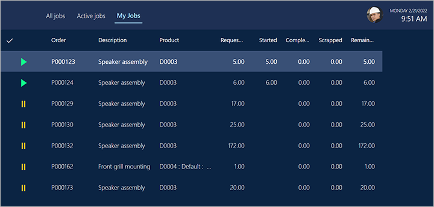

---
# required metadata

title: How workers use the production floor execution interface
description: This article describes how to use the production floor execution interface from a worker's point of view.
author: johanhoffmann
ms.date: 01/24/2022
ms.topic: article
ms.prod: 
ms.technology: 

# optional metadata

ms.search.form: JmgProductionFloorExecution
audience: Application User
# ms.devlang: 
ms.reviewer: kamaybac
# ms.tgt_pltfrm: 
# ms.custom: [used by loc for articles migrated from the wiki]
ms.search.region: Global
# ms.search.industry: [leave blank for most, retail, public sector]
ms.author: johanho
ms.search.validFrom: 2020-10-05
ms.dyn365.ops.version: 10.0.24
---

# How workers use the production floor execution interface

[!include [banner](../includes/banner.md)]

The production floor execution interface is optimized for touch interaction. Its design provides visual contrast that meets accessibility requirements for shop floor environments. It offers all the same functional capabilities as the job card device. However, it also enables multiple jobs to be started in parallel from a job list. (This capability is also known as *job bundling*.) Additionally, from a job list, workers can open a guide that was created in Microsoft Dynamics 365 Guide. In this way, they can get visual instructions on a HoloLens.

## Sign in to the production floor execution interface as a worker

Before workers can start to use the device, a supervisor or technical staff must prepare it and open the correct page in Dynamics 365 Supply Chain Management. For more information about how to set up the device, see [Set up a device to run the production floor execution interface](production-floor-execution-setup.md).

After the device has been prepared, the sign-in page appears on it. This page shows information about the status of jobs for the local work cell. This information is updated periodically. On the page, workers use their badge IDs to sign. Although workers don't have to have a user account for Supply Chain Management, they must have a *time registered worker* account that they can use when they sign in.

The remaining sections of this article describe how workers interact with the interface.

## All jobs tab

The **All jobs** tab provides a job list that shows all the production jobs that have a status of *Not started*, *Stopped*, or *Started*. (This tab name is customizable and may be different for your system.)

The job list has the following columns. The numbers correspond to the numbers in the previous illustration.

1. **Selection column** – The leftmost column uses check marks to indicate jobs that have been selected by the worker. Workers can select multiple jobs in the list at the same time. To select all the jobs in the list, select the check mark in the column header. When a single job is selected, details about that job are shown in the lower part of the page.
1. **Job status column** – This column uses symbols to indicate the status of each job. Jobs that have no symbol in this column have a status of *Not started*. A green triangle indicates jobs that have a status of *Started*. Two yellow vertical lines indicate jobs that have a status of *Stopped*.
1. **High priority column** – This column uses exclamation marks to indicate jobs that have high priority.
1. **Order** – This column shows the production order number for a job.
1. **Description** – This column shows a description of the operation that a job is part of.
1. **Requested** – This column shows the quantity that a job is planned to produce.
1. **Started** – This column shows the quantity that has already been started for a job.
1. **Completed** – This column shows the quantity that has already been completed for a job.
1. **Scrapped** – This column shows the quantity that has already been scrapped for a job.
1. **Remaining** – This column shows the quantity that remains to be completed for a job.

## Active jobs tab

The **Active jobs** tabs shows a list of all jobs that the signed-in worker has already started. (This tab name is customizable and may be different for your system.)

The active jobs list has the following columns:

- **Selection column** – The leftmost column uses check marks to indicate jobs that have been selected by the worker. Workers can select multiple jobs in the list at the same time. To select all the jobs in the list, select the check mark in the column header. When a single job is selected, details about that job are shown in the lower part of the page.
- **Order** – This column shows the production order number for a job.
- **Description** – This column shows a description of the operation that a job is part of.
- **Requested** – This column shows the quantity that a job is planned to produce.
- **Started** – This column shows the quantity that has already been started for a job.
- **Completed** – This column shows the quantity that has already been completed for a job.
- **Scrapped** – This column shows the quantity that has already been scrapped for a job.
- **Remaining** – This column shows the quantity that remains to be completed for a job.

## My jobs tab

The **My jobs** tab lets workers easily view all unstarted and unfinished jobs that are assigned specifically to them. It's useful in companies where jobs are sometimes or always assigned to specific workers (human resources) instead of other types of resources (such as machines).

The scheduling system automatically assigns each production job to a specific resource record, and each resource record has a type (such as machine or human). When you set up an employee as a production worker, you can associate the worker account with a unique human resource record.

The **My jobs** tab lists all unstarted and unfinished jobs that have been assigned to the human resource record of the signed-in worker, if any worker is signed in. It never lists jobs that have been assigned to a machine or other type of resource, even if the signed-in worker has started to work on those jobs.

To view all jobs that have been started by the signed-in worker, regardless of the type of resource that each job is assigned to, use the **Active jobs** tab. To view all unfinished jobs that match the configuration of the local job filter, regardless of the worker or start status, use the **All jobs** tab.

## My machine tab

The **My machine** tab lets workers select an asset that is connected to a machine resource within the filter set on the **All jobs** tab. The worker can then view the state and health of the selected asset by reading values for up to four selected counters and lists of recent maintenance requests and registered downtimes. The worker can also request maintenance for the selected asset and register and edit machine downtime. (This tab name is customizable and may be different for your system.)

The **My machine** tab has the following columns. The numbers correspond to the numbers in the previous illustration.

1. **Machine asset** – Select the machine asset that you want to track. Start typing a name to select from a list of matching assets, or select the magnifying-glass icon to select from a list of all assets associated with the resources that are within the filter of the job list.

    > [!NOTE]
    > Supply Chain Management users can assign a resource to each asset as needed using the **All assets** page (on the **Fixed asset** tab, using the **Resource** drop-down list). For more information, see [Create an asset](../asset-management/objects/create-an-object.md).

1. **Settings** – Select the gear icon to open a dialog box where you can choose which counters to view for the selected machine asset. Values for these counters are shown at the top of the **Asset management** tab. The **Settings** menu (shown in the following screenshot) lets you enable up to four counters. For each counter that you want to enable, use the lookup field at the top of the tile to select a counter. The lookup field lists all of the counters associated to the asset selected at the top of the **Asset management** page. Set each counter to monitor either the **Aggregated** value or the latest **Actual** value for the counter. For example, if you set a counter that tracks how many hours the machine has been running, then you should set it to **Aggregated**. If you set a counter to measure the latest updated temperature or pressure, then you should set it to **Actual**. Select **OK** to save your settings and close the dialog box.

    

1. **Request maintenance** – Select this button to open a dialog box where you can create a maintenance request. You'll be able to provide description and a note. The request will be brought to the attention of a Supply Chain Management user, who will then be able to convert the maintenance request to a maintenance work order.
1. **Register downtime** – Select this button to open a dialog box where you can register machine downtime. You'll be able to select a reason code and enter a date/time span for the downtime. The machine downtime registration is used for calculating the efficiency of the machine asset.
1. **View or edit** – Select this button to open a dialog box where you can edit or view existing downtime records.

## Starting and completing production jobs

Workers start a production job by selecting a job on the **All jobs** tab and then selecting **Start job** to open the **Start job** dialog box.

Workers use the **Start job** dialog box to confirm the production quantity and then start the job. Workers can adjust the quantity by selecting the **Quantity** field and then using the numeric keyboard that appears. Workers then select **Start** to start to work on the job. The **Start job** dialog box is closed, and the job is added to the **Active jobs** tab.

Workers can start a job that is in any status. When a worker starts a job that has a status of *Not started*, the **Quantity** field in the **Start job** dialog box initially shows the full quantity. When a worker starts a job that has a status of *Started* or *Stopped*, the **Quantity** field initially shows the remaining quantity.

## Reporting good quantities

When a worker completes or partially completes a job, they can report good quantities that were produced by selecting a job on the **Active jobs** tab and then selecting **Report progress**. Then, in the **Report progress** dialog box, the worker enters the good quantity by using the numeric keyboard. The quantity is blank by default. After a quantity is entered, the worker can update the status of the job to *In progress*, *Stopped*, or *Completed*.

## Reporting good quantities on batch orders that have co-products and by-products

Workers can use the production floor execution interface to report progress on batch orders. This reporting includes reporting on co-products and by-products.

Some manufacturers, especially in process industries, use batch orders to manage their production processes. Batch orders are created from formulas, and those formulas can be defined so that they have co-products and by-products as output. When feedback about those batch orders is reported, the amount of output must be registered on the formula item, and also on the co-products and by-products.

When a worker completes or partially completes a job on a batch order, they can report good or scrap quantities for each product that is defined as output for the order. Products that are defined as output for a batch order can be of the *Formula*, *Co-product*, or *By-product* type.

To report good quantities on the products, a worker selects a job on the **Active jobs** tab and then selects **Report progress**.

Then, in the **Report progress** dialog box, the worker can select among the products that are defined as output for the batch order to report on. The worker can select one or many products in the list, and then select **Report progress**. For each product, the quantity is blank by default, and the worker can use the numeric keyboard to enter the quantity. The worker can use the **Previous** and **Next** buttons to move between the selected products. After the quantity is entered for each product, the worker can update the status of the job to *In progress*, *Stopped*, or *Completed*.

### Reporting on batch orders for planning items

When a worker completes a job on a batch order for a planning item, they will report quantities only on co-products and by-products, because planning items don't contain an item of the *Formula* type.

### Reporting co-product variation

If a batch order is created from a formula version where the **Co-products variations** option is set to *Yes*, the worker can report on co-products that aren't part of the definition for the batch orders. This functionality is used in scenarios where unexpected product output can occur in the production process.

In this case, the worker can specify the co-product and quantity to report by selecting **Co-products variations** in the report progress dialog box. The worker can then select among all the released products that are defined as co-products.

### Reporting catch weight items

Workers can use the production floor execution interface to report progress on batch orders that are created for catch weight items. Batch orders are created from formulas, which can be defined to have catch weight items as formula items, co-products, and by-products. A formula can also be defined to have formula lines for ingredients that are defined for catch weight. Catch weight items use two units of measure to track inventory: catch weight quantity and inventory quantity. For example, in the food industry, boxed meat can be defined as a catch weight item, where the catch weight quantity is used to track the number of boxes and the inventory quantity is used to track the weight of the boxes.

## Reporting scrap

When a worker completes or partially completes a job, they can report scrap by selecting a job on the **Active jobs** tab and then selecting **Report scrap**. Then, in the **Report scrap** dialog box, the worker enters the scrap quantity by using the numeric keyboard. The worker also selects a reason (*None*, *Machine*, *Operator*, or *Material*).

## Adjust material consumption and make material reservations

[!INCLUDE [preview-banner-section](../../includes/preview-banner-section.md)]
<!-- KFM: preview until further notice -->

Workers can adjust material consumption for each production job. This functionality is used in scenarios where the actual quantity of materials that was consumed by a production job was more or less than the planned quantity. Therefore, it must be adjusted to keep the inventory levels current.

Workers can also make reservations on the batch and serial numbers of materials. This functionality is used in scenarios where a worker must manually specify which material batch or serial numbers were consumed, to meet material traceability requirements.

Workers can specify the quantity to adjust by selecting **Adjust material**. This button is available in the following locations:

- In the **Report scrap** dialog box
- In the **Report progress** dialog box
- On the toolbar on the right

### Adjust material consumption from the Report scrap and Report progress dialog boxes

After a worker enters the quantity to report in the **Report progress** or **Report scrap** dialog box, the **Adjust material** button becomes available. When the user selects this button, the **Adjust material** dialog box appears. This dialog box lists the items that are planned to be consumed when the good or scrapped quantity is reported for the job.

The list in the dialog box shows the following information:

- **Product number** – The product master and product variant.
- **Product name** – The name of the product.
- **Proposal** – The estimated quantity of material that will be consumed when progress or scrap is reported for the specified quantity for the job.
- **Consumption** – The actual quantity of material that will be consumed when progress or scrap is reported for the specified quantity for the job.
- **Reserved** – The quantity of material that has been physical reserved in inventory.
- **Unit** – The bill of materials (BOM) unit.

The right side of the dialog box shows following information:

- **Product number** – The product master and product variant.
- **Estimated** – The estimated quantity to consume.
- **Started** – The quantity that has been started on the production job.
- **Remaining quantity** – Of the estimated quantity, the quantity that remains to be consumed.
- **Released quantity** – The quantity that has been consumed.

The following actions can be performed:

- The worker can specify the quantity to adjust for a material by selecting **Adjust consumption**. After the quantity is confirmed, the quantity in the **Consumption** column is updated with the adjusted quantity.
- When the worker selects **Adjust material**, a production picking list journal is created. This journal contains the same items and quantities as the **Adjust material** list.
- When the worker adjusts a quantity in the **Adjust material** dialog box, the **Proposal** field on the corresponding journal line is updated with the same quantity. If the worker selects **Cancel** in the **Adjust material** dialog box, the picking list is deleted.
- If the worker selects **OK**, the picking list isn't deleted. It will be posted when the job is reported in the **Report scrap** or **Report progress** dialog box.
- If the worker selects **Cancel** in the **Report progress** or **Report scrap** dialog box, the picking list is deleted.

### Adjust material from the primary or secondary toolbar

The **Adjust material** button can be configured so that it appears on the primary or secondary toolbar. (For more information, see [Design the production floor execution interface](production-floor-execution-tabs.md).) A worker can select **Adjust material** for a production job that is in progress. In this case, the **Adjust material** dialog box appears, where the worker can make the desired adjustments. When the dialog box is opened, a production picking list that contains lines for the adjusted quantities is created for the production order. If the worker selects **Post now**, the adjustment is confirmed, and the picking list is posted. If the worker selects **Cancel**, the picking list is deleted, and no adjustment is made.

### Adjust material consumption for catch weight items

[!INCLUDE [preview-banner-section](../../includes/preview-banner-section.md)]
<!-- KFM: preview until further notice -->

Workers can adjust material consumption for catch weight items. This functionality is used in scenarios where the actual quantity of a catch weight material that was consumed by a production job was more or less than the planned quantity. Therefore, it must be adjusted to keep the inventory levels current. When a worker adjusts consumption of a catch weight item, they can adjust both the catch weight quantity and the inventory quantity. For example, if a production job is planned to consume five boxes that have an estimated weight of 2 kilograms per box, the worker can adjust both the number of boxes to consume and the weight of the boxes. The system will validate that the specified weight of the boxes is within the defined minimum and maximum threshold that defined on the released product.

### Reserve materials

In the **Adjust material** dialog box, a worker can make and adjust material reservations by selecting **Reserve material**. The **Reserve material** dialog box that appears shows the physically available inventory for the item for each storage and tracking dimension.

If the material is enabled for warehouse management processes (WMS), the list shows only the physically available inventory for the production input location for the material. The production input location is defined on the resource where the production job is planned. If the item number is batch or serial number controlled, the full list of physically available batch and serial numbers is shown. To specify a quantity to reserve, the worker can select **Reserve material**. To remove an existing reservation, the worker can select **Remove reservation**.

For more information about how to set up the production input location, see the following blog post: [Setting up the production input location](/archive/blogs/axmfg/deliver-picked-materials-to-the-locations-where-the-materials-are-consumed-by-operations-in-production).

> [!NOTE]
> Reservations that a worker makes in the **Reserve material** dialog box will remain when the worker selects **Cancel** in the **Report progress** or **Report scrap** dialog box.
>
> It isn't possible to adjust reservations for catch weight items.

## Completing a job and starting a new job

Usually, workers complete a job by selecting one or more current jobs on the **Active jobs** tab and then selecting **Report progress**. They then enter the quantity that was produced (the good quantity) and set the status to *Complete*. If more than one job was selected, a worker then uses the **Previous** and **Next** buttons to move among them. To start a new job, the worker selects it on the **All jobs** tab and then selects **Start job**.

A worker can also start a new job while their previous job is still open. Once again, the worker selects the new job on the **All jobs** tab and then selects **Start job**. However, in this case, the **Start job** dialog box informs the worker that they are currently working on a job, and that they must therefore either stop or complete that job before they start the new job.

## Working on multiple jobs in parallel

One worker can work on multiple jobs at the same time (that is, in parallel). In this case, the collection of jobs that the worker is working on is called a *job bundle*. The worker can add new jobs to the bundle, or complete one or more jobs in the bundle. The following two scenarios show how a worker can work on jobs in parallel.

### Scenario 1: A worker who has no active jobs wants to start two jobs and work on them in parallel

The worker selects the two jobs on the **All jobs** tab and then selects **Start job**. The **Start job** dialog box shows both selected jobs, and the worker can adjust the quantity to start on each job. The worker then confirms the dialog box and can start both jobs.

### Scenario 2: A worker who has two active jobs that are in progress wants to start a third job and work on it in parallel with the other two

The worker selects the third job on the **All jobs** tab and then selects **Bundle**. In the **Bundle** dialog box, the worker can adjust the quantity to start. The worker then confirms the dialog box by selecting **Bundle**.

## Working on indirect activities

Indirect activities are activities that aren't directly related to a production order. Indirect activities can be flexibly defined, as described in [Set up indirect activities for time and attendance](/dynamicsax-2012/appuser-itpro/set-up-indirect-activities-for-time-and-attendance).

For example, Shannon, a floor worker at Contoso, wants to attend a company meeting, and meetings are considered an indirect activity. One of the following two scenarios applies:

- **Shannon is working on one or more active jobs.** Shannon selects **Activity**, identifies the activity (meeting), and confirms the selection. A message that appears informs Shannon about jobs that are in progress. From the message, Shannon can choose to complete or stop the jobs before going to the meeting.
- **Shannon doesn't have any active jobs.** Shannon selects **Activity**, identifies the activity (meeting), and confirms the selection. Shannon is now registered as being at the meeting.

In both scenarios, after confirming the selection, Shannon goes to either the sign-in page or a page that will wait for the confirmation that Shannon has returned from the indirect activity. The page that appears depends on the configuration of the production floor execution interface. (For more information, see [Configure the production floor execution interface](production-floor-execution-configure.md).)

## Registering breaks

Workers can register breaks. Breaks can be flexibly defined, as described in [Pay based on registrations](pay-based-on-registrations.md).

A worker registers a break by selecting **Break** and then selecting the card that represents the break type (such as lunch). After the worker confirms the selection, the device shows either the sign-in page or a page that will wait for the worker to confirm that they have returned from the break. The page that appears depends on the configuration of the production floor execution interface. (For more information, see [Configure the production floor execution interface](production-floor-execution-configure.md).)

## View the "My day" dialog

The **My day** dialog provides workers with an overview of their registrations and balances. The dialog is divided into the following three sections:

- The main section lists the registrations that the current worker made on a selected date. It opens showing registrations for the current day, and provides a date picker that lets the worker view other days.
- The **Last calculated daily balance** section shows the worker's current balances for paid time, paid overtime, absence, and paid absence. These values are based on the registrations that have been calculated during the approval process.
- The **Balances** section provides an overview of the balances within a defined period for selected categories of registrations (such as vacation, standard time, and overtime). These balances are based on the way statistical balances are set up in the **Time and attendance** module. For more information about how to set this up, see [Show vacation balances in the production floor execution interface](production-floor-execution-payroll-stats.md).

Admins can add this feature to the interface by placing the **My day** button on a toolbar for each relevant tab as described in [Design the production floor execution interface](production-floor-execution-tabs.md).

## Working in teams

When multiple workers are assigned to the same production job, they can form a team. The team can nominate one worker as a pilot. The remaining workers then automatically become assistants of that pilot. For the resulting team, only the pilot must register job status. Time records apply to all team members.

### Prerequisites

To use teams, an admin must enable the **Assistant** action for the primary toolbar on the **All jobs** tab of the production floor execution interface. For instructions, see [Design the production floor execution interface](production-floor-execution-tabs.md).

### Form a new team that has a pilot and an assistant

A worker can register as an assistant by selecting **Assistant** on the **All jobs** tab. Then, in the **Select an employee to assist** dialog box that appears, the worker can select a pilot in a list of workers who are actively working on a job. After the worker confirms their selection, they become an assistant to the selected worker, who becomes the pilot for the new team.

### Assign a new pilot to an existing team

When a team wants to select a new pilot, the current pilot must nominate another worker in the team as the new pilot. To nominate a new pilot, the current pilot selects **Assistant** on the **All jobs** tab. Then, in the **Change pilot** dialog box that appears, the pilot can select a new pilot in a list of workers who are already on the team. After the current pilot confirms their selection, they are dropped from the team completely. However, they can rejoin the team as they require.

### Assistant clocks out

When a worker who works as an assistant clocks out, they leave the team. If the **Permanent teams** and **Restart at clock in** options are set to *Yes*, a worker who clocks out will automatically rejoin the team the next time that they clock in. You can find these options on the **General** tab of the **Time and attendance parameters** page.

## Opening instructions

Workers can open a document that is attached to a job by selecting **Instructions**. The **Instructions** button is available only if a document is associated with the job in the master data. For example, a document that is attached to a product on the **Released products** page in Supply Chain Management will be available for workers to open in the shop floor execution interface.

## Opening mixed-reality guides for HoloLens

[Dynamics 365 Guides](https://dynamics.microsoft.com/mixed-reality/guides/) can help empower workers by providing hands-on learning that uses mixed reality. You can define standardized processes where step-by-step instructions guide workers to the tools and parts that they need and show how to use those tools in real work situations. Here is an overview of the process.

1. Every time that a worker opens a job list in the shop floor execution interface, the interface finds all relevant guides for the jobs that are shown.
1. The worker selects **Guides** to view the list of guides.
1. The worker selects a relevant guide in the list.
1. The shop floor execution interface shows a QR code for the selected guide.
1. The worker puts on a HoloLens and glances at the QR code to start the guide.
1. The worker works through the guide to learn the task.

For more information about how to create, assign, and use guides for HoloLens, see [Provide mixed-reality Guides for workers in production](instruction-guides-in-production-overview.md).

[!INCLUDE[footer-include](../../includes/footer-banner.md)]
