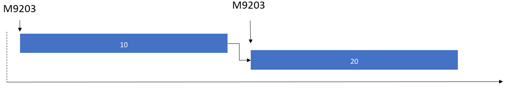

---
# required metadata

title: Release BOM and formula lines to the warehouse
description: This topic describes the process for releasing raw material for BOM lines and formula lines to the warehouse.
author: johanhoffmann
ms.date: 10/30/2017
ms.topic: article
ms.prod: 
ms.technology: 

# optional metadata

ms.search.form: SysOperationTemplateForm, ProdParmReleaseToWarehouse, WHSReleaseToWarehouseProdBOM
# ROBOTS: 
audience: Application User
# ms.devlang: 
ms.reviewer: kamaybac
# ms.tgt_pltfrm: 
ms.custom: 1705903
ms.search.region: Global
# ms.search.industry: 
ms.author: johanho
ms.search.validFrom: 2017-12-31
ms.dyn365.ops.version: 7.3
---

# Release BOM and formula lines to the warehouse

[!include [banner](../includes/banner.md)]

This topic describes the process for releasing raw material for bill of materials (BOM) lines and formula lines to the warehouse. When you release a BOM or formula line to the warehouse, the system first determines whether material is already available at the production input location on the shop floor where the material will be consumed for the production process.

- If the material is available at the production input location, it's picked from that location immediately after the signal is given for the release of material to the warehouse.
- If the material isn't available at the production input location, the material release indicates that material must be moved from locations in the warehouse to the production input location. The material is moved via warehouse work for raw material picking. Therefore, warehouse processes for raw material picking must be configured. For more information, see [Replenishment overview](../warehousing/replenishment.md) and [Control warehouse work by using work templates and location directives](../warehousing/control-warehouse-location-directives.md).

## Methods for releasing BOM and formula lines

You can configure the release of BOM and formula lines so that it occurs as part of the release of a production order or batch order. Alternatively, the release can be controlled by a batch job or done as a manual interaction.

The method that is used to release BOM and formula lines is controlled by the **Production line release** parameter. You can find this parameter at **Production control** \> **Setup** \> **Production parameters**.

- **Release BOM and formula lines as part of production or batch order release** – In this method, BOM and formula lines for a production or batch order are released as part of the process of releasing the order. Usually, during the release of a production or batch order, production jobs are released to the shop floor workers, and production papers are printed. During this process, the status of the order is also changed to **Released**.
- **Release BOM and formula lines via a batch job or as a manual interaction** – In this method, BOM and formula lines can be released only through the **Automatic release of BOM and formula lines** batch job or as a manual interaction. To manually release BOM and formula lines, on the production order list page or the production order details page, on the Action Pane, select **Release to warehouse**.

For a quick demonstration of how to release BOM and formula lines to production by using a batch job, watch this short YouTube video:
[Release production picking to the warehouse in batch](https://www.youtube.com/watch?v=8urAJn50dQ8).

## Releasing the BOM and formula lines by using a batch job

The **Automatic release of BOM and formula lines** batch job goes through selected BOM and formula lines that have a remaining quantity to release. The job considers only orders that have a status of **Released**, **Started**, or **Reported as finished**. If a BOM or formula line has a remaining quantity to release, the job releases up to the quantity that can be covered by the quantity that has already been physically reserved and the quantity that is physically available.

### Example of a batch job release

| Scenario | Remaining quantity to release | Physically reserved quantity | Physically available quantity | Quantity released by the batch job |
|----------|-------------------------------|------------------------------|-------------------------------|------------------------------------|
| 1        | 100                           | 20                           | 90                            | 100                                |
| 2        | 100                           | 20                           | 70                            | 90                                 |
| 3        | 100                           | 0                            | 90                            | 90                                 |
| 4        | 100                           | 0                            | 110                           | 100                                |
| 5        | 100                           | 20                           | 0                             | 20                                 |

### Batch job setup

In the query for the **Automatic release of BOM and formula lines** batch job, you can set up a filter criterion to specify how many days ahead the job should look for lines that have unreleased quantities. In the query for the job, in the **Raw material date** field, use the **(LessThanDate())** function as a filter criterion.

The following illustration shows a production order that has two jobs, 10 and 20, that cover the assembly and packing for the production order. Each job is set up to consume a quantity of material. In this illustration, the release time fence that is indicated by the green arrow below the time line equals the number of days that has been specified in the **(LessThanDate())** criterion. For example, **(LessThanDate(2))** indicates that the job should look for unreleased quantities only within a time fence of two days.

## Releasing material per operation number or in proportion to the amount of finished goods

If you release materials by using the **On production order release** parameter setting, when you do a manual release, you have two options for controlling the material release:

- Release material per operation number.
- Release material in proportion to the amount of finished goods.

### Release material per operation number

To control the operations that material should be released to, use the **Release to warehouse** page.

- Select **Production control** \> **Production orders** \> **All production orders**, select a production order, and then, on the **Warehouse** tab, select **Release to warehouse**. Then use the **From Oper. No.** and **To Oper. No** fields to specify the range of operation numbers.

The following illustration shows a production order that has two operations, 10 and 20. In this example, if you limit the release to operation 10, only material M9203 will be released.

For a quick demonstration of how to release material in proportion to the amount of finished goods, watch this short YouTube video about 
[enhancements to the production order release process](https://www.youtube.com/watch?v=Rm3ojAz6Zu0).

### Release material in proportion to the amount of finished goods

You can release raw material for a partial quantity of finished goods or in a specific unit.

- To release raw material for a partial quantity of finished goods, select **Production control** \> **Production orders** \> **All production orders**, select a production order, and then, on the **Warehouse** tab, select **Release to warehouse**. Then enter a quantity in the **Quantity** field.

    For example, a production order is created and scheduled for 1,000 pieces (pcs.). The shop floor supervisor is planning the production of 100 pcs. for the next shift and wants to release materials only for that shift. In this case, the supervisor can use the **Quantity** field to release materials for the 100 pcs. that are planned for the next shift.

- To release raw material in a specific unit, select **Production control** \> **Production orders** \> **All production orders**, select a production order, and then, on the **Warehouse** tab, select **Release to warehouse**. Then use the **Unit** field to select the unit of the finished good to release material in.

    The units that are available are defined in the unit sequence group ID of the finished good.

    For example, a finished good has the following unit conversion between pounds (lbs.) and pallet (PL): 1 PL = 100 lbs. To create a production order for 10,000 lbs. of the finished good, you can release raw materials for the number of pallets that you plan to produce. Select **PL** as the unit, and then select a corresponding number in the **Quantity** field.

[!INCLUDE[footer-include](../../includes/footer-banner.md)]