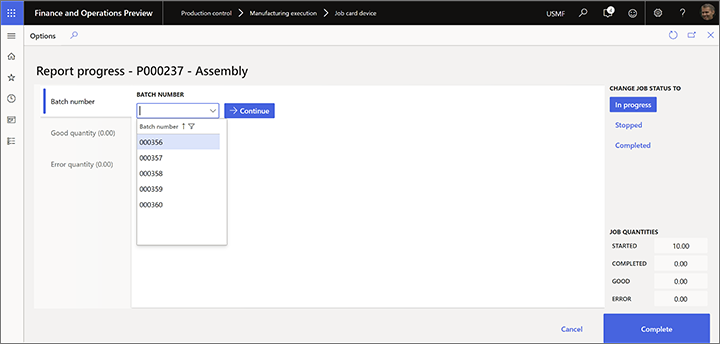

---
# required metadata

title: Report as finished from the job card device
description: This topic describes how to configure the system to allow users of a job card device to report finished products from a production order to the inventory
author: johanhoffmann
manager: tfehr
ms.date: 05/18/2020
ms.topic: article
ms.prod: 
ms.service: dynamics-ax-applications
ms.technology: 

# optional metadata

# ms.search.form:  [Operations AOT form name to tie this topic to]
audience: Application User
# ms.devlang: 
ms.reviewer: kamaybac
ms.search.scope:  Core, Operations
# ms.tgt_pltfrm: 
# ms.custom: [used by loc for topics migrated from the wiki]
ms.search.region: Global
# ms.search.industry: [leave blank for most, retail, public sector]
ms.author: johanho
ms.search.validFrom: 2020-05-18
ms.dyn365.ops.version: Release 10.0.12
---

# Report as finished from the job card device

<!-- KFM: I think maybe the following text should actually be in a section, but I'm not sure what to call that section. -->
<!-- JOHANHO: Re-wrote things a bit -->

Workers use the **Report progress** page on the job card device to report quantities completed on a production job. You can control whether the quantities reported as finished on the last operation should be added to the inventory in the **Production order defaults** parameters page. Go to the **Report as finished** tab and set the **Update finished report on-line** drop-down list:

<!-- KFM: It would be nice to describe the what each of those settings does. -->
<!-- JOHANHO: It would be nice to describe the what each of those settings does. -->

* **No**: No quantity will be added to the inventory when reporting quantities on the last operation. The status of the production order will never change.

* **Status + Quantity**: The production order will change status to reported as finished and the quantity is reported as finished to inventory.

* **Quantity**: The quantity is reported as finished to the inventory, but the production order will never change.

* **Status**: Only the status of the production order will change, but no quantities will be added to the inventory when reporting quantities on the last operation.

Quantities reported as finished on operations that aren't defined as the last operation are not tracked in inventory, but can be used to view progress and can be included in rules that control whether workers are permitted to start the next operation before reaching a defined threshold of reported quantities on the previous operation. You can define these rules on the **Quantity validation** tab of the **Production order defaults** page.

For more information about how to work with the **Production order defaults** page, see [Production parameters in Manufacturing execution](production-parameters-manufacturing-execution.md).

## Report batch-controlled items as finished 
<!-- KFM: Is this only for "non-advanced" warehouse processes? What do we call that? -->
<!-- JOHANHO: Elaborated on that? -->

The job card device supports three principles for reporting on batch items. These prinicples are applicable for items enabled for the advanced warehouse processes as well as items not enabled for the advanced warehouse processes

- **Manually assigned batch numbers**: Workers enter a custom batch number, which might come from an external source that isn't known to the system.
- **Pre-defined batch numbers**: Workers choose from a collection of batch numbers that are automatically generated by the system before the production order is released to job card device.
- **Fixed batch numbers**: Workers don't enter or select a batch number. Instead, the system automatically assigns a batch number to the production order before it is released.

To enable each of these scenarios:

1. Go to **Product information management > Products > Released products**.
1. Select the product you want to configure.
1. Expand the **Manage inventory** FastTab.
1. Open the **Batch number group** drop-down list and select the tracking number group that is configured to support your scenario.

> [!NOTE]
> If a batch-controlled product doesn't have a **Batch number group** assigned, then the job card device defaults to providing manual entry for the batch number when reporting as finished. <!-- KFM: Please confirm that I have understood this note correctly. --> <!-- johanho: yes you have-->

The following subsections describe how to set up tracking number groups to support each of the three scenarios mentioned for reporting on batch items.

### Set up a tracking number group that allows workers to assign a batch number manually

To allow manually assigned batch numbers, set up a tracking number group as follows:

1. Go to **Inventory management > Setup > Dimensions > Tracking number groups**.
1. Create or select the tracking number group you want to set up.
1. On the **General** FastTab, set **Manual** to **Yes**.

    

1. Make other settings as required and then use this tracking number group as your **Batch number group** for the released products where you want to use this scenario.

When you use this scenario, the **Report progress** page on the job card device provides a **Batch number** field where workers can freely enter a value.

### Set up a tracking number group that provides a section of pre-defined batch numbers

To provide a drop-down list of pre-defined batch numbers, set up a tracking number group as follows:

1. Go to **Inventory management > Setup > Dimensions > Tracking number groups**.
1. Create or select the tracking number group you want to set up.
1. On the **General** FastTab, set **Only for inventory transactions** to **Yes**.
1. Use the **Per qty** field to split batch numbers per quantity according to the value you enter here. For example if you have a production order for ten pieces, and **Per qty.** is set to *2*, then five batch numbers will be assigned to the production order when it is created.

    

1. Make other settings as required and then use this tracking number group as your **Batch number group** for the released products where you want to use this scenario.

When you use this scenario, the **Report progress** page on the job card device provides a **Batch number** drop-down list where workers must select a pre-defined value.

### Set up a tracking number group that assigns batch numbers automatically

To assign batch numbers automatically, without worker input, set up a tracking number group as follows:

1. Go to **Inventory management > Setup > Dimensions > Tracking number groups**.
1. Create or select the tracking number group you want to set up.
1. On the **General** FastTab, set **Only for inventory transactions** to **No**.
1. On the **General** FastTab, set **Manual** to **No**. <!-- KFM: right? --> <!-- johanho -- Yes-->

    

1. Make other settings as required and then use this tracking number group as your **Batch number group** for the released products where you want to use this scenario.

When you use this scenario, the **Report progress** page on the job card device displays the **Batch number**, but workers can't edit it.

## Report as finished items that are enabled for advanced warehouse processes

The advanced warehouse processes uses the license plate dimension to track inventory on warehouse locations that have been set up to be tracked by the license plate dimension. In that case, the license plate number is needed when you report as finished. In the configuration page for the job card device you can set up if you during report as finished want to re-use an existing license plate or a new one should be generated This can either be an existing license plate that is re-used or a new license plate number.Go to **Production control > Setup > Manufacturing execution > Configure job card for devices** and set the following options:

* **Generate license plate**: Set this to **Yes** to generate a new license plate for each report as finished. Set this to **No** if an existing license plate should be used for each report as finished.  <!-- ... KFM: I don't see this in the UI. Do we need to enable something? Also, what happens if this is set to No? --> <!-- johanho: Field enabled in FM. I have elaborated on value: No -->
* **Print label**: Set this to **Yes** if the worker needs to print a license plate label for each report as finished. Set this to **No** if no label is required to be printed. The label is configured in the **Document routing** menu. 

<!-- ... KFM: Again, I don't see this in the UI. Do we need to enable something? Where is the Document routing menu, and how do we "configure" it? Also, what happens if this is set to No? -->
<!-- JOHANHO: You need to enable that i Feature management. Also explained No -->

<!-- KFM: I couldn't find any of the things described below. I think I need a demo. -->
<!-- ... KFM: How do we set up the first scenario? -->

