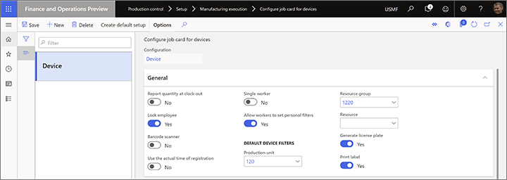

---
# required metadata

title: Report as finished from the job card device
description: This topic describes how to configure the system to allow users of a job card device to report finished products from a production order to the inventory
author: johanhoffmann
manager: tfehr
ms.date: 05/18/2020
ms.topic: article
ms.prod: 
ms.service: dynamics-ax-applications
ms.technology: 

# optional metadata

# ms.search.form:  [Operations AOT form name to tie this topic to]
audience: Application User
# ms.devlang: 
ms.reviewer: kamaybac
ms.search.scope:  Core, Operations
# ms.tgt_pltfrm: 
# ms.custom: [used by loc for topics migrated from the wiki]
ms.search.region: Global
# ms.search.industry: [leave blank for most, retail, public sector]
ms.author: johanho
ms.search.validFrom: 2020-05-18
ms.dyn365.ops.version: Release 10.0.12
---

# Report as finished from the job card device

The *Reporting as finished* process completes finished products on a production order and can then add them to the inventory if appropriate.

<!-- KFM: I think maybe the following text should actually be in a section, but I'm not sure what to call that section. -->

Workers normally use the **Report progress** page on the job card device to report product quantities as finished when they complete the last operation of a production or batch order.

Workers can also use the **Report progress** page to report progress on operations that aren't defined as the last operation in a production route. Quantities reported as finished on those operations are not tracked in inventory, but can be used to view progress and can be included in rules that control whether workers are permitted to start the next operation before reaching a defined threshold of reported quantities on the previous operation. You can define these rules on the **Quantity validation** tab of the **Production order defaults** page.

You can also control whether the quantities reported as finished on the last operation should be added to the inventory. To set this option, go to the **Report as finished** tab of the **Production order defaults** page and set the **Update finished report on-line** drop-down list to **Status + Quantity** or **Quantity**. <!-- KFM: It would be nice to describe the what each of those settings does. -->

For more information about how to work with the **Production order defaults** page, see [Production parameters in Manufacturing execution](production-parameters-manufacturing-execution.md).

## Report batch-controlled items as finished 
<!-- KFM: Is this only for "non-advanced" warehouse processes? What do we call that? -->

The job card device supports three scenarios for reporting on batch items:

- **Manually assigned batch numbers**: Workers enter a custom batch number, which  might come from an external source that isn't known to the system.
- **Pre-defined batch numbers**: Workers choose from a collection of batch numbers that are automatically generated by the system before the production order is released to job card device.
- **Fixed batch numbers**: Workers don't enter or select a batch number. Instead, the system automatically assigns a batch number to the production order before it is released.

To enable each of these scenarios:

1. Go to **Product information management > Products > Released products**.
1. Select the product you want to configure.
1. Expand the **Manage inventory** FastTab.
1. Open the **Batch number group** drop-down list and select the tracking number group that is configured to support your scenario.

> [!NOTE]
> If a batch-controlled product doesn't have a **Batch number group** assigned, then the job card device defaults to providing manual entry for the batch number when reporting as finished. <!-- KFM: Please confirm that I have understood this note correctly. -->

The following subsections describe how to set up tracking number groups to support each of the three scenarios mentioned for reporting on batch items.

### Set up a tracking number group that allows workers to assign a batch number manually

To allow manually assigned batch numbers, set up a tracking number group as follows:

1. Go to **Inventory management > Setup > Dimensions > Tracking number groups**.
1. Create or select the tracking number group you want to set up.
1. On the **General** FastTab, set **Manual** to **Yes**.

    

1. Make other settings as required and then use this tracking number group as your **Batch number group** for the released products where you want to use this scenario.

When you use this scenario, the **Report progress** page on the job card device provides a **Batch number** field where workers can freely enter a value.

### Set up a tracking number group that provides a section of pre-defined batch numbers

To provide a drop-down list of pre-defined batch numbers, set up a tracking number group as follows:

1. Go to **Inventory management > Setup > Dimensions > Tracking number groups**.
1. Create or select the tracking number group you want to set up.
1. On the **General** FastTab, set **Only for inventory transactions** to **Yes**.
1. Use the **Per qty** field to split batch numbers per quantity according to the value you enter here. For example if you have a production order for ten pieces, and **Per qty.** is set to *2*, then five batch numbers will be assigned to the production order when it is created.

    

1. Make other settings as required and then use this tracking number group as your **Batch number group** for the released products where you want to use this scenario.

When you use this scenario, the **Report progress** page on the job card device provides a **Batch number** drop-down list where workers must select a pre-defined value.

### Set up a tracking number group that assigns batch numbers automatically

To assign batch numbers automatically, without worker input, set up a tracking number group as follows:

1. Go to **Inventory management > Setup > Dimensions > Tracking number groups**.
1. Create or select the tracking number group you want to set up.
1. On the **General** FastTab, set **Only for inventory transactions** to **No**.
1. On the **General** FastTab, set **Manual** to **No**. <!-- KFM: right? -->

    

1. Make other settings as required and then use this tracking number group as your **Batch number group** for the released products where you want to use this scenario.

When you use this scenario, the **Report progress** page on the job card device displays the **Batch number**, but workers can't edit it.

## Report as finished items that are enabled for advanced warehouse processes

For items that are enabled for the advanced warehouse processes, reporting as finished is always associated with a specific *Production output location*, which is defined on the resource for the last operation in the production route. <!-- KFM: (Read more about it here). Please provide this link. -->

When you use advanced warehouse processes, the job card device supports two scenarios for reporting as finished to a license-plate controlled output location:

- Workers report as finished to an existing license plate on the production output location. This is relevant, for example, if the license plate represents a pallet and workers continually report items to the same pallet as the finished goods are completed in the production process.
- Workers report as finished to a new license plate each time, and print out a license plate label with the new license plate number

<!-- KFM: I couldn't find any of the things described below. I think I need a demo. -->
You can define the production output location to be tracked by its license plate. This is set up in the **Location profile ID** in the field **Use license plate tracking**. The **Location profile ID** is associated the location. If the production output location is set up to be tracked by license plate, then a license plate has to be specified when reporting as finished.

To <!-- ... KFM: What are we doing here? -->, go to **Production control > Setup > Manufacturing execution > Configure job card for devices** and set the following options:

- **Generate license plate**: Set this to **Yes** to generate a new license plate for each report as finished. <!-- ... KFM: I don't see this in the UI. Do we need to enable something? Also, what happens if this is set to No? -->
- **Print label**: Set this to **Yes** if the worker needs to print a license plate label for each report as finished. The label is configured in the **Document routing** menu. <!-- ... KFM: Again, I don't see this in the UI. Do we need to enable something? Where is the Document routing menu, and how do we "configure" it? Also, what happens if this is set to No? -->

<!-- ... KFM: How do we set up the first scenario? -->

