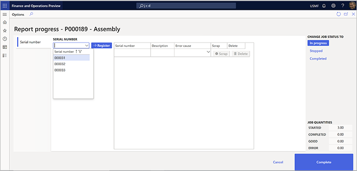

---
# required metadata

title: Report as finished from the job card device
description: This article describes how to configure the system so that users of a job card device can report finished products from a production order to inventory.
author: johanhoffmann
ms.date: 08/05/2022
ms.topic: article
ms.prod: 
ms.technology: 

# optional metadata

ms.search.form: JmgRegistrationSetupTouch
audience: Application User
# ms.devlang: 
ms.reviewer: kamaybac
# ms.tgt_pltfrm: 
# ms.custom: [used by loc for articles migrated from the wiki]
ms.search.region: Global
# ms.search.industry: [leave blank for most, retail, public sector]
ms.author: johanho
ms.search.validFrom: 2020-05-18
ms.dyn365.ops.version: 10.0.13
---

# Report as finished from the job card device

[!include [banner](../includes/banner.md)]

Workers use the **Report progress** page on the job card device to report quantities that have been completed for a production job. This article describes how to set up various options that establish how workers can report as finished using this page and what happens next. Options include:

- Control whether and how quantities that are reported as finished are added to inventory.
- Control whether and how batch numbers are generated and applied when reporting as finished.
- Control whether and how serial numbers are generated and applied when reporting as finished.
- Control whether and how to report as finished to a license plate.

## Control whether quantities that are reported as finished are added to inventory

To control whether and how the quantities that are reported as finished on the last operation should be added to inventory, follow these steps.

1. Go to **Product control \> Setup \> Manufacturing execution \> Production order defaults**.
1. On the **Report as finished** tab, set the **Update finished report on-line** field to one of the following values:

    - **No** – No quantity will be added to inventory when quantities are reported on the last operation. The status of the production order will never change.
    - **Status + Quantity** – The status of the production order will change to *Reported as finished*, and the quantity will be reported as finished to inventory.
    - **Quantity** – The quantity will be reported as finished to inventory, but the status of the production order will never change.
    - **Status** – Only the status of the production order will change. No quantities will be added to inventory when quantities are reported on the last operation.

> [!NOTE]
> Quantities aren't tracked in inventory if the operations that they are reported as finished on aren't defined as the last operation. However, those quantities can be used to view progress. They can also be included in rules that control whether workers can start the next operation before a defined threshold of reported quantities on the previous operation is reached. You can define these rules on the **Quantity validation** tab on the **Production order defaults** page.

For more information about how to work with the **Production order defaults** page, see [Production parameters in Manufacturing execution](production-parameters-manufacturing-execution.md).

## Report batch-controlled items as finished

The job card device supports three scenarios for reporting on batch items. These scenarios apply both to items that are enabled for warehouse management processes (WMS) and to items that aren't enabled for WMS.

- **Manually assigned batch numbers** - Workers enter a custom batch number. This batch number might come from an external source that isn't known to the system.
- **Predefined batch numbers** - Workers select a batch number in a list of batch numbers that the system automatically generates before the production order is released to the job card device.
- **Fixed batch numbers** - Workers don't enter or select a batch number. Instead, the system automatically assigns a batch number to the production order before it's released.

### Enable the feature on your system

To enable your job card devices to accept a batch number during reporting as finished, you must use [feature management](../../fin-ops-core/fin-ops/get-started/feature-management/feature-management-overview.md) to turn on the following features:

- *Improved user experience for the Report progress dialog in the Job Card Device* (As of Supply Chain Management version 10.0.36, this feature is turned on by default.)
- *Enable to enter batch and serial numbers while reporting as finished from the Job Card Device* (As of Supply Chain Management version 10.0.29, this feature is turned on by default. As of Supply Chain Management version 10.0.32, it's mandatory and can't be turned off.)

### Configure products that require batch number reporting

To enable a product to support any of the available batch-controlled scenarios, follow these steps:

1. Go to **Product information management \> Products \> Released products**.
1. Select the product to configure.
1. On the **Manage inventory** FastTab, in the **Batch number group** field, select the tracking number group that is set up to support your scenario.

> [!NOTE]
> By default, if no batch number group is assigned to a batch-controlled product, the job card device provides manual entry for the batch number during reporting as finished.

The following sections describe how to set up tracking number groups to support each of the three scenarios for reporting on batch items.

### Set up a tracking number group that lets workers manually assign a batch number

To allow for manually assigned batch numbers, follow these steps to set up a tracking number group.

1. Go to **Inventory management \> Setup \> Dimensions \> Tracking number groups**.
1. Create or select the tracking number group to set up.
1. On the **General** FastTab, set the **Manual** option to **Yes**.

    

1. Set other values as you require, and then select this tracking number group as the batch number group for released products that you want to use this scenario for.

When you use this scenario, the **Batch number** field that the **Report progress** page on the job card device provides is a text box where workers can enter any value.

### Set up a tracking number group that provides a list of predefined batch numbers

To provide a list of predefined batch numbers, follow these steps to set up a tracking number group.

1. Go to **Inventory management \> Setup > Dimensions \> Tracking number groups**.
1. Create or select the tracking number group to set up.
1. On the **General** FastTab, set the **Only for inventory transactions** option to **Yes**.
1. Use the **Per qty** field to split batch numbers per quantity, based on the value that you enter. For example, you have a production order for ten pieces, and the **Per qty** field is set to *2*. In this case, five batch numbers will be assigned to the production order when it's created.

    

1. Set other values as you require, and then select this tracking number group as the batch number group for released products that you want to use this scenario for.

When you use this scenario, the **Batch number** field that the **Report progress** page on the job card device provides is a drop-down list where workers must select a predefined value.

### Set up a tracking number group that automatically assigns batch numbers

If batch numbers should be assigned automatically, without worker input, follow these steps to set up a tracking number group.

1. Go to **Inventory management \> Setup \> Dimensions \> Tracking number groups**.
1. Create or select the tracking number group to set up.
1. On the **General** FastTab, set the **Only for inventory transactions** option to **No**.
1. Set the **Manual** option to **No**.

    

1. Set other values as you require, and then select this tracking number group as the batch number group for released products that you want to use this scenario for.

When you use this scenario, the **Batch number** field that the **Report progress** page on the job card device provides shows a value, but workers can't edit it.

## Report serial-controlled items as finished

The job card device supports three scenarios for reporting on serial-controlled items. These scenarios apply both to items that are enabled for warehouse management processes (WMS) and to items that aren't enabled for WMS.

- **Manually assigned serial numbers** - Workers enter a custom serial number. This serial number might come from an external source that isn't known to the system.
- **Predefined serial numbers** - Workers select a serial number in a list of serial numbers that the system automatically generates before the production order is released to the job card device.
- **Fixed serial number** - Workers don't enter or select a serial number. Instead, the system automatically assigns a serial number to the production order before it's released.

### Enable the feature on your system

To enable your job card devices to accept a serial number during reporting as finished, you must use [feature management](../../fin-ops-core/fin-ops/get-started/feature-management/feature-management-overview.md) to turn on the following features:

- *Improved user experience for the Report progress dialog in the Job Card Device* (As of Supply Chain Management version 10.0.36, this feature is turned on by default.)
- *Enable to enter batch and serial numbers while reporting as finished from the Job Card Device* (As of Supply Chain Management version 10.0.29, this feature is turned on by default.)

### Configure products that require serial-number reporting

To enable a product to support any of the available serial-controlled scenarios, follow these steps:

To enable each scenario, follow these steps.

1. Go to **Product information management \> Products \> Released products**.
1. Select the product to configure.
1. On the **Manage inventory** FastTab, in the **Serial number group** field, select the tracking number group that is set up to support your scenario.

> [!NOTE]
> By default, if no serial number group is assigned to a serial-controlled product, the job card device provides manual entry for the serial number during reporting as finished.

The following sections describe how to set up tracking number groups to support each of the three scenarios for reporting on serial-controlled items.

### Set up a tracking number group that lets workers manually assign a serial number

To allow for manually assigned serial numbers, follow these steps to set up a tracking number group.

1. Go to **Inventory management \> Setup \> Dimensions \> Tracking number groups**.
1. Create or select the tracking number group to set up.
1. On the **General** FastTab, set the **Manual** option to **Yes**.

    

1. Set other values as you require, and then select this tracking number group as the serial number group for released products that you want to use this scenario for.

When you use this scenario, the **Serial number** field that the **Report progress** page on the job card device provides is a text box where workers can enter any value for the serial number. On entering a value, it is added to the serial number list. In this list,  workers can do the following:

- To mark a serial number as scrapped, select the **Scrap** button for the appropriate row. The worker will be prompted to provide an **Error cause**.
- To delete a serial number, select the **Delete** button for the appropriate row.

### Set up a tracking number group that provides a list of predefined serial numbers

To provide a list of predefined serial numbers, follow these steps to set up a tracking number group.

1. Go to **Inventory management \> Setup \> Dimensions \> Tracking number groups**.
1. Create or select the tracking number group to set up.
1. On the **General** FastTab, set the **Only for inventory transactions** option to **Yes**.
1. Use the **Per qty** field to split serial numbers per quantity of one.

    

1. Set other values as you require, and then select this tracking number group as the serial number group for released products that you want to use this scenario for.

When you use this scenario, the **Serial number** field that the **Report progress** page on the job card device provides is a drop-down list where workers must select a predefined value.

### Set up a tracking number group that automatically assigns serial numbers

If a serial number should be assigned automatically, without worker input, follow these steps to set up a tracking number group.

1. Go to **Inventory management \> Setup \> Dimensions \> Tracking number groups**.
1. Create or select the tracking number group to set up.
1. On the **General** FastTab, set the **Only for inventory transactions** option to **No**.
1. Set the **Manual** option to **No**.

    

1. Set other values as you require, and then select this tracking number group as the serial number group for released products that you want to use this scenario for.

When you use this scenario, the **Serial number** field that the **Report progress** page on the job card device provides shows a value, but workers can't edit it. This scenario is only relevant when a production order is created for a quantity of one piece of a serial number-controlled item.

## Report as finished to a license plate

Warehouse management processes (WMS) can use the license plate dimension to track inventory on warehouse locations that have been set up for this purpose. In this case, the license plate number is required when a worker reports quantities as finished.

### Enable license plate reporting and label printing

To use the features that are described in this section, you must use [feature management](../../fin-ops-core/fin-ops/get-started/feature-management/feature-management-overview.md) to turn on the following features (in this order):

1. *License plate for reporting as finished added to the Job Card Device* (As of Supply Chain Management version 10.0.21, this feature is turned on by default. As of Supply Chain Management version 10.0.25, this feature is mandatory.)
1. *Enable automatic generation of license plate number when reporting as finished in the job card device* (As of Supply Chain Management version 10.0.25, this feature is mandatory.)
1. *Print label from Job Card Device* (As of Supply Chain Management version 10.0.25, this feature is mandatory.)

### Set up reporting as finished to a license plate

To control whether workers should reuse an existing license plate or generate a new license plate when they report quantities as finished, follow these steps.

1. Go to **Production control \> Setup \> Manufacturing execution \> Configure job card for devices**.
2. Set the following options for each device:

    - **Generate license plate** – Set this option to **Yes** to generate a new license plate for each report as finished. Set it to **No** if an existing license plate should be used for each report as finished.
    - **Print label** – Set this option to **Yes** if the worker must print a license plate label for each report as finished. Set it to **No** if no label is required. 

> [!NOTE]
> To configure the label, go to **Warehouse management \> Setup \> Document routing \> Document routing**. For more information, see [Document routing label layouts](../warehousing/document-routing-layout-for-license-plates.md).

[!INCLUDE[footer-include](../../includes/footer-banner.md)]