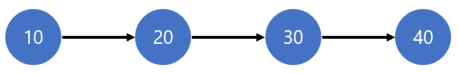
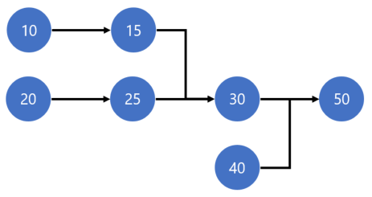
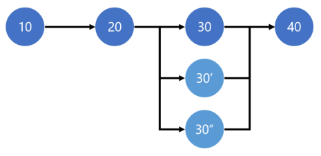

# Routes and operations

[!include [banner](../includes/banner.md)]

This article provides information about routes and operations. A route defines the process for producing a product or product variant. It describes each step (operation) in the production process and the order that these steps must be performed in. For each step, the route also defines the required operations resources, the required setup time and run time, and how the cost should be calculated.

## Overview

A route describes the order of operations that is required in order to produce a product or product variant. For each operation, the route also defines the operations resources that are required, the time that is required in order to set up and perform the operation, and how the cost should be calculated. You can use the same route to produce multiple products, or you can define a unique route for each product or product variant. You can even have multiple routes for the same product. In this case, the route that is used varies, depending on factors such as the quantity that must be produced. The definition of a route in Supply Chain Management consists of four separate elements that, together, describe the production process:

- **Route** – A route defines the structure of the production process. In other words, it defines the order of operations.
- **Operation** – An operation identifies a named step in a route, such as **Assembly**. The same operation can occur in multiple routes and can have different operation numbers.
- **Operation relation** – An operation relation defines the operational properties of an operation, such as the setup time and run time, cost categories, consumption parameters, and resource requirements. The operation relation enables the operational properties of an operation to vary, depending on the route that the operation is used in or the products that are being produced.
- **Route version** – A route version defines the route that is used to produce a product or product variant. Route versions enable routes to be reused across products or changed over time. They also enable different routes to be used to produce the same product. In this case, the route that is used depends on factors such as the location or the quantity that must be produced.

## Routes

A route describes the order of operations that is used to produce a product or product variant. Each operation is assigned an operation number and a successor operation. The order of operations forms a route network that can be represented by a directed chart that has one or more starting points and a single end point. In Supply Chain Management, routes are distinguished based on the type of structure. The two types of routes are simple routes and route networks. In the Production control parameters, you can specify whether only simple routes can be used, or whether the more complex route networks can be used.

### Simple routes

A simple route is sequential, and there's only one starting point for the route.

If you enable only simple routes in the Production control parameters, Supply Chain Management automatically generates the operation numbers (10, 20, 30, and so on) when you define the route.

### Route networks

If you enable the more complex route networks in the Production control parameters, you can define routes that have multiple starting points and operations that can be run in parallel.

> [!NOTE]
>
> - Each operation can have only one successor operation, and the entire route must end in a single operation.
> - This does not ensure that multiple operations that have the same successor operation (for example, operations 30 and 40 in the preceding illustration) will actually be run in parallel. The availability and capacity of resources might put constraints on the way that operations are scheduled.
> - You can't use 0 (zero) as the operation number. That number is reserved and is used to specify that the last operation in the route has no successor operation.

### Parallel operations

Sometimes, a combination of multiple operations resources that have different characteristics is required in order to perform an operation. For example, an assembly operation might require a machine, a tool, and one worker for every two machines to oversee the operation. This example can be modeled by using parallel operations, where one operation is designated as the primary operation and the others are secondary.

Typically, the primary operation represents the bottleneck resource and dictates the run time for the secondary operations. However, during scheduling that involves finite capacity, the resources that are scheduled for both the primary operation and the secondary operations must be available and have free capacity at the same time.

Both the primary operation and the secondary operations must have the same operation number (30 in the preceding illustration).

In the preceding example, the resource requirement for the primary operation (30) is the machine, whereas the resource requirements for the secondary operations (30' and 30'') are the tool and the worker. A fifty-percent load helps guarantee that the scheduled worker can oversee two machines at the same time.

### Approval of routes

A route must be approved before it can be used in the planning or manufacturing process. Approval indicates that the route design has been completed. The same released product or released product variant can have multiple approved routes. Typically, approval of a route occurs when the first relevant route version is approved. However, in some business scenarios, the approval of the route and the route version are separate activities that might involve different process owners.

Each route can be approved or unapproved separately. However, when a route is unapproved, all related route versions are also unapproved. In the Production control parameters, you can specify whether routes can be unapproved, and whether approved routes can be changed.

If you must keep a log of who approves each route, you can require electronic signatures for route approval. Users will then have to confirm their identity by using an [electronic signature](../../fin-ops-core/fin-ops/organization-administration/electronic-signature-overview.md).

## Operations

An operation is a step in the production process. Each operation has an ID and a simple description. The following table shows typical examples of operations from a machine shop.

| Operation | Description |
|---|---|
| PipeCut | Pipe cutting |
| TIGweld | TIG welding |
| JigAssy | Jig assembly |
| Inspection | Quality inspection |

The operational properties of the operation, such as the setup time and run time, resource requirements, costing information, and consumption calculation, are specified on the operation relation. (For more information about operation relations, see the next section.)

## Operation relations

The following operational properties of an operation are maintained on the operation relation:

- Cost categories
- Consumption parameters
- Processing times
- Processing quantities
- Resource requirements
- Notes and instructions

You can define multiple operation relations for the same operation. However, each operation relation is specific to one operation, and stores properties that are specific to a route, a released product, or a set of released products that are related to an item group. Therefore, the same operation can be used in multiple routes that have different operational properties. In addition, you can more easily maintain your master data if you use standard operations that have the same operational properties, regardless of the route that is used and product that is produced. The scope of the operation relation is defined through the **Item code**, **Item relation**, **Route code** and **Route relation** properties, as shown in the following table.

| Item code | Item relation | Route code | Route relation | Scope of the operation relation |
|---|---|---|---|---|
| Table | &lt;Item&nbsp;ID&gt; | Route | &lt;Route&nbsp;ID&gt; | The operational properties of an operation when it's used in the route where **Route number**=*&lt;route&nbsp;ID&gt;* to produce the released product where **Item number**=*&lt;Item&nbsp;ID&gt;*. |
| Table | &lt;Item&nbsp;ID&gt; | All | | The default operational properties of an operation when it's used to produce the released product where **Item number**=*&lt;Item&nbsp;ID&gt;*. In other words, these operational properties apply when there's no route-specific operation relation for the released product. |
| Group | &lt;Item&nbsp;group&nbsp;ID&gt; | Route | &lt;Route&nbsp;ID&gt; | The operational properties of an operation when it's used in the route where **Route number**=*&lt;route&nbsp;ID&gt;* to produce released products that are associated with item group *&lt;Item&nbsp;group&nbsp;ID&gt;*, unless there's a route-specific operation relation for the released product. |
| Group | &lt;Item&nbsp;group&nbsp;ID&gt; | All | | The default operational properties of an operation when it's used to produce released products that are associated with item group *&lt;Item&nbsp;group&nbsp;ID&gt;*, unless a more specific operation relation exists. |
| All | | Route | &lt;route&nbsp;ID&gt; | The default operational properties of the operation when it's used in the route where **Route number**=*&lt;route&nbsp;ID&gt;*. In other words, these operational properties apply when there's no operation relation for this route that is specific to either the released product or its associated item group. |
| All | | All | | The default operational properties of an operation. These operational properties apply when a more specific operation relation doesn't exist. |

You can also specify that an operation relation is specific to a site. In this way, the operational properties of an operation can vary, depending on the location (that is, the site) where the operation is performed. For configured products, you can also specify different operational properties for each product configuration.

Operation relations give you lots of flexibility when you define your routes. Additionally, the ability to define default properties helps reduce the amount of master data that you must maintain. However, this flexibility also means that you must be aware of the context that you modify an operation relation in.

> [!NOTE]
> Because the operational properties are stored in operation relations per operation for each route, all occurrences of the same operation (for example, Assembly) have the same setup time, run time, and resource requirements. Therefore, if two occurrences of an operation must occur in the same route but have different run times, you must create two separate operations, such as Assembly1 and Assembly2.

### Modifying product-specific routes

When you open the **Route** page from the **Released product details** page, the route versions that are associated with the selected released product are shown. In this context, for each operation, Supply Chain Management shows the operational properties from the operation relation that best matches the route version. You'll notice that the list of operations includes the **Item code** and **Route code** properties from the operation relation. Therefore, you can determine which operation relation is shown.

On the **Route** page, you can modify the operational properties of the operation, such as the run time or the cost categories. Your changes are stored on the operation relation that is specific to the route and released product that are referenced in the current route version. If the operation relation that is shown isn't specific to the route and the released product, before your changes are stored, the system creates a copy of the operation relation. This copy *is* specific to the route and released product. Therefore, your changes won't affect other routes or released products. To verify which operation relation is being modified on the **Route** page, look at the **Item code** and **Route code** fields.

You can also manually create an operation that is specific to a route and released product by using the **Copy and edit relation** function.

> [!NOTE]
> If you add a new operation to a route on the **Route** page, an operation relation is created only for the current released product. Therefore, if the route is also used to produce other released products, no applicable operation relation will exist for those released products, and the route can no longer be used for those released products.

### Maintaining operation relations per route

When you open the **Route details** page from the **Routes** list page, a list of all the operation relations that apply to the selected route is shown. Therefore, you can easily verify which operational properties are used for which products. You can modify both default property values and product-specific property values.

If you add a new operation relation on the **Route details** page, the **Route code** field is automatically set to **Route**, and the **Route relation** field is set to the route number of the current route.

### Maintaining operation relations per operation

From the **Operations** page, you can open the **Operation relations** page. On this page, you can modify all operation relations for a specific operation. You can even modify operation relations that contain default values.

If your business uses standard operations, and if the operational parameters are the same across all products and processes, the **Operation relations** page provides a convenient way to maintain the default operational properties of those operations.

### Applying operation relations

In some cases, Supply Chain Management must find the operational properties for an operation. For example, when a purchase order is created, the operational properties of each operation must be copied from the operation relations to the production route. In these situations, Supply Chain Management searches the relevant operation relations from the most specific combination to the least specific combination.

When Supply Chain Management searches for the most relevant operation relation for a released product, an operation relation that matches the item ID of the released product is preferred over an operation relation that matches the item group ID. In turn, an operation relation that matches the item group ID is preferred over the default operation relation. The search is done in the following order:

1. **Item code**=*Table* and **Item relation**=*&lt;Item&nbsp;ID&gt;*
1. **Item code**=*Group* and **Item relation**=*&lt;Item&nbsp;group&nbsp;ID&gt;*
1. **Item code**=*All*
1. **Route code**=*Route* and **Route relation**=*&lt;route&nbsp;ID&gt;*
1. **Route code**=*All*
1. **Configuration**=*&lt;configuration ID&gt;*
1. **Configuration**=
1. **Site**=*&lt;site ID&gt;*
1. **Site**=

Therefore, an operation should be used only one time for each route. If the operation occurs multiple times in the same route, all occurrences of that operation will have the same operation relation, and you won't be able to have different properties (for example, run times) for each occurrence.

## Route versions

Route versions are used to accommodate variations in the production of products or provide greater control over the production process. They define which route should be used when a specific released product or released product variant is produced. You can use the following constraints to define which route is used for a released product:

- Product dimensions (size, color, style, or configuration)
- Production quantity
- Production site
- Production date

When you're producing the product at a specific site, in a specific quantity, or in a specific period, you can designate a specific route version as the default route version. However, only one active route is allowed for a given released product and a given set of constraints.

On the **Production control parameters** page, you can require that the validity period of a route version must always be specified.

### Approval of route versions

Before a route version can be used in the planning or manufacturing process, it must be approved. When you approve a route version, you can also approve the related route. However, a route version can be approved only if the related route is also approved.

### Activating the default route version

When you activate a route version, you designate it as the default route version that master planning will use, or that will be used to create production orders. You can have only one active route version for a given set of constraints (for example, period, site, or quantity). If the version that you’re trying to activate conflicts with a version that is already active, you receive an error message. To prevent an ambiguous activation, you must then either inactivate the conflicting version or modify the constraints (usually the period) on the route version.

### Electronic signatures

If you must keep a log that records who approves and activates each route version, you can require electronic signatures for these tasks. Users who approve and activate route versions will then have to confirm their identity by using an [electronic signature](../../fin-ops-core/fin-ops/organization-administration/electronic-signature-overview.md).

### Product change that uses case management

The product change case for the approval and activation of new or changed routes and route versions gives you an easy way to see an overview of the route version constraints. You can also approve and activate all routes that are related to a specific change in one operation and document the results in the product change case.

## Maintaining routes

Depending on your business requirements, you might be able to reduce the effort that is required in order to maintain your process definitions.

### Making routes independent of resources

In many systems, the operations resource or resource group that should perform an operation must be specified in the route. However, in Supply Chain Management, you can define a set of requirements that an operations resource must meet to be applicable for the operation. Therefore, the specific operations resource or resource group that should be used doesn't have to be determined until the operation is actually scheduled. This functionality is especially useful when you have many workers or machines that can perform the same operation.

For example, you specify that an operation requires an operations resource of the **Machine** type that has a **Stamping** capability of 20 tons. The scheduling engine will then resolve these requirements to a specific operations resource or resource group when the operation is scheduled. Because you can just specify these requirements instead of binding the operation to a specific machine, you have much more flexibility. Additionally, maintenance is easier when resources are moved or new resources are added.

For more information about the various types of resource requirements and how to use them, see Operations resource requirements and [Resource capabilities](resource-capabilities.md).

### Sharing routes across sites

If you produce the same product at more than one production site, and if the steps for producing the product are the same at all sites, you can often design a shared route that is used across all production sites. To create a shared route, don't specify a site on the route itself. However, you must still create a route version that associates the shared route with the product at each site.

You must also make sure that the resource requirements for each operation in the route don't call for specific operations resources or resource groups, but are instead expressed in terms of the characteristics of the required resources. The scheduling engine will then be able to assign the appropriate operations resources from the site that the production is scheduled on. For example, if there are small differences in the run time, or if the setup time for a certain operation is site-specific, you can specify this information by adding an additional operation relation for that site.

To take full advantage of the benefits of shared routes, you should also use resource consumption on the corresponding bill of materials (BOM). When you set the flag for resource consumption on the BOM line, the warehouse and location that raw materials should be consumed from is inferred from the operations resource that the operation is scheduled on. Therefore, the warehouse and location don't have to be determined until the production is actually scheduled. In this way, you can make both the BOM and the route independent of the physical location where the product is produced.

### Standard operation relations

If your business uses standardized operations throughout production, and if there's little or no variation in the setup time, run time, consumption calculation, cost calculation, and so on, you might benefit from creating default operation relations for all operations. In this case, avoid creating operation relations that are specific to any route or released product.

If you also express resource requirements in terms of skills and capabilities, and make your routes site-independent, you can help keep the ongoing maintenance of your business processes to a minimum.

When you use this approach, the **Operation relations** page becomes your primary destination for maintaining run times and other properties.

### Resource-specific process times

If you don't specify an operations resource or resource group as part of the resource requirements for an operation, the applicable resources might operate at different speeds. Therefore, the time that is required in order to process an operation might vary. To resolve this issue, you can use the **Formula** field on the operation relation to specify how the process time is calculated. The following options are available:

- **Standard** – (Default option) The calculation uses only the fields from the operation relation and multiplies the specified run time by the order quantity.
- **Capacity** – The calculation includes the **Capacity** field from the operations resource. Therefore, the time is resource-dependent. The value that is specified on the operations resource is capacity per hour. The **Process time** is calculated as **Order quantity** divided by **Capacity**. The capacity value isn't specific to a particular unit of measure and therefore isn't converted based on the **Capacity unit** field, which is just a descriptive field that isn't used in calculations.
- **Batch** – A batch capacity is calculated by using information from the operation relation. The number of batches and, therefore, the process time can then be calculated based on the order quantity.
- **Resource batch** – This option is basically the same as the **Batch** option. However, the calculation includes the **Batch capacity** field from the operations resource. Therefore, the time is resource dependent.

### Set up route groups

You can define the route groups and the setup for its route or job types under **Production control \> Setup \> Routes \> Route groups**. For each route/job type in the route group, you can select or clear the following options:

- **Activation** – Select this option to enable calculations and scheduling for the selected job type, and to receive job feedback when you run job scheduling. You need to select this option to enable the job type and then, select the rest of the options for that job type. If the activation isn't selected, that job type won't be enabled, regardless of the selection of the other options.
- **Job management** – Select this option to include the job type in job management when you run job scheduling.
- **Working time** – Select this option to schedule the job type according to the working time calendar that is defined for the operations resource, otherwise the Gregorian calendar is used. Working time can be scheduled either according to the Gregorian calendar or the defined working calendar. If you select this option, scheduling is based on the defined working time calendar. Additionally, the job of the job type is scheduled from midnight on the date that is defined as the job's starting date.
- **Capacity** – Select this option to reserve capacity for the job type when you run job scheduling. If you select this option, capacity is reserved when scheduling is run for the selected job type. This gives you an overview of which job types in each route group use the operations resources. For example, in a situation where drying resources are bottleneck resources, these resources must be specified as bottlenecks. Drying operations that are assigned to queue time job types will reserve drying resources.

For each of the job types, you first need to activate or de-activate it. When de-activated, none of the other setup (Job management, working time, and capacity) will be considered, as the job type won't be active.

One of the job types is *Overlap*. Overlap allows different jobs to be performed at the same time. When jobs are overlapping, the resources can be used but can't be reserved for the specific jobs.
Therefore, when **Activation** is selected for the row with a **Route/job type** of *Overlap*, the rest of the settings (**Job management**, **Working time**, and **Capacity**) don't have any impact on the route group.

> [!NOTE]
> When you upgrade versions, you might encounter the following error: *CRL Error occurred while invoking the scheduling engine*. If you receive this error, go to the **Route groups** page and for all the routes where you have activated the **Route/job type** *Overlap*, clear the **Job management**, **Working time**, and **Capacity** check boxes.

## Additional resources

- [Bills of materials and formulas](bill-of-material-bom.md)
- [Cost categories used in production routing](../cost-management/cost-categories-used-production-routings.md)
- [Resource capabilities](resource-capabilities.md)
- [Electronic signature overview](../../fin-ops-core/fin-ops/organization-administration/electronic-signature-overview.md)

[!INCLUDE[footer-include](../../includes/footer-banner.md)]
