---
# required metadata

title: Subcontracting
description: This topic will help you build a walkthrough of subcontracting in manufacturing in Dynamics 365 Supply Chain Management.
author: johanhoffmann
ms.date: 09/28/2018
ms.topic: article
ms.prod: 
ms.technology: 

# optional metadata

# ms.search.form:  
audience: Application User
# ms.devlang:
ms.reviewer: kamaybac
# ms.tgt_pltfrm: 
# ms.custom: 
ms.search.region: Global
# ms.search.industry: 
ms.author: johanho
ms.search.validFrom: 2018-09-30
ms.dyn365.ops.version: 

---

# Subcontracting

[!include [banner](../includes/banner.md)]

This topic will help you build a walkthrough of subcontracting in manufacturing in Microsoft Dynamics 365 Supply Chain Management. The first part of this topic describes the setup of the data. The second part takes you through the steps in the walkthrough.

## Target audience

In this topic, you will learn how to set up subcontracting in manufacturing. You will use existing data in the HQUS legal entity to do the basic setup of a subcontracting activity flow. The demo data in the HQUS legal entity includes setup parameters that have been preset to support the steps in the walkthrough. Even though the walkthrough addresses key pain points and challenges for various roles, it can be completed by the system admin.

## Demo scenario

In the HQUS legal entity, high-end speakers are manufactured. During the manufacturing process, speakers go through the following three operations.

- **Pre-assembly** – The speaker cabinet is assembled. The material for the cabinet is picked in the material warehouse before the operation is started.
- **Coating** – After the speaker cabinet has been assembled, it must be coated. This operation is completed by a vendor (subcontractor). The pre-assembled speaker cabinet is shipped to the coating subcontractor together with two materials.
- **Finish** – After the pre-assembled speaker cabinet has been coated by the subcontractor, it's returned to the HQUS legal entity so that final assembly of the speaker can be completed.

The following illustration shows the three operations and the materials that they consume.

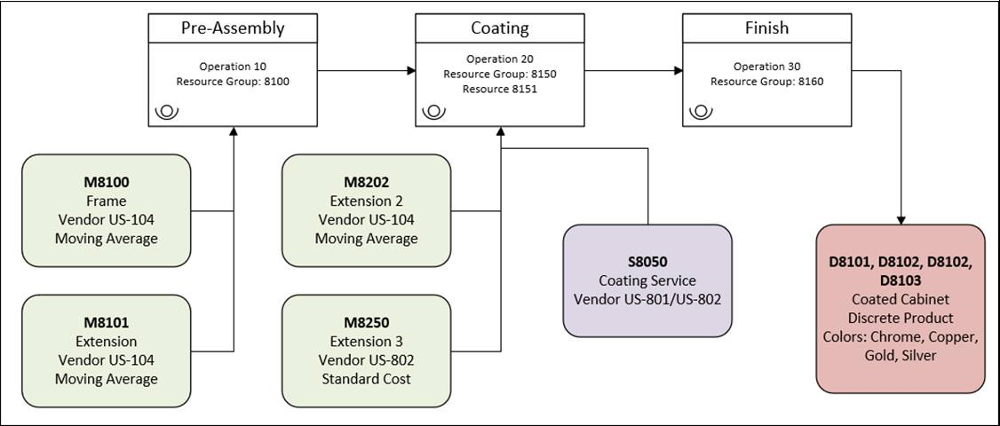

## Setup

Before you start the walkthrough, you must set up the data.

### Set up the finished product

This procedure takes you through the setup of released product D8100, "Coated Cabinet."

1. Select **Product information management \> Products \> Released products** to open the **Released product details** page.
2. In the quick filter field, enter **D8100** to find the existing released product.

    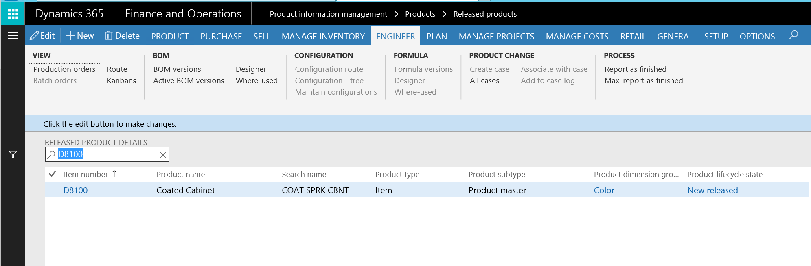

3. On the Action Pane, on the **Engineer** tab, select **Route** to open the **Route** page.

    The **Route** page shows the eight route versions for released product D8100. The eight route versions are divided among four routes on site 1 and site 5. Route 000400 is used for costing, route 00041 is used when the Coating operation is an internal operation, and route 00042 is used when the Coating operation is an external operation.

    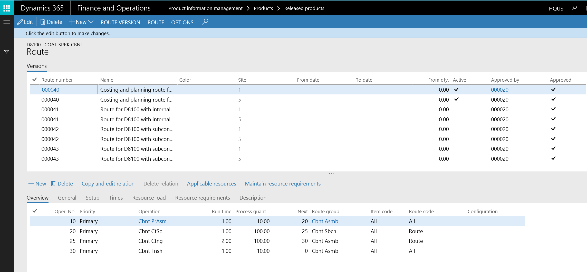

4. In the upper pane, in the **Versions** grid, select route version **00042** for site **5**.
5. In the lower pane, on the **Overview** tab, select operation **20** (**Cbnt CtSc**) in the grid.

    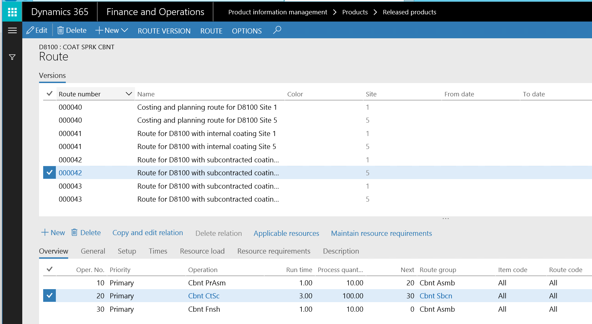

6. Select the **General** tab.

    Notice that the field **Route type** field is set to **Vendor**. This value indicates that operation 20 (Cbnt CtSc) is a subcontracted operation.

    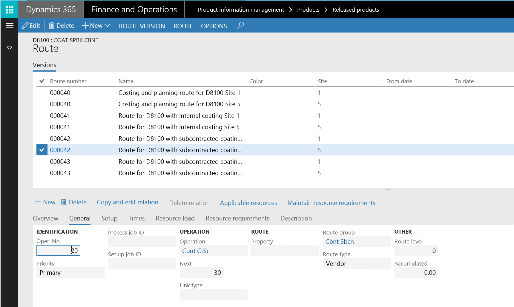

7. Select the **Resource requirements** tab.

    Capabilities will be used to find an applicable resource during production scheduling. For operation 20 (Cbnt CtSc), notice that a resource that has two capabilities, **Coating** and **Coated cabinets**, is required.

    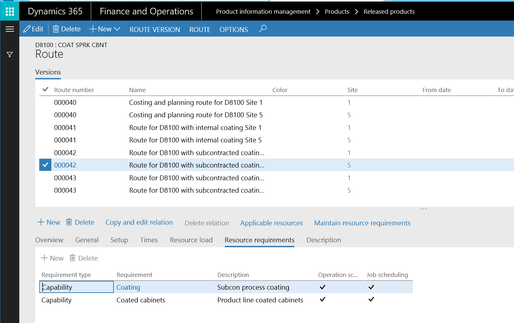

8. Select **Applicable resources** to open the **Applicable resources** dialog box.

    Three resources are found that match the resource requirements for the operation. Notice that resources 8851 and 8852 are of the **Vendor** type.

    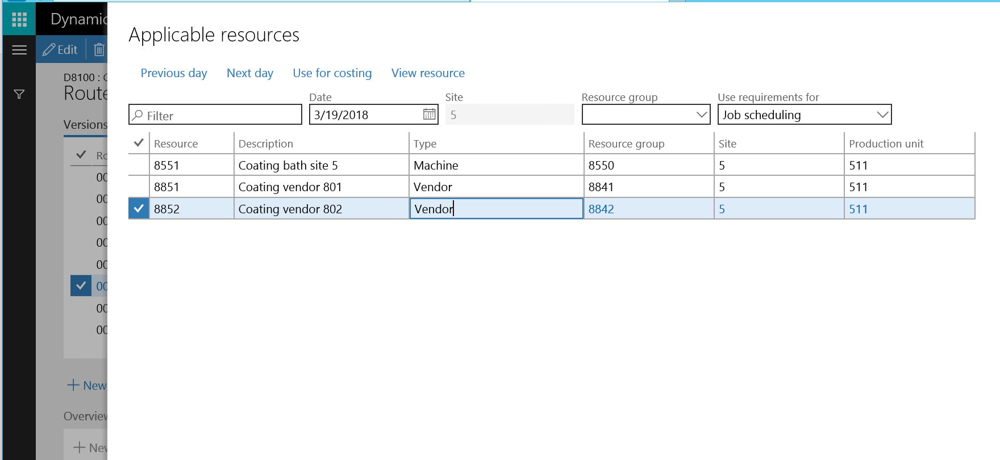

9. Select **OK** to close the **Applicable resources** dialog box and return to the **Route** page.
10. Close the **Route** page to return to the **Released product details** page.

    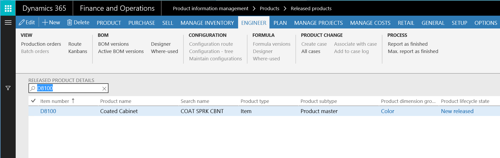

11. On the Action Pane, on the **Engineer** tab, select **BOM versions** to open the **BOM versions** page.

    The **BOM versions** page shows the four bill of materials (BOM) versions for released product D8100. BOM 000040 is used for costing and planning, BOM 000041 is used if the Coating operation is done in-house, and BOMs 000042 and 000043 are used if the Coating operation is subcontracted.

    Notice that item S8050 is a product of the **Service** item type. This item represents the subcontracted work.

    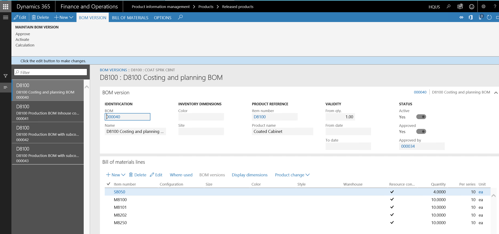

12. On the **Bill of materials lines** FastTab, select **Edit** to open the **Edit BOM line** dialog box.

    When a production order is created and estimated for released product D8100, a purchase order will be automatically generated for item S8050. This purchase order will be linked to the production order. For purchase orders to be automatically generated, the **Line type** field must be set to **Vendor**, and the vendor account for the subcontractor must be selected. In this case, the vendor account is US-801.

    Notice that the BOM line is connected to the Coating operation through the operation number (in this case, 20).

    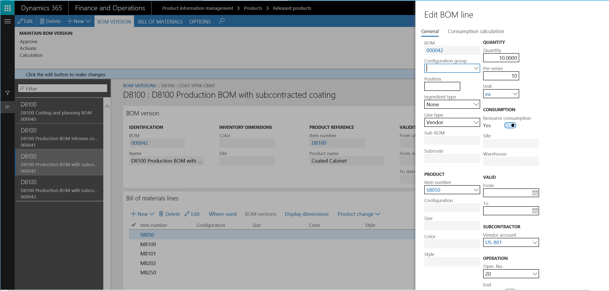

### Create a password for warehouse workers

You must define a password for the warehouse workers who use the hand-held device.

1. Select **Warehouse management \> Setup \> Worker** to open the **Work users** page.
2. On the **Users** FastTab, select the row for user **51**.

    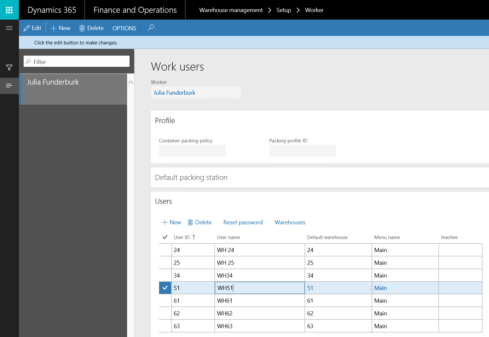

3. Select **Reset password**.
4. In the **Password** and **Confirm password** fields, enter **1**.
5. Select **Set password**.

## Step-by-step walkthrough

**Scenario and background**

A production order of 10 pieces is created for product D8100, "Coated Cabinet." The coating of the cabinets is a sub-contracted operation that is done at vendor US-801, Perfect Coating Solutions. The production order consists of three operations. In the first operation, the cabinet is pre-assembled as an in-house operation. The material for the pre-assembly is released for picking in the raw material warehouse. After the pre-assembly is completed, the pre-assembled cabinet is sent to Perfect Coating Solutions together with two materials that are required for the Coating operation. When the coated cabinet is received back from the vendor, it goes through a final in-house assembly operation before it's reported as finished.

1. Select **Production control \> Production orders \> All production orders** to open the **All production orders** page.
2. On the Action Pane, select **New production order** to open the **Create production order** dialog box.

    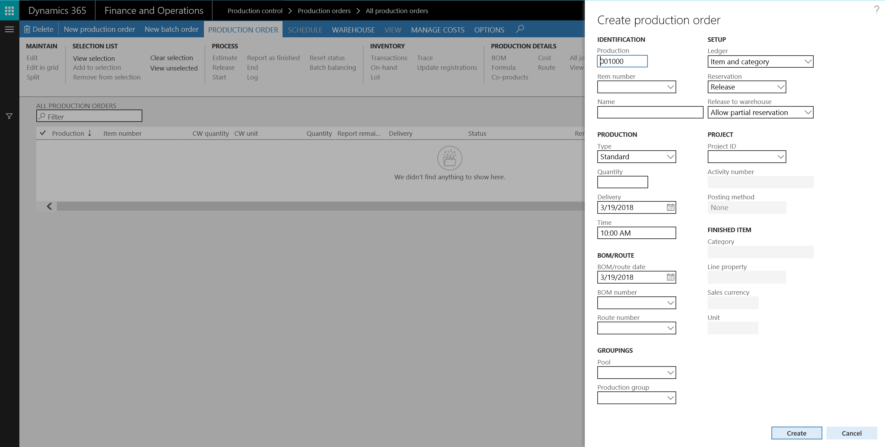

3. In the **Item number** field, select **D8100**.
4. After you select the item number, fields for the inventory dimensions appear. In the **Color** field, select **Chrome**.

    A message box appears that asks whether the active versions for the BOM and route should be inserted.

    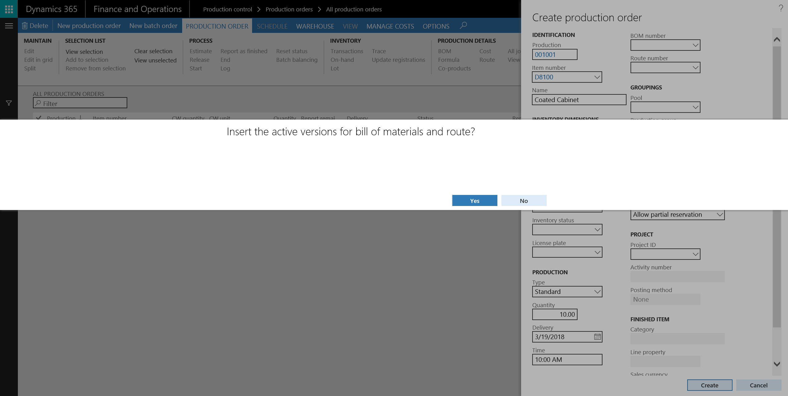

5. Select **Yes**. 

    In the **Create production order** dialog box, the active versions of the BOM and route for product D8100 are automatically selected in the **BOM number** and **Route number** fields, respectively. In this case, BOM **000040** and route **000040** are selected.
    
    > [!NOTE]
    > For both the BOM and the route, version 000040 is used for costing and planning.

6. In the **Site** field, select **5**.
7. In the **Warehouse** field, select **51**.
8. In the **BOM number** and **Route number** fields, change the value that was automatically selected to **000042**.

    > [!NOTE]
    > For both the BOM and the route, version 000042 is used to subcontract the coating of the cabinet to vendor US-801.

    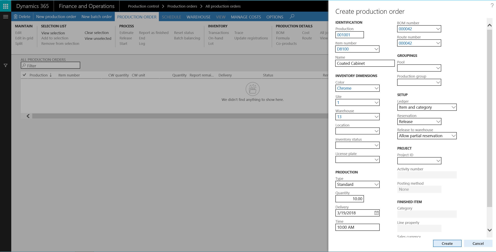

9. Select **Create** to create the production order and return to the **All production orders** page.

    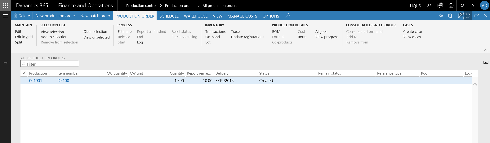

10. On the Action Pane, on the **Production order** tab, select **Estimate** to open the **Estimate** dialog box.

    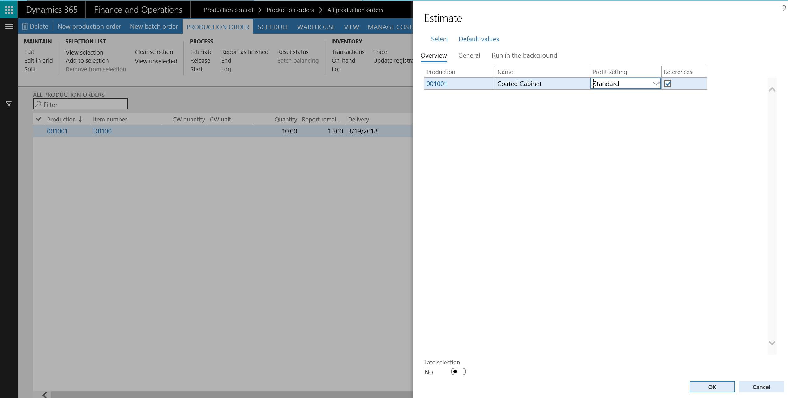

11. Select **OK** to confirm the estimate and return to the **All production orders** page.

    > [!NOTE]
    > When the production order is estimated, the purchase order for service item S8050 is generated for vendor US-801.

12. On the Action Pane, on the **Production order** tab, select **BOM** to open the **BOM** page, where you can view the BOM lines for the production order.

    For service item S8050, notice that there is a reference to the purchase order that was generated when the production order was estimated.

    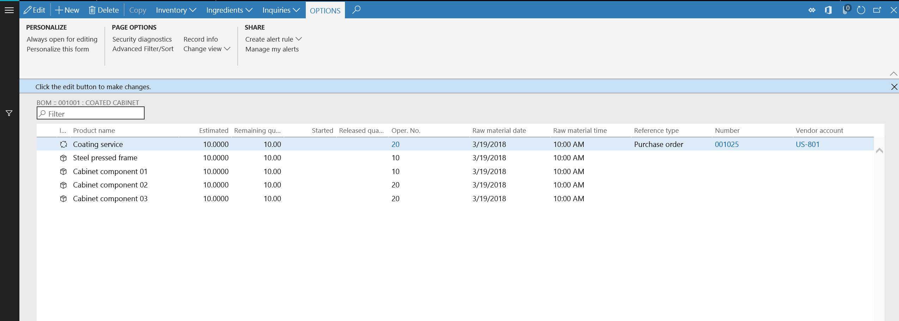

13. Close the **BOM** page to return to the **All production orders** page.
14. On the Action Pane, on the **Schedule** tab, select **Schedule jobs** to open the **Job scheduling** dialog box.
15. Specify the following values:

    - In the **Scheduling direction** field, select **Forward from tomorrow**.
    - Set the **Finite capacity** option to **Yes**.

    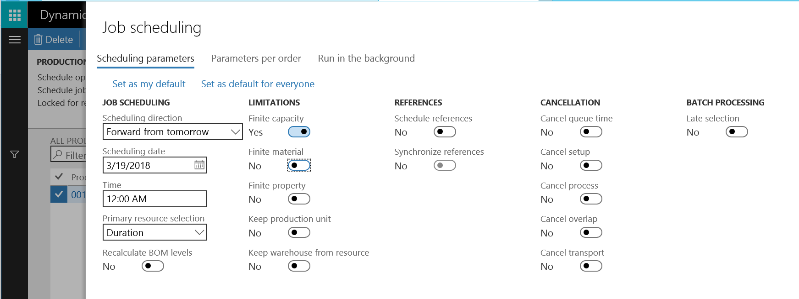

16. Select **OK** to close the **Job scheduling** dialog box and return to the **All production orders** page.
17. On the Action Pane, on the **Schedule** tab, select **Gantt** to open the **Gantt chart - Resource view** page.

    The Gantt chart provides a visual overview of how the production jobs are scheduled on the resources. Notice that the external Coating operation consists of three jobs: a process job, a transport job, and a queue time job.

    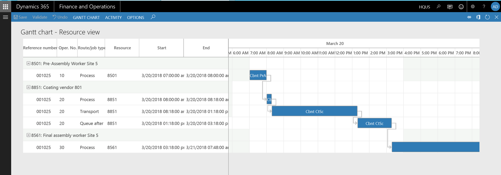

18. Close the **Gantt chart - Resource view** page to return to the **All production orders** page.
19. On the Action Pane, on the **Production order** tab, select **Release** to open the **Release** dialog box.

    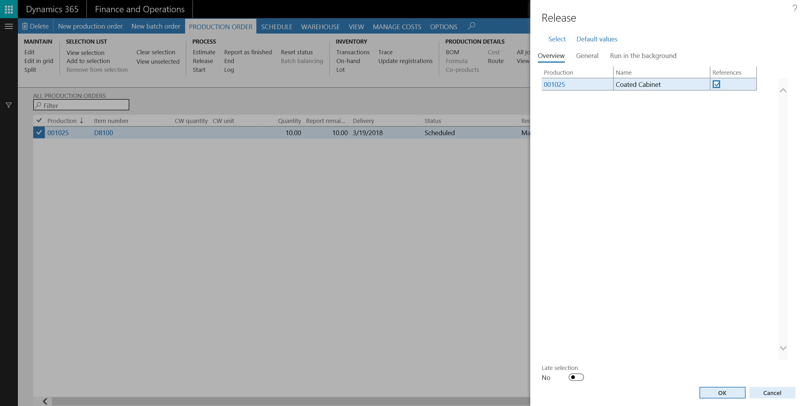

20. Select **OK** to close the **Release** dialog box.
21. Select **Production control \> Periodic tasks \> Release to warehouse \> Automatic release of BOM and formula lines** to open the **Automatic release of BOM and formula lines** dialog box.

    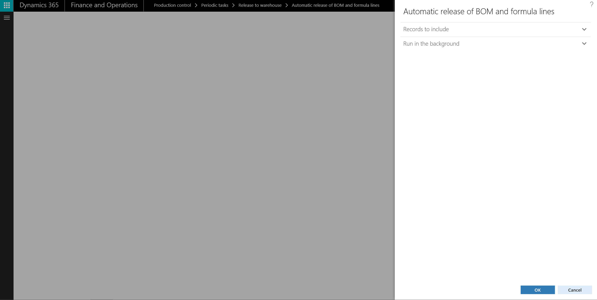

22. Select **OK** to run the Automatic release of BOM and formula lines job.

    This job releases pick work for raw materials to the warehouse.

23. Select **Production control \> Production orders \> All production orders** to open the **All production orders** page.
24. Use the quick filter field to select the production order that you've been working on.
25. On the Action Pane, on the **Warehouse** tab, select **Work details** to open the **Work** page.

    Notice that the page shows two sets of work for raw material picking. The first work is for materials M8100 and M8101. These materials are consumed by operation 10. The second work is for materials M8202 and M8250. These materials are consumed by operation 20, which is the subcontracted operation.

    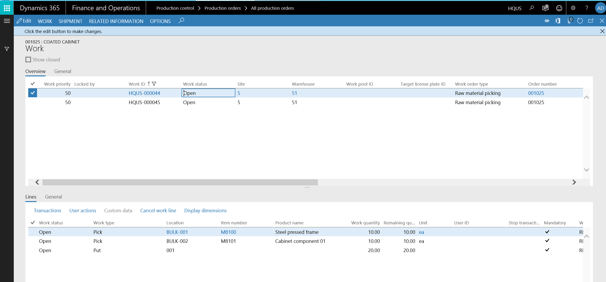

26. Start the Warehouse Management mobile app to process the warehouse work for operation 10.

    <!-- TBD – screen shots for processing pick work for the materials. -->

27. Select **Production control \> Production orders \> All production orders** to open the **All production orders** page.
28. Use the quick filter field to select the production order that you've been working on.
29. On the Action Pane, on the **Production order** tab, select **Start** to open the **Start** dialog box.
30. On the **General** tab, specify the following values:

    - In the **From Oper. No.** field, select **10**.
    - In the **To Oper. No.** field, select **10**.

    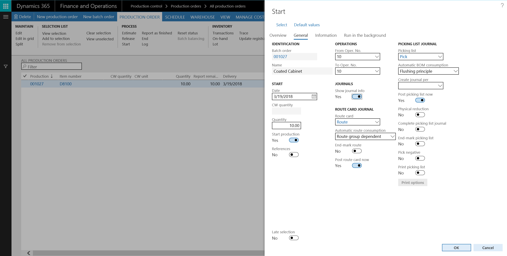

31. Select **OK** to close the **Start** dialog box and return to the **All production orders** page.

    Notice that the status of the production order is now **Started**. The materials for operation 10 are consumed by an automatic posting of the picking list journal. Time consumption for operation 10 is accounted for by an automatic posting of a route card journal.

32. Start the Warehouse Management mobile app to process the warehouse work for operation 20.

    <!-- TBD – screen shots for processing pick work for the materials. -->

33. On the Action Pane, on the **Production order** tab, select **Start** to open the **Start** dialog box.
34. On the **General** tab, specify the following values:

    - In the **From Oper. No.** field, select **20**.
    - In the **To Oper. No.** field, select **20**.
    - In the **Quantity** field, enter **10**.
    - Set the **Post picking list now** option to **No**.

    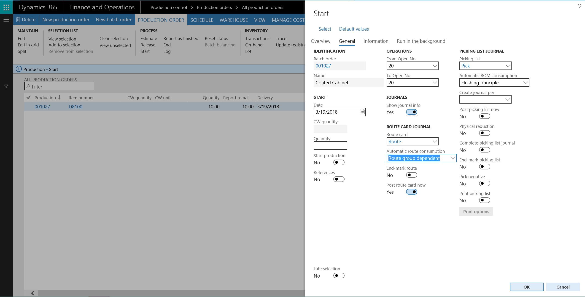

35. Select **OK** to close the **Start** dialog box and return to the **All production orders** page.

    A picking list is created for the materials that are used for the Coating operation, and for the service item. The service item represents the cost of the subcontracted operation.

36. On the Action Pane, on the **View** tab, select **Picking list** to open the **Picking list** page.
37. Select the picking list that isn't posted, and then select the journal number to view the journal lines.

    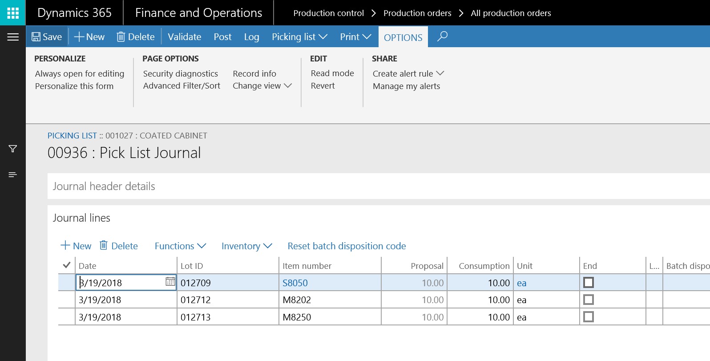

38. On the Action Pane, select **Print** \> **Picking list report** to open the **Picking list report** dialog box.
39. Set the **Use delivery note layout** option to **Yes**.

    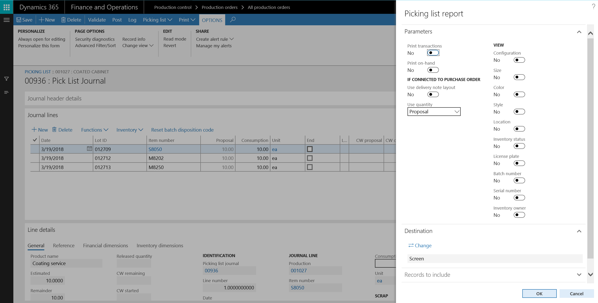

40. Select **OK** to generate a **Picking list** report.

    In this case, a vendor delivery note is printed from the production picking list journal. The delivery note specifies the materials that are shipped to the vendor who will do the Coating operation.

    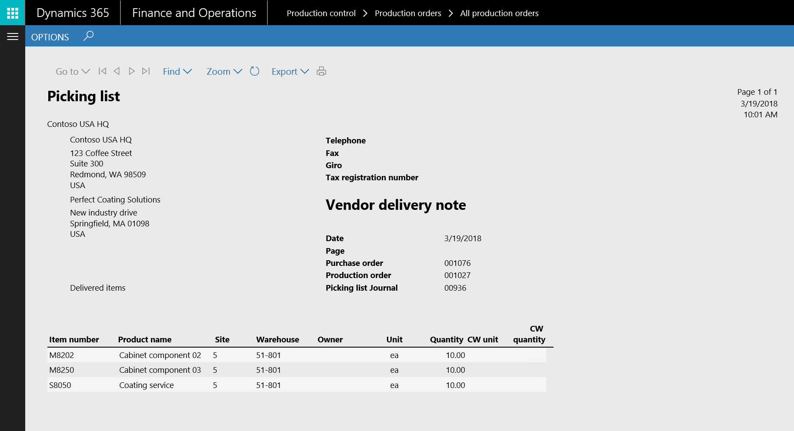

41. Close the **Picking list** report to return to the **Picking list** page.
42. On the Action Pane, select **Post** to open the **Post journal** dialog box.

    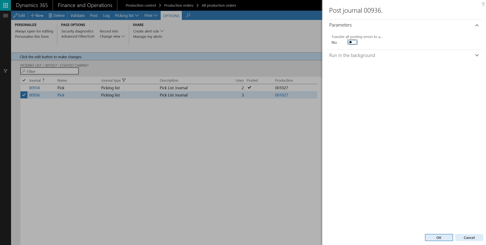

43. Select **OK** to close the **Post journal** dialog box.
44. Open the purchase order.

    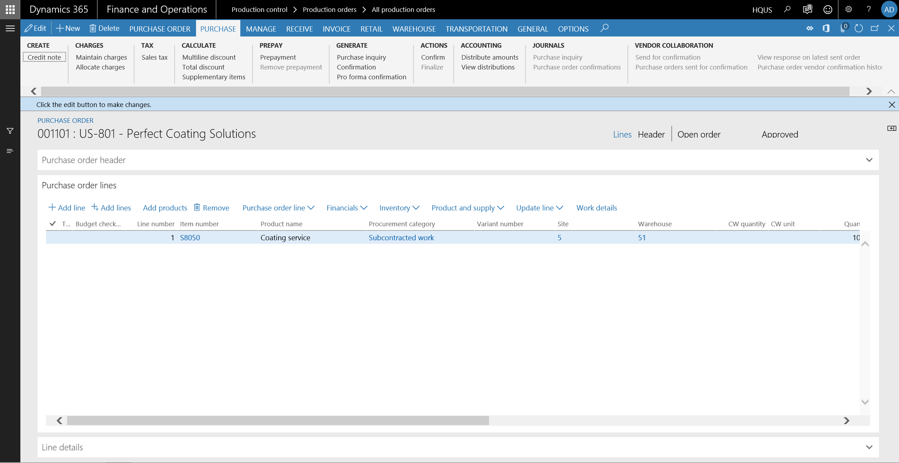

45. On the Action Pane, on the **Purchase** tab, select **Confirm**.
46. Select **Post** to open the **Post journal** dialog box.
47. Select **OK** to close the **Post journal** dialog box and return to the **Purchase order** page.
48. Change the unit price from **33** to **40**.

    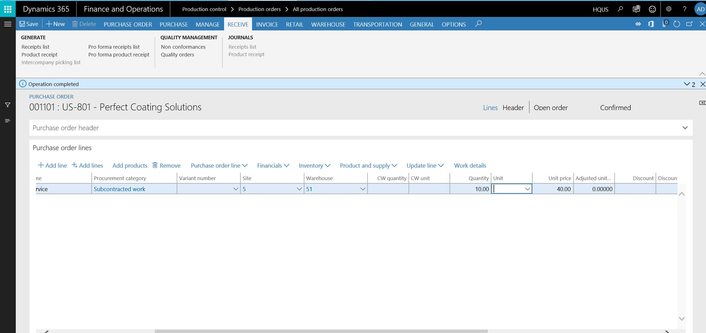

49. Confirm the purchase order again.
50. Product receipt.

    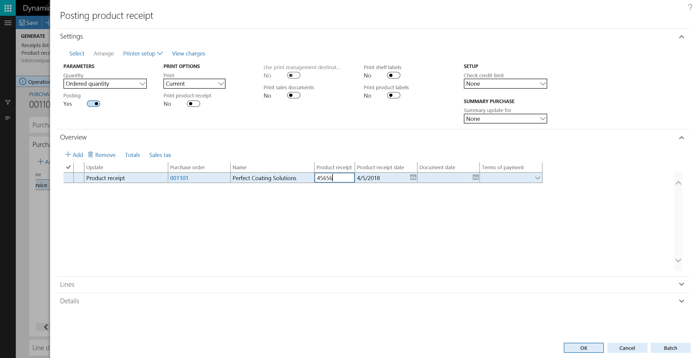

51. Purchase invoice.
52. Update the match status.

    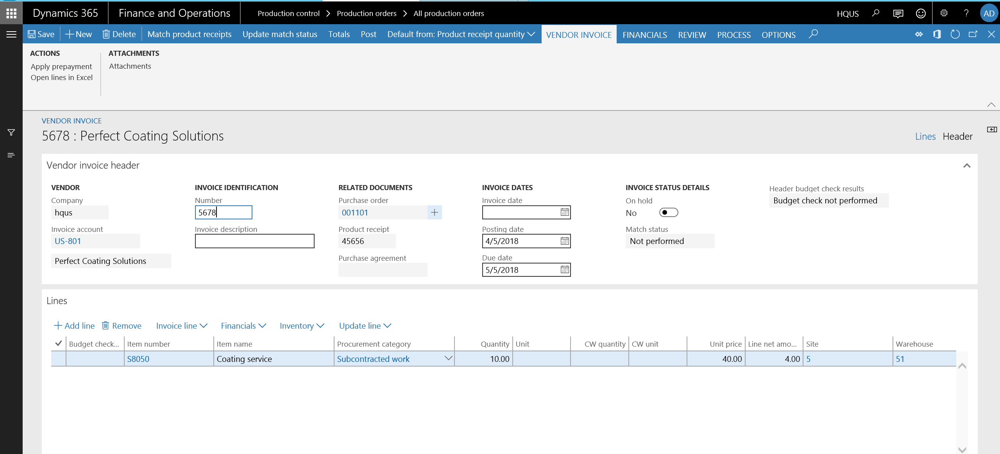

53. Report as finished.

    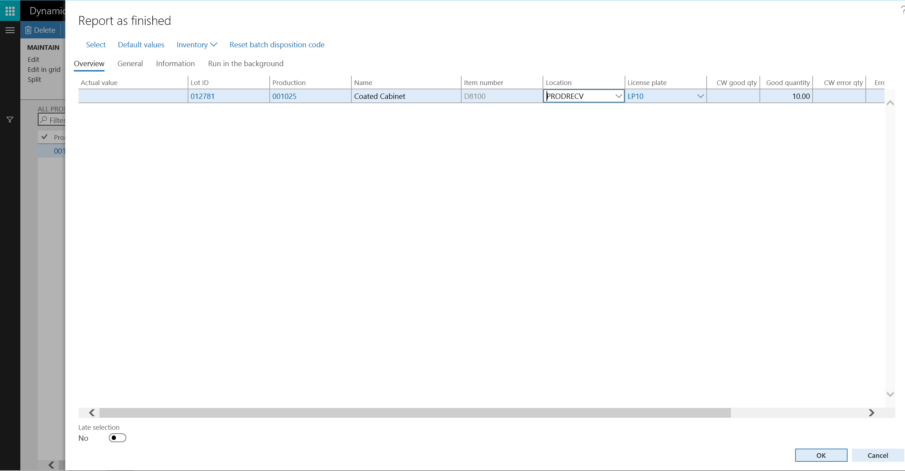

54. End.

    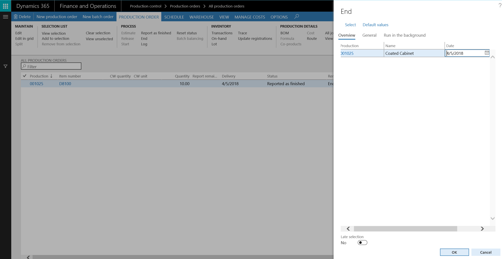

55. Cost comparison.

    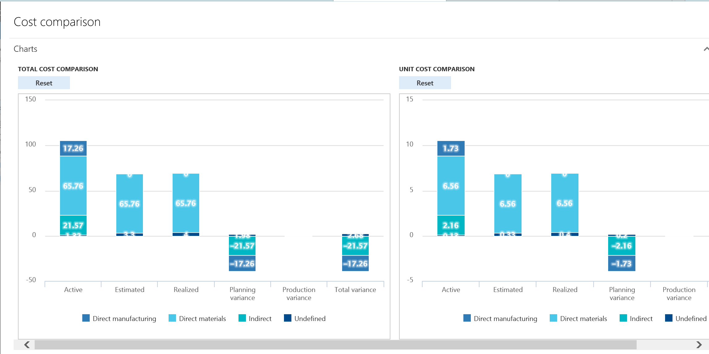

Missing setup in data.

[!INCLUDE[footer-include](../../includes/footer-banner.md)]