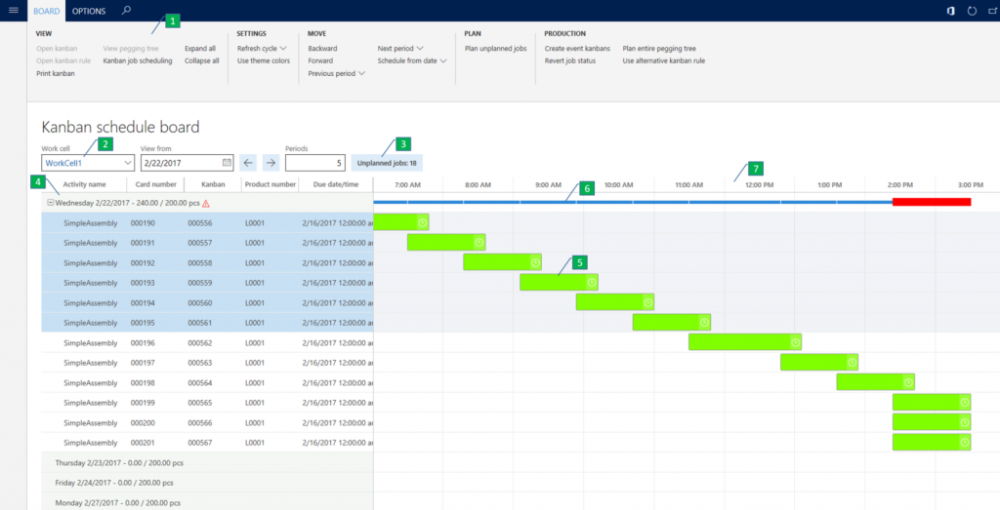

# Visual scheduling for lean manufacturing

[!include [banner](../includes/banner.md)]

This article provides information about the Kanban schedule board, which the production planner can use to control and optimize the production plan for kanban jobs.

This article provides information about the Kanban schedule board, which the production planner can use to control and optimize the production plan for kanban jobs.

The Kanban schedule board lets the production planner control and optimize the production plan for kanban jobs. It makes the flow of kanban jobs transparent, and gives the production planner a tool that optimizes and adjusts the production plan for the lean manufacturing work cell.

## Visual scheduling of kanban jobs
A kanban job can consist of one or many kanban jobs. There are two types of kanban jobs:

-   Process
-   Transfer

You can schedule only jobs of the **Process** type. The kanban job and its properties, such as the activity time, are defined in the production kanban flow. In the production kanban flow, the kanban job is also assigned to a work cell. The work cell's daily capacity is calculated based on the work cell capacity that is set on the resource group. It's adjusted by the daily working time in the related calendar. When a kanban job is scheduled, the job loads the capacity of the work cell. The Kanban schedule board provides the following main features:

-   A graphical overview of the production plan in a lean work cell. This overview shows the planned kanban process jobs in the defined periods.
-   A tool that lets you schedule unplanned kanban jobs and reschedule previously scheduled jobs.

## Kanban schedule board
The **Kanban schedule board** page contains seven main elements, as shown in the following illustration. 

1.  Action Pane
2.  Filter fields
3.  Button for unplanned jobs
4.  Period node
5.  Kanban job
6.  Capacity bar
7.  Time scale

### View the time scale

The board is divided into periods, each of which is represented as a node (4). The period nodes are listed on the vertical axis, and the horizontal axis represents a time scale (7) that shows the length of the period. A period has a length of either one day or one week. The period length is determined by the configuration of the work cell that is selected for the Kanban schedule board (2). For each period node, the Kanban schedule board indicates how much the scheduled kanban jobs are loading the period. There is also an indication of the maximum throughput for the period. If the scheduled throughput exceeds the maximum throughput, the period is considered as overloaded, and a red warning symbol appears. A scheduled kanban job appears in a period that has scheduled start and end times (5). The length of the job is equal to the activity time. Kanban jobs appear as overlapping in a period if their activity times exceed the task time of the work cell.

### View job status

More information about a kanban job is available in the tooltip that appears when you hover the pointer over the job. A symbol provides information about the status of the job. For example, a clock symbol indicates that the kanban job is overdue.

### Use colors to view the Kanban schedule board

To enhance the overview that the Kanban schedule board provides, you can use colors to distinguish kanban jobs. The color of a kanban job is configured in the lean schedule group, where you can aggregate the products that should be produced in the same sequence. The **Use theme colors** button on the **Board** tab of the Action Pane lets you switch between the application theme colors and the colors that are configured in the lean schedule group. For each period, a capacity bar (6) indicates how many of the available hours for the period have been loaded with kanban jobs. If the period is overloaded, the capacity bar appears thicker and in red. All these functions are available on the **Board** tab of the Action Pane (1) at the top of the **Kanban schedule board** page.

## Plan unplanned jobs
You can schedule unplanned kanban jobs from the **Plan unplanned jobs** dialog box. To open this dialog box, click the **Unplanned jobs** button that shows the current number of unplanned jobs. Alternatively, click **Plan unplanned jobs** on the **Board** tab of the Action Pane. The dialog box shows a list of the unplanned kanban jobs for the work cell. You can use the **Filter** field to filter on all fields in the grid. For example, you can filter on kanban jobs for a specific product. After you have a filtered list of the jobs that you want to schedule, select them in the list, and then click **OK**. To use automatic planning to schedule the jobs, set the **Automatic planning** option to **Yes**. In this case, the jobs are scheduled into a period according to their due date. You can also schedule the jobs by period. Just select a period in the **Period** field. The following illustration shows an example of the **Plan unplanned jobs** dialog box. 

## Sequence kanban jobs within the same period
You can change the sequence of one or more selected jobs within a period. This capability can be useful if you want to prioritize some jobs within the period. Alternatively, you might want to sequence jobs that have the same product attributes, to optimize job execution. You can change the sequence through a drag-and-drop operation, or by using the **Backward** and **Forward** menu items on the **Board** tab of the Action Pane.

## Reassign kanban jobs across periods
Jobs can be reassigned from one period to another. This capability can be useful if a period is overloaded and you want to level the load to periods that have spare capacity. You can reassign jobs through a drag-and-drop operation, or by using the **Next period** and **Previous period** menu items on the **Board** tab of the Action Pane.

## Open the Kanban schedule board
You can open the Kanban schedule board by using the menu item on the following pages:

-   **Production area** page
-   **Kanban jobs scheduling** page
-   **Production flow visualization** page

## Related information

[Kanban job scheduling for lean manufacturing](lean-manufacturing-kanban-job-scheduling.md)

[!INCLUDE[footer-include](../../includes/footer-banner.md)]