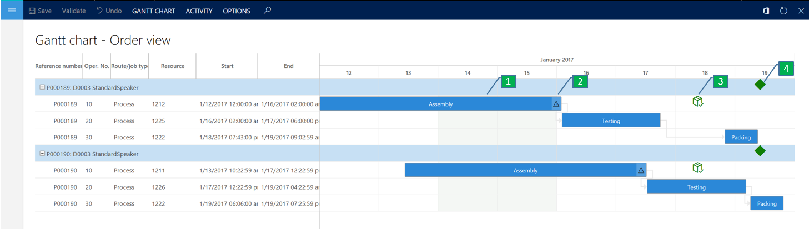
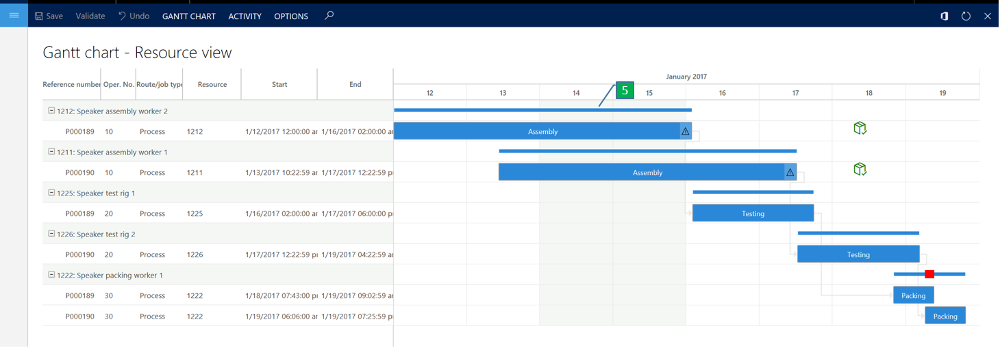
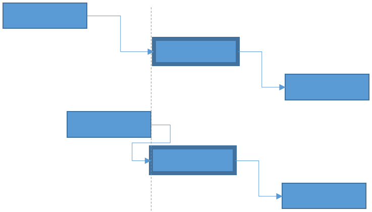
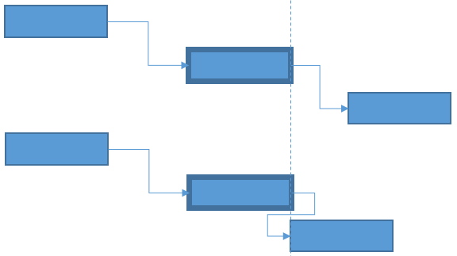
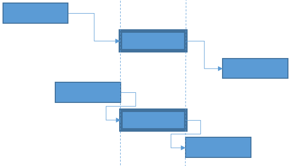
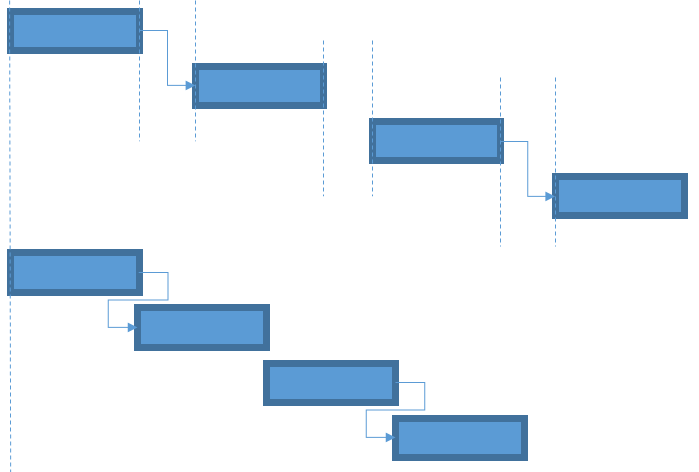

# Gantt chart for job scheduling

[!include [banner](../includes/banner.md)]

The Gantt chart is designed to empower production planners to control and optimize the production plan. The Gantt chart makes the flow of operations transparent and makes it easy to adjust the production schedule while taking into account material or resource shortages. This helps planners make the best use of available resources, minimize work in progress, and optimize throughput times for production orders.

A Gantt chart is a visual representation of scheduled activities within a defined time interval. The activities are scheduled on resources that have capacity defined by a capacity calendar. The following types of activities can be shown in the Gantt chart.

- Jobs from production orders that are job scheduled.
- Jobs from planned production orders.
- Job scheduled project activities of type Hour forecasts.

## Gantt chart views

The Gantt chart can be opened in two different views, **Order view** and **Resource view**. In **Order view**, activities are grouped under production orders. This can be useful, for example, if you want to maintain an overview of all the jobs belonging to the same orders. In **Resource view** all jobs are grouped under individual resources. This view can be useful when optimizing the plan at a resource level, for example, a machine or a group of machines. The Gantt charts shown in the illustrations below show **Order view** and **Resource view** with these key elements:

1. Gantt chart activity
2. Material shortage icon
3. Material availability icon
4. Order delivery date icon
5. Capacity bar

The following screenshot shows the order view.

The following screenshot shows the resource view.

## Activities

The activities appear as bars and are organized in a time scale grid with a scheduled start and end time, making the length of the bars proportional to the time that is necessary to complete the activity. The activities are shown according to a time scale. You can adjust the time scale on the menu where you select a start and end date and a time unit, for example, hours or days. By adjusting the time scale, you can set focus on a time interval in which you want to manage activities.

To get a better overview, there are different options for controlling the color of the activities. You can configure an individual color for activities, use the theme color that is the general color theme used for the application, or set up the color to be controlled by the color code for production orders.

The time interval for activities has a background shade. Periods with a white shade indicate a time interval with defined capacity on the resource for the activity, whereas periods with a grey shade indicate time intervals with no capacity defined.

On the left side of the chart, there's additional information about the activity, for example, the resource on which the activity is scheduled and production order number. The connection between jobs belonging to the same order is shown with an arrow.

You can get more information about an activity in the activity dialog box. To open the dialog box, double-click the activity or select the **information** menu. In the activity dialog you can see the scheduled start and end date, and time information about which materials the activity is planned to consume.

The activities can be grouped in Grouping levels. The Grouping levels are hierarchical and can be used to make a logical grouping of activities. For example, if you have a layout where manufacturing activities are grouped by site, production units, resource groups, and resources, you can use the Grouping levels to group the activities according to that layout. The grouping levels can be expanded and collapsed either on the individual grouping level or for all levels in the chart by using the **Expand all** and **Collapse all** buttons on the menu. You can also configure the grouping levels to be expanded or collapsed when the chart is opened.

### Material availability

The Gantt chart can be set up to provide the planner with detailed information about material status for the individual activities. For example, this can be helpful if material is delayed and is affecting the production plan. In this case, the material issues will be highlighted in the Gantt chart to help the planner to understand consequences and make necessary adjustments.

A job will appear with a material shortage icon if the schedule start date of the job is later than the material availability date for materials consumed by the job. The material availability date is calculated based on the pegging information in the dynamic master plan. The material shortage icon will, for example, appear on a job that is consuming a material that is pegged against a purchase order that has a receipt that is later than the planned start date of the job.

### Indicator of material availability date

When you set up the chart to show jobs with material shortages an icon for showing the material availability date for the job can also be shown. The icon will only be shown if the material availability date is within the defined time interval of the chart. If the material availability date lies outside the defined time interval, then more detailed material availability information can be retrieved from the material list in the job dialog box. In the list, there's also an icon showing late materials for the job. You can reschedule a job using the material availability date as a start date.

### Indicator of order delivery date

This icon indicates the delivery date for a production order. The icon is only visible in the order view.

### Capacity bar

You can configure the chart to show a resource capacity bar. This bar provides an overview of the resource capacity for an activity in the defined time interval of the chart. The capacity bar isn't shown for periods of the time where the resource isn't booked. In periods where the resource is booked to capacity, the capacity bar is shown as a solid bar. In periods where the resource is overbooked, the bar will appear thicker and in a red color. For example, if two jobs overlap, the capacity bar will indicate an overbooking in the time interval where there's an overlap. The capacity bar is updated dynamically when you schedule a job. You enable the capacity bar on the **Show capacity bar** menu. It can only be shown in **Resource view**. If you want to get a more detailed view of the capacity load on a resource, use the **Capacity load** chart, which can be opened from the menu or the context menu for a selected activity.

## Job scheduling in the Gantt chart

The Gantt chart offers different options for making adjustments to the production plan. In the Gantt chart, you can reschedule activities as a drag-and-drop interaction or from a schedule menu. In the planning process, you can take resource capacity, resource capabilities, and material constraints into account.

### Schedule a job as a drag-and-drop interaction

You can reschedule job within the defined time interval as a drag-and-drop interaction. You can only reschedule the job on the same resource, and you can only schedule one job at a time.

### Schedule a job from the menu

On the **Schedule jobs** menu, you can schedule one or more selected jobs in the chart based on a scheduling direction and a scheduling date time. There are three available schedule directions.

- Forward from scheduling date
- Backward from scheduling date
- Forward from material availability date

It isn't possible to schedule a job outside the defined time interval of the Gantt chart. If you do that, the job will be left unscheduled and you'll receive the error message, "Could not schedule the job within the loaded time period."

### Schedule previous jobs

In a network of activities, such as jobs belonging to the same production order, you can use the **Schedule previous jobs** function to schedule the previous jobs relative to a selected job in the network. In the following example, the highlighted activity is the selected job. The diagram shows before a previous job is scheduled and after the previous job is scheduled.

### Schedule next jobs

You can use the **Schedule next jobs** function to schedule the next jobs relative to a selected job in a network of activities. In the following example, the highlighted activity is the selected job. The diagram shows before the next job is scheduled and after the next job is scheduled.

### Schedule around job

You can use the **Schedule around job** function to schedule the next job and the previous job relative to a selected job in a network of activities. In the following example, the highlighted activity is the selected job. The diagram shows before a job is scheduled and after the job is scheduled.

### Arrange jobs

You can use the **Arrange** function to arrange selected activities on the same resource. These activities can be in the same network of activities, but can also belong to different networks. When you use the arrange function, the time gaps between the selected activities will be eliminated. You can use this function to optimize the capacity utilization of the resources. The diagram shows before a job is scheduled and after the job is scheduled.

### Reassign activities from one resource to another

You can reassign a job from one resource to another. This can be useful in situations where a machine is out of order or overbooked, and you need to find another available resource that can do the job.

### Reassigning an activity as a drag-and-drop interaction

In the **Resource** view, you can reassign an activity to a different resource in the Gantt chart as a drag-and-drop interaction. You do that by selecting the row in which the activity is scheduled. After the row is selected, you can drag the row to the resource in the chart grouped under a different resource grouping level.

### Reassigning an activity from the Schedule jobs menu

You can reassign a job from the **Schedule job** dialog box opened from the **Schedule job** menu. From this menu, you can only reassign a job to a resource that is already loaded to the Gantt chart. If you only select one job, then the drop-down list for the resource will be sorted by applicable resources. If you select more jobs, then there will be no information about applicable resources from the resource list.

## Load additional resources to the Gantt chart

In the **Resource view**, you can load additional resources to the Gantt chart. This can be useful if you want to find an alternative resource for a job that is scheduled on a machine that is overbooked or broken down. On the **Load additional resources** page, you'll get a list of resources that are date efficient as of the date the list is opened. Applicable resources, relative to a selected job in the Gantt chart, will be listed first. If you have multiple jobs selected prior to opening the list no indication of applicable resources will be shown. On the **Load additional resources** page, you can select one or more resources that will be loaded to the Gantt chart when you confirm your selection. If there are no jobs scheduled on the selected resource in the time interval of the Gantt chart, then the resource will be placed under a resource grouping level in the bottom of the list of activities in the Gantt chart.

### Access the Gantt chart

The Gantt chart can be opened from the following pages.

| Page | Description |
|---|---|
| **Production order list and detail** | On the **Production order list and detail** page, you can open the Gantt chart from one or more selected orders. Opening the chart from the **Gantt chart** menu item will load all jobs related to the selected production orders, but also jobs from other production orders that are scheduled on the same resources. Opening the chart from the **Gantt chart – Fast view** menu item will only load jobs related to the selected production orders. In this view, it isn't possible to schedule jobs. |
| **Resource** | On the **Resource** page, you can open the Gantt chart from the menu item **Gantt chart**. When selected, all the jobs scheduled on the resource in a selected time interval will be loaded to the chart. |
| **Resource group** | On the **Resource group** page, you can open the Gantt chart from the menu item **Gantt** chart. When selected, all the jobs scheduled on the resources in the resource group will be shown in a selected time interval. |
| **Gantt charts** | On the **Gantt charts** page, you can configure Gantt charts by resources and resource groups. For example, if you want to control production activities for specific sets of resources or resource groups, then you can make individual configurations of those on the **Gantt charts** page. You can then open the Gantt chart from each configuration. |
| **Hour forecasts** (project) | Project activities of type **Hour forecast** can be job scheduled on resources. On the **Hour forecast** page, on the **Scheduling** menu, you can open the Gantt chart on an order to see job scheduled project activities of type hour forecast. |
| **Job to complete** (List in **Production floor management** workspace) | The **Jobs to complete list in the Production floor management** workspace shows jobs from production and batch orders that are in progress on the selected resources for the workspace. On the **Gantt chart** menu item you can open the Gantt chart, where all the jobs selected in the list will be loaded to the chart. |
| **Production orders to release** (Opened from the **Production floor management** workspace) | The **Production orders to release** page is opened from the **Production floor management** workspace. This page shows scheduled production and batch orders pending release. On this page, you can open the Gantt chart for selected production orders. |

## Additional resources

- [Visual scheduling with Gantt chart for production and batch orders (Video)](https://youtu.be/BtbuShkGj4I)
- [Visual scheduling for production (demo script)](/dynamics/s-e/)

[!INCLUDE[footer-include](../../includes/footer-banner.md)]
