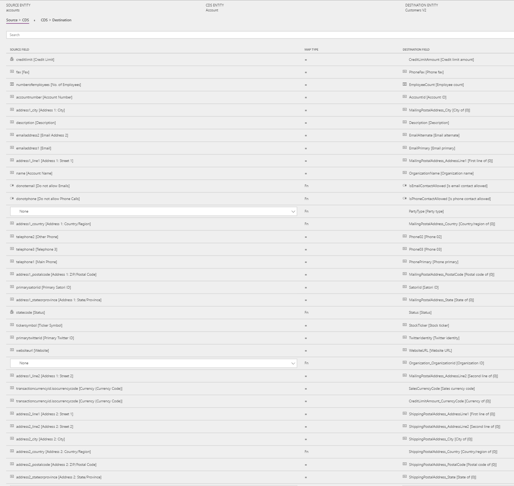
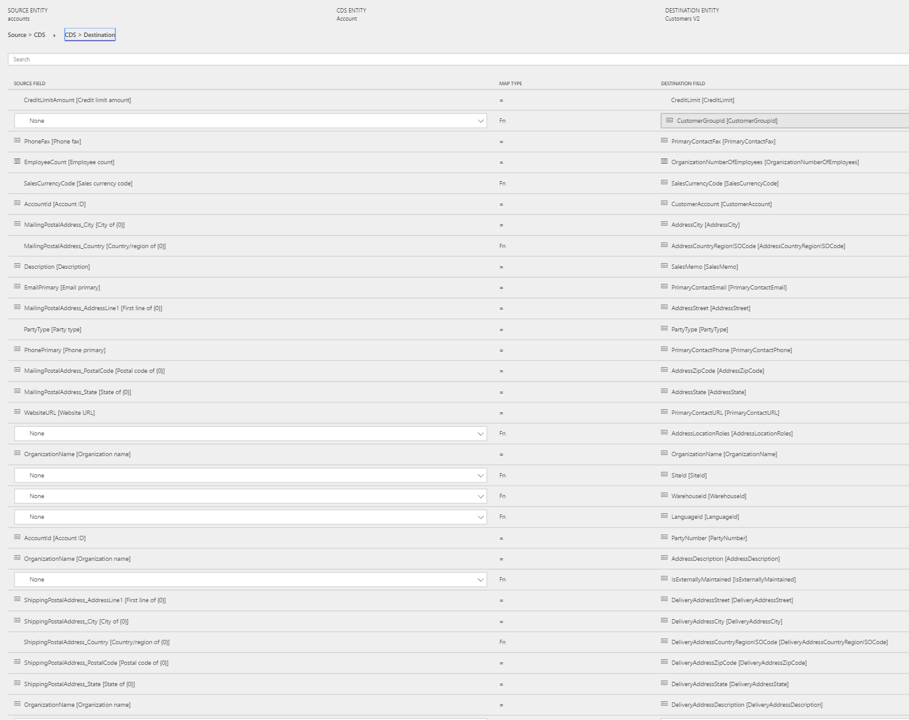

---
# required metadata

title: Synchronize accounts from Sales to customers in Finance and Operations 
description: The topic discusses the templates and underlying tasks that are used to synchronize accounts from Microsoft Dynamics 365 for Sales to Microsoft Dynamics 365 for Finance and Operations, Enterprise edition. 
author: ChristianRytt
manager: AnnBe
ms.date: 08/28/2017
ms.topic: article
ms.prod: 
ms.service: dynamics-ax-applications
ms.technology: 

# optional metadata

ms.search.form: 
# ROBOTS: 
audience: Application User, IT Pro
# ms.devlang: 
ms.reviewer: yuyus
ms.search.scope: Core, Operations
# ms.tgt_pltfrm: 
ms.custom: 
ms.assetid: 
ms.search.region: global
ms.search.industry: 
ms.author: crytt
ms.dyn365.ops.version: July 2017 update 
ms.search.validFrom: 2017-07-8

---

# Synchronize accounts from Sales to customers in Finance and Operations

[!include[banner](../includes/banner.md)]

> [!NOTE]
> Before you can use the Prospect to cash solution, be familiar with [Dynamics 365 Data Integration](/common-data-service/entity-reference/dynamics-365-integration). 

The topic discusses the templates and underlying tasks that are used to synchronize accounts from Microsoft Dynamics 365 for Sales (Sales) to Microsoft Dynamics 365 for Finance and Operations, Enterprise edition (Finance and Operations).

## Template and task

The following templates and underlying tasks are used to synchronize accounts from Sales to Finance and Operations:

- **Name of the template:** Accounts (Sales to Fin and Ops)
- **Name of the task in the project:** Accounts - Account - Customers

Sync tasks required prior to Account / Customer sync: None

## Entity set

| Sales    | CDS     | Finance and Operations |
|----------|---------|------------------------|
| Accounts | Account | Customers              |

## Entity flow

Accounts are managed in Sales and synchronized to Finance and Operations as Customers. The **Is Externally Maintained** property on these Customers is set to **Yes** to track Customers that originate from Sales. During invoicing, this information is used to filter invoices that are synchronized to Sales.

## Prospect to cash solution for Sales

The **Account Number** field is available on the **Account** page. It has been made a natural and unique key to support the integration. The natural key feature of the Customer Relationship Management (CRM) solution might affect customers who already use the **Account Number** field, but who don't use unique **Account Number** values per account. Currently, the integration solution doesn't support this case.

When a new account is created, if an **Account Number** value doesn't already exist, it's automatically generated by using a number sequence. The value consists of **ACC**, followed by an increasing number sequence and then a suffix of six characters. Here is an example: **ACC-01000-BVRCPS**

When the integration solution for Sales is applied, an upgrade script sets the **Account Number** field for existing accounts in Sales. If there are no **Account Number** values, the number sequence that was described earlier is used.

## Preconditions and mapping setup

- **CustomerGroupId** mapping from **CDS &gt; Destination** must be updated to a valid value in Finance and Operations. You can specify a default value, or you can set the value by using a value map. The default template value is **10**.
- **Address country region code** is required in Finance and Operations. To avoid synchronization errors, you can specify a default value in the mapping from **CDS &gt; Destination**. That default value is then used if the field is left blank in Sales.

    - The default template value for **AddressCountryRegionISOCode** is **USA**.
    - The default template value for **DeliveryAddressCountryRegionISOCode** is **USA**.

- By adding the following mappings from **CDS &gt; Destination**, you can help reduce the number of manual updates that are required in Finance and Operations. You can use a default value or a value map from, for example, **Country/Region** or **City**.

    - **SiteId** – A site is required in order to generate quotations and sales order lines in Finance and Operations. A default site can be taken either from the product, or from the customer from the order header. The default template value for **SiteId** is **1**.
    - **WarehouseId** – A warehouse is required in order to process quotations and sales order lines in Finance and Operations. A default warehouse can be taken either from the product, or from the customer from the order header in Finance and Operations. The default template value for **WarehouseId** is **13**.
    - **LanguageId** – A language is required in order to generate quotations and sales orders in Finance and Operations. By default, the language from the order header from the customer is used. The default template value for **LanguageId** is **en-us**.

- Update the CDS organization ID (**Organization_OrganizationId**) in the **Source &gt; CDS** mapping. The default template value is **ORG001**.

## Template mapping in data integrator

> [!NOTE]
> The **Payment terms**, **Freight terms**, **Delivery terms**, **Shipping method**, and **Delivery mode** fields aren't included in the default mappings. To map these fields, you must set up a value mapping. Value mappings are specific to the data in the organizations that the entity is synchronized between.

The following illustrations show an example of a template mapping in data integrator.

## Related topics

[Synchronize products from Finance and Operations to products in Sales](products-template-mapping.md)

[Synchronize contacts from Sales to contacts or customers in Finance and Operations](contacts-template-mapping.md)

[Synchronize sales quotation headers and lines from Sales to Finance and Operations](sales-quotation-template-mapping.md)

[Synchronize sales order headers and lines from Finance and Operations to Sales](sales-order-template-mapping.md)

[Synchronize sales invoice headers and lines from Finance and Operations to Sales](sales-invoice-template-mapping.md)

