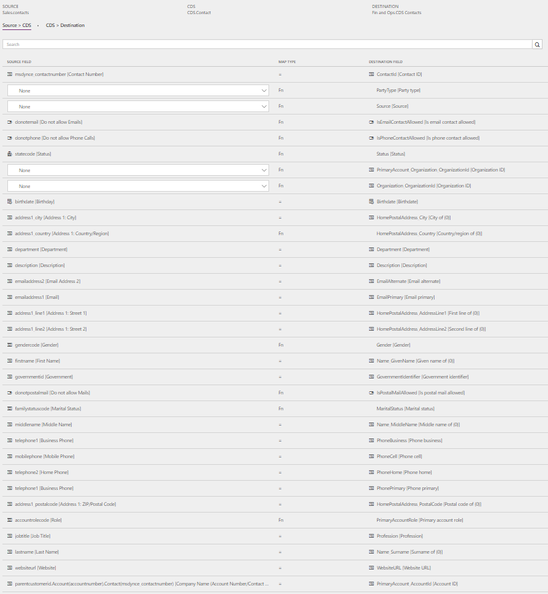
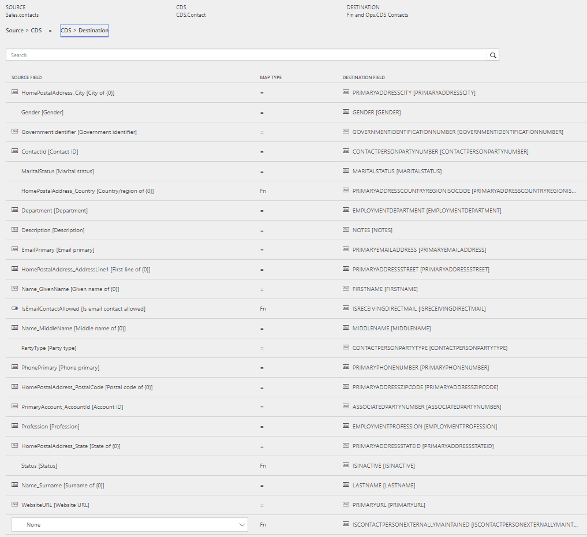
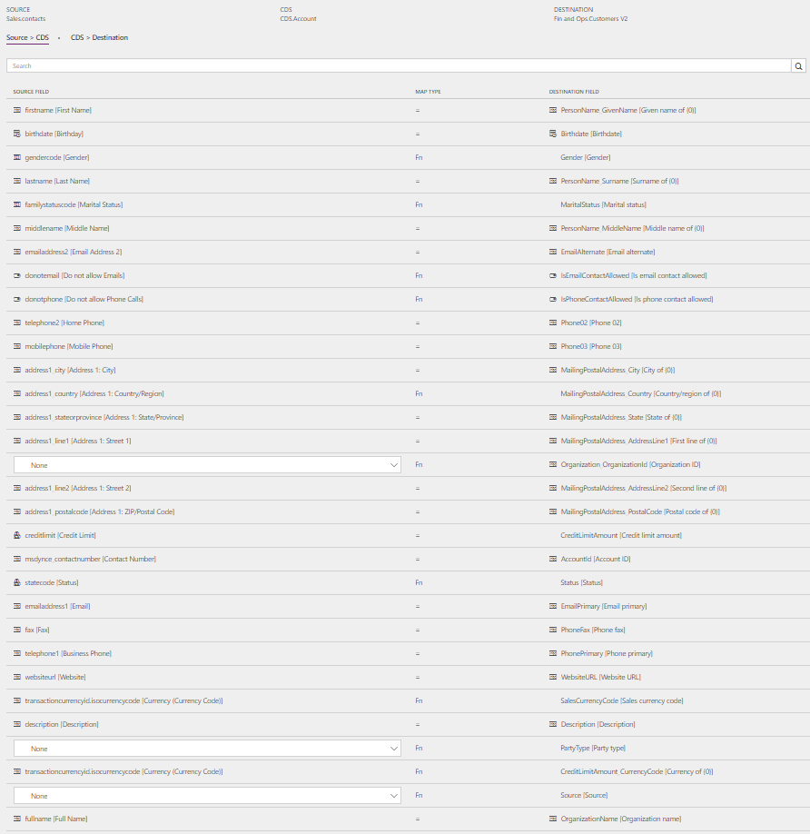
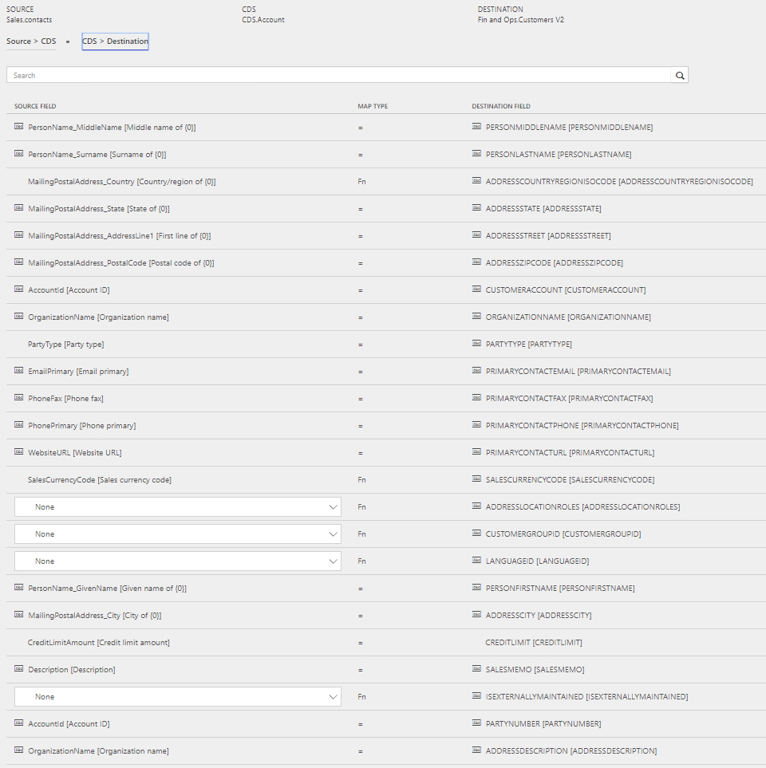

---
# required metadata

title: Synchronize contacts from Sales to contacts or customers in Finance and Operations
description: This topic discusses the templates and underlying tasks that are used to synchronize Contact (Contacts) and Contact (Customers) from Microsoft Dynamics 365 for Sales to Microsoft Dynamics 365 for Finance and Operations, Enterprise edition.
author: ChristianRytt
manager: AnnBe
ms.date: 08/28/2017
ms.topic: article
ms.prod: 
ms.service: dynamics-ax-applications
ms.technology: 

# optional metadata

ms.search.form: 
# ROBOTS: 
audience: Application User, IT Pro
# ms.devlang: 
ms.reviewer: yuyus
ms.search.scope: Core, Operations, UnifiedOperations
# ms.tgt_pltfrm: 
ms.custom: 
ms.assetid: 
ms.search.region: global
ms.search.industry: 
ms.author: crytt
ms.dyn365.ops.intro: July 2017 update 
ms.search.validFrom: 2017-07-8

---

# Synchronize contacts from Sales to contacts or customers in Finance and Operations

[!include[banner](../includes/banner.md)]

> [!NOTE]
> Before you can use the Prospect to cash solution, be familiar with [Dynamics 365 Data Integration](/common-data-service/entity-reference/dynamics-365-integration). 

This topic discusses the templates and underlying tasks that are used to synchronize Contact (Contacts) entities and Contact (Customers) from Microsoft Dynamics 365 for Sales (Sales) to Microsoft Dynamics 365 for Finance and Operations, Enterprise edition (Finance and Operations).

## Templates and tasks

The following templates and underlying tasks are used to synchronize Contact (Contacts) in Sales to Contact (Customers) in Finance and Operations:

- **Names of the templates:**

    - Contacts (Sales to Fin and Ops)
    - Contacts to Customer (Sales to Fin and Ops)

- **Names of the tasks in the project:**

    - Contacts
    - ContactToCustomer

The following synchronization task is required before Contact synchronization: Accounts (Sales to Fin and Ops)

## Entity sets

| Sales    | CDS     | Finance and Operations |
|----------|---------|------------------------|
| Contacts | Contact | CDS Contacts           |
| Contacts | Account | Customers V2           |

## Entity flow

Contacts are managed in Sales, and are synchronized to Common Data Service (CDS) and Finance and Operations.

A Contact in Sales can become a Contact in CDS and Finance and Operations. Alternatively, it can become an Account in CDS and a Customer in Finance and Operations. To determine whether a contact should be picked up in Sales for synchronization to CDS and Finance and Operations (for example, Contacts in Sales &gt; Contact in CDS &gt; Contacts in Finance and Operations), the system looks at the following properties on Contact in Sales:

- **Sync to Account in CDS and Customer in Finance and Operations:** Contacts where **Is Active Customer** is set to **Yes**
- **Sync to Contact in CDS and Contact in Finance and Operations:** Contacts where **Is Active Customer** is set to **No** and **Company** (Parent Account/Contact) points to an Account (not a Contact)

## Prospect to cash solution for Sales 

A new **Is Active Customer** field has been added to the Contact. This field is used to differentiate Contacts that have sales activity and Contacts that don't have sales activity. **Is Active Customer** is set to **Yes** only for Contacts that have related quotations, orders, or invoices. Only those Contacts are synchronized to Finance and Operations as Customers.

A new **IsCompanyAnAccount** field has been added to the Contact. This field is used to indicate whether a Contact is linked to a Company (Parent Account/Contact) of the **Account** type. This information is used to identify Contacts that should be synchronized to Finance and Operations as Contacts.

A new **Contact Number** field has been added to the Contact to help guarantee a natural and unique key for the integration. When a new Contact is created, a **Contact Number** value is automatically generated by using a number sequence. The value consists of **CON**, followed by an increasing number sequence and then a suffix of six characters. Here is an example: **CON-01000-BVRCPS**

When the integration solution for Sales is added to Sales, an upgrade script sets the **Contact Number** field for existing Contacts by using the number sequence that was discussed earlier. The upgrade script also sets the **Is Active Customer** field to **Yes** for any Contacts that have sales activity.

## In Finance and Operations 

Contacts are tagged by using the **IsContactPersonExternallyMaintained** property. This property indicates that a given Contact is maintained externally. In this case, externally maintained Contacts are maintained in Sales.

## Preconditions and mapping setup

### Contact to Contact

- Update **CDS Organization ID** in the **Source &gt; CDS** mapping.

    - The default template value for **Organization_OrganizationId [Organization ID]** is **ORG001**.
    - The default template value for **PrimaryAccount_Organization_OrganizationId [Organization ID]** is **ORG001**.

- **Address Country region code** is required in Finance and Operations. To avoid synchronization errors, you can specify a default value in the **CDS &gt; Operations** mapping. That default value is then used if the field is left blank in Sales. The default template value for **PrimaryAddressCountryRegionISOCode** is **USA**.
- Make sure that a value for the following field exists in Finance and Operations. If the information isn't required in Finance and Operations, you can remove the mapping from the **CDS &gt; Destination** mapping.

    - **Field name in Finance and Operations:** Decision
    - **Mapping:** PrimaryAccountRole = DecisionMakingRole

### Contact to Customer

- Update **CDS Organization ID** in the **Source &gt; CDS** mapping. The default template value for **Organization_OrganizationId [Organization ID]** is **ORG001**.
- **Address Country region code** is required in Finance and Operations. To avoid synchronization errors, you can specify a default value in the **CDS &gt; Destination** mapping. That default value is then used if the field is left blank in Sales. The default template value for **PrimaryAddressCountryRegionISOCode** is **USA**.
- **CustomerGroup** is required in Finance and Operations. To avoid synchronization errors, you can specify a default value in the **CDS &gt; Destination** mapping. That default value is then used if the field is left blank in Sales. The default template value for **CustomerGroupId** is **10**.
- By adding the following mappings from **CDS &gt; Destination**, you can help reduce the number of manual updates that are in Finance and Operations. You can use a default value or a value map from, for example, **Country/Region** or **City**.

    - **SiteId** - A default site can also be defined on products in Finance and Operations. A site is required in order to generate quotations and sales orders in Finance and Operations. A template value for **SiteId** isn't defined.
    - **WarehouseId** - A default warehouse can also be defined on products in Finance and Operations. A warehouse is required in order to generate quotations and sales orders in Finance and Operations. A template value for **WarehouseId** isn't defined.
    - **LanguageId** - A language is required in order to generate quotations and sales orders in Finance and Operations. The default template value for **LanguageId** is **en-us**.

## Template mapping in data integrator

The following illustrations show an example of a template mapping in data integrator.

### Contact to Contact

### Contact to Customer

## Related topics

[Synchronize products from Finance and Operations to products in Sales](products-template-mapping.md)

[Synchronize accounts from Sales to customers in Finance and Operations](accounts-template-mapping.md)

[Synchronize sales quotation headers and lines from Sales to Finance and Operations](sales-quotation-template-mapping.md)

[Synchronize sales order headers and lines from Finance and Operations to Sales](sales-order-template-mapping.md)

[Synchronize sales invoice headers and lines from Finance and Operations to Sales](sales-invoice-template-mapping.md)
