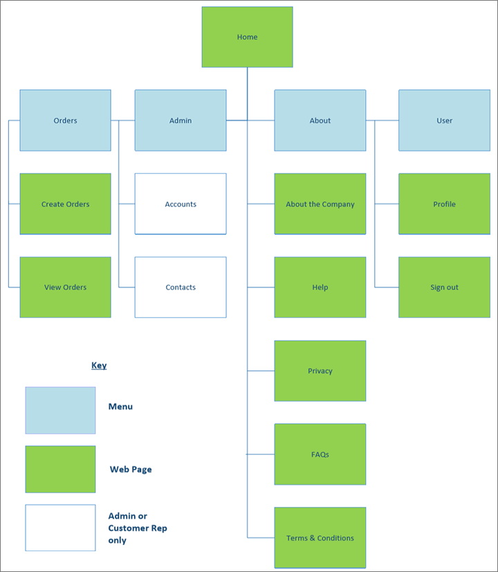
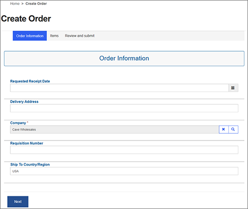
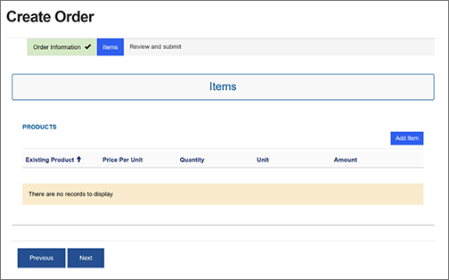
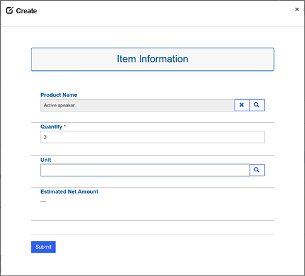
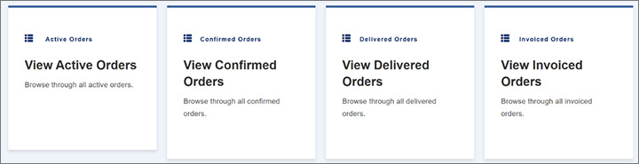
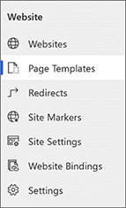
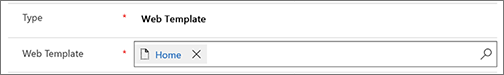

---
# required metadata

title: Customize and use the Customer portal
description: How to customize the Customer portal once it's been added to your system
author: dasani-madipalli
manager: tfehr
ms.date: 04/22/2020
ms.topic: article
ms.prod: 
ms.service: dynamics-ax-applications
ms.technology: 

# optional metadata

# ms.search.form:  [Operations AOT form name to tie this topic to]
audience: Application User
# ms.devlang: 
ms.reviewer: kamaybac
ms.search.scope:  Core, Operations
# ms.tgt_pltfrm: 
# ms.custom: [used by loc for topics migrated from the wiki]
ms.search.region: Global
# ms.search.industry: [leave blank for most, retail, public sector]
ms.author: damadipa
ms.search.validFrom: 2020-04-22
ms.dyn365.ops.version: Release 10.0.13
---

# Customize and use the Customer portal

This section describes the different pages that available in the Customer portal out of the box. It explains what the page does and how you can customize them.

The Customer portal offers a few webpages and actions out of the box. The following site map provides an overview of all the pages, actions, and who can perform those actions.

## Typical customizations

The following topics will help you learn the basics about Power Apps portals and how you can customize portals:

- [Work with templates](https://docs.microsoft.com/powerapps/maker/portals/work-with-templates) – This topic provides a general overview of how Power Apps portals works and how you can do simple customizations of portals.
- [Manage portal content](https://docs.microsoft.com/dynamics365/portals/manage-portal-content) – This topic explains how you can manage and customize the content that you surface in your portal.
- [Edit CSS](https://docs.microsoft.com/powerapps/maker/portals/edit-css) – This topic helps you make more complex customizations to the user interface (UI) of your portal.
- [Create a theme for your portal](https://docs.microsoft.com/dynamics365/portals/create-theme) – This topic helps you create a UI theme for your portal.
- [Create and expose portal content easily](https://docs.microsoft.com/dynamics365/portals/create-expose-portal-content) – This topic helps you manage the underlying data and entities that you use for your portal.
- [Configure a contact for use on a portal](https://docs.microsoft.com/powerapps/maker/portals/configure/configure-contacts) – This topic explains how to create and customize user roles, and how security and authentication work in Power Apps portals.
- [Configure notes for entity forms and web forms on portals](https://docs.microsoft.com/powerapps/maker/portals/configure-notes) – This topic explains how to add documents and additional storage to your portal.
- [Error handling for portal website](https://docs.microsoft.com/powerapps/maker/portals/admin/view-portal-error-log) - This topic explains how to view portal error logs and store them in your Azure Blob storage account

## Customize the order creation process

When a user submits an order by using the Customer portal, the order is automatically synced to the corresponding Supply Chain Management environment. Because the user is an external customer, some required information is intentionally hidden from him or her. This information will automatically be filled when the form is submitted.

This section shows how you should set up contacts to avoid errors. It explains fields are automatically set and how you can modify the value of those fields if you must.

### The out-of-box order creation process

Here are the standard steps for submitting an order from the Customer portal.

1. On the home page, select the **Create order** tile to open the **Create Order** wizard.
1. On the **Order Information** page, set the following fields:

    - **Requested receipt date** – Specify the date of delivery.
    - **Delivery address** – Enter the address that the order should be delivered to.
    - **Company** – Select the name of the customer company. This field is automatically set for non-admin users.
    - **Requisition number** – Enter the requisition number of the order. This field isn't required.
    - **Ship to country/region** – Enter the country/region that the items will be delivered to. This field is automatically set for non-admin users.

    

1. Select **Next**.
1. On the **Items** page, select **Add Item**.

    

1. In the **Item Information** dialog box, set the following fields:

    - **Product Name** – Find and select a product to add to the order.
    - **Quantity** – Enter the quantity of the selected product.
    - **Unit** – Specify the unit of measure (for example, **ea.** , **kgs** , or **box** ).
    - **Estimated net amount** – The value is calculated as the estimated price of the item × the quantity for the selected unit.

    

1. Select **Submit** to add the item to the order.
1. Repeat steps 4 through 6 until you've added all the items that you want to order.
1. When you've finished adding items, select **Next** on the **Items** page.
1. The **Review and submit** page provides a summary of the order. Review the order contents and delivery details. If everything looks correct, select **Submit** to submit the order.

    

### Standard data setup

To help ensure a smooth user experience, the Customer portal automatically fills values for several required fields. These values are based on information in the contact record of the customer who is submitting the order.

For each [contact record](https://docs.microsoft.com/powerapps/maker/portals/configure/configure-contacts) that belongs to a customer who will submit orders by using the Customer portal, values must be specified for the following required fields. Otherwise, errors will occur.

- **Company** – The legal entity that the order belongs to
- **Potential customer** – The customer account that is associated with the order
- **Price list** – The custom price list for the customer
- **Currency** – The currency of the price
- **Ship to country/region** – The country/region that the items will be delivered to

The following fields are automatically set for the sales order entity:

- **Language** – The language of the order (By default, the value is taken from the contact record.)
- **Ship to country/region** – The country/region that the items will be delivered to (By default, the value is taken from the contact record.)
- **Contact person** – The user who can be contacted for information about the order (By default, the value is taken from the contact record.)
- **Company** – The legal entity that the order belongs to (By default, the value is taken from the contact record.)
- **Potential customer** – The customer account associated with the order (defaulted from contact)
- **Invoice customer** – The billing account of the order (The default value is the potential customer from the contact record.)
- **Sales order name** – The name of the sales order (The default value is **sales order**.)
- **Currency** – The currency of the price (By default, the value is taken from the contact record.)
- **Price list** – The custom price list for the customer (By default, the value is taken from the contact record.)
- **Delivery address description** – The delivery address of the sales order (The default value is **delivery address description**.)

### Modify the order creation process

You can freely modify the appearance and UI of the Customer portal, if you don't change the basic order creation process. However, if you want to change the creation process, there are a few things that you must keep in mind.

Don't remove the following fields from the sales order entity in Common Data Service, because they are required to create a sales order in dual-write:

- **Company** – The legal entity that the order belongs to
- **Name** – The name of the sales order
- **Currency** – The currency of the price
- **Price list** – The custom price list for the customer
- **Ship to country/region** – The country/region that the items will be delivered to
- **Potential customer** – The customer account that is associated with the order
- **Language** – The language of the order (Typically, this language is the language of the potential customer.)
- **Delivery address description** – The delivery address of the sales order

For items, the following fields are required:

- **Product** – The product to order
- **Quantity** – The quantity of the selected product
- **Unit** – The unit of measure (for example, **ea.** , **kgs** , or **box** )
- **Ship to country/region** – The country/region of delivery
- **Delivery address description** – The delivery address of the order

You must make sure that your Customer portal submits values for each of these fields in one way or another.

If you want to add fields to the page, or remove fields, see [Create or edit quick create forms for a streamlined data entry experience](https://docs.microsoft.com/dynamics365/customerengagement/on-premises/customize/create-edit-quick-create-forms%22HYPERLINK%20https://docs.microsoft.com/dynamics365/customerengagement/on-premises/customize/create-edit-quick-create-forms).

If you want to change how fields are preset and how values are set when the page is saved, see the following information in the Power Apps portals documentation:

- [Prepopulate field](https://docs.microsoft.com/powerapps/maker/portals/configure/configure-web-form-metadata#prepopulate-field)
- [Set Value On Save](https://docs.microsoft.com/powerapps/maker/portals/configure/configure-web-form-metadata#set-value-on-save)

## Customize the home page

All the controls in the Customer portal are built-in Power Apps portals controls. You can customize them by following the steps in [Compose a page](https://docs.microsoft.com/powerapps/maker/portals/compose-page%22HYPERLINK%20https://docs.microsoft.com/powerapps/maker/portals/compose-page) in the Power Apps portals documentation.

The only custom control that is included in the Customer portal template is used to create the tiles on the home page.

To modify the tiles, follow these steps.

1. Open the [Portal Management app](https://docs.microsoft.com/powerapps/maker/portals/configure/configure-portal).

1. In the navigation pane on the left, select **Page Templates**.

    

1. Select the page template that is named **Home**.
1. In the **Web Template** field, select the **Home** link to open the source code for that page.

    

1. You should now see all the source code for the home page and can modify it as you require.

## Resources

See these documents to learn more about how you can set up and customize the Customer portal:

- [Power Apps portals documentation](https://docs.microsoft.com/powerapps/maker/portals/overview)
- [Dual-write documentation](../../fin-ops-core/dev-itpro/data-entities/dual-write/dual-write-home-page.md)
- [About portal lifecycle](https://docs.microsoft.com/powerapps/maker/portals/admin/portal-lifecycle)
- [Upgrade a portal](https://docs.microsoft.com/powerapps/maker/portals/admin/upgrade-portal)
- [Migrate portal configuration](https://docs.microsoft.com/powerapps/maker/portals/admin/migrate-portal-configuration)
- [Solution Lifecycle Management: Dynamics 365 for Customer Engagement apps](https://www.microsoft.com/download/details.aspx?id=57777)

<!-- KFM: I copied the above links from the setup topic. Are they all also relevant here? -->