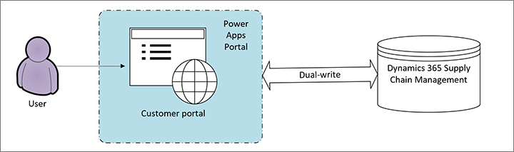

# Customer portal for Dynamics 365 Supply Chain Management overview

[!include [banner](../includes/banner.md)]

## What is the Customer portal?

Modern supply chain systems rely on integration. They require that inventory, customer demand, and sales departments be integrated instead of residing in separate silos. The Customer portal helps organizations that run Microsoft Dynamics 365 Supply Chain Management enhance this integration and more effectively keep their customers informed.

The Customer portal is a [Power Apps portals](/powerapps/maker/portals/overview) template that lets companies create an externally facing business-to-business (B2B) website for scenarios that are related to sales order processing. The template uses [dual-write](../../fin-ops-core/dev-itpro/data-entities/dual-write/dual-write-home-page.md), Supply Chain Management, and Power Apps portals to enable external enterprise customers to view and create data from the company's Dynamics 365 environment.

The Customer portal template has all the customization capabilities that the portals feature of Power Apps offers. The template can easily be modified to represent the company's brand, add increased functionality, and change the user experience. All the functionality that the template offers out of the box can be modified as desired.

> [!IMPORTANT]
> By itself, the template isn't expected to be completely functional. It just serves as an enabler for customers who want to create an externally facing website so that enterprise customers can engage with data from Supply Chain Management.

> [!NOTE]
> The Customer portal documentation is directed at admins, customizers, and system integrators who will set up the Customer portal for a Supply Chain Management installation. It uses the terms _customer_ and _user_ to describe people who are customers of the organization that is running Supply Chain Management, and who will use the final portal itself.

## Video

> [!VIDEO https://www.microsoft.com/videoplayer/embed/RE4ylwW]

The [Overview of the Customer portal template in Dynamics 365 Supply Chain Management](https://youtu.be/nPrqoLuHfV8) video (shown above) is included in the [finance and operations playlist](https://www.youtube.com/playlist?list=PLcakwueIHoT_SYfIaPGoOhloFoCXiUSyW) available on YouTube.

## Who should use it?

The Customer portal is designed for companies that run Supply Chain Management and have these characteristics:

- They want to build an externally facing website that communicates order processing information (such as order status or account information) directly from their Supply Chain Management system to their enterprise customers.
- They're transitioning from Dynamics AX 2012 to Supply Chain Management and previously used the [AX 2012 Customer self-service portal](/dynamicsax-2012/appuser-itpro/about-the-customer-self-service-portal).

The following types of organizations are **not** good candidates for implementing the Customer portal:

- Companies that want to build a website for non-enterprise customers. These companies should consider creating a [Dynamics 365 Commerce e-commerce website](../../commerce/create-ecommerce-site.md).
- Companies that are already using an existing Power Apps portals website for a similar purpose. These companies won't receive any additional benefits from the Customer portal. The Customer portal is delivered as a template that acts as a guide and a starting point for customers who want to "connect the dots" between dual-write, Supply Chain Management, and Power Apps portals. If you've already set up a website that serves this purpose, you might not gain much value from using the Customer portal template to reprovision that website.

## How does it work?

The Customer portal is provided as a Power Apps portals template. It depends on Power Apps portals and dual-write.

[Power Apps portals](/powerapps/maker/portals/overview) is a feature that lets users create an externally facing website that people from outside the organization can sign in to. Little to no coding is required to make portals. The Customer portal is one of many [Dynamics 365 portal templates](/powerapps/maker/portals/portal-templates#environment-with-model-driven-apps-in-dynamics-365) that are available from Microsoft.

[Dual-write](/powerapps/maker/portals/overview) is an out-of-box infrastructure product that provides near-real-time interaction between customer engagements apps and finance and operations apps. Dual-write provides bidirectional integration between finance and operations apps and Microsoft Dataverse. Therefore, it provides an integrated user experience across the apps. The Customer portal depends on tables that are synced with dual-write. Before data from Supply Chain Management can be surfaced in the Customer portal, dual-write must be enabled for all the appropriate tables.

The Customer portal acts as a starting point for organizations that want to use Power Apps portals to build an externally facing website that uses data from their Supply Chain Management installation. It helps organizations connect dual-write, Supply Chain Management, and Power Apps portals.

[!INCLUDE[footer-include](../../includes/footer-banner.md)]
