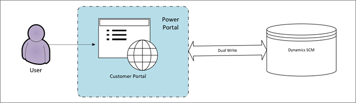

# Install, set up, and update the Customer portal

[!include [banner](../includes/banner.md)]

## Licensing requirements

To implement the Customer portal, you must have the following licenses:

- **Power Apps portals** – This license is required to host the Customer portal. Portals are licensed based on usage. Learn more in the [Power Apps portals licensing requirements](/power-platform/admin/powerapps-flow-licensing-faq#portals).
- **Dual-write** – You must have the necessary licenses to enable dual-write for Supply Chain Management tables. Learn more in the [system requirements for dual-write](../../fin-ops-core/dev-itpro/data-entities/dual-write/dual-write-system-req.md).

## Dependencies on dual-write and Power Apps portals

The Customer portal depends on Power Apps portals and dual-write, as shown in the following illustration.

Unlike other features from Supply Chain Management, the Customer portal template resides in Power Apps portals. Therefore, the Customer portal is limited by the functionality and capabilities that are provided by Power Apps portals and the tables in dual-write.

## Required setup to enable the Customer portal

After you've made sure that you have the required licenses, you can set up dual-write as described in the [dual-write initial synchronization instructions](../../fin-ops-core/dev-itpro/data-entities/dual-write/enable-entity-map.md).

Be sure to enable the following table mappings in dual-write:

- Sales Order Header
- Sales Order Details
- Accounts
- Contacts
- Products

After this setup is completed, you can provision the Customer portal template.

## Provision the Customer portal

Before you begin, make sure that you've already completed the [required setup](#required-setup). Then follow these steps to provision the Customer portal.

1. Go to [Power Pages](https://make.powerpages.microsoft.com/).
2. Make sure that you're using the environment where you enabled dual-write.
3. On the **Templates** tab, open the **Dynamics 365** tab, and select the template named **Customer Portal**.
4. Follow the on-screen instructions.

After provisioning is completed, you can access the Customer portal on the **Active Sites** tab of the **Home** page.

> [!NOTE]
> If the dual-write solution isn't installed in the environment that you're working in, you will receive an error message, and the Customer portal won't be provisioned.

## Update the Customer portal

Any changes that Microsoft makes to the underlying solution components will automatically appear in your environment. However, the website that is provisioned in your environment won't automatically reflect changes that are made to the configuration data. You'll have to manually apply those changes by getting the code from the new template and merging it with the provisioned website.

## Related information

To learn how you can set up and customize the Customer portal, you should start by reviewing the following documentation for the underlying technologies:

- [Power Pages documentation](/power-pages/introduction)
- [Dynamics 365 templates](/power-pages/templates/dynamics-365-apps/overview#supply-chain-management-customer-site)
- [Dual-write documentation](../../fin-ops-core/dev-itpro/data-entities/dual-write/dual-write-home-page.md)

To effectively manage your sites, you must understand the Power Pages and Microsoft Dataverse lifecycle. For more information, see the following resources:

- [About Power Pages lifecycle](/power-pages/admin/lifecycle)
- [Upgrade a Power Pages site](/power-pages/admin/upgrade-site)
- [Migrate website configuration](/power-pages/admin/migrate-site-configuration)
- [Solution Lifecycle Management: Dynamics 365 for Customer Engagement apps](https://www.microsoft.com/download/details.aspx?id=57777)

[!INCLUDE[footer-include](../../includes/footer-banner.md)]
