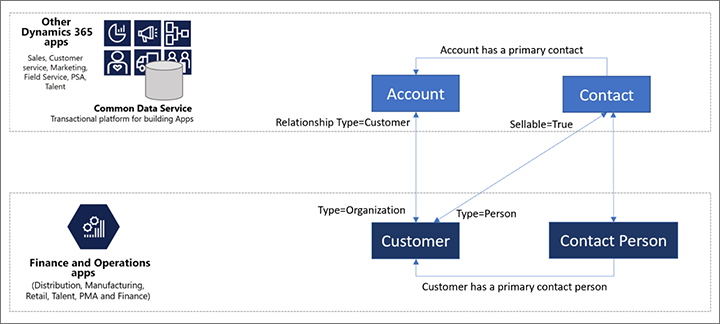

---
# required metadata

title: Create and manage Customer portal users (contains video)
description: This article explains how to create Customer portal user accounts and set permissions for them.
author: Henrikan
ms.date: 07/31/2020
ms.topic: article
ms.prod: 
ms.technology: 

# optional metadata

# ms.search.form:  [Operations AOT form name to tie this article to]
audience: Application User
# ms.devlang: 
ms.reviewer: kamaybac
# ms.tgt_pltfrm: 
# ms.custom: [used by loc for articles migrated from the wiki]
ms.search.region: Global
# ms.search.industry: [leave blank for most, retail, public sector]
ms.author: henrikan
ms.search.validFrom: 2020-04-22
ms.dyn365.ops.version: 10.0.13
---

# Create and manage Customer portal users

[!include [banner](../includes/banner.md)]

In the out-of-box implementation, there is no way for users to self-register for websites that are created by using the Customer portal. To sign in and use a website, users must be invited by the admin. Microsoft has intentionally blocked the ability of users to self-register.

Before a user can use a website, a contact record must be created for that user. This record indicates which customer account and legal entity the user belongs to. This information is essential for ensuring that the user can create and view sales orders.

When users self-register, contact records are automatically created for them. Therefore, you can't ensure that a user selects the correct customer account and legal entity. On the other hand, the invitation process lets an admin assign the correct customer account and legal entity to the contact record before an invitation is sent. If you're thinking about customizing the solution so that users can self-register, be sure to consider the possible consequences.

## Video
> [!VIDEO https://www.microsoft.com/en-us/videoplayer/embed/RE4ADkI]

The [Invite customers to register and use your customer portal](https://youtu.be/drGUYHX9QIQ) video (shown above) is included in the [finance and operations playlist](https://www.youtube.com/playlist?list=PLcakwueIHoT_SYfIaPGoOhloFoCXiUSyW) available on YouTube.

## Prerequisite setup

Contacts in Power Apps portals are stored as records in the **Contacts** table in Microsoft Dataverse. Dual-write then syncs these records to Microsoft Dynamics 365 Supply Chain Management as required.

Before you start to invite new customers, make sure that you've enabled the **Contact** table mapping in dual-write.

## The invitation process

To invite an existing contact to the Customer portal, follow the steps in [Invite contacts to your portals](/powerapps/maker/portals/configure/invite-contacts) in the Power Apps portals documentation.

Before you invite a customer to join the Customer portal, make sure that the customer's [contact record](/powerapps/maker/portals/configure/configure-contacts) is available and set up in the following way:

1. Set the **Company** field to the legal entity that you want the customer to belong to in Supply Chain Management.
2. Set the **Account Number** field to the customer account number that you want the user to have in Supply Chain Management.

After a contact is created, you should be able to see it in Supply Chain Management.

For more information, see [Configure a contact for use on a portal](/powerapps/maker/portals/configure/configure-contacts) in the Power Apps portals documentation.

## Out-of-box web roles and table permissions

User roles in Power Apps portals are defined by [web roles](/powerapps/maker/portals/configure/create-web-roles) and [table permissions](/powerapps/maker/portals/configure/assign-entity-permissions). A few roles are defined for the Customer portal out of the box. You can create new roles, and you can modify or remove existing roles.

### Out-of-box web roles

This section describes the web roles that are delivered with the Customer portal.

For more information about how to modify the out-of-box user roles, see [Create web roles for portals](/powerapps/maker/portals/configure/create-web-roles) and [Add record-based security by using table permissions for portals](/powerapps/maker/portals/configure/assign-entity-permissions) in the Power Apps portals documentation.

#### Administrator

The administrator oversees and maintains the website. This person will provision and set up the Customer portal. The administrator maintains the IT and security aspects of the portal, and makes sure that everything runs smoothly. The administrator might also customize and/or change the portal by adding new functionalities, creating new roles, and more.

#### Customer representative

A customer representative works for a customer company and is responsible for managing the orders that the company places. The customer representative can see all the orders that have been placed for the company and the users who placed them. Additionally, the customer representative can see information about the overall account and which contacts can place orders on behalf of that account.

#### Authorized users

Authorized users can place orders and view the status of the orders that they have placed. However, they can't view the status of orders that other users in their company have placed.

#### Unauthorized users

Unauthorized users can't view any data. They can see only public information, such as terms and conditions, and details about the company that is running the Customer portal.

#### Example

The following table shows which sales orders the users in each web role can see in the system.

| Sales order | Administrator | Customer representative for customer&nbsp;X | Authorized user: Jane | Authorized user: Sam | Unauthorized user: May |
|---|---|---|---|---|---|
| Customer&nbsp;X Orderer:&nbsp;Jane | Yes | Yes | Yes | No | No |
| Customer&nbsp;X Orderer:&nbsp;Sam | Yes | Yes | No | Yes | No |
| Customer&nbsp;Y Orderer:&nbsp;May | Yes | No | No | No | No |

> [!NOTE]
> Even though both Sam and Jane are contacts who work for customer X, they can see only the orders that they themselves have placed and nothing else. Although May has an order in the system but can't see that order in the Customer portal, because May is an unauthorized user. (Additionally, May must have placed the order through some channel other than the Customer portal.)

[!INCLUDE[footer-include](../../includes/footer-banner.md)]
