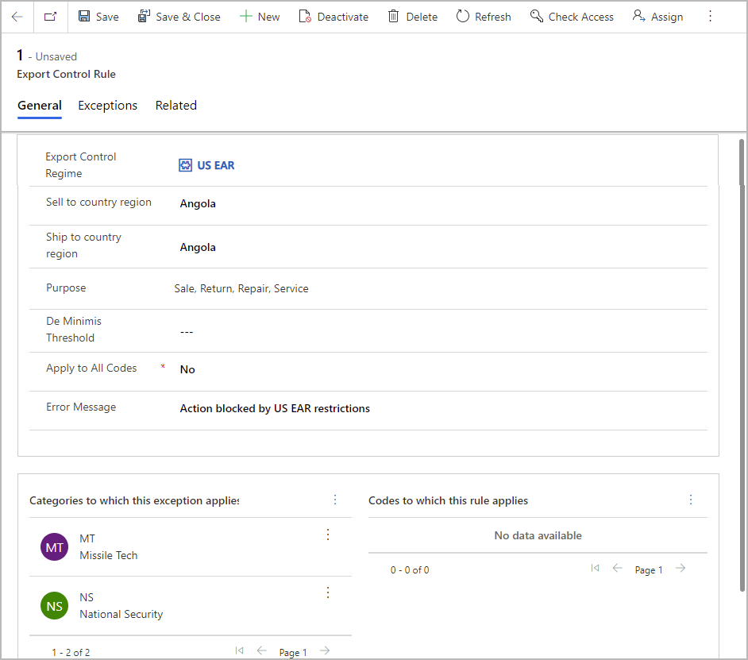

# Advanced export control overview

<!-- KFM: What is the name of this "feature"? Should it be capitalized? Is it a "solution" or a "feature" or an "app" or something else? "Advanced Export Control solution for Microsoft Finance and Operations Supply Chain" doesn't work (incorrect trademarks) -->

The Advanced Export Control solution for Microsoft Finance and Operations Supply Chain provides the foundation for managing, tracking, and checking export compliance. It can be used without Microsoft Finance and Operations Supply Chain as well.

## Overview

Export Control consists of five primary concepts.

- Jurisdictions
- Codes and Categories
- Restrictions
- Exceptions
- Licenses

A jurisdiction is a set of codes, categories, restrictions, exceptions, and licenses. It represents a set of configuration that applies to incoming requests.

A jurisdiction consists of a set of codes, often referred to as Export Control Classification Numbers or ECCNs. If the Export Control functionality is used for customs scenarios, then Harmonized System or HS codes may also be used. Codes may be linked to one or more control categories such as Missile Technology or National Security. The set of codes and categories is unique per jurisdiction.

For a given jurisdiction a set of rules are provided which indicate when the jurisdiction is applicable. If the rule is configured as an error, then any activity matching the rule will be blocked for that jurisdiction unless an exception exists. A rule is usually a combination of a country, a transaction purpose, and a set of codes and categories.

Exceptions are ways of allowing an activity even though a rule would otherwise block the action. Common types of exceptions are licenses, blanket exemptions, or corporate policies. Exceptions are defined the same way as rules, but also provide extra requirements when the exception is used such as messages to display to the user or text and licenses to print on documents.

## Jurisdictions

An Export Control Jurisdiction (also referred to as an Export Control Jurisdiction) defines a set of classifications, together with rules as to which activities are allowed under which conditions. Examples of Export Control Jurisdictions include but are not limited to the following. They do not need to be dictated by a country or region, but can also be configured to control export activities based on a company's own policies.

- US International Traffic in Arms Regulation (ITAR)
- The Wassenaar Arrangement
- EU Dual Use
- Norway Liste I and II
- US Export Administration Regulations (EAR)
- Controls on exports by an individual company
- Multilateral Export Controls
- Sanctions

## Codes and Categories

An Export Control Jurisdiction is defined by a set of Export Control Classification Number (ECCN) codes, together with Control Categories. Each ECCN may be a member of zero or more control categories. And each control category may contain many ECCNs.

An example of an export control classification number is 7A994 as defined by the US Export Administration Regulations Export Control Jurisdiction. 7A994 applies to "Other navigation direction finding equipment, airborne communication equipment, all aircraft inertial navigation systems not controlled under 7A003 or 7A103, and other avionic equipment, including parts and components." Per the US EAR, ECCN 7A994 is a part of the Anti Terrorism (AT) control category.

Since ECCNs and control categories are defined by Export Control Jurisdictions, the same ECCN may appear in more than one Export Control Jurisdiction. For this reason it is important to always specify which jurisdiction a code references. Harmonized System (HS) codes which are used primarily for customs tracking may also be used as codes to manage export controls related to customs.

Following is a sample configuration for the US EAR jurisdiction.

## Restrictions

Export Control Jurisdictions then define a set of restrictions under which export actions should be disallowed unless an exception exists. Often that is defined in terms of a commerce country chart, such as [this example](https://www.bis.doc.gov/index.php/documents/regulations-docs/2253-supplement-no-1-to-part-738-commerce-country-chart/file) from the US EAR. A restriction is a set of ECCNs and/or control categories, together with a country, transaction purpose, and other aspects.

Following is a sample rule for the US EAR restrictions based on the country chart. Based on this rule, any order containing an item with an ECCN in the MT or NS control categories would not be allowed to be sold to Angola. When attempting to confirm an order containing one of these items, the error message "Action blocked by US EAR restrictions" would be shown to the user.

## Exceptions

Exceptions are defined the same way as restrictions, only they define which activities should _not_ be blocked even though there is a restriction. The most common types of exceptions are licenses, blanket exemptions, or company policies.

When an exception applies, additional information may also be provided. This includes a license number which can be referenced on reports or documents, as well as informational or warning messages to display to the user while working with the document.

