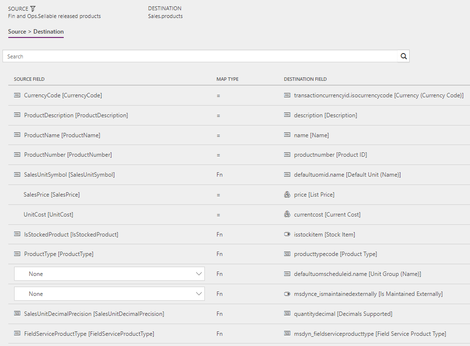

---
# required metadata

title: Synchronize products in Supply Chain Management to products in Field Service
description: This topic discusses the templates and underlying task that are used to synchronize products from Dynamics 365 Supply Chain Management to Dynamics 365 Field Service.
author: Henrikan
ms.date: 04/09/2018
ms.topic: article
ms.prod: 
ms.technology: 

# optional metadata

ms.search.form: 
# ROBOTS: 
audience: Application User, IT Pro
# ms.devlang: 
ms.reviewer: kamaybac
# ms.tgt_pltfrm: 
ms.custom: 
ms.assetid: 
ms.search.region: global
ms.search.industry: 
ms.author: henrikan
ms.dyn365.ops.version: July 2017 update 
ms.search.validFrom: 2017-07-8

---

# Synchronize products in Supply Chain Management to products in Field Service

[!include[banner](../includes/banner.md)]

This topic discusses the templates and underlying task that are used to synchronize products from Dynamics 365 Supply Chain Management to Dynamics 365  Field Service.

The used **Field Service Products (Supply Chain Management to Field Service)** template is based on the **Products (Supply Chain Management to Sales) – Direct** template from Prospect to Cash. For more information, see [Products (Supply Chain Management to Sales) – Direct](/dynamics365/unified-operations/supply-chain/sales-marketing/products-template-mapping-direct).

This topic only describes the differences between the **Field Service Products (Supply Chain Management to Field Service)** and **Products (Supply Chain Management to Sales) – Direct** templates.

## Templates and tasks

**Name of the template in Data integration**

- Field Service Products (Supply Chain Management to Field Service)

**Name of the task in the Data integration project**

- Products - Products

The **Field Service Products (Supply Chain Management to Field Service)** template includes one mapping that isn't included in the **Products (Supply Chain Management to Sales) – Direct** template. This mapping ensures that the required Field Service-specific field **Service Product Type** is set correctly.

```plaintext
FIELDSERVICEPRODUCTTYPE        Fn        msdyn_fieldserciveproducttype
```

The following value mapping is used.

```plaintext
inventory     :  690970000
nonInventory  :  690970001 
service       :  690970002 
```

In Supply Chain Management, the **Field Service product type** value on the **Sellable released products** data entity is calculated as follows:

- **Inventory:** Product type = Product and Item model group, Stocked product = True
- **NonInventory:** Product type = Product and Item model group, Stocked product = False
- **Service:** Product type = Service

## Template mapping in Data integration

The following illustrations show the template mapping in Data integration.

### Field Service Products (Supply Chain Management to Field Service): Products - Products

[](./media/FSProduct.png)


[!INCLUDE[footer-include](../../includes/footer-banner.md)]