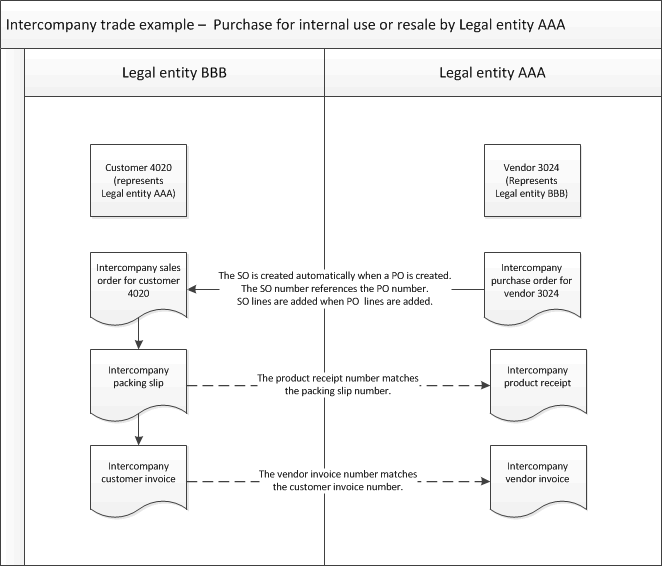

# Create and invoice an intercompany purchase order for internal use

[!include [banner](../../includes/banner.md)]

You can create an intercompany purchase order for an intercompany vendor. This automatically creates an intercompany sales order at the intercompany vendor.

## Create an intercompany purchase order and a corresponding intercompany sales order

Do these steps in legal entity AAA, as shown in the illustration.

1. Select **Accounts payable** \> **Purchase orders** \> **All purchase orders**.
1. On the **All purchase orders** list page, create a purchase order for an intercompany vendor. The field values are copied from the vendor account to the purchase order.

    Because you're working with an intercompany vendor, an intercompany sales order is created in the legal entity that corresponds to the vendor. The number of the intercompany sales order can be the same as the number of the intercompany purchase order, and it can include the ID of the legal entity. The number structure that is used depends on the selection in the **Sales order numbering** field in the **Intercompany** page. For example, if you create purchase order 00029\_064 in legal entity AAA, the sales order number in legal entity BBB is AAA00029\_64.

    An informational message tells you that an intercompany purchase order and intercompany sales order have been created. The message includes the intercompany sales order number, for your information.

1. Add line items to the purchase order. The corresponding line items are added automatically to the intercompany sales order. If an item doesn't exist in the other legal entity, a message is displayed and you can't add the item to the purchase order. To fix this problem, switch to the other legal entity and release the product to that legal entity. The item will be available to be added to sales orders in that legal entity. Then, switch back to the legal entity of the purchase order and continue adding line items.
1. When you have finished entering information for the purchase order, confirm it.

## Process the intercompany packing slip and customer invoice

Do these steps in legal entity BBB, as shown in the illustration.

1. Go to **Accounts receivable \> Sales orders \> All sales orders**.
1. On the **All sales orders** list page, select the intercompany sales order.
1. On the Action Pane, select the **Pick and pack** tab, and then select **Packing slip**.
1. Select the **Posting** check box.
1. Select **OK**. The packing slip is posted in legal entity BBB.
1. On the **All sales orders** list page, select the intercompany sales order.
1. On the Action Pane, select the **Invoice** tab, and then select **Invoice**.
1. Select the **Posting** check box.
1. Select **OK**.

    The customer invoice for the intercompany sales order is posted in legal entity BBB.

## Process the intercompany product receipt and vendor invoice

Do these steps in legal entity AAA, as shown in the illustration.

1. Go to **Accounts payable \> Purchase orders \> All purchase orders**.
1. On the **All purchase orders** list page, select the intercompany purchase order.
1. On the Action Pane, select **Receive**, and then select **Product receipt**. The product receipt is created. The product receipt number is the same as the intercompany packing slip number.
1. Select the **Posting** check box.
1. Select **OK**.
1. On the **All purchase orders** list page, select the intercompany purchase order.
1. On the Action Pane, select **Invoice**, and then select **Invoice**. The vendor invoice is created. The vendor invoice number is the same as the intercompany customer invoice number.
1. Finish entering the vendor invoice, and then post it.

[!INCLUDE[footer-include](../../includes/footer-banner.md)]
